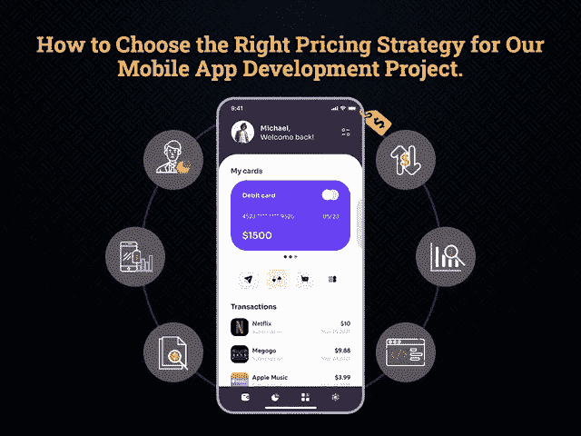
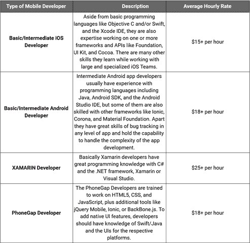
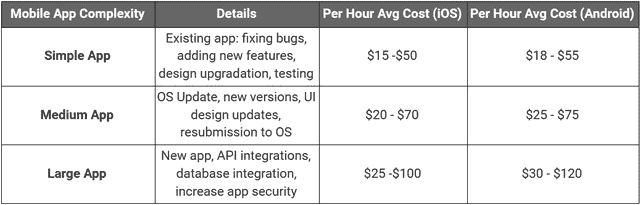

# 如何为您的移动应用项目设定最佳定价策略

> 原文：<https://javascript.plainenglish.io/how-to-set-the-best-pricing-strategy-for-your-mobile-app-project-74f403d9d96e?source=collection_archive---------7----------------------->

## **为您的应用开发项目选择最佳定价策略的指南**

曾几何时，移动应用开发对企业来说是一种奢侈。但是今天，它已经成为数字世界中成功的同义词。随着数字化宣传的日益高涨，构建一个伟大的移动应用程序占据了中心舞台。

据预测，移动应用程序将为[带来 9350 亿美元的收入，企业越来越多地瞄准移动平台，希望成为这个蓬勃发展的行业的一部分。](https://www.statista.com/statistics/269025/worldwide-mobile-app-revenue-forecast/)

无论大小，每个公司都在尽力利用这个行业的好处来增加收入。但这里出现了一个核心问题:如何从你的应用中获利？

你应该为你的应用选择什么样的应用盈利模式？你在应用程序中提供的功能的合理定价是多少？许多计划推出应用程序的首次创业公司都在反复谈论这些问题，并在项目的规划、设计和开发阶段花费了大量的时间、精力和金钱。

回到现实世界，初创公司的核心焦点通常是向最终用户提供愉悦的用户体验和价值，并选择多种策略来实现应用的货币化。但仍然有 30%的创业公司无法在市场中生存！

一切看起来都很完美，那为什么创业公司都活不下去？因为他们忽略了为他们的应用选择正确定价策略的事实。

选择正确的产品定价对于让你的应用程序在应用商店中首次可见起着重要的作用。从长远来看，你如何为你的产品定价将决定你的应用在下载量和用户保持率方面的成功。

那么，你应该免费还是以较低的订阅价格提供你的应用程序，以成功获得良好的投资回报？你如何决定正确的产品定价策略？有了 [**移动应用程序开发公司**](https://www.xicom.biz/services/mobile-app-development/) 的专家意见，你可以轻松克服这些麻烦，并能够理解在确定应用程序价格时哪些因素起了作用。

市场研究、应用的价值和功能、市场竞争等主要因素，进一步与消费者心理相结合，为您的企业制定完美的盈利战略。

因此，在你开始招聘移动应用程序开发人员之前，先看一看如何为你的移动应用程序选择最佳定价策略是有意义的。

# **如何将你的 App 货币化，决定定价策略？**

在选择定价策略时，你应该知道你打算创建什么类型的应用程序，哪种盈利模式对你的公司、开发者和客户有意义，以及它将在什么操作平台上推出。虽然投入了大量的精力、时间和预算，但了解从你的应用程序中获取最大利润的策略是值得的。然而，要决定最佳的盈利模式，你需要评估有助于你正确定价应用的参数。

因此，以下是您需要在移动应用中采用的参数，以了解不同价格对潜在用户群的影响:

## **1。了解你的目标受众及其购买心理**

数字化的浪潮深刻地动摇了消费者的购买心理。所以在你给你的 app 定价之前，你要知道你的目标用户群是否愿意为 app 付费？

如今，消费者对最新的市场趋势了如指掌，并且有十种其他选择，那么你如何说服他们选择你的产品呢？

很简单，通过保持较低的价格标签，为他们提供产品的更大价值。

一旦客户意识到你的产品价格合适，他们肯定会进入这个细分市场。当他们不知道从哪里开始时，事情会变得容易些。

但是在你忽略这个事实之前，请记住，顾客已经养成了在做出最终决定之前比较市场上产品价格的倾向。所以在这里，你需要评估竞争对手的定价策略。比较你的价值构成，确保你以较低的价格提供比竞争对手更高的价值。

## **2。分析竞争对手的价格政策**

无论你是一家初创企业还是领先的企业家，你的首要目标都是超越竞争对手，但你无法拿出原创和独特的定价。最好评估一下其他市场领导者是如何做的，并分析他们征服市场的政策。

*假设你的竞争对手正在提供一个免费下载的应用程序，并提供应用内购买选项，那么选择付费应用程序将是最大的错误。*

由于没有放之四海而皆准的标准政策，市场分析涉及的详细参数只有一家 [**软件开发公司**](https://www.xicom.biz/) 能帮你处理。从分析你的竞争对手提供什么来确定你的应用的目标，它的市场价值到应用开发的成本，有各种各样的事情要考虑。

## **3。设计和开发用户想要的产品**

在你开始开发一个功能丰富的应用程序之前，确定你的终端用户的关注点是很重要的，你的应用程序应该解决这些问题。当你开发出一个用户真正想要的产品时，给你的应用定价就变得容易了。

移动应用程序的设计应该与惊人的特性和功能非凡。如果你正在创建一个基于用户的应用程序，那么确保你在一定的时间间隔内发布新的更新。所以你可以很容易地给那些增加用户渴望升级到最新版本的更新定价。

## **4。用不同的定价模式测试您的产品**

每个应用程序都有一定的价格标签，但在你对应用程序的订阅价格进行报价之前，你需要确定市场愿意支付的价格。因此，简单的技巧是在不同的价格水平测试你的产品，以评估市场反应。

为用户设定一个合理的价格，因为定价策略应该在客户中创造有意义的收入流和忠诚度。由于你可能会在企业计划中提供应用内升级，确保你设定了一个合理的价格，用户可以轻松支付。

## **5。您选择的平台或应用商店**

你在哪里发布应用也会极大地影响你的移动应用的定价策略。由于 Android 和 iOS 都以不同的应用内支付视角提供了不同的目标市场，因此值得聘请一家 [**移动应用开发公司**](https://www.xicom.biz/services/mobile-app-development/) 来帮助你评估项目的更好范围。

根据调查报告，iOS 用户更富有，愿意为付费应用付费，而 Android 属于中产阶级。所以在选择价格策略之前，你需要了解你创建了什么类型的 app。

从市场竞争对手那里获取线索是一个很好的方法。当你的市场上其他人都在免费提供功能性应用时，选择付费定价模式是最大的错误。如果你的应用程序具有先进的功能和独特的主张，而这在类似的应用程序中是找不到的，那么用户会愿意为你支付更多。

> **现在你知道了为你的产品选择最佳定价策略的过程。但这也引出了一个问题:你可以为你的移动应用选择的最有效的定价模式是什么？**

# **如何将你的手机应用货币化？**

无论一个应用程序的想法有多好，你付出了多少努力，如果它不能为企业带来任何收入，那它就是一个失败。因此，在你计划开发一个移动应用程序来为你的公司发现新的创收机会之前，在采纳应用程序的想法之前，有必要深入研究一下这种赚钱策略。

> **以下是 2021 年你的应用最有可能实现盈利的几种方式:**

## **免费应用**

app store 中有数以百万计的应用程序可供免费下载，这是广告的主要收入来源。

因为免费应用程序通常被视为吸引大量用户的注意力并使他们长期与应用程序保持联系的伟大工具，尽管大多数企业选择可以作为免费下载应用程序轻松启动的应用程序开发理念。

根据你的应用创意的目的，有两种免费的定价策略可供选择。其中之一是完全免费的策略，当你已经有了一个成熟的产品或服务时，这种策略就会被用到。

例如，免费应用包括优惠券、折扣通知等功能，提供信息鼓励用户采取行动。

第二，应用内广告策略，这些类型的应用可以免费使用，但用户在使用应用时会看到广告。这种类型的盈利策略主要用于游戏应用。

## **免费增值**

免费增值定价模式是企业广泛使用的免费定价策略的修改版本。免费增值应用程序可以免费下载和使用，但功能有限。为了从这类应用中赚钱，企业可以使用应用内购买选项。用户必须切换到每月，每季度或每年的订阅计划，以获得优质功能。

## **付费应用**

顾名思义，它们有一定的价格标签。但由于免费和免费增值应用的数量不断增加，付费应用的受欢迎程度近年来有所下降。如今，企业对开发更适合其业务目标的移动应用更感兴趣，而不是购买应用。

> 因此，如果你正计划开发一款应用程序，可以帮助你在 2021 年创造大量收入，那么你就只有一步之遥了。你所需要的就是 [**雇佣一个 app 开发公司**](https://www.xicom.biz/services/mobile-app-development/) 把你的 app 创意变成一个完美的解决方案。

# **雇佣一个手机 App 开发者需要多少钱？**

雇佣一个移动应用开发者的成本会因不同的功能而有很大的差异。概括地说，有两件事最重要:

*   应用程序开发人员的技能和知识
*   应用程序的操作平台
*   开发过程中使用的技术
*   开发者的地理位置
*   应用程序的复杂性

无论是从头开始开发，还是需要使用最新功能升级现有应用，您都需要一名具备适当技能和知识的专业移动应用开发人员，他们可以轻松了解您的业务需求，并帮助您创建符合您预算的应用。

那么雇佣一个 pro app 开发团队到底需要多少钱呢？

> **让我们根据不同的参数来了解雇佣一个应用开发者的成本:**

1.  **开发人员的技能和经验:**开发一个移动应用程序对于熟练的开发人员来说并不是一件遥不可及的工作。随着多种技术、框架和编程语言的广泛选择，构建任何类型的应用程序都变得比以往任何时候都容易。你需要做的就是选择合适的开发商。

*不同类型的应用程序开发人员负责不同的职责，他们的招聘成本也相应不同，如下:*

## **2。基于位置的应用程序开发人员雇佣成本**

雇佣应用程序开发人员的成本因地点不同而有很大差异。当你 [**雇佣一个移动应用开发者**](https://www.xicom.biz/offerings/hire-mobile-developers/) 时，那个特定地区的生活成本起着重要的作用。根据调查报告和市场分析，我们得出的结论是，印度、英国、澳大利亚、新加坡、乌克兰和俄罗斯是雇佣来自世界各地的应用程序开发人员最常见的地方，平均费用为每小时 15 美元以上至 150 美元以上。

## **3。应用程序开发复杂性**

你打算打造什么类型的 app，可以带来整体开发成本的巨大差异。根据应用程序的复杂程度，移动应用程序开发项目可能需要一周到五个月甚至更长时间才能完成。所以这里是不同 app 开发者针对不同 app 结构的定价。

这些是你在估算移动权利的整体定价时需要考虑的几个主要参数，从货币化策略到为你的项目雇佣应用开发者的成本。

> **更多可以看这个 Bog:** [**雇佣一个手机 App 开发者需要多少钱？**](https://medium.com/flutter-community/how-much-does-it-cost-to-hire-a-mobile-app-developer-f0ea8b95943b)

# **总结**

开发一款手机 app 已经成为你企业的迫切需求。但是，如何开始从你的移动应用项目中获利，以及雇佣一个 [**移动应用开发公司**](https://www.xicom.biz/services/mobile-app-development/) 到底要花多少钱，这些问题仍然是一个未解之谜。

因此，考虑到市场调查，我们详细列出了您在为您的移动应用项目选择定价策略时需要牢记的策略。仔细评估为你的项目雇佣应用程序开发人员的成本，以使你的项目在 2021 年取得巨大成功。

> 更多问题，可以在下面留言！

*更多内容尽在*[*plain English . io*](http://plainenglish.io/)