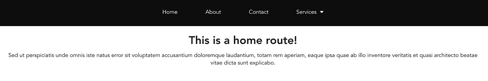

# 如何用 Vue.js 设置下拉导航条路由器

> 原文：<https://javascript.plainenglish.io/how-to-set-up-a-dropdown-navbar-router-with-vuejs-6e0ef48625f6?source=collection_archive---------1----------------------->

如果你已经开始学习 Vue.js 和 SPA，你迟早会遇到 vue-router 来处理导航，这对于一个功能齐全的应用来说是不可避免的。

简而言之:*“用 Vue 和 Vue-Router 创建一个 SPA 再简单不过了。”*

如果您的电脑上没有安装 Vue，请通过终端安装 Vue:`*npm install -g @vue/cli*`

然后创建你的应用:`*vue create name-of-your-app*`

在这个简短的项目中，您将被提示选择一个预设，我选择 Vue2 和 vue-路由器依赖关系，因为其他不相关。欲了解更多信息，请点击查看[。](https://cli.vuejs.org/guide/creating-a-project.html#vue-create)

最后的 app 开发树应该和这个差不多。确保您对正确设置 vue CLI 有基本的了解，了解 package.json 和 npm run。**主**。 **js** 包含用于初始化 **Vue** 应用程序的 JavaScript，它应该从'导入**路由器**。/router' (index.js)。App。 **vue** 包含一个 **Vue** app 的根组件。

下面是我的 [main.js](https://github.com/Mozes721/Vue_Navbar/blob/master/src/main.js)

## 在 index.js 中设置路由

在 index.js 中，我们需要从 node_modules 文件夹中导入一个 vue-router 模块，因为我们已经在这个项目中安装了所有的依赖项，并且显然已经安装了将作为路由器路径的所有组件。

## App.vue 组件

像在任何项目中一样，我们从移除**组件/HelloWorld 开始。Vue** 然后我们会自动将该组件插入到`id=”app”`占位符中。同样的风格，并根据我们的项目进行调整。

正在添加`<Navbar />`组件，它将在我们的组件中被引用。这是一种依赖。

## 创建导航栏

因为每个组件都有自己的`<template>`标签，所以我们创建了一个导航标签。nav 标签为单个元素设计了导航条和“菜单项”的样式。

这里魔法开始发挥作用`<router-link>`是在支持路由器的应用程序中支持用户导航的组件。

***注意*** *:* `*<router-link>*` *优先于硬编码的* `*<a href="...">*` *，原因如下:*

router-link 中的`to`属性将在内部传递给`router.push()`，因此该值可以是字符串或位置描述符对象。在我们的例子中，我们在 **index.js** 中定义了路由路径和组件，更多信息请查看[这里的](https://router.vuejs.org/api/#to)。

Home route

## 下拉组件

最后，由于我们需要在我们的应用程序下拉功能，我们创建了一个名为**服务**的新组件，这将使工作完成！

在菜单项中，我们使用了一个所谓的[事件处理器](https://vuejs.org/v2/guide/events.html),这也是 VueJS 因其简单易用而受到称赞并被全球采用的原因之一。脚本中的道具‘标题’是从 **Navbar.vue** 组件中获取标题名称。

当元素被点击时，在这种情况下**服务**它激活 click 事件处理程序，该处理程序激活`data`属性中的 isOpen。它作为一个函数工作，其默认值为 false，因此每次按下它时，true、false 值都在变化。

1.  Svg 元素是 **SVG** 图形的容器。
2.  打开列表元素时过渡到更平滑的淡入淡出。

3.指令 [**v** - **如果**](https://vuejs.org/v2/guide/conditional.html) 被用来有条件地渲染一个块，这里它检查服务是否被按下，以便列表不会只是从开始显示:

Changed route to Videos in dropdown list

我试图让下拉路径更动态，而不是硬编码。仍在学习过程中，下一次应该实现更多的嵌套路由，但我们都尽自己的努力学习和改进！

***注:*** *我会在这篇博文中添加其他内容，如联系方式、关于、网络等，但我知道读者的时间很重要，因此我会尽量让它简洁明了！*

# **结论**

我希望你学到了一些关于 Vue.js 和 vue-router 的新知识。我对此很陌生，因为我的主要兴趣在后端，但随着项目复杂性的增加，更多的技能应该被添加到一个人的军火库中！我是渐进式 JavaScript 框架的超级粉丝，希望你也一样。

我的 GitHub 回购项目如下:

 [## Mozes721/Vue_Navbar

### 在 GitHub 上创建一个帐户，为 Mozes721/Vue_Navbar 开发做出贡献。

github.com](https://github.com/Mozes721/Vue_Navbar) 

# 相关故事

 [## 用 JavaScript 构建日期和时区

### 对于 JS 初学者来说，时钟项目是一个标准的项目理念。

medium.com](https://medium.com/geekculture/building-date-and-time-zone-with-javascript-6b862f279937)  [## 普通 JavaScript 简单密码生成器

### 功能实现简单的 JavaScript 密码生成器

javascript.plainenglish.io](/vanilla-js-simple-password-generator-87e02e5c506a)  [## 通过石头剪子布游戏学习 Vue.js 基础知识

### 涵盖主要 Vue.js 特性:v-if，v-on，emit event 等等，附带简单的游戏机制。

javascript.plainenglish.io](/vuejs-essentials-through-rock-paper-scissors-game-1eb8a41aeb7e)