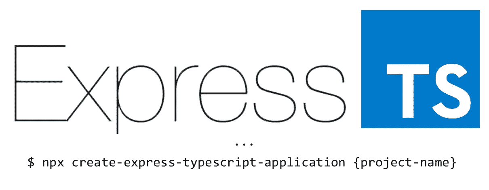
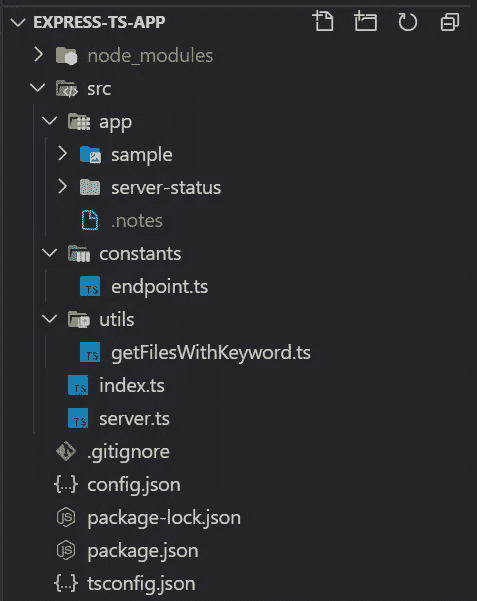

# 2021 年如何设置节点，Express + TypeScript App

> 原文：<https://javascript.plainenglish.io/how-to-set-up-a-node-express-typescript-app-in-2021-1459e53a3090?source=collection_archive---------8----------------------->

每天都有越来越多的包添加到 npm 数据库中，这导致新开发人员在设置一个支持 TypeScript 的简单 Express 应用程序时感到困惑。本文提供了一个简单易用的指南，帮助您设置一个具有 TypeScript 支持的良好结构化 Node.js Express 应用程序。



ExpressTS — A robust NodeJS server with adding static type definitions (TypeScript)

Express.js 应用程序近年来获得了一些关注。然而，对于类型安全编程来说，普通 JavaScript 仍然是一个问题。因此，需要将 TypeScript 集成到 Express.js 中。本指南不仅提供了设置支持 TypeScript 的结构化 Express 应用程序的分步说明，还解释了为什么选择某些包，以便作为开发人员的您了解项目中使用的每个包。

# **先决条件**

这些是要在本地安装的必备软件。

1.  节点(如果没有，则在此安装节点)
2.  npm(它随节点安装一起提供)
3.  git ( [在此安装 git 版本控制](https://git-scm.com/downloads)

# 装置

入门有两种方式，主要是`npm install -g`命令和`npx`命令。`npm install -g`命令将本地声明的包下载到全局 node_modules 文件夹，而`npx`命令只执行节点包，不在本地存储。我将在下面提供这两种方法。不过，我建议使用`npx`方法，因为它可以确保节点包总是最新版本。在本教程中，项目名称为 express-ts-app。您应该根据您自己的项目名称对此进行更改。

1.npm 方法(不推荐—参见 npx 方法)

```
$ npm install -g create-express-typescript-application 
$ create-express-typescript-application express-ts-app
```

2.npx 方法

```
$ npx create-express-typescript-application express-ts-app
```

一旦运行了上面的命令，就会创建下面的文件结构，并初始化 git。



在 src 文件夹中，有三个子文件夹。它们是应用程序、常量和实用程序文件夹。有独立的`index.ts`和`server.ts`文件。`index.ts`是整个应用的入口，主要监听 tcp 端口。`server.ts`是快速应用程序的设置。请注意，所有路线都应位于 app 文件夹中。

# 了解使用的包

由于这是一个轻量级的 Express-TypeScript 应用程序，它只包括 5 个包，即 cors，Express，fs，helmet 和 morgan。

`cors`是一个允许跨源 XML 请求调用的包。这是为了允许来自不同来源/URL 的 API 调用。

`express`是一个最小且灵活的 Node.js web 应用程序框架，为 web 和移动应用程序提供了一组健壮的特性。

`fs`是一个 Node.js 文件系统包，允许代码与实际存储进行交互。

`helmet`是一个通过设置各种 http 头来保护 express app 的包。

`morgan`是通过控制台记录所有与 express 服务器通信的流量的记录工具。

# 入门指南

要开始，只需在项目目录的根目录下启动终端/cmd 提示符。一旦到达那里，您就可以通过运行以下命令来启动开发环境。

```
$ npm run dev
```

应用程序使用 nodemon 来侦听文件更改，如果 src 文件夹中有文件正在更新，则重新启动应用程序。成功启动服务器后，您可以在浏览器上转到[http://localhost:8080/API/server-status/](http://localhost:8080/api/server-status/)。你应该看看

```
{
    "status": "server is running"
}
```

另一个默认路由是[http://localhost:8080/API/server-status/routes](http://localhost:8080/api/server-status/routes)，在这里可以看到所有注册的路由。

# 教程:创建 API

在本教程中，您将学习创建一个 API 来完成两个数的简单加法运算。

请注意，API 文件必须位于 src/app/文件夹中，文件名以 include router 为关键字。您可以在如图所示的`server.ts`文件中相应地修改这些规则。

准备好后，在 src/app/ folder 调用 addition 中创建一个新文件夹。您可以在单独的终端中键入以下命令，通过`npm run dev`命令让您的服务器继续运行。

```
$ mkdir src/app/addition
```

然后，创建新文件 call addition.router.ts。您可以在单独的终端中键入以下命令，通过`npm run dev`命令让您的服务器继续运行。

```
$ echo > src/app/addition/addition.router.ts
```

一旦创建了新文件，就可以开始了。从导入路由器开始，定义 GET 方法。

接下来，通过 URL 查询字符串 a 和 b 获得输入，并检查它是否是有效的数字。

一旦验证了输入是数字，就可以返回这个 API 了。

API 完成后，您可以从浏览器测试 API。

[http://localhost:8080/API/addition？a=hello & b=world](http://localhost:8080/api/addition?a=hello&b=world) 应该回来了

```
{
    "message": "a and b are not number"
}
```

还有[http://localhost:8080/API/addition？a=22 & b=09](http://localhost:8080/api/addition?a=22&b=09) 应该返回

```
{
    "equation": "22+9=31",
    "input1": 22,
    "input2": 9,
    "output": 31
}
```

至此，您已经成功地完成了一个 GET API。其他 http 方法甚至 [Express.js](https://expressjs.com/en/starter/basic-routing.html) 文档都可以参考 src/app/sample 文件夹。

# 结论

在本指南中，您已经学习了如何设置一个完整的支持 TypeScript 的轻量级 Express 应用程序。您还学习了在刚刚创建的 Express-TypeScript 应用程序中创建一个简单的加法 API。恭喜你！我希望这个指南有用。如果你想有更多的教程或概念，请留言！谢谢你。