# 如何在 React 中从头开始设置 Firebase 身份验证

> 原文：<https://javascript.plainenglish.io/how-to-set-up-firebase-authentication-in-react-from-scratch-363b123484b7?source=collection_archive---------6----------------------->

# 概述:

如果你正在建立一个像社交媒体应用程序一样存储一些用户私人数据的平台，用户认证是必须的。同时，实现起来有点棘手。在本文中，我们将讨论如何使用 Firebase 来创建一个功能齐全且安全的用户身份验证。

# 议程:

下面是我们将在本文后面构建的特性列表。

*   签约雇用
*   登录
*   仪表盘
*   注销
*   忘记密码
*   受保护的路线

# 先决条件:

*   熟悉 React 环境。
*   ***上下文 API 基础知识。***
*   React 中路由的基本知识。

# 让我们顺其自然吧

所以首先，我们需要创建一个 React 应用程序。导航到终端内的`Desktop`文件夹，输入`npx create-react-app <give any name>`。在`src`文件夹中，只保留`index.js`和`App.js`，删除其余的——我们不需要它们。

## 设置 Firebase:

好了，现在，访问 [firebase](https://firebase.google.com/) ，点击 ***进入控制台；*** 在那里，你点击 ***添加项目*** 并给它起任何你想要的名字。

点击 ***继续*** 并禁用 ***谷歌分析，*** 再次点击 ***继续。这需要一些时间来处理，完成后，我们的 Firebase 应用程序就准备好了。***

现在，我们需要将它与我们的 React web 应用程序集成。点击 ***网页图标*** *。* 然后，它会要求您输入另一个项目名称进行集成。别担心，它可以是你想要的任何名字。

点击 ***注册 app。*** 现在，Firebase 会给你一些键和其他配置设置，以便你可以将你的 React app 与 Firebase 服务连接起来。

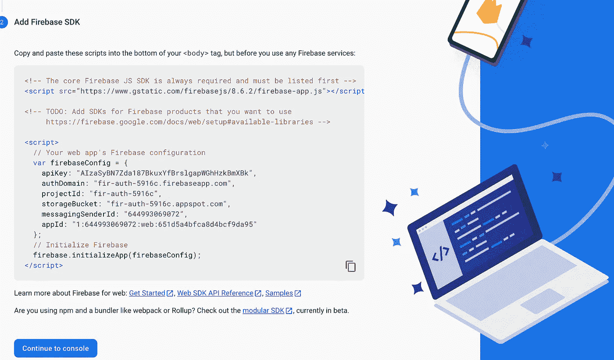

> 您的配置文件会有所不同。还有，不要用上面的键。 ***这篇文章后会删除这个演示 app。***

我们稍后会用到它们。现在，让我们设置认证 ***。*** 导航至 firebase 应用程序的主页，点击 ***认证。*** 然后，点击 ***开始。它将向你展示一些你可以用来创建用户认证的方法。在本文中，我们将使用**电子邮件/密码**方法。所以，点击它。然后点击 ***仅针对第一个选项启用*** 并点击 ***保存。******

太好了！现在我们有了一个认证方法和一个连接应用程序的配置文件。让我们去我们最喜欢的代码编辑器开始编码吧！

# 危险！代码提前

首先，我们将创建一个`.env.local`文件来存储我们的 Firebase 配置细节。将它们赤裸裸地公开放在你的代码中会让黑客很容易访问你的 Firebase 应用。在我们的 react-app 中，创建一个`.env.local`文件，只存储变量***firebaseConfig***中的键和值，如下所示:

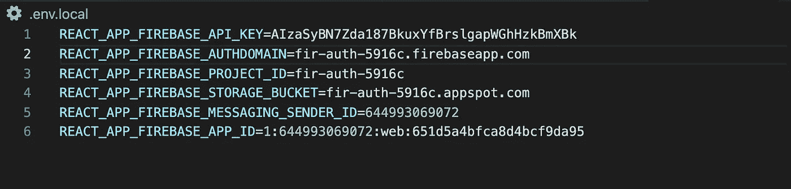

> 在 React 中， ***环境变量*** 的命名以 ***REACT_APP*** 开始

太好了！现在，是时候连接它了。为此，我们将使用 **firebase** 模块。下面是我们将在整个项目中使用的所有模块的列表。

*   `react-router-dom`用于处理不同的路线。
*   `bootstrap`用于造型
*   `react-bootstrap`对于预建的样式组件
*   `firebase`用于使用 Firebase

因此，继续使用命令:`npm i react-router-dom bootstrap react-bootstrap firebase`一次性安装它们。

在 react-app 中，创建一个文件`firebase.js`，用于与 Firebase 建立连接。

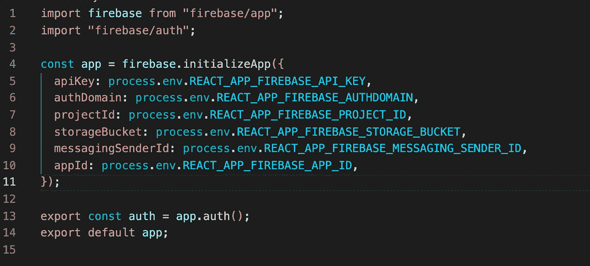

如果您观察敏锐，那么这个文件与 Firebase 提供给我们的用于创建连接的文件非常相似。是的，我们只是使用了`firebase`模块，而不是外部 JavaScript 脚本。我们用存储在`.env.local`文件中的环境变量初始化应用程序，而`app.auth()`存储在`auth`中，它将负责调用几个方法，如**登录、注册、注销等。**

很好。现在，是时候设置**上下文 API** 了，这样我们就可以在一个文件中定义我们的认证方法，并在相关的组件中访问它们。在`src`文件夹中，创建另一个名为**上下文**的文件夹，并在其中创建一个文件`authContext.js`，如下所示。

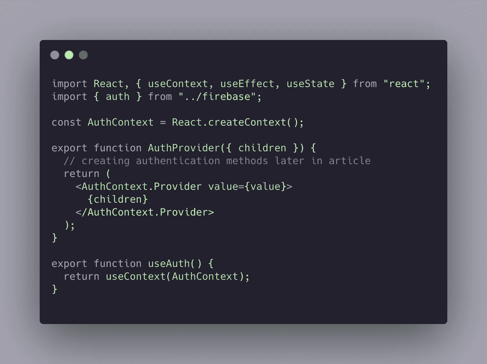

先决条件中提到了**上下文 API** 的基础知识。不过，我还是要解释一下。上面，你可以看到上下文 JavaScript 文件的基本结构。首先，我们使用`React.createContext()`创建一个上下文。它给了我们两样东西——提供者和消费者。现在，我们只关心能够让我们传递值并在任何组件中使用它们的提供者。

组件`AuthProvider`返回带有`value`属性的`<AuthContext.Provider>`组件，该属性包含我们想要传递的值，`{children}`引用将由**提供者包装的根组件。最后，我们创建了一个定制的钩子`useAuth()`，它直接给你所有传递的值。**

现在，让我们开始在 **authContext.js** 中创建我们的认证方法，并将它们传递给 **Provider。**用下面几行替换上面代码中的注释。

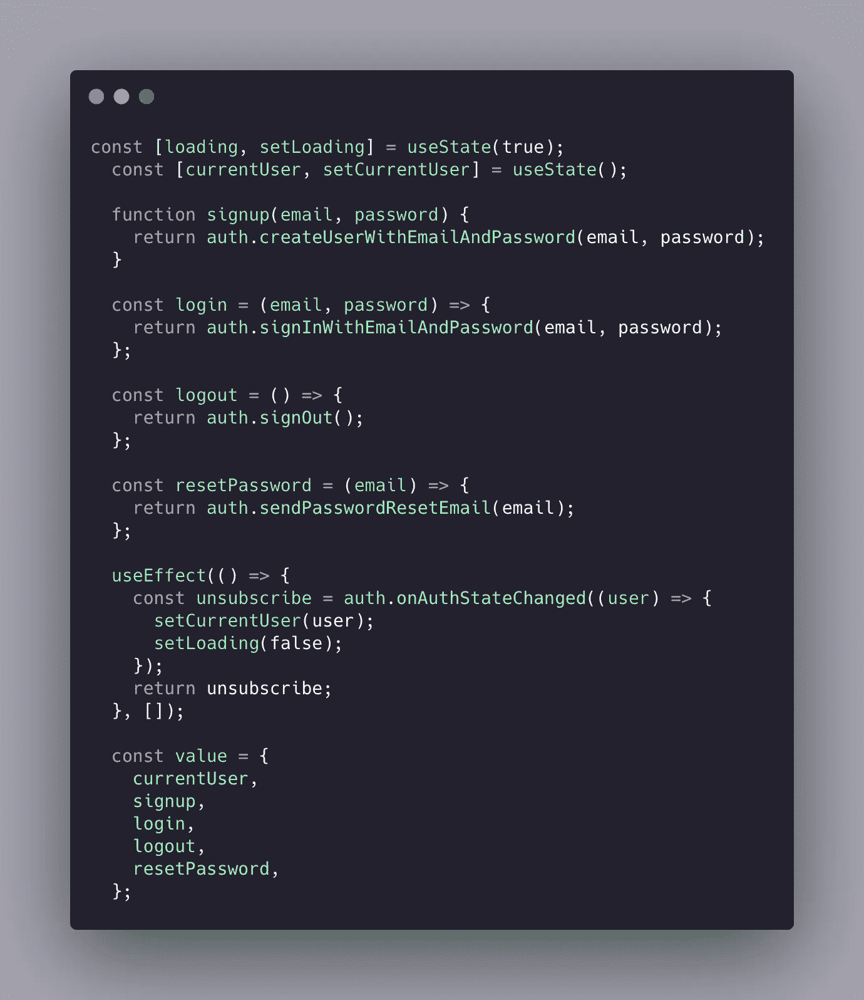

您可以看到，首先，我们创建了两个状态来存储包含登录用户信息的`currentUser`和设置为 false 后显示`{children}`的`loading`。所以，不要简单的把`{children}`渲染在`<AuthContext.Provider>`里面，改成`{!loading && children}`。

如前所述，所有的认证方法都将存储在 **firebase.js** 的`auth`中。因此，我们使用`auth`来调用不同的方法，并将它们存储在各自的函数中，以便在需要时可以调用它们。`useEffect()`包含一个事件处理程序，它持续监听用户登录和注销时的身份验证状态。据此，将`currentUser`状态设置为登录用户或`undefined`。

`auth.onAuthStateChanged()`是事件处理程序。每当组件加载时，`useEffect()`设置该处理程序多次使用。这可能会导致内存泄漏，并使您的应用程序变慢。为了处理这个问题，`auth.onAuthStateChanged()`返回了一个`unsubscribe`方法，它可以在组件卸载时让你从事件处理程序中取消订阅。

之后，我们只需将所有方法和状态传递给 **Provider 内部的 values prop。**

现在，我们需要用`AuthProvider`组件包装我们的根组件。在这个应用程序中，我们将包装我们的`App`组件。因此，打开 **index.js** 并执行以下操作:

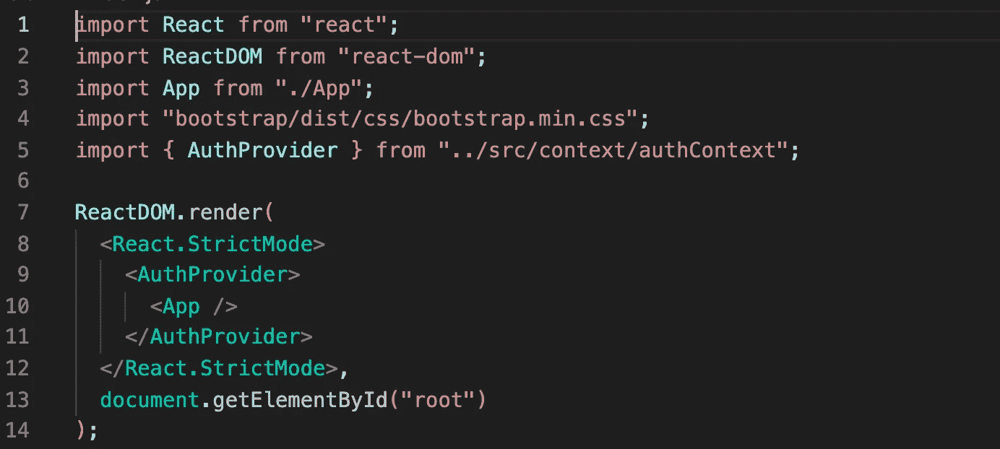

现在我们的`<App />`将为`<AuthProvider>`做`{children}`。你可以看到我还导入了一个引导 CSS 文件，为我们的每个组件赋予风格。但是如果您愿意，您可以创建自己的自定义样式表。在本文中，我们只关注功能。

到目前为止，我们一直在处理功能设置。所以，是时候为每个方法创建组件了。在`src`文件夹中创建一个文件夹，名称为`components`。

# 注册组件:

首先，我们将处理注册组件。因此，在`components`文件夹中，创建一个名为 **signup.js** 的文件。

我们将创建一个具有三个字段的表单— **电子邮件、密码、确认密码、**并检查**确认密码是否与密码匹配。**只有这样，我们才会从 **authContext.js 中调用注册方法。**如果注册成功，我们会将用户重定向到 ***仪表板*** 组件(稍后将创建该组件)。

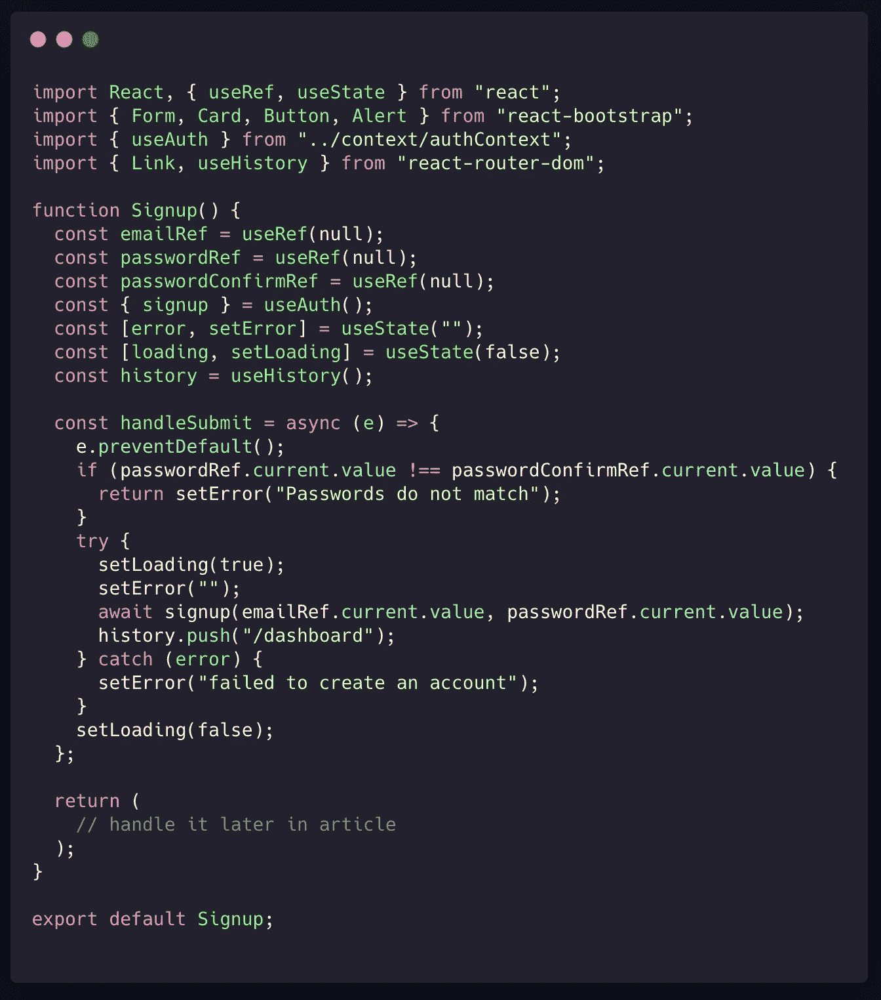

正如我在文章前面提到的，我们的定制钩子`useAuth()`将用于接收上下文中传递的值，在这个组件中，我们使用在 **authContext.js 中创建的 **signup** 方法。** `Link`用于将用户带到**登录**页面(如果他们已经有一个帐户),而`useHistory`挂钩用于在成功注册后重定向用户。

`emailRef`、`passwordRef`和`passwordConfirmRef`被用作各自输入字段的引用，稍后我们从`useAuth`钩子中析构**注册**方法。

现在，看一下`handleSubmit`的功能。这是一个`async`函数，因为来自 Firebase 的认证方法返回一个**承诺。**所以，我们用`async / await`来处理它。这里，我们首先检查密码和确认密码是否相同。然后，在`try / catch`块中，我们通过传递用户输入的**电子邮件**和**密码**来调用**注册**函数。

这是我们的**注册功能。**现在，在 return 中，让我们创建表单和其他 ui。我们使用**自举卡**和**形式**用于造型目的。

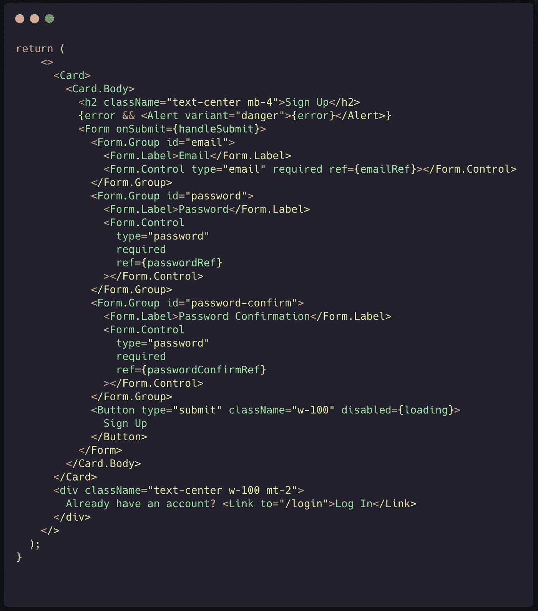

一行一行来就行了。代码非常简单。我们所做的就是使用 **bootstrap** 组件并创建表单。最后，如果用户已经有了帐户，我们创建了一个到**登录**组件的链接。就是这样。我们的**注册**组件准备好了。

# 登录组件:

在**组件**文件夹中创建一个文件，命名为 **login.js.**

这个组件将与**注册**组件非常相似。唯一的区别是我们调用了**登录**函数，而不是**注册。我们不需要在这里有确认密码字段。两个组件中的其余代码是相同的。**

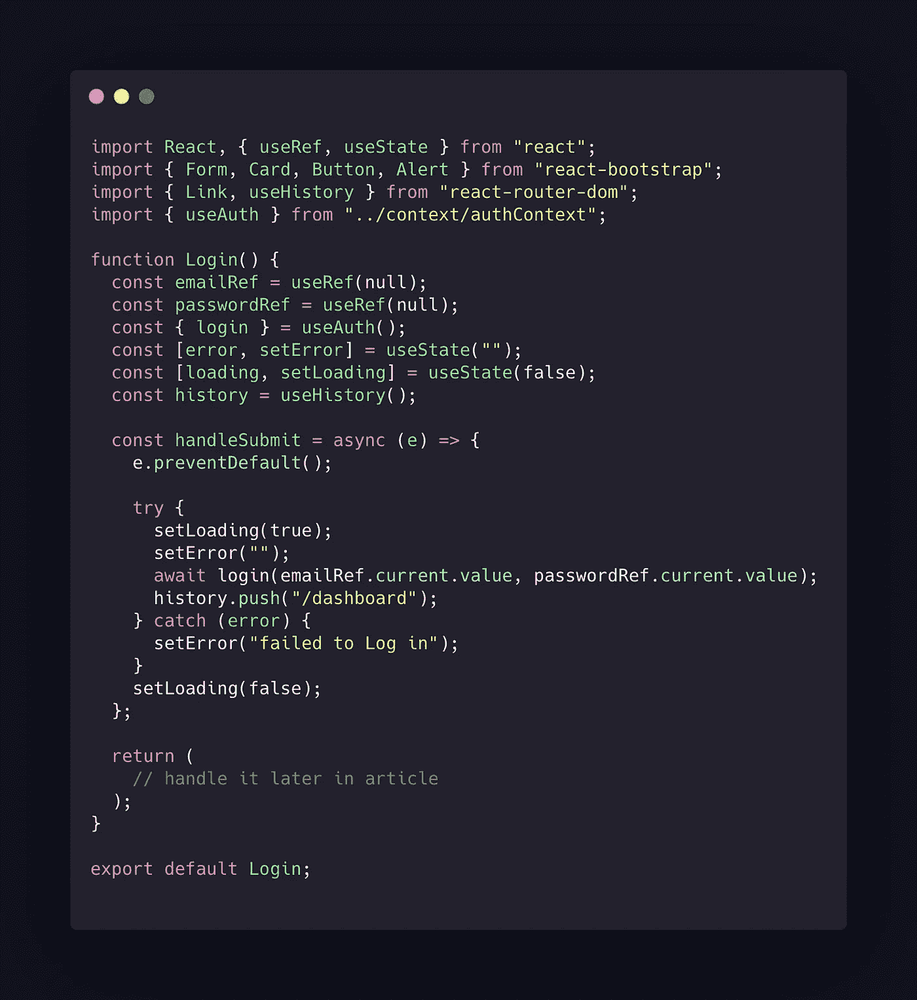

我们返回的内容也非常类似于**注册。**除了不创建到**登录的链接，**我们询问他们是否未注册，然后带他们到****注册**组件**。****

**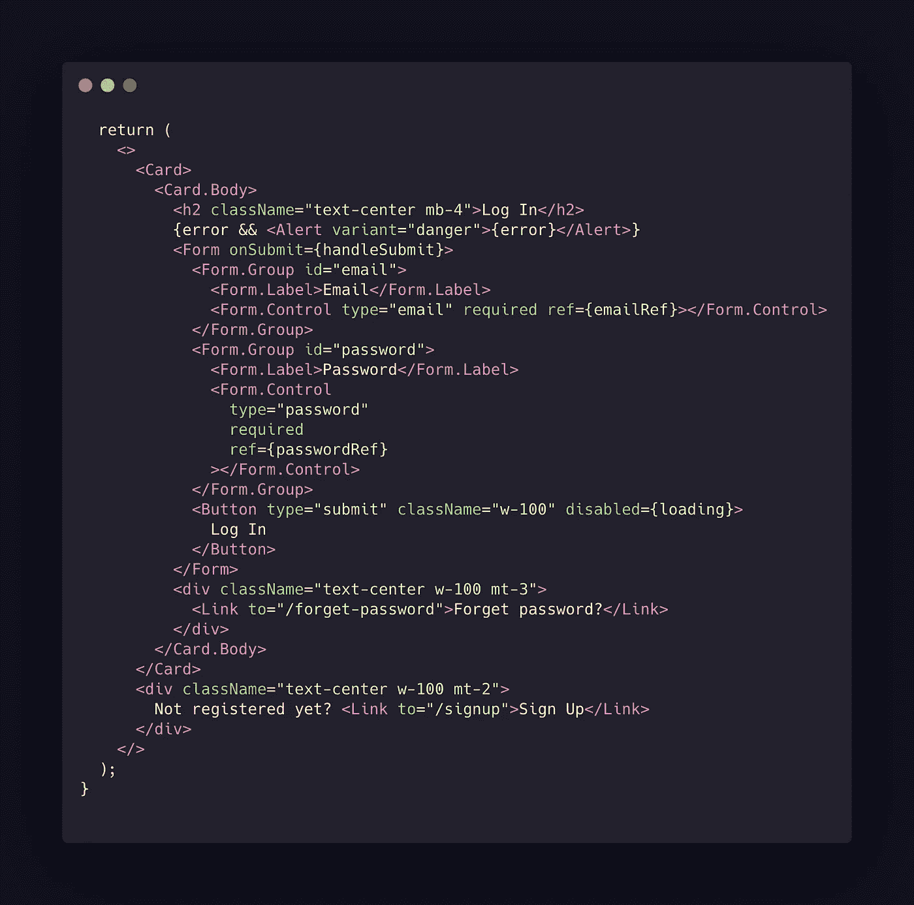**

**我们允许用户通过创建一个到**遗忘密码**组件的链接来重置他们的密码。**

# **忘记密码组件:**

**Firebase 密码重置的工作方式是，当用户点击它时，他们会向注册的电子邮件地址发送一封电子邮件，其中包含进一步的说明和重置密码的链接。**

**最酷的是，代码与上面的组件非常相似，这里我们调用了`resetpassword`方法。继续创建一个名为 **forgetpassword.js** 的文件，看看下面的内容。**

**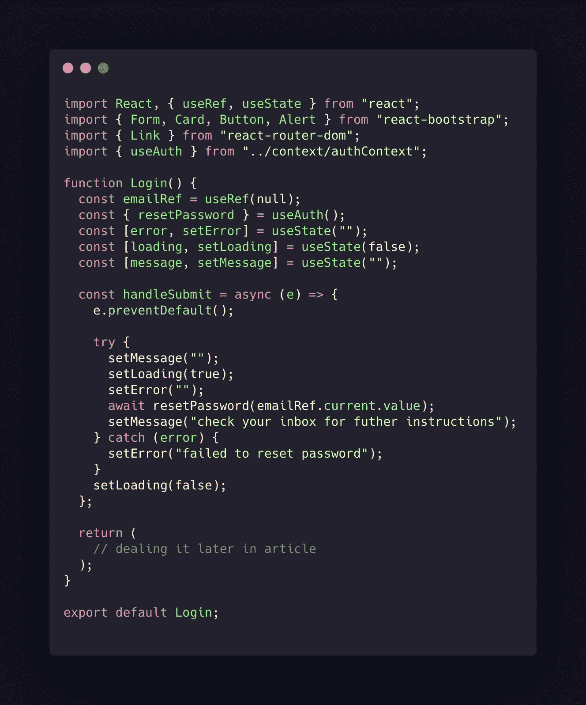**

**正如你所看到的，我们正在从自定义`useAuth()`钩子中析构`resetPassword`，并且在成功调用`resetPassword`函数后，有一个额外的状态来存储消息，比如 ***检查你的收件箱等等等等…*** 。**

**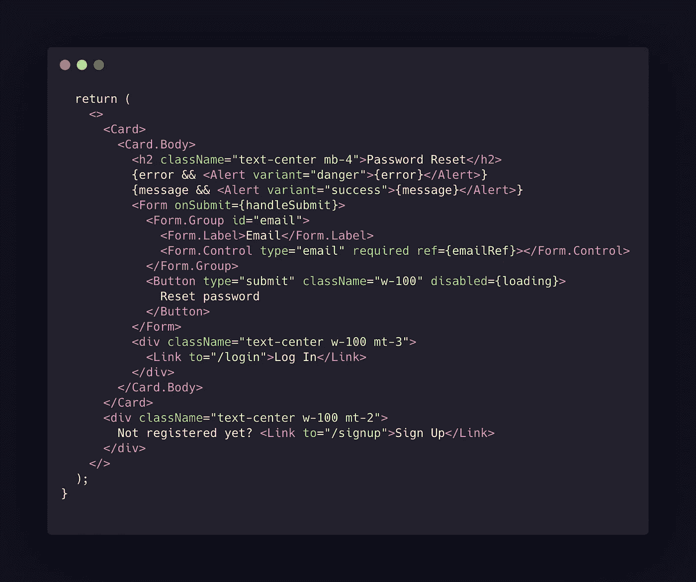**

**没什么新鲜的。我们已经熟悉了这种类型的代码——我们的**重置密码**组件已经准备好了。**

# **仪表板:**

**目前，我们的仪表板只显示了`currentUser`的电子邮件，还包含一个用于注销用户的`logout`按钮。您可以根据您的自定义项目添加更多功能。**

**继续在**组件**文件夹中创建一个名为 **dashboard.js** 的文件。**

**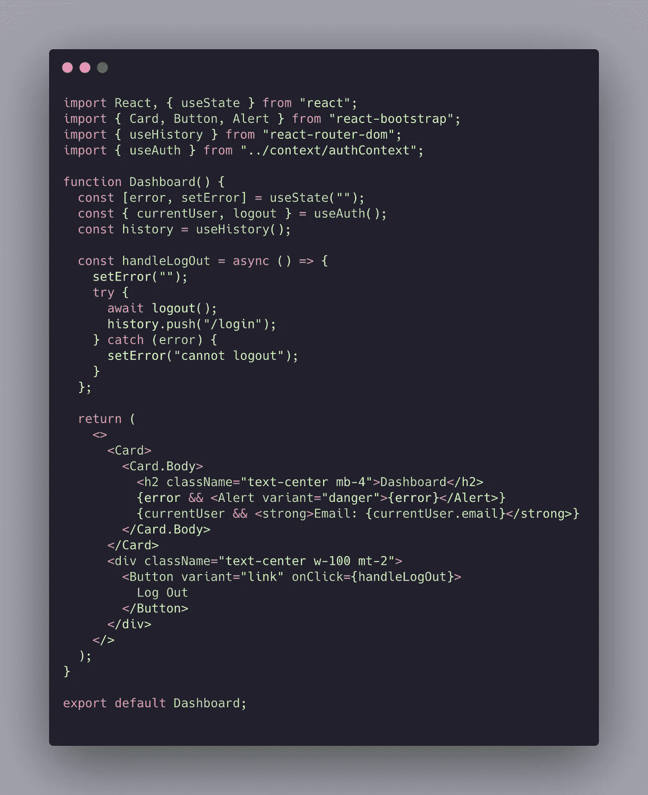**

**需要注意的是，这里我们分别析构了`logout`和`currentUser`来处理注销和显示登录用户的邮件。当用户成功注销时，我们使用`useHistory()`钩子将他/她重定向到**登录**组件。**仪表板**组件准备就绪。**

# **为组件设置路线:**

**我们完成了所有的组件。现在让我们使用`react-router-dom`在 **App.js** 中设置他们的每条路线。打开 **App.js** 并执行以下操作。**

**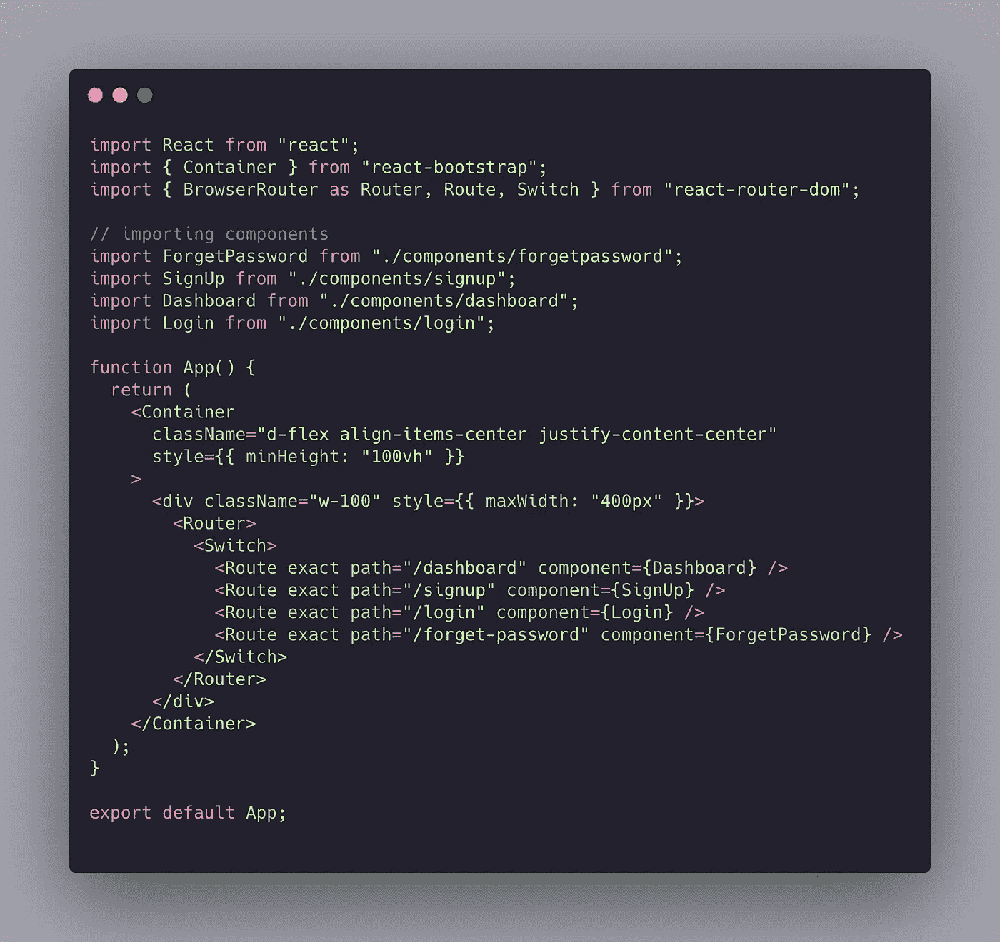**

**我们导出了`BrowserRouter`和`Route`来为每个不同的组件设置路径，导出了`Switch`来一次加载一个组件。**

**现在，如果您通过运行`npm start`启动应用程序，那么您会看到一个空白屏幕，因为主页现在是空的。要查看不同的组件，请访问它们各自的 URL。比如:[***http://localhost:3000/sign up***](http://localhost:3000/signup)*会带你去:***

***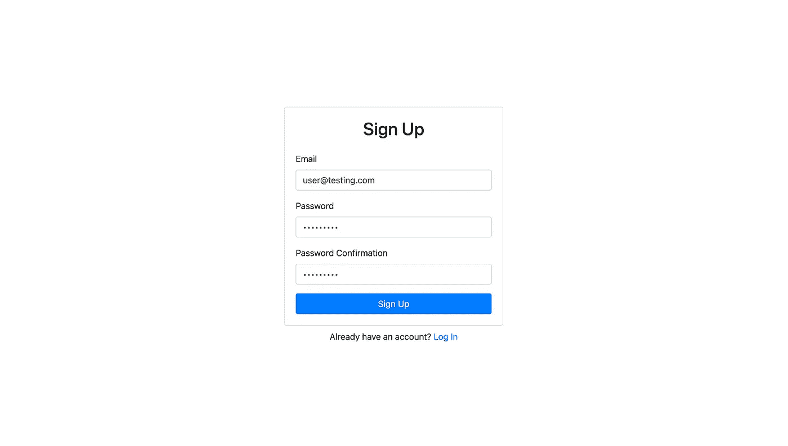***

***当您输入您的详细信息并点击 ***注册*** 按钮时，您将被重定向到**仪表板**组件***

***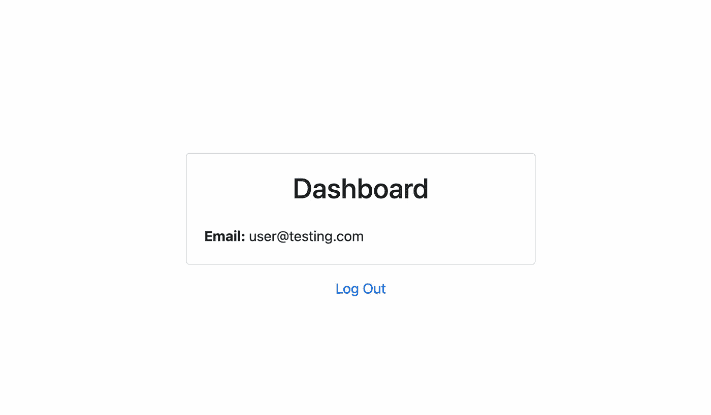***

***现在，您可以一个接一个地检查其他组件。现在我们已经成功地实现了认证。您可以在 Firebase 控制台的 authentication 部分看到注册用户的列表。还缺少一些东西…..***

# ***保护敏感路线:***

***我们的应用程序运行良好，用户认证也很好，但仍然缺少一些东西，我们忘记了一些东西。你能猜到是什么吗？***

***嗯，如果你注销用户，并试图进入**仪表板**…嘣！你仍然可以访问它，这是不好的。我们不希望任何来宾用户轻松访问我们的仪表板。虽然它现在不包含任何内容，但在您的项目中可能不成立。我们仍然需要保护它，以便只有注册用户才能访问他们的仪表板。***

***我们可以这样做的方法是创建另一个组件。基本上是来自`react-router-dom`的`Route`组件的修改版本，它将检查是否有人登录。如果为真，那么它将呈现**仪表板，**否则，只需重定向到**登录**组件。***

***在 **components** 文件夹中创建一个名为 **privateRoute.js** 的文件，看看它将包含什么。***

***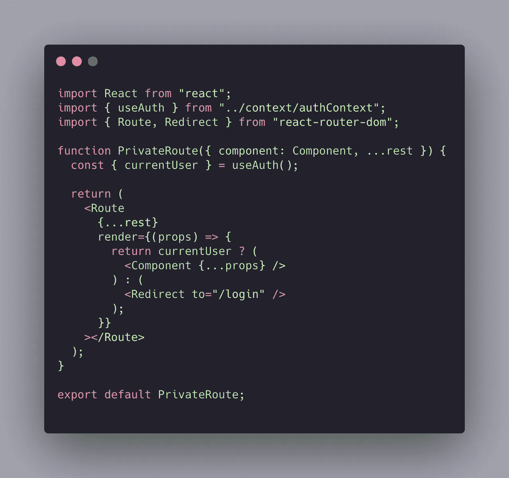***

***让我们明白我们在做什么。正如我所说的， **PrivateRoute** 是`Route`组件的修改版本，它在建立任何路由之前检查`currentUser`。在这里，我们先来了解一下`useAuth()`的`currentUser`。***

***然后，我们返回带有普通`<Route>`组件所需的所有道具的`<Route>`组件，如`path`、`exact`等。然后检查`currentUser`。如果为真，则渲染**仪表板；**否则，重定向到**登录。这里，我们将使用来自`react-router-dom`的`<Redirect>`组件，而不是使用`useHistory()`进行重定向，因为如果`currentUser`没有登录，我们需要渲染一些东西。*****

***现在，在 **App.js 中，**导入该组件，并将为**仪表板**设置路线的代码行替换为:***

***`<PrivateRoute exact path=”/dashboard” component={Dashboard} />`***

***我们完了。现在，如果您试图以访客身份访问**仪表板**，您将被重定向到**登录**组件。***

# ***结论:***

***就是这样。我们成功地创建了用户身份验证所需的所有基本功能。你可以用你想要的方式升级它，或者不使用**上下文，**你可以使用 **Redux。Firebase 有很多很酷的功能，比如 Firestore、实时数据库等等。在设计大型项目时，它真的很方便。我们将在以后的文章中讨论更多关于 Firestore 的内容。在那之前，保持健康，继续编码。*****

> ***如果您想要项目的完整代码文件，请从这里的 [**获取。**](https://github.com/practice404/react-components/tree/main/firebase-react-auth)***

****更多内容请看*[*plain English . io*](http://plainenglish.io/)***