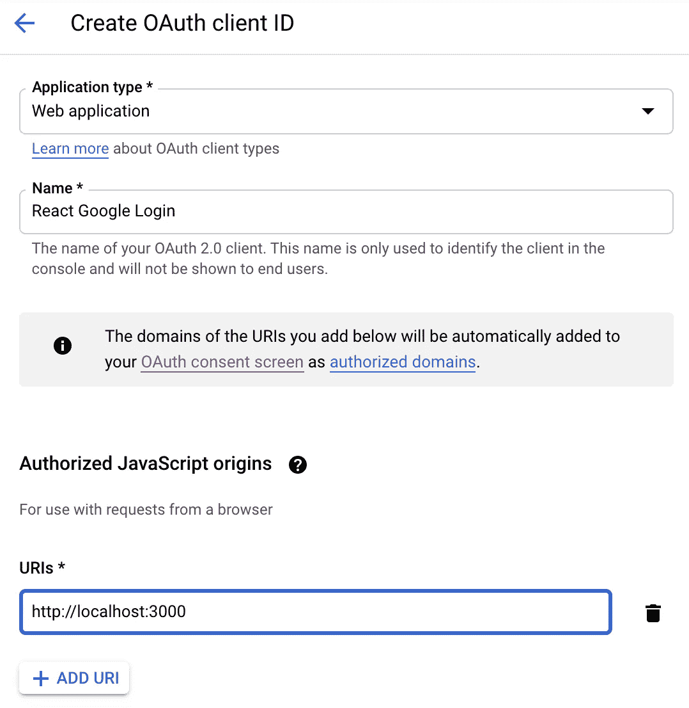

# 如何在 React 中设置 Google OAuth

> 原文：<https://javascript.plainenglish.io/how-to-set-up-google-oauth-in-react-with-react-google-login-9c6538389fde?source=collection_archive---------1----------------------->

## 在 React 中创建一个 Google OAuth 登录组件。


Photo by [Mitchell Luo](https://unsplash.com/@mitchel3uo?utm_source=medium&utm_medium=referral) on [Unsplash](https://unsplash.com?utm_source=medium&utm_medium=referral)

OAuth 是用户授予网站和应用程序访问其信息而无需创建新密码的常用方式。大多数大公司使用 OAuth 与第三方网站和应用程序共享信息。Google 是使用 OAuth 协议进行认证和授权的大公司之一。

理解在 React 应用程序中实现 OAuth 的流程可能很棘手。幸运的是，有一个名为 react-google-login 的第三方包，我们可以用它来使事情变得简单一些。

在本文中，我们将了解如何在 React 应用程序中访问 Google APIs OAuth。在本文结束时，您应该了解如何做到以下几点:

*   使用 react-google-login 在 React 中创建一个登录按钮
*   从 Google API 控制台获取凭据
*   从 Google 授权服务器获取一个访问令牌

# 使用 react-google-login 在 React 中创建一个登录按钮

对于这个例子，我将使用 create-react-app 创建一个基本的 React 应用程序。然后我们将清理`App.js`文件来呈现一个空白屏幕。

```
npx create-react-app YOUR-PROJECT-NAME
```

我们将使用 [react-google-login](https://www.npmjs.com/package/react-google-login) 包来创建一个按钮组件，并连接到 google 授权服务器。

第一步是将软件包安装到您的项目中。

```
npm install react-google-login
```

然后，导入`GoogleLogin`组件，并在您的应用程序中呈现它。`GoogleLogin`组件将采用以下道具:

*   clientId——来自 Google API 控制台的客户端 Id(我们将在下一节中获取)
*   buttonText —显示在按钮上的文本
*   onSuccess —成功时运行的回调函数
*   onFailure —失败时运行的回调函数
*   cookiesPolicy —为其创建登录 cookie 的域

对于`onSuccess`和`onFailure`道具，我们将创建一个回调函数，简单地将响应打印到控制台。

```
const responseGoogle = *response* => {
  console.log(response);
};
```

`GoogleLogin`组件将如下所示:

```
<GoogleLogin
  clientId=""
  buttonText="Login with Google"
  onSuccess={responseGoogle}
  onFailure={responseGoogle}
  cookiePolicy="single_host_origin"
/>
```

该按钮将被禁用，因为我们还没有添加客户端 ID。它看起来会像这样。


# 从 Google API 控制台获取凭据

下一步将是从 [Google API 控制台](https://console.developers.google.com/)获取凭证。

访问网站，并创建一个新项目。


创建项目后，选择您的项目并访问 **OAuth 同意屏幕**。


在这里，您需要配置和注册您的应用程序。采取以下步骤:

1.选择用户类型=外部


2.填写应用信息和开发者联系信息中的必填字段


3.添加范围或测试用户(可选)

完成后，请访问**凭证**选项卡。


从这里，点击**创建凭证**按钮并选择 **OAuth 客户端 ID** 。选择 Web 应用程序的应用程序类型，并为 OAuth 客户端命名。最后，添加一个授权的 JavaScript 源。

授权的 JavaScript 源用于标识应用程序可以向 OAuth 2.0 服务器发送请求的域。在我们的例子中，我们将它设置为[*http://localhost:3000*](http://localhost:3000/)。



最后，点击 **Create** ，等待 OAuth 客户端被创建。将出现以下模式。


复制此客户端 ID。我们将在下一步中需要它。

# 从 Google 授权服务器获取一个访问令牌

现在我们已经有了客户端 ID，返回到您的文本编辑器，将它作为道具添加到`GoogleLogin`组件中。

在您的应用程序中，登录按钮现在应该显示为可点击的。


如果我们点击按钮，它将打开谷歌模式的登录。选择您要用来登录的电子邮件。

登录后，将调用`onSuccess`回调函数，您将在控制台中看到一个带有响应信息的对象。该响应将包括一个访问令牌、一个包含您的个人信息的配置文件对象以及其他详细信息。

恭喜你！你现在通过谷歌认证了。

# 结论

感谢阅读！使用 OAuth 是在您的网站或应用程序中验证用户身份的好方法。它为用户省去创建和记忆新密码的麻烦。

我希望这篇文章对您在 React 应用程序中设置 Google OAuth 有所帮助。

如果你想学习如何在 React 中建立一个注册页面，请查看下面的文章。

[](https://levelup.gitconnected.com/create-a-signup-page-with-react-and-material-ui-9b203d18cf3f) [## 用 React 和 Material-UI 创建一个注册页面

### 了解如何为您的下一个网站创建一个对话框和表单

levelup.gitconnected.com](https://levelup.gitconnected.com/create-a-signup-page-with-react-and-material-ui-9b203d18cf3f) 

*更多内容请看*[*plain English . io*](http://plainenglish.io/)