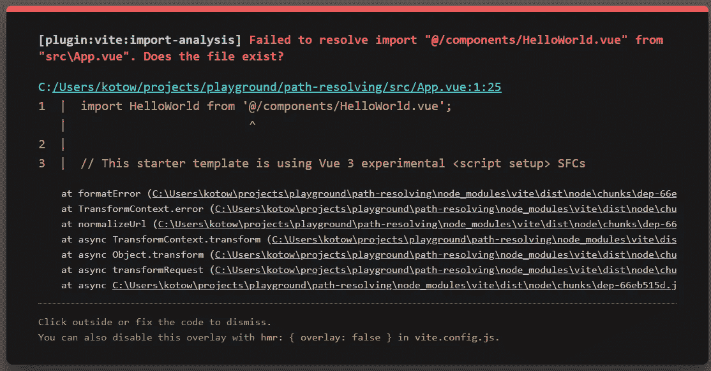

# 如何在 Vite 中设置路径解析

> 原文：<https://javascript.plainenglish.io/how-to-set-up-path-resolving-in-vite-ad284e0d9eae?source=collection_archive---------2----------------------->


本文原载于[*企业*](https://theroadtoenterprise.com/blog/how-to-set-up-path-resolving-in-vite)*之路。*

*一段时间以前，我尝试在我的一些辅导项目中使用 [Vite](https://vitejs.dev) 。在用 Vite 设置了一个项目并创建了一个新的组件之后，我尝试用我在处理用 Vue-CLI 搭建的项目时通常使用的方式导入它，用@符号解析到“src”目录。令我惊讶的是，它并没有工作，我很高兴看到这个错误:*

**

*原来 Vite 默认没有 *src* 路径解析。幸运的是，配置它相当容易。*

**

*Learn industry-level skills with the most advanced React book available.*

# *路径别名*

*我们可以通过修改 *vite.config.js* 文件来配置 Vite。我们需要通过提供 *resolve.alias* config 来告诉 Vite 应该如何解析路径。下面是将 *@* 符号解析到 *src* 目录的代码。*

## *vite.config.js*

```
*import { defineConfig } from 'vite'
import vue from '@vitejs/plugin-vue'
import path from 'path'

export default defineConfig({
  plugins: [vue()],
  resolve: {
    alias: {
      '@': path.resolve(__dirname, './src'),
    },
  },
})*
```

*我们还需要做一件事。告诉您的代码编辑器应该如何解析您的别名是一个好主意。你可以通过创建一个 *jsconfig.json* 或者 *ts.config.json* 文件来实现。*

*jsconfig.json*

```
*{
  "compilerOptions": {
    "baseUrl": ".",
    "paths": {
      "@/*": ["src/*"]
    }
  }
}*
```

*如果没有设置它，如果您试图从“@/component/…path”导入一个类似于 *import CMP 的组件，它将没有 intellisense。**

## *结论*

*我希望这篇文章对你有用。如果你想学习更多与 Vue 相关的技巧、高级模式、技术和最佳实践，你可能想看看[《Vue——企业之路》](https://theroadtoenterprise.com/?utm_source=theroadtoenterprise_blog&utm_medium=article_learn_more&utm_campaign=vue_the_road_to_enterprise)这本书，注册[时事通讯](https://theroadtoenterprise.com/blog/subscribe?utm_source=theroadtoenterprise_blog&utm_medium=article_learn_more&utm_campaign=vue_the_road_to_enterprise)，并在 [Twitter](https://twitter.com/@thomasfindlay94) 上关注我。*

**更多内容请看*[***plain English . io***](https://plainenglish.io/)*