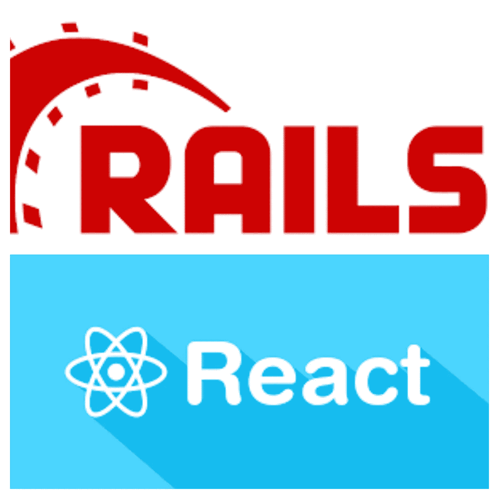

# 如何使用 Ruby on Rails 项目设置 React 第 2 部分— Redux

> 原文：<https://javascript.plainenglish.io/how-to-set-up-react-js-with-a-ruby-on-rails-project-part-2-redux-31ac07638f34?source=collection_archive---------16----------------------->



之前，我们设置了 Ruby on Rails 应用程序来使用 React。

现在，我们需要做更多的事情来确保我们的应用程序真正发挥作用。我们仍然需要

1.  在 rails 中设置我们的模型
2.  让我们的前端连接到我们的后端
3.  集成 Redux 以便 React 更好地工作。

让我们开始吧。

# 在 rails 中设置我们的 Post 模型和控制器

这将是一个非常常见的 Rails 代码。首先在“app/models/Post.rb”中创建模型。

```
class Post < ApplicationRecordend
```

接下来，我们将设置我们的序列化程序。这基本上把我们的模型变成了 JSON，我们可以把它发送到我们的前端。创建“app/serializer/post _ serializer . Rb”并放置以下内容:

```
class PostSerializer
  include FastJsonapi::ObjectSerializer
  attributes :title, :bodyend
```

这些属性是我们的模型上的属性，我们将把它们公开为 JSON。这提醒了我，我们需要添加 FastJsonapi 宝石。转到您的 gem 文件并添加:

```
gem 'fast_jsonapi'
```

运行捆绑包安装。

现在我们需要在数据库中建立我们的模型。运行以下命令:

```
rails g migration create_posts
```

在迁移文件中:

```
class CreatePosts < ActiveRecord::Migration[6.1]
  def change
    create_table :posts do |t|
      t.string :title
      t.string :body
      t.timestamps
    end
  endend
```

然后运行迁移:

```
rails db:migrate
```

现在，在控制器上。在“app/controller/API/v1/posts _ controller . Rb”中设置您的控制器代码。这在通常的 Rails CRUD 控制器代码中很常见，但是我们将呈现 JSON，而不是呈现视图或重定向。

以下是控制器的代码:

```
module Api
  module V1
    class PostsController < ApplicationController

      def index
        posts = Post.all
        render json: PostSerializer.new(posts).serialized_json
      end

    def show
      post = Post.find(params[:id])
      render json: PostSerializer.new(post).serialized_json
    end

    def create 
      post = Post.new(post_params)

      if post.save
        render json: PostSerializer.new(post).serialized_json
      else
        render json: {error: post.errors.messsages}
      end
    end

    def update
      post = Post.find(params[:id])
      if post.update(post_params)
        render json: PostSerializer.new(post).serialized_json
      else
        render json: { error: post.errors.messages }
      end
    end

    def destroy
      post = Post.find(params[:id])

      if post.destroy
        head :no_content
      else
        render json: { error: post.errors.messages }
      end
    end

    private 

    def post_params
      params.require(:post).permit(:title, :body)
    end
  endend
```

现在是用 Postman 之类的东西测试所有这些动作的好时机。在进入前端之前，继续测试您的 API。

我们将在接下来的部分中编写大量代码来连接我们的后端。你的后端正常工作是很重要的。

打开 Rails 控制台并添加一些记录，这样我们就可以看到我们的数据。我是这么做的。

```
Post.create(title: "one", body:"something")Post.create(title: "two", body:"something else")
```

现在，当您达到帖子的索引端点时，您应该会获得一些记录。

# 向 Ruby on Rails 添加 Redux

创建一个文件夹和文件夹“app/javascript/src/api/api.js”这是我们要用来和我们的后端对话的。我们的文件将是这样的:

```
import axios from 'axios'

const ROOT_PATH = '/api/v1'
const POSTS_PATH = `${ROOT_PATH}/posts`

export const getPosts = () => {
  return axios.get(POSTS_PATH)}
```

我们正在导入 axios，这样我们就可以向后端发出 http 请求。然后，我们为我们的路线设置一些常数。最后，我们将创建一个向我们的 posts 路由发出 get 请求的函数。

使用纱线添加 axios:

```
yarn add axios
```

现在是时候添加 redux 了。我将尽我所能解释清楚，但是我假设在您开始尝试将 redux 添加到 Rails 之前，您已经对 redux 的工作原理有所了解。

在“app/javascript/src/actions”中创建一个 actions 文件夹，并在该文件夹中创建一个 posts.js 文件。在文件中写下:

```
import * as api from '../api/api'

export const getPosts = () => async (dispatch) => {
  const { data } = await api.getPosts()}
```

我们正在导入我们的 api，所以我们可以使用那里的方法。我们还创建了一个函数，它只调用我们的 api 并返回数据。“dispatch”部分可能看起来很奇怪，但是我们这样做是为了让 redux-thunk 工作。

我们稍后将回到这个函数，但这足以测试它。

编辑:在添加之前，我们不会测试这个函数。耐心等待，我们将回到这个函数。

转到位于“app/javascript/packs/index.jsx”的 index.jsx 文件，使该文件如下所示

```
import React from 'react'
import ReactDOM from 'react-dom'
import { BrowserRouter as Router, Route } from 'react-router-dom'
import App from '../src/components/App'

import { Provider } from 'react-redux'
import { createStore, applyMiddleware, compose } from 'redux'
import thunk from 'redux-thunk'
import reducers from '../src/reducers'

const composeEnhancers = window.__REDUX_DEVTOOLS_EXTENSION_COMPOSE__ || compose

const store = createStore(reducers, composeEnhancers(applyMiddleware(thunk)))

document.addEventListener('DOMContentLoaded', () => {
  ReactDOM.render(
    <Provider store={store}>
      <Router>
        <Route path="/" component={App}/>
      </Router>
    </Provider>,
    document.body.appendChild(document.createElement('div')),
  )
})
```

那么这些代码是怎么回事呢？首先，我们从 react-redux 和 redux-thunk 导入我们需要的所有东西:

```
import { Provider } from 'react-redux'
import { createStore, applyMiddleware, compose } from 'redux'
import thunk from 'redux-thunk'import reducers from '../src/reducers'
```

我们还将导入一个 reducers 文件，稍后我们将创建该文件。

然后，这一行设置 Redux，这样我们就可以使用 Chrome redux 开发工具。如果你没有这样设置，Chrome 扩展将无法工作:

```
const composeEnhancers = window.__REDUX_DEVTOOLS_EXTENSION_COMPOSE__ || compose
```

接下来，我们将创建我们的商店，让我们能够与 state 合作。我们还告诉我们的应用程序，我们想使用 redux-thunk。

```
const store = createStore(reducers, composeEnhancers(applyMiddleware(thunk)))
```

最后，我们将应用程序包装在 Provider 标签中。这与访问我们应用程序中的商店或状态有关。

```
<Provider store={store}>
      <Router>
        <Route path="/" component={App}/>
      </Router></Provider>
```

文件就这些了。现在我们需要创建我们刚刚导入的那个缩减器。但首先，确保你用纱线添加包装。

```
yarn add react-redux redux-thunk
```

在“app/javascript/src”中创建一个 reducers 文件夹，创建两个文件。创建一个“posts.js”文件和一个“index.js”文件。我们先打开“posts.js”文件。

这个文件将会记录你的应用状态中的帖子。这个文件的任务是当你的动作文件发出某些动作时，更新所有的文章。

该文件如下所示:

```
import { GET_POSTS } from '../types/index'

export default (posts = [], action ) => {
  switch (action.type) {
    case GET_POSTS:
      return action.payload
    default:
      return posts
  }}
```

让我们来分析一下这里发生了什么。首先，我们导入一个 GET_POSTS 类型。我们一会儿就会创建它。

接下来，我们导出一个函数，并将 posts 的初始状态设置为一个空数组。然后我们有了 switch 语句。

```
switch (action.type) {
   case GET_POSTS:
     return action.payload
   default:
     return posts}
```

这是在说“每当我看到 GET_POSTS 动作时，我将从该动作中获取有效负载，并将我的帖子设置为等于该有效负载。对于所有其他操作(默认)，我只是返回帖子，什么也不做。

稍后，当我们使用我们的动作时，我们将发送类似 GET_POSTS 的类型，告诉这个 reducer 使用我们传递给它的数据。如果有任何其他动作类型传递给它，它不会做任何事情。

在我们忘记之前，让我们在“app/JavaScript/src/types/index . js”中创建类型文件夹和文件。这将有助于我们以后打错任何类型。

```
export const GET_POSTS = "GET_POSTS"
```

现在我们转到“app/JavaScript/src/reducers . index . js”文件。这个文件只是结合了你所有的减速器。

```
import { combineReducers } from 'redux'
import posts from './posts'

export default combineReducers({
  posts: posts})
```

这告诉 redux 我们需要一个名为“posts”的状态键，并将其设置为与状态中的 posts 相等。

既然我们已经设置了我们的 reducers，我们可以返回到我们的 action creator 文件并分派操作。基本上，这让我们的行为与我们的还原者对话。回到“apps/JavaScript/src/actions/posts . js ”,让你的文件看起来像这样。

```
import * as api from '../api/api'
import { GET_POSTS } from '../types/index'

export const getPosts = () => async (dispatch) => {
  const { data } = await api.getPosts()
  dispatch({
    type: GET_POSTS,
    payload: data.data
  })
}
```

这就是我们正在做的。我们使用 api 从 rails 后端获取数据。然后，通过“dispatch”我们告诉我们所有的 reducers“嘿，如果你订阅了 GET_POSTS 操作，我有一些数据给你。”

我们现在只有一个 reducer，但是所有的 reducer 都会关注这个动作，只有那些订阅了 GET_POSTS 的 reducer 才会执行任何操作。在我们的例子中，我们的 posts reducer 正在寻找这种动作类型。它将看到有效载荷中的数据，然后在我们的 posts 键中设置我们的状态。

现在让我们实际使用我们设置的所有代码！

回到我们的 Posts 组件“app/JavaScript/src/components/Posts/Posts ”,编写以下代码。

```
import React, { useEffect } from 'react'
import { useDispatch, useSelector } from 'react-redux'
import { getPosts } from '../../actions/posts'

const Posts = () => {
  const dispatch = useDispatch()
  const posts = useSelector(state => state.posts)
  useEffect(() => {
      dispatch(getPosts())
  }, [])

  if (posts.length === 0) { return <div>loading...</div>}

  console.log(posts)

  return (
    <div>
      <h1>Posts</h1>
      <p>This is our posts page.</p>
    </div>
  )
}export default Posts
```

这是怎么回事？

我们正在从 react-redux 获得一些函数，并获得我们的动作创建器函数。

```
import { useDispatch, useSelector } from 'react-redux'
import { getPosts } from '../../actions/posts'
```

我们正在这里设置我们的调度功能。

```
const dispatch = useDispatch()
```

接下来，我们告诉 react 创建一个名为 posts 的变量，并将其设置为 redux 存储中的 posts。

```
const posts = useSelector(state => state.posts)
```

现在，我们说“当这个组件加载时，使用我的动作创建器获取所有的帖子。

```
useEffect(() => {
     dispatch(getPosts())
}, [])
```

如果我们的页面在我们的数据返回之前加载，我们将有一个加载信号。否则，如果你在数据从服务器返回之前就开始尝试访问数据，你的应用就会崩溃。

```
if (posts.length === 0) { return <div>loading...</div>}
```

然后，我们只是控制台。登录我们的职位。你应该也能在 Chrome redux 开发工具中看到它们。

```
console.log(posts)
```

太棒了，现在我们的 react 应用程序可以从 redux store 读取数据，这些数据来自我们的后端。我们在最后冲刺阶段！

不过，我们不只是想记录我们的数据。所以，让我们解决这个问题。在我们的返回函数中，我们要像这样放另一个函数。

```
return (
   <div>
     <h1>Posts</h1>
     {renderPosts()}
   </div>}
```

让我们在这个文件中创建一个名为 renderPosts 的函数。在这里，我们将遍历我们的每个帖子并呈现一个组件。

```
const renderPosts = () => {
    return posts.map(post => {
      return <PostListItem key={post.id} post={post} />
    })}
```

我们将当前帖子传递给每个项目。我们还要给它一个键，否则 react 会对我们大喊大叫，这会影响性能。

导入顶部的列表项目。

```
import PostListItem from './PostListItem'
```

然后在“app/JavaScript/src/components/Post/PostListItem”处创建。

```
import React from 'react'

const PostListItem = ({post}) => {
  return(
    <div>
      <h2>{post.attributes.title}</h2>
      <p>{post.attributes.body}</p>
    </div>
  )
}export default PostListItem
```

你现在应该可以看到你所有的帖子了。


在下一篇文章中，我将介绍 Rails 和 React 中的 CRUD 操作。敬请期待！

*更多内容尽在*[*plain English . io*](http://plainenglish.io/)