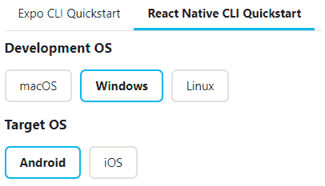
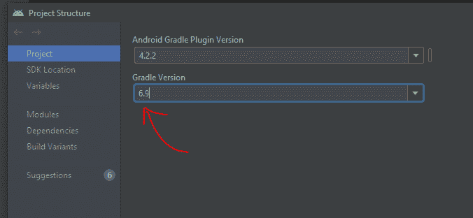
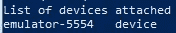

# 如何在 WSL2 上为 Android 开发设置 React-Native

> 原文：<https://javascript.plainenglish.io/how-to-set-up-react-native-on-your-wsl2-for-android-development-a09ee37bf628?source=collection_archive---------0----------------------->


Photo by [Naveen Chandra](https://unsplash.com/@naveenchandra?utm_source=medium&utm_medium=referral) on [Unsplash](https://unsplash.com?utm_source=medium&utm_medium=referral)

# 介绍

最近，我为一个 **React-Native** 项目建立了一个环境，作为一个在我的 web 开发环境中使用 **Windows + WSL2** 的忠实粉丝，我不想在这个新的移动开发项目中停止使用 WSL2。

在任何环境下设置 React-Native 通常都是非常痛苦的，每次我需要设置它的时候我都差点哭出来。如果你把 WSL2 加进去，事情就变得更糟了。我花了很多时间，直到一切正常，我写这篇文章的目的是让任何需要的人生活得更容易。

在本教程结束时，您将有一个 React-Native 项目在 WSL2 中运行，并在 Windows 10 上使用 Android 模拟器。

# 先决条件

Windows 10 环境

*   安装的 VSCode
*   WSL2 Ubuntu 20.04 安装了 node v14.18.2 和 VSCode 扩展([https://docs . Microsoft . com/en-us/windows/dev-environment/JavaScript/nodejs-on-wsl](https://docs.microsoft.com/en-us/windows/dev-environment/javascript/nodejs-on-wsl))

PS:你可以在 WSL2 上使用任何发行版，但是本教程是用 Ubuntu 20.04 发行版制作的。

# 开始吧！

本文将分为两个部分

*   A 部分:在 Windows 10 上设置环境
*   B 部分:在 WSL2 上设置环境

# A 部分:在 Windows 10 上设置环境

在这一节你只需要按照官方文档在 Windows 10 上安装 React-Native。

等等…但是你刚刚说这个任务通常是非常痛苦的，现在你又说我“只是”需要遵循官方文档，你怎么敢？！

是的……我知道官方文档是广泛而痛苦的，但是我会给你一些提示来浏览它:

1.选择*快速启动*选项时，选择:

*   **React Native CLI 快速入门**
*   开发操作系统: **Windows**
*   目标操作系统:**安卓**



2.安装节点时，最好安装版本 14.18.2

*   如果安装的节点版本不同于 v14.18.2，您也可以安装 **nvm** 并设置为使用 v 14 . 18 . 2([https://docs . Microsoft . com/en-us/windows/dev-environment/JavaScript/nodejs-on-windows](https://docs.microsoft.com/en-us/windows/dev-environment/javascript/nodejs-on-windows))
*   PS:您可以按照任何节点版本的教程进行操作，但是请记住，在这个过程中，它可能会导致一些令人讨厌的**错误**，比如这个:[https://stack overflow . com/questions/69647332/cannot-read-properties-of-undefined-reading-transform file-at-bundler-transfo](https://stackoverflow.com/questions/69647332/cannot-read-properties-of-undefined-reading-transformfile-at-bundler-transfo)

3.在本教程中，您可以跳过使用物理设备配置的*，而只遵循使用虚拟设备*的*。*

所以，现在深呼吸，穿过它！【https://reactnative.dev/docs/environment-setup 

下一节见。

# B 部分:在 WSL2 上设置环境

到目前为止，您应该已经有了一个 React 原生项目，并在 Windows 10 上运行了一个模拟器，对吗？但是我们想要更多，我们想要在 WSL2 中运行项目，并且只与 Windows 10 上的仿真器通信，所以让我们开始吧！

注意:检查 WSL2 终端中节点的版本。强烈建议大家安装使用 v14.18.2。

**第一步:检查升级版本**

在 Android Studio 上打开在 A 部分创建的项目，并检查 Gradle 版本([https://stack overflow . com/questions/25260172/how-to-check-the-Gradle-version-in-Android-Studio](https://stackoverflow.com/questions/25260172/how-to-check-the-gradle-version-in-android-studio))



Checking gradle version

在这种情况下，版本是 6.9。请记住这条信息，因为我们很快就会用到它。

**第二步:在 WSL2 中安装 Android SDK 命令行工具**

打开 WSL 终端并在其上执行以下脚本:

```
cd ~
sudo apt-get update
sudo apt-get install unzip zip
wget [https://dl.google.com/android/repository/sdk-tools-linux-4333796.zip](https://dl.google.com/android/repository/sdk-tools-linux-4333796.zip)
unzip sdk-tools-linux-4333796.zip -d Android
rm sdk-tools-linux-4333796.zip
sudo apt-get install -y lib32z1 openjdk-8-jdk
export JAVA_HOME=/usr/lib/jvm/java-8-openjdk-amd64
export PATH=$PATH:$JAVA_HOME/binprintf "\n\nexport JAVA_HOME=/usr/lib/jvm/java-8-openjdk-amd64\nexport PATH=\$PATH:\$JAVA_HOME/bin" >> ~/.bashrccd Android/tools/bin
### check latest platform and build-tools versions (29, 29.0.2)./sdkmanager --install "platform-tools" "platforms;android-29" "build-tools;29.0.2"export ANDROID_HOME="$HOME/Android"
export PATH=$ANDROID_HOME/tools:$PATH
export PATH=$ANDROID_HOME/tools/bin:$PATH
export PATH=$ANDROID_HOME/platform-tools:$PATHprintf "\n\nexport ANDROID_HOME=\$HOME/Android\nexport PATH=\$PATH:\$ANDROID_HOME/tools\nexport PATH=\$PATH:\$ANDROID_HOME/platform-tools" >> ~/.bashrc./sdkmanager --updatecurl -s "https://get.sdkman.io" | bashsource "$HOME/.sdkman/bin/sdkman-init.sh"
```

现在您需要使用我们之前在步骤 1 中检查过的 gradle 版本信息。

```
### use the gradle version that you’ve checked on PartB > Step 1
sdk install gradle 6.9
gradle -v
export ANDROID_SDK_ROOT="$ANDROID_SDK_ROOT"
export WSL_HOST=$(tail -1 /etc/resolv.conf | cut -d' ' -f2)
export ADB_SERVER_SOCKET=tcp:$WSL_HOST:5037printf "\n\nexport WSL_HOST=\$(tail -1 /etc/resolv.conf | cut -d' ' -f2)\nexport ADB_SERVER_SOCKET=tcp:\$WSL_HOST:5037" >> ~/.bashrc
```

**步骤 3:检查所有变量是否设置正确**

在 WSL 终端中，输入您的。 *bashrc* 文件。

```
cd ~
vim .bashrc # use any editor to open the file
```

它应该与下面的内容相匹配:

```
*export JAVA_HOME=/usr/lib/jvm/java-8-openjdk-amd64
export PATH=$PATH:$JAVA_HOME/bin**export ANDROID_HOME=$HOME/Android
export PATH=$PATH:$ANDROID_HOME/tools
export PATH=$PATH:$ANDROID_HOME/platform-tools**#THIS MUST BE AT THE END OF THE FILE FOR SDKMAN TO WORK!!!
export SDKMAN_DIR="$HOME/.sdkman"
[[ -s "$HOME/.sdkman/bin/sdkman-init.sh" ]] && source "$HOME/.sdkman/bin/sdkman-init.sh"**export WSL_HOST=$(tail -1 /etc/resolv.conf | cut -d' ' -f2)
export ADB_SERVER_SOCKET=tcp:$WSL_HOST:5037*
```

搞定了。我们一切都准备好了！让我们继续，在 WSL 中创建我们的第一个项目。

**步骤 4:在 WSL 中创建一个 React-Native 项目**

因此，再次打开 WSL 终端，并使用以下命令创建一个 React 本地项目:

```
# If you want, use the command to create it with Typescript instead
npx react-native init AwesomeProject # Creating the project
```

现在我们刚刚创建了一个名为 **AwesomeProject** 的项目。让我们在 VSCode 上打开它。

仍然在 WSL 终端中，运行以下命令:

```
cd AwesomeProject/ #Entering on projectcode . #opening the project using visual studio
```

酷！我认为我们已经完成了最糟糕的配置部分。我们再也不需要执行这个配置了。

接下来的步骤(5、6 和 7)与使用模拟器运行项目相关，每次想要使用模拟器运行项目时，都应该重复这些步骤。

第五步:打开模拟器

如果您遵循了与 A 部分相关的所有文档，我相信您已经在 Android Studio 上创建了一个仿真器。

因此，打开 Android Studio 并打开模拟器(在本教程中，我们使用的是 *Pixel 2* )

提示:你不需要打开任何 Android Studio 项目来打开模拟器。只需关闭 Android Studio 设置即可在启动时打开最后一个项目(参考:[https://stack overflow . com/questions/30458900/how-can-I-prevent-Android-Studio-from-opening-last-project](https://stackoverflow.com/questions/30458900/how-can-i-prevent-android-studio-from-opening-last-project))

**第六步:在 PowerShell 上运行 Android 调试桥(ADB)**

运行此部分之前，确保仿真器正在运行(步骤 5)。

打开 Windows **PowerShell** ，执行下面的命令:

```
adb kill-server ; adb -a nodaemon server start
```

让它开着。

最后，打开另一个窗口 **PowerShell** 并检查模拟器 Id(我们将很快需要它)

```
adb devices# List of devices attached
# emulator-5554   device
```



adb devices output

在这种情况下，我们的仿真器 id 是 **emulator-5554**

**步骤 7:运行项目**

最后我们的最后一步！让我们在 WSL 中运行我们的 AwesomeProject，并查看它在我们的模拟器上的执行情况。

打开 WSL 终端并执行以下命令:

```
# Open WSL on the target project directory
cd ~/AwesomeProject/ #Entering on project# running metro bundler
npx react-native start -- host 127.0.0.1
```

**保持开启**。

现在，打开另一个 WSL 终端，然后执行下面的命令:
PS:用您在步骤 6 中获取的仿真器 id 替换 *emulator-5554* 。

(每次第一次执行时，可能需要一段时间)。

```
# Open WSL on the target project directory
cd ~/AwesomeProject/ #Entering on project# use the emulator id retrieved on step 6
npx react-native run-android --variant=debug --deviceId emulator-5554
```

(如果您愿意，可以关闭这个 WSL 终端)。

搞定了。我们完成了！您应该会看到模拟器正在运行项目。请记住，每次您需要运行项目时，您都需要保证:

步骤 5 完成(仿真器打开)
步骤 6 完成(adb 启动)

# **运行过程总结**

如果您正确地设置了一切，到最后，您只需要在每次想要运行项目时执行以下命令:

**之前所有
打开安卓设备模拟器**

**PowerShell
(保持打开)**

```
adb kill-server ; adb -a nodaemon server start
```

**WSL:在目标项目目录上
(保持打开)**

```
npx react-native start --host 127.0.0.1
```

**WSL:在目标项目目录** PS:用您在步骤 6 中获取的仿真器 id 替换 *emulator-5554*

```
# use the emulator id retrieved on step 6
npx react-native run-android --variant=debug --deviceId emulator-5554
```

很酷，对吧？

这篇文章对你有帮助吗？有没有更好的方法来改进其中的一些步骤？写在评论里告诉我吧！

谢谢大家！希望你喜欢它！

# 参考

[https://gist . github . com/Bergman njg/461958 db 03 c 6a e 41 a 66d 264 AE 6504 ade](https://gist.github.com/bergmannjg/461958db03c6ae41a66d264ae6504ade)

[https://medium . com/georget info/configurar-Ambiente-react-native-no-wsl 2-54b 7707 BD 5 e 6](https://medium.com/georgetechinfo/configurar-ambiente-react-native-no-wsl2-54b7707bd5e6)

*更多内容看* [***说白了. io***](http://plainenglish.io/) ***。*** *报名参加我们的**[***免费每周简讯这里***](http://newsletter.plainenglish.io/) ***。****