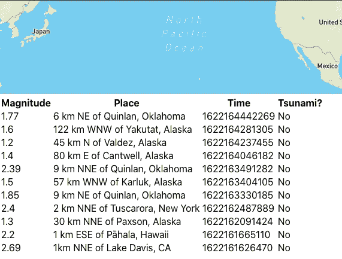

# 如何使用动态数据建立反应表

> 原文：<https://javascript.plainenglish.io/how-to-set-up-react-table-using-dynamic-data-1d2b6f555a9a?source=collection_archive---------4----------------------->

*欢迎来到灵活、可组合和轻量级表格的无头世界——介绍 TanStack 的 React Table。*

Photo by [Abel Y Costa](https://unsplash.com/@abelycosta?utm_source=medium&utm_medium=referral) on [Unsplash](https://unsplash.com?utm_source=medium&utm_medium=referral)

*(* ***披露:*** *本文底部包含一个代销商链接，我可能会通过 BlueHost 获得一小笔佣金，如果您选择通过我的链接购买，则无需额外费用)。*

# 我们开始吧

假设您正在构建一个 React 应用程序，使用美国地质调查局(USGS)API 实时跟踪全球地震。

这个 API 返回给我们过去一个小时的地震列表——所有地震的震级从 0 到 7 不等。

我们的目标是将这些地震整齐地呈现在一个表格中，按照**震级**、**地点**、**时间**和**海啸预警**、*(耶)*进行分类。

现在，我不会在这里深入讨论架构细节，但让我们假设我们有一个`server.js`文件，它每小时进行一次节点获取，并使用 **Socket.io** *(只是为了让您知道我们如何传递数据)* ***:*** 将数据发送到前端

既然我们正在与 React 一起工作，React 自然地加强了模块化——这也是一种良好的可伸缩性实践，我们可能会有一个看起来像这样的`feed.js`组件:

在第 20 行，我们返回了代表我们将使用的实际表格的`<Table />`组件——我们向其传递了两个属性:实际的**地震数据**和表格列的**标签**,作为数组传递。

因为我们希望保持组件的可重用性，所以我们尽可能保持它们的通用性——这样，我们就可以一次又一次地使用它们，而不必重新发明轮子。 我们可以将这个表格组件归类为可重用的，因为我们已经标记了我们的两个道具`data`和`col_labels`，因此*减少了*进入组件的**类型数据**的特异性。

首先，在我们的`table.js`中，我们使用箭头函数语法创建一个组件，并将组件命名为`Table`，如下所示:

`const Table = (props) => {...}`

这个组件现在将接收我们从`feed.js`传入的 2 个道具(**数据** & **标签**)。在我们的**表**组件中，我们循环传入的数据，并准备我们的列来填充它们相应的数据:

**到目前为止很简单！** *(在第 1 行，我们将我们的表数据设置为* `*null*` *以便为我们从套接字事件接收的每一个新的数据批清除我们的表数据，但是我们也可以将 initialState 选项传递给我们的表钩子)。*

然后，我们进入下一步——设置我们的**列标题**:

在第 2 行，我们使用`useMemo`钩子来包装我们的函数，因为我们只希望我们的列被设置一次——只要`col_labels`道具不变。这个钩子可以让我们指令反应——“嘿，如果新的道具是一样的，跳过下一个重新渲染”。

我不会详细讲解钩子，但是对于那些刚接触过 React Hooks 的人来说，这可能会派上用场。**反应神可以跳过这一段。**当 DOM 被更新时，React 会首先渲染组件。之后，它会将渲染结果与之前的渲染结果进行比较，如果结果不同，则 React 会更新 DOM 并重新渲染组件。`useMemo`使用一种叫做**记忆化的**结果的东西——简单来说，这意味着只有当函数的一个依赖关系改变时，我们才重新计算包装在函数中的值。**这就是为什么我们在第 9 行看到一个空数组——因为我们本质上是在告诉反应，因为我没有在这个数组中传递任何依赖关系，所以不要重新计算这些值……因此给我们的应用程序带来了一点性能提升。**

**在第 5 行和第 6 行**中，我们基本上是应用道具中的列标签，并为我们的**访问器**在单词`col`后面添加一个索引号，这样它就可以访问我们的列数据，比如:`col0`、`col1`、`col2` …等等。

***现在，既然我们已经排除了这个可能性，让我们来看看下一步:***

在这里，我们利用了由团队在 React Table 提供给我们的定制`useTable`钩子，并传递了两个选项`columns`和`table`，这将让我们开始。

在做了一些去结构化之后，我们像这样返回我们的表:

# 就是这样！

# ***完整代码如下:***

**我们漂亮但没有风格的桌子可能看起来像这样:**

既然这是一个 web 应用程序，我们可能会使用传统的部署平台之一来交付这个产品，但如果我们正在构建一个网站，并且需要一个可靠且可扩展的托管解决方案，我会考虑使用 [**BlueHost**](https://www.anrdoezrs.net/click-100417643-11768802) 。他们提供各种托管计划，以满足您的特定需求。

# 总之:

我们仍然需要使用像 **Moment.js** 这样的库来格式化我们的时间，为这个表添加一些基本样式&悬停动画来看起来功能就绪。

我们还需要一个工具栏来排序，过滤和搜索栏，把它带到下一个层次。总而言之，React Table 让我们可以灵活地使用他们的定制挂钩，并根据我们的需要定制这个表。

我希望这对你有所帮助——感谢阅读！

# **资源:**

**反应表转移:**https://react-table.tanstack.com/

*更多内容请看*[*plain English . io*](http://plainenglish.io/)