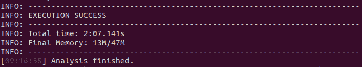

# 如何在 React TypeScript 项目上本地设置 SonarQube

> 原文：<https://javascript.plainenglish.io/how-to-set-up-sonarqube-locally-on-a-react-typescript-project-ec02cd8e2626?source=collection_archive---------0----------------------->

# 介绍

SonarQube 是一款帮助你捕捉应用程序中的错误和漏洞的工具。与 **ESLint** 和**单元测试**一起工作，它提供了一个**伟大的代码质量扫描**。

在本教程中，我将向您展示如何设置 SonarQube 并在 React TypeScript 项目上本地运行。然后，我们将通过添加 ESLint 和 Jest 报告来改进 SonarQube 分析。

这些主题组织如下:

*   步骤 1:用 TypeScript 创建一个 React 项目
*   步骤 2:安装 SonarQube
*   步骤 3:在 React + TypeScript 项目上配置 SonarQube
*   配置 Jest 向 SonarQube 发送信息
*   配置 ESLint 向 SonarQube 发送信息
*   有用的提示

所以，我们开始吧！

# 先决条件

你需要在你的电脑上已经安装了:
— **Node.js** (版本> = 10)。— **打卡员** — **打卡员撰写**

# 第一步。使用 TypeScript 创建 React 项目

以下命令将在文件夹' *my-app* '中创建一个项目。
在终端上，运行:

```
npx create-react-app my-app --template typescript
```

# 第二步。安装 SonarQube

我们将使用一个官方 Docker Compose 文件来安装它。

## 下载 Docker 合成文件

在 SonarSource Github 上，下载以下 docker compose 文件(sonar cube with Postgres):
[https://Github . com/sonar source/docker-sonar cube/blob/master/example-compose-files/sq-with-Postgres/docker-compose . yml](https://github.com/SonarSource/docker-sonarqube/blob/master/example-compose-files/sq-with-postgres/docker-compose.yml)

## 运行 Docker 合成文件

是时候运行我们的 Docker Compose '*Docker-Compose . yml*'文件了。

在运行它之前，我们需要增加 Docker 专用的内存，否则，当我们试图运行它时，我们会得到下面的错误:


memory is too low error

要解决这个问题，请执行以下命令。
在端子上:

```
sudo sysctl -w vm.max_map_count=262144
```

(*参考*:[https://stack overflow . com/questions/51445846/elastic search-max-virtual-memory-areas-VM-max-map-count-65530-is-too-low-Inc](https://stackoverflow.com/questions/51445846/elasticsearch-max-virtual-memory-areas-vm-max-map-count-65530-is-too-low-inc))

现在，让我们运行' docker-compose.yml '文件。在文件所在的同一目录中，运行:

在终端上:

```
docker-compose up
```


SonarQube running with success

PS:要保持 SonarQube 运行，你需要打开这个终端窗口。每当你想停止 SonarQube 运行时，只需在终端上按 Ctrl+C(或者关闭)。

需要时，打开另一个终端窗口执行其他命令。

## 检查安装

通过在本地主机上打开 SonarQube 来检查安装是否成功。SonarQube 将在端口 9000 上可用。

[http://localhost:9000/](http://localhost:9000/)


SonarQube UI

## 登录

点击登录并输入以下凭证:
登录:管理员
密码:管理员

# 第三步。在 React + TypeScript 项目上配置 SonarQube

这时我们有:

*   React + TypeScript 项目已创建
*   SonarQube 运行

是时候在我们的 React + TypeScript 项目上配置 SonarQube 了。

## 安装 SonarQube 扫描仪包

**sonar cube-scanner:**[https://www.npmjs.com/package/sonarqube-scanner](https://www.npmjs.com/package/sonarqube-scanner)
*它对我们的项目运行 sonar cube 分析，并将信息发送到 sonar cube 应用程序。*

**在**React 项目目录' *my-app/* '内，在终端上运行:

```
npm install --save-dev sonarqube-scanner
```

## SonarQube 配置文件

在项目的根目录下，创建一个“ *sonarqube-scanner.js* ”文件。

*sonarqube-scanner.js* 文件内容:

```
const scanner = require('sonarqube-scanner');scanner(
  {
  serverUrl: "http://localhost:9000",
  login:"admin",
  password:"admin",
  options: {
    "sonar.sources": "./src"
  },
},
() => process.exit()
);
```

> *注意:使用* ***登录*******密码*** *是* ***不安全*** *我们这样做只是为了简化配置过程。**
> 
> **你可以在本文末尾的*有用提示*章节*中看到这个安全问题的最佳解决方案*

## *运行 SonarQube*

*SonarQube 已经设置好了！要查看它对我们代码的分析，我们需要运行 SonarQube Scanner。*

*在运行它之前，让我们给我们的代码添加一个代码气味！(查看 SonarQube 分析)*

*在“App.tsx”文件上:*

```
*...
function App() {
//'Empty block statement' code smell
try{
}
catch(e){
}
return (
...*
```

***运行 sonar cube Scanner** 现在，让我们调用 sonar cube Scanner 将报告发送给 sonar cube。
在端子上:*

```
*node sonarqube-scanner.js*
```

*一段时间后，它将打印以下消息:*

**

*SonarQube Scanner analysis finished*

*让我们在 [http://localhost:9000](http://localhost:9000) 上查看结果*

**

*酷！*

*要查看指出的问题的详细列表，只需单击“问题”选项卡。*

**

*Issues detailed list*

*如果你点击这个问题，它会显示所有与问题相关的线路。*

**

*Detailed Issue*

*很酷，对吧？*

# *配置 Jest 向 SonarQube 发送信息*

*我们已经看到了 SonarQube 能源本身。现在，让我们通过向它发送我们的单元测试报告来改进它。*

## *安装 Jest-Sonar-Reporter 包*

***jest-sonar-reporter:**[https://www.npmjs.com/package/jest-sonar-reporter](https://www.npmjs.com/package/jest-sonar-reporter)
*将 Jest 的报告输出转换为 SonarQube 报告格式。**

*在终端上:*

```
*npm install --save-dev jest-sonar-reporter*
```

## *向声纳配置文件添加一些测试配置*

*在' *sonarqube-scanner.js* 文件上，添加“*选项*”:*

```
*"sonar.exclusions": "**/*.test.tsx",
"sonar.tests": "./src",
"sonar.test.inclusions": "**/*.test.tsx,**/*.test.ts",
"sonar.typescript.lcov.reportPaths": "coverage/lcov.info",
"sonar.testExecutionReportPaths": "test-report.xml"*
```

***组织在子文件夹中的测试文件:**这不是我们的情况，但如果您的 React 测试在一个文件夹下，如“src/myTests”和子文件夹，您将需要更改以下设置:*

```
*"sonar.exclusions": "**/myTests/**",
"sonar.tests": "./src/myTests",
"sonar.test.inclusions": "./src/myTests/**/*.test.tsx,./src/myTests/**/*.test.ts"*
```

*现在，我们需要告诉 Jest，每次单元测试运行时，它必须以 SonarQube 能够理解的格式创建一个报告。*

*所以，在 *package.json* 上，让我们更改一下我们的*测试*脚本:*

```
*{
...,
"test": "react-scripts test --watchAll=false --coverage --testResultsProcessor jest-sonar-reporter",
...
}*
```

*让我解释一下我们添加的一些命令选项:*

**- watchAll=false:* 这是因为当执行*‘test’*脚本时，React 会启动一个观看模式菜单，这样你就可以选择是否要运行所有文件、特定文件、只运行修改过的文件等等。在我们的例子中，我们不希望它问任何问题，而只是运行所有的测试。所以我们通过添加' *- watchAll=false* '来关闭这个监视模式。*

**- coverage* :它只是告诉 Jest 应该在输出中收集和报告测试覆盖信息。*

*-test results processor jest-sonar-reporter:告知以 SonarQube 预期格式生成输出。*

*SonarQube 已准备好接收 Jest 报告数据。所以让我们开始吧！。*

## *运行 Jest+sonar cube*

***运行 Jest** 首先，运行 Jest 生成报告输出:*

*在终端上:*

```
*npm run test*
```

*看到一个名为' *test-report.xml* '的报告将出现在您的项目的根目录下。*

***运行 sonar cube Scanner** 现在，让我们调用 sonar cube Scanner 向 sonar cube 发送报告。
在端子上:*

```
*node sonarqube-scanner.js*
```

*一段时间后，它将打印以下消息:*

**

*让我们在 [http://localhost:9000](http://localhost:9000) 上查看结果*

**

*我们的 Jest 报告现在正在 SonarQube report 上播放！酷！*

# *配置 ESLint 向 SonarQube 发送信息*

*我们还可以对我们的项目文件执行 ESLint，生成报告并将其发送到 SonarQube。*

*所以，我们开始吧！*

## *将 Eslint 报告路径添加到 SonarQube 配置文件*

*在' *sonarqube-scanner.js* '文件上，添加“*选项*”:*

```
*"sonar.eslint.reportPaths":"eslint-report.json"*
```

## *运行 ESLint+sonar cube*

***运行 ESLint
一个简单的代码味道是创建一个变量，而不是在我们的代码中使用它。***

*在' *App.tsx* '文件上:*

```
*...
//'Unused variable' code smell
const unusedVar = "";
function App() {
//'Empty block statement' code smell
try{
}
catch(e){
}
return (
...*
```

*添加了代码气味！现在让我们运行 ESLint 来生成一个报告输出:*

*在终端上:*

```
*npx eslint -f json -o eslint-report.json .*
```

*看到一个名为' *eslint-report.json* '的报告将出现在项目的根目录下。*

***运行 sonar cube Scanner** 现在，让我们调用 sonar cube Scanner 将报告发送给 sonar cube。*

*在终端上，运行:*

```
*node sonarqube-scanner.js*
```

*一段时间后，它将打印以下消息:*

**

*让我们在 [http://localhost:9000](http://localhost:9000) 上查看结果*

**

*酷！我们的报道中又出了一个代码味！*

*让我们在“问题”选项卡上查看 SonarQube 分析指出的问题的详细列表。*

**

*代码气味' *unusedVar* '如我们所料被指出！很酷，对吧？*

# *有用的提示*

*我们完成了！但是让我给你一些非常有用的提示！*

## *更新。gitignore*

*有些文件，比如生成的报告，放入存储库是没有用的。我建议在你的简历中加入以下内容。 *gitignore* 文件:*

```
*#SonarQubetest-report.xml
eslint-report.json
/.scannerwork*
```

## *生成用于 SonarQube 配置文件的用户令牌*

*在' ' *sonarqube-scanner.js* ' '上暴露你的登录名和密码是不安全的。为了解决这个安全问题，让我向您展示如何生成并使用令牌:*

1.  *打开 [http://localhost:9000](http://localhost:9000) 并登录。*
2.  *点击管理员图标，然后点击“我的账户”*

**

*3.在管理员屏幕上，选择*“安全”*选项卡。输入一个令牌名称并点击'*生成*按钮。*

**

*4.屏幕上将显示一个令牌。将其复制并保存在安全的地方。*

**

*user token generated*

*5.在' ' *sonarqube-scanner.js* 上:*

*   *使用生成的令牌添加以下行:*

```
*token: "3aa403f1ad2065ea2b4b837262ca2cad96e3cd7a"*
```

*   *删除以下行:*

```
*login:"admin",
password:"admin"*
```

*   *导致以下结果:*

```
*const scanner = require('sonarqube-scanner');
scanner(
{
serverUrl: "http://localhost:9000",
token: "3aa403f1ad2065ea2b4b837262ca2cad96e3cd7a",
options: {
...*
```

*完成了！*

## *通过“package.json”文件组织所有脚本*

*为了更好地组织你的项目，让所有的脚本放在 *"package.json"* 文件中。*

```
*"scripts": {
...
"test": "react-scripts test",
"test:noWatch":"npm run test -- --watchAll=false",
"test:report": "npm run test:noWatch -- --coverage --testResultsProcessor jest-sonar-reporter",
"lint": "eslint --fix",
"lint:report":"npm run lint -- -f json -o eslint-report.json",
"sonar": "node sonarqube-scanner.js"
},*
```

*然后你可以像这样使用它:*

*   *要在监视模式下运行 Jest，请执行以下操作:*

```
*npm run test*
```

*   *要在没有监视模式的情况下对整个项目运行 Jest:*

```
*npm run test:noWatch*
```

*   *要在没有观察模式的情况下对整个项目运行 Jest 并生成报告:*

```
*npm run test:report*
```

*   *在整个项目中运行 ESLint*

```
*npm run lint -- .*
```

*   *要对整个项目运行 ESLint 并生成报告，请执行以下操作:*

```
*npm run lint:report -- .*
```

*   *要运行 SonarQube 扫描仪*

```
*npm run sonar*
```

## *也在您的 CI 管道上配置这些验证:*

*SonarQube 构建为在 CI 管道上运行，并保证不会部署坏代码。因此，我强烈建议在您的 CI(持续集成)管道过程中设置它。*

*我们可以另找时间讨论这个 CI 配置。这里的主要目标是在本地运行和使用 SonarQube。*

# *谢谢！*

*非常感谢！希望你喜欢！任何反馈都将不胜感激！*

# *参考资料:*

*[](https://jestjs.io/docs/en/cli) [## 命令行界面选项

### ` jest '命令行运行程序有许多有用的选项。您可以运行“jest - help”来查看所有可用的选项…

jet js . io](https://jestjs.io/docs/en/cli) [](https://www.npmjs.com/package/sonarqube-scanner) [## 声纳扫描仪

### sonar cube-scanner 使得在 JavaScript 代码基础上触发 sonar cube/sonar cloud 分析变得非常容易，而不需要…

www.npmjs.com](https://www.npmjs.com/package/sonarqube-scanner) [](https://www.npmjs.com/package/jest-sonar-reporter) [## 捷斯特声纳记者

### jest-sonar-reporter 是 jest 的定制结果处理器。处理器将 Jest 的输出转换成声纳的通用…

www.npmjs.com](https://www.npmjs.com/package/jest-sonar-reporter)  [## JavaScript /类型脚本

### 为了分析 JavaScript 或 TypeScript 代码，您需要在运行…的机器上安装 Node.js >= 10

docs.sonarqube.org](https://docs.sonarqube.org/pages/viewpage.action?pageId=11639183) [](https://nickkorbel.com/2020/02/05/configuring-sonar-with-a-create-react-app-in-typescript/) [## 在 TypeScript 中使用 Create React 应用程序配置 Sonar

### 在 StackOverflow 和 Medium 上有很多关于建立 SonarQube 的帖子，但是我…

nickkorbel.com](https://nickkorbel.com/2020/02/05/configuring-sonar-with-a-create-react-app-in-typescript/)*