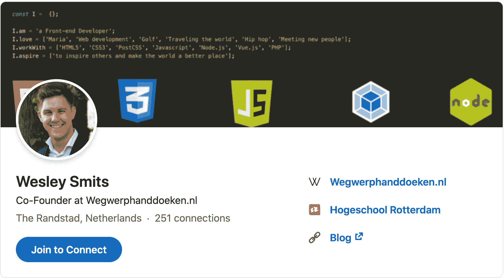
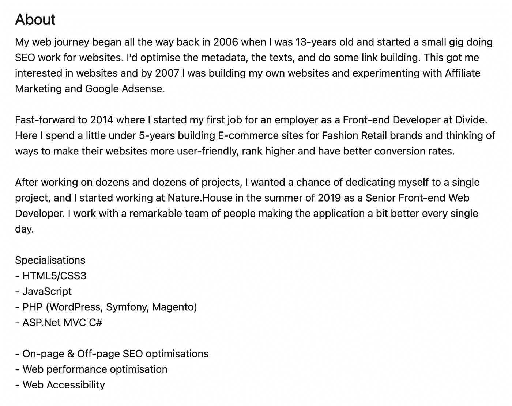
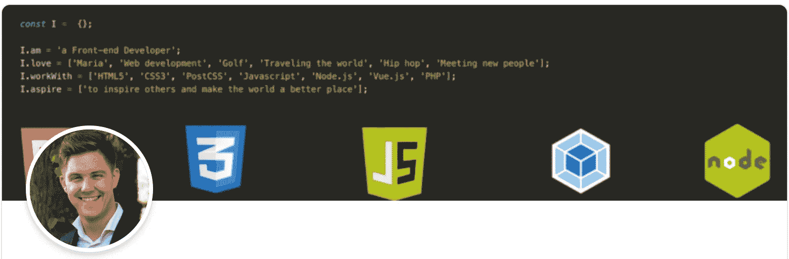

# 如何设置你的编程 LinkedIn 个人资料

> 原文：<https://javascript.plainenglish.io/how-to-set-up-your-programming-linkedin-profile-1c8322c24a72?source=collection_archive---------1----------------------->

## WEB 开发职业

## 如果你想被聘为网页开发员

无论您是该领域的新手，正在寻找您的第一份开发工作，还是寻求新机会的老手。如今，你需要一个 LinkedIn 个人资料来获得正确的接触和关注。

## 为什么 LinkedIn 如此重要？

几乎每个雇主和招聘人员都使用 LinkedIn 来寻找新员工。据研究显示，87%的招聘人员经常使用 LinkedIn。能见度是求职的关键，而 LinkedIn 正好给了你合适的人。

维护更新的简历、投资组合网站和 LinkedIn 个人资料似乎是多余的。但它们都是你在线职业身份的重要组成部分。

## LinkedIn 如何工作

LinkedIn 可能是这些组件中最重要的。你的简历和你的个人网站只有你在那里指导过的人或偶尔来自谷歌的访问者才能看到，LinkedIn 本身就是一个搜索引擎，专门用来寻找新员工/雇主。

就像任何搜索引擎一样，LinkedIn 在潜在雇主/招聘人员搜索时，使用你个人资料各个领域的关键词来确定你是否是相关结果。

这意味着您可以通过在标题、摘要和技能部分放置正确的词语来优化您的个人资料，以增加被正确的人找到的机会。

## 在开始之前

如果你已经有一个 LinkedIn 个人资料，我建议你[关闭分享你的个人资料编辑](https://www.linkedin.com/help/linkedin/answer/86236)。我们即将进行许多更改，如果您的联系人无法获得每一项更改的更新，这可能对他们有好处。此外，在 LinkedIn 上做很多改变可能会在你准备告诉你现在的雇主之前，无意中暗示他们你在寻找新的东西。

## 1.绝对必备的个人资料功能

你个人资料的以下部分是绝对必须包含在你的个人资料中的，并且应该尽你所能做到。

## 1.1.加一张好看的职业简介照片

Example of my own LinkedIn profile photo

LinkedIn 表示，一张好照片可以让你的个人资料[比没有照片的个人资料多 21 倍的浏览量](https://www.linkedin.com/help/linkedin/topics/6042/6059/profile-photo)。头像/插图很有趣，但专业标准是头像，这也立即与你这个人建立了个人联系，而不仅仅是个人资料。

没有必要为这样的照片付钱给摄影师。每部现代智能手机都有一个很棒的相机，可以拍出好照片。确保找到一个好的简单的背景，不会分散照片的注意力(例如简单的墙)，或者你可以使用图像编辑来删除背景，并添加一个数字背景。

确保照片光线充足。最好是自然光。例如，试着在一个光线充足的房间里拍照，你面对着窗户或者外面。

确保最终的结果是从躯干中部或肩膀以上捕捉到你，并且你的脸占据了大约 60%的镜头。LinkedIn 上的照片显示得很小，目的是建立联系。如果你站在远处的背景中，你会被人认出来。

## 1.2.添加一个清晰的、描述性的、精心选择的标题

标题字段位于您个人资料的顶部，就在您姓名的下方。默认情况下，这将显示你的最新职位和雇主。但是，您可以将其更改为您想要的任何内容。

你可以很有创意，与其他候选人相比脱颖而出。如果你要改变职业或行业，展示你以前的头衔或领域不会让潜在雇主认为你不合适。

标题最长可达 120 个字符。因此，你应该保持简短，但要有足够的空间来发挥创意，并解释你能带来什么。

以下是一些可以用作标题的创意示例:

## 使用你想要的职称，而不是你现在的职称

*   前端 Web 开发人员
*   SEO 战略家
*   PHP Web 开发人员

## 添加你相关专业的经验

*   前端 Web 开发人员— JavaScript、Vue、React
*   时尚零售品牌的资深搜索引擎优化策略师
*   PHP 网络开发者——Symfony，WordPress，Magento

## 有可能在组合中加入以前职位的技能

*   作为搜索引擎优化策略师的经验前端 Web 开发人员
*   经验丰富的 SEO 战略家、前端开发人员和网页设计师
*   PHP Web 开发人员，有 5 年以上的前端开发经验。

## 1.3.写一份令人信服的总结

摘要字段可以是 2600 个字符(或大约 400-450 个单词)长。这是一个告诉人们关于你、你的故事、你的个性和你的经历的地方。

同时，这也是你可以聪明地注入一些关键词，以便在搜索结果中更好地显示(而不会被垃圾邮件)的地方。

下面是我目前的总结作为例子

Example of my own LinkedIn summary

*   为了便于阅读，我在不同的段落中列出了我职业生涯的整个故事。
*   在总结的最后，我加入了专业化部分，这样我就有了一种不引人注目的方式来展示我的技能，而不用在故事中使用 ASP.Net 这样的技术术语。

## 额外提示

此外，您还可以将您的联系方式或行动号召添加到您的投资组合网站上。例如:“*在……*查看我的作品”或“*随时给我发电子邮件……T3”*

## 1.4.列出你的经历

你应该仔细整理 LinkedIn 个人资料上的经历列表。确保它反映了你想要进入的角色。这意味着有时省略信息或添加额外信息会更好。

使用简短、清晰、真实的信息来描述你所做的事情是很好的。例如:你可以写“将电子邮件简讯打开率从 5%提高到 16%”，而不是写“管理公司简讯”。这说明了同样的事情，但是表明你在你所做的事情上是成功的。如果你不能用数字来解释你的结果，试着用最好的方式来解释它是如何推动公司前进的。确保使用有影响力的词语，如*创造、成长、实现、翻倍、启动、建立*。

## 1.5.技能部分

技能部分对你在相关搜索结果中的出现非常重要。你应该确保你放在这里的技能主要与你正在寻找的工作相关，而不是你可能已经拥有的工作。

您最多可以包含 50 项技能。但是现在，让我们从你的专业领域开始，集中在大约 10-15 个相关技能上，比如“*前端开发*”、“ *HTML* ”、“ *CSS* ”、“ *JavaScript* ”。

不要忘记包括你所精通的帮助你从竞争中脱颖而出的工具，比如:" *GitHub* "、" *Google Analytics* "、"*Visual Studio Code*"*WordPress*"、" *Magento* "等等。

额外的东西，比如像“*敏捷*”、“ *Scrum* ”这样的过程也可以被添加进来。一旦你添加完你的技能，你应该重新排序，让它们从最重要到最不重要。

提示:你会说的语言既可以作为技能，也可以作为技能。

## 顶级技能

你最多可以选择三个技能作为你的*顶级技能*。这些将显示在技能部分的顶部，并且是唯一没有人点击“*显示更多*”按钮的显示。

## 背书

LinkedIn 允许你认可其他人在个人资料中提到的技能。任何人都可以按下技能旁边的“+”按钮，并提及他们认为此人在该技能方面的熟练程度，以及他们与此人的关系，以给予此认可。

获得一些支持可以帮助你在搜索结果中表现得更好，当其他人支持你时，你的个人资料看起来也不错。

获得认可可以通过以下方式轻松完成:

1.  认可他人的技能。想一想(前)同事、(前)同学、朋友、家人、客户或任何你能真正认可一项技能的人，然后去做。他们很有可能会回报你。
2.  求背书。如果你想找一份新工作，很有可能人们会愿意从一天中抽出两分钟来帮助你，给你一些支持。确保你询问的人能够给予诚实的支持。

## 技能评估

LinkedIn 允许你参加包含 15 个选择题的各种主题的小测验。这适用于你作为一个 web 开发人员能够并且应该拥有的许多技能。这些评估只需要一点点时间，但可以帮助你在搜索结果中表现得更好，给你一点点动力，特别是在寻找你在这个领域的第一份工作时。

## 1.6.教育或其他培训

虽然在许多地方，正规教育并不是科技行业的要求，但是如果你在这一部分没有任何内容，你可以跳过这一部分。

但是如果你有某种形式的正规教育，你绝对应该把它添加到你的个人资料中。当招聘经理或招聘人员寻找受过正规教育的候选人，或者在某个方向或特定学校学习过的人时，这也可以帮助你被发现。

此外，这给了你一个机会与和你学同样东西的人联系，这可以通过那些人找到工作机会，因为很可能你们最终会在同一个圈子里工作。

## 2.应有的个人资料特征

您的个人资料的以下部分不是必须包括的，但仍然是从竞争中脱颖而出的重要因素。

## 2.1.添加自定义 LinkedIn 个人资料 URL

创建您的个人资料时，LinkedIn 会为您创建一个随机的个人资料 URL。然而，你可以把它改成更专业、更容易识别的独特的东西。这很可能是你的名字，如果这不可用，你可以尝试你的全名，如果这是不可能的，你可以包括出生年份或数字。

**例如**

*   韦斯利-史密斯(姓名)
*   韦斯利-罗伯特-史密斯(全名)
*   wesley-smits-1993 或 wesley-smits-7(带有出生年份或随机数)

## 2.2.添加有趣的封面图片

Example of my own LinkedIn cover image

LinkedIn 允许你上传封面图片，该图片显示在你个人资料页面的顶部和整个平台的个人资料窗口小部件中。这是一个极好的地方来展示你的一些个性，并从许多不使用这个功能并拥有默认 LinkedIn 封面的人中脱颖而出。

[LinkedIn 建议封面图片尺寸为 1584×396，](https://www.linkedin.com/help/linkedin/answer/49960/add-or-change-the-background-photo-on-your-profile?lang=en)我建议坚持这个尺寸，因为裁剪/调整尺寸选项不是最好的。

正如你在上面的截图中看到的，我使用 JavaScript 对象制作了一个简单的截图，写出了一些关于我的个人资料，并用一些 web 开发徽标填充了图像的底部。易于制作，独一无二，展示了我的个性和一些关于我的信息。

## 2.3.突出你的成就

如果你有任何值得注意的成就，这是展示它们的地方。这可能是你会说的语言、你拥有的证书、你获得的奖项、你完成的项目或课程，如黑客马拉松或百日代码挑战。

你也可以包括关于你的出版物或者你自己发表的东西，比如一篇博客文章或者杂志文章。

## 2.4.求推荐

LinkedIn 为我们提供了一个功能，可以为其他 LinkedIn 用户写推荐信。类似于代言，获得这些的最好方法是把它们给人，并向人要。

确保你只从你实际共事过的人那里收集真实而有意义的推荐信(如果你在找第一份工作的话，可能会和你一起学习)。

## 3.你的个人资料上不该有的东西

## 3.1.你的电话号码

找工作的时候，把你的电话号码放在你的个人资料里似乎是个好主意，这样人们可以直接联系到你。这通常会导致你的电话号码被存储在一堆数据库中，这意味着在你找到新工作之前，你会接到很多电话。

## 3.2.无关信息

不要添加工作经验、技能或任何其他与你个人或你目前正在寻找的东西无关的信息。

## 3.3.不真实或不匹配的信息

如果你的 LinkedIn 档案发挥了最大的作用，让你获得了一次工作面试，那么你的 LinkedIn 档案与你、你的技能或你的经验不匹配就会很快变得明显。确保你的简介、简历和真实情况保持一致。

## 3.4.错误

这似乎是显而易见的，但值得注意的是，你的 LinkedIn 个人资料需要看起来很专业。一个简单的反其道而行之的方法是忘记校对，然后得到一个充满错别字或语法错误的简介。

你可以请朋友或家人校对，我也建议你使用工具来改善你的文本。语法上有一个免费的计划，如果你的简介是英文的，它可以很好地改进你的文本。

## 4.其他提示

## 4.1.扩大你的关系网

LinkedIn 是一个很好的地方，你可以在这里和你一生中遇到或共事过的人联系。这些人可能有一天对你有意义，或者你对他们有意义。

一个很好的例子是我的一个同事。我曾经在学习期间给比我低一年级的学生上过课，教室里有一个人在 LinkedIn 上和我联系。快进到 6 年后，我在 LinkedIn feed 上分享了我现在工作的公司的一个空缺职位，他看到了，申请了，并得到了这份工作。

除了同学，你还可以添加客户(包括你自己的客户或你的雇主，如果你曾与他们共事过的话)、你在社交活动中遇到的人，或者任何你认为应该在你的社交网络中的人。

## 4.2 拥有活跃的内容提要

如果你在 LinkedIn 上很活跃，并且分享相关信息，这看起来很好。这可以是分享你自己的博客文章的形式，或者你可以分享你在网上找到的其他内容，并提供你对它的看法。

除了发布自己的帖子，你还可以在 LinkedIn 上的社交网络或利基群体中的人的帖子上发表评论或讨论事情。

## 结论

LinkedIn 是一个强大的平台，可以真正帮助你找到更好的职业机会。我希望这篇文章能帮助你改善你的 LinkedIn 档案，并帮助你找到更好的职业机会！

感谢阅读。如果你对此有想法，一定要留下评论！

如果你喜欢我的内容，并想支持我的努力，考虑通过[我的会员链接](https://medium.com/@WesleySmits/membership)成为一个媒体订阅者。这不会花费你任何额外的费用，但 Medium 会把部分收益给我，让我推荐你。

如果你愿意，你可以在 [LinkedIn](https://www.linkedin.com/in/wesley-robert-smits/) 或 [Twitter](https://twitter.com/iamwesleysmits) 上联系我！

 [## 通过我的推荐链接加入 Medium-Wesley Smits

### 阅读韦斯利·斯密特(以及媒体上成千上万的其他作家)的每一个故事。您的会员费直接支持…

medium.com](https://medium.com/@WesleySmits/membership) 

*更多内容请看*[***plain English . io***](http://plainenglish.io)