# 如何建立一个免费且强大的 JAMstack 网站

> 原文：<https://javascript.plainenglish.io/how-to-setup-a-free-and-powerful-jamstack-website-f9638ef7d4d7?source=collection_archive---------8----------------------->

## git lab+NetlifyCMS+Gatsby+Starter =免费、简单、强大

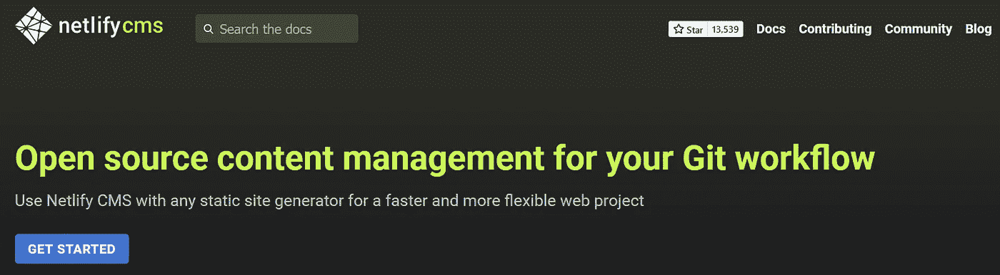

[https://www.netlifycms.org](https://www.netlifycms.org)

JAMstack 是一种现代的、轻量级的方法，用于构建静态内容或者内容随时间变化相对较少的网站。关于你为什么想用 JAMstack 建立一个网站的其他原因，请看这里列出的[的优势](https://jamstack.org/why-jamstack/)。

**J** 代表一个 **JavaScript** 前端， **A** 代表**API**， **M** 代表**标记**。前端通常使用静态站点生成器构建，如这里列出的。后端通常由一个版本控制系统+无头 CMS 组成，就像这里列出的[中的一个](https://jamstack.org/headless-cms/)。

## JAMstack 组合的选择

我通常需要一个小型私人网站项目的设置，有以下要求:

*   免费托管
*   支持自定义域
*   内容没有变化或变化很少
*   没有技术背景的人应该能够自己进行改变

我想出了后端部分的[git lab](https://about.gitlab.com/)+[NetlifyCMS](https://jamstack.org/headless-cms/netlify-cms/)和前端部分的 [Gatby](https://jamstack.org/generators/gatsby/) 作为我私人项目的完美设置。为了将后端+前端集成为一个功能完整的内容管理系统，我将使用[Gatsby-starter-netlify-CMS](https://github.com/netlify-templates/gatsby-starter-netlify-cms)。这种设置也适用于早期创业。

## 将模板导入 GitLab 中的 repo

首先，进入 **GitHub** 并访问 [gatsby-starter-netlify-cms 回购网站](https://github.com/netlify-templates/gatsby-starter-netlify-cms)并复制用于克隆回购的 URL。

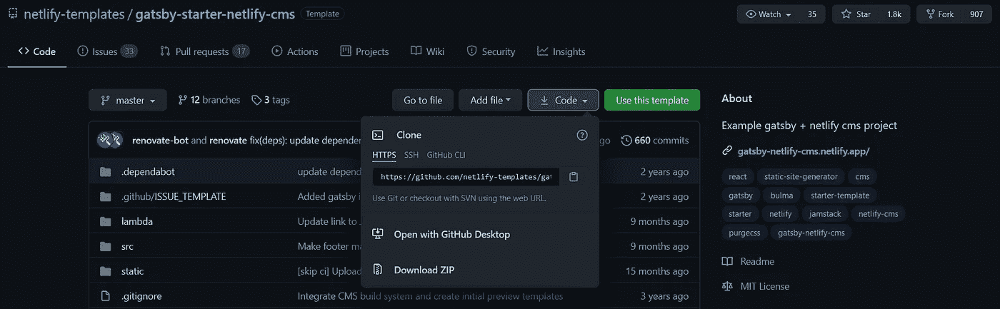

GitHub repository gatsby-starter-netlify-cms project page

然后去你的 **GitLab** 账户，去你的**项目**站点，点击**新项目**按钮。

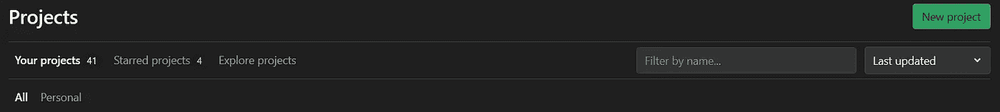

GitLab projects page

选择**导入项目** t…

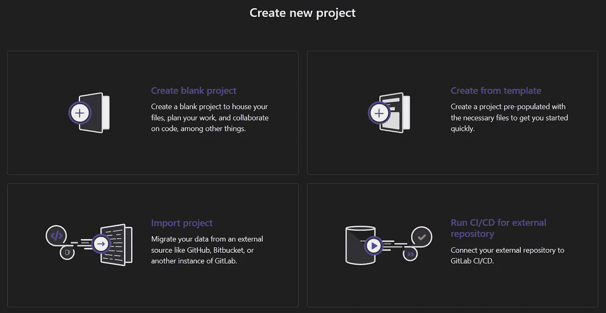

GitLab New Project Workflow — page 1/3

…并将之前的 URL 拷贝粘贴到 **Git 存储库 URL** 字段中。

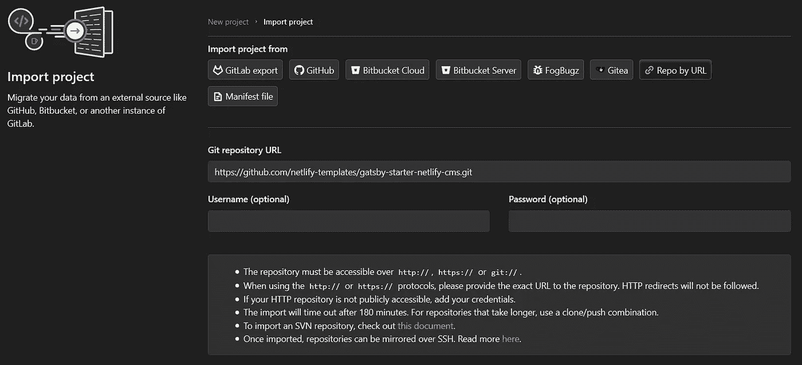

GitLab New Project Workflow — page 2/2 (upper part)

为您的项目设置**项目名称**，并按下**创建项目**按钮。

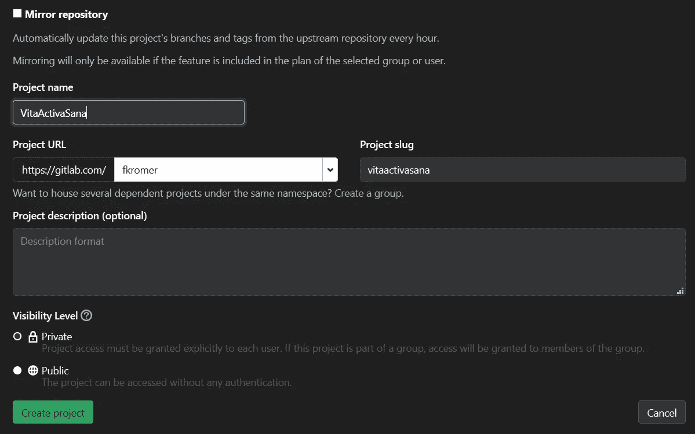

GitLab New Project Workflow — page 2/2 (lower part)

## 从 GitLab repo 在 Netlify 中创建新站点

登录到您的 **netlify** 账户，选择**站点**选项卡，然后点击**从 Git** 新建站点按钮。

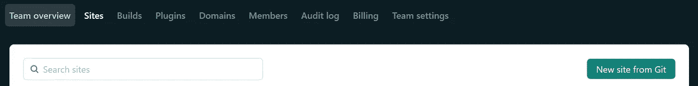

Netlify Sites Tab

在持续部署选项中选择 **GitLab** ，

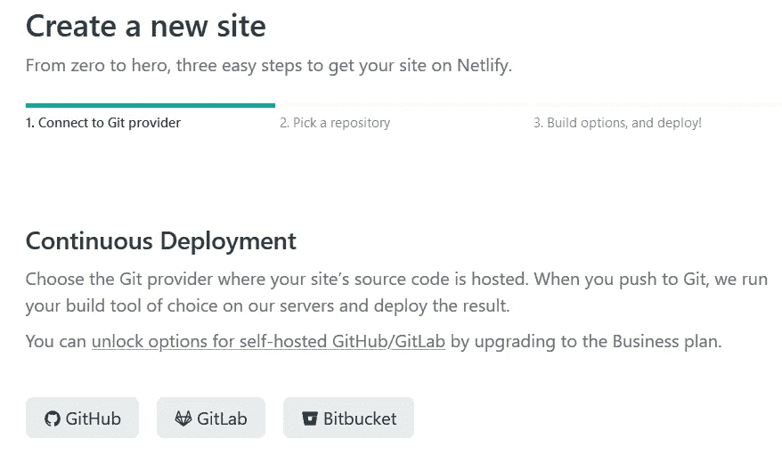

Netlify New site from Git Workflow 1/3

选择您之前创建的 **GitLab 项目 repo** ，

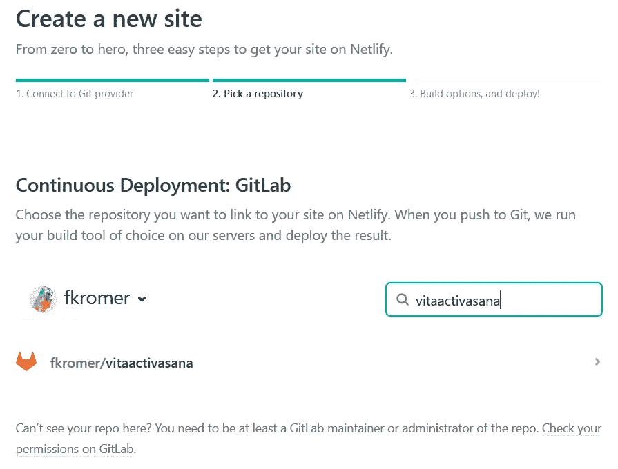

Netlify New site from Git Workflow 2/3

并且该分支将在**部署设置中用于…** (这里最初是**主**，但是以后使用另一个分支是有益的)

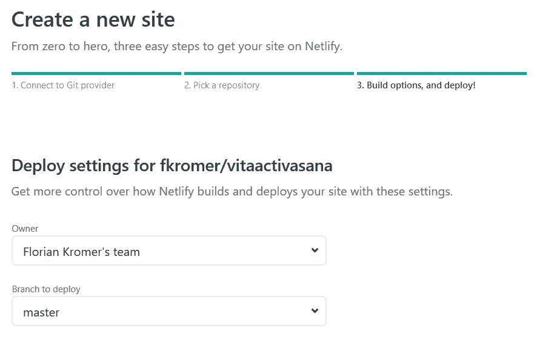

Netlify New site from Git Workflow 3/3 (upper part)

并保持**基本构建设置**不变:

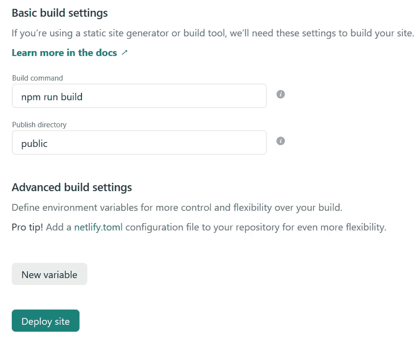

Netlify New site from Git Workflow 3/3 (lower part)

网站应该正在建设，过一会儿…

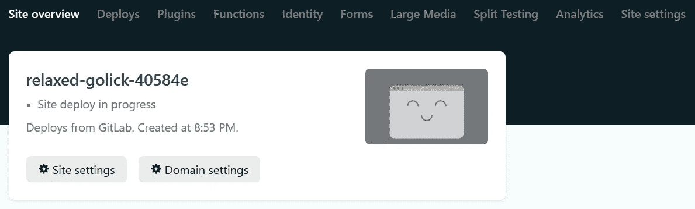

Netlify site overview (site build)

可立即访问(此处[https://relaxed-golick-40584 e . net lify . app](https://relaxed-golick-40584e.netlify.app)):

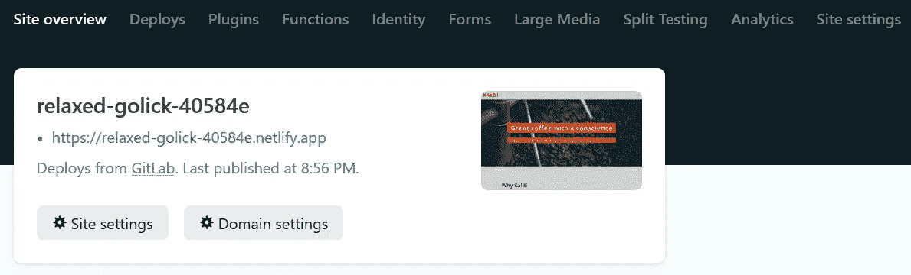

Netlify site overview (site ready)

如果你访问这个网站，你应该会看到类似的东西…

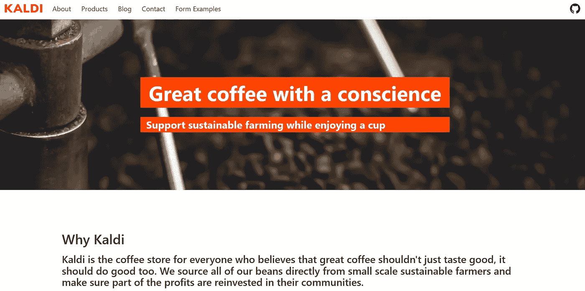

[URL of your website](https://relaxed-golick-40584e.netlify.app/)

如果你去 https://relaxed-golick-40584e.netlify.app/admin，你应该会看到这样的东西:

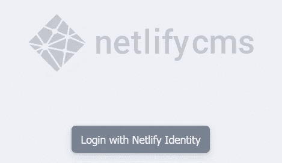

[URL of your website, CMS section (URL/admin)](https://relaxed-golick-40584e.netlify.app/admin)

如果您按下**用网络身份登录**按钮，您会看到如下内容:

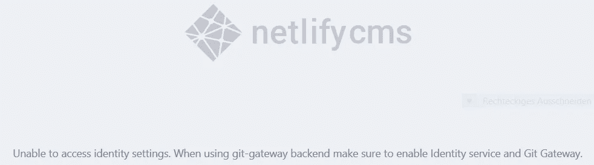

website admin area failing login attempt

很明显接下来要做什么…对吗？

## 启用网络 CMS

启用 Netlify CMS 所需的步骤可以在[这里](https://www.netlifycms.org/docs/add-to-your-site/#enable-identity-and-git-gateway)和[这里](https://docs.netlify.com/visitor-access/identity/?_ga=2.147019326.841730965.1614800898-1556107854.1614528239)找到。在 **Netlify** 中，在登录页面上选择您的站点。

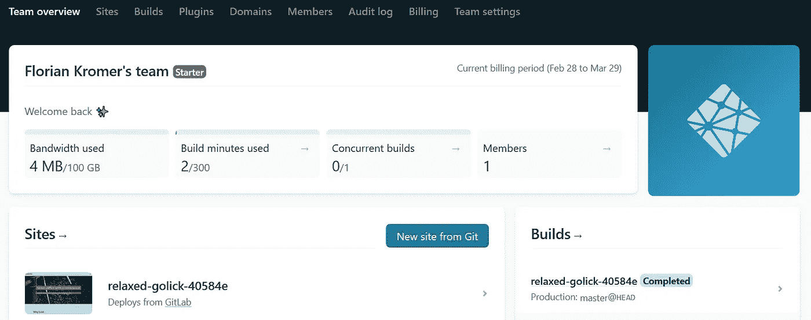

netlify landing page

进入**现场设置**选项卡，选择**标识**部分，按下**启用标识**按钮。

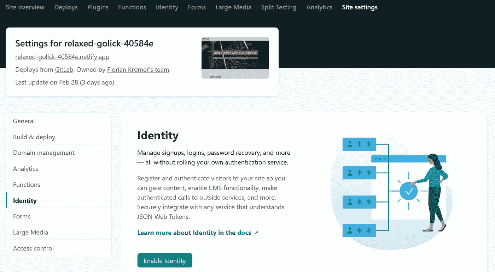

Site settings / Identity

按下**身份/注册表**部分的**编辑设置**。

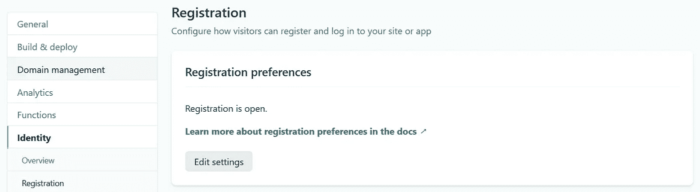

Site settings / Identity / Registration

选择**仅邀请**并按下**保存**按钮。

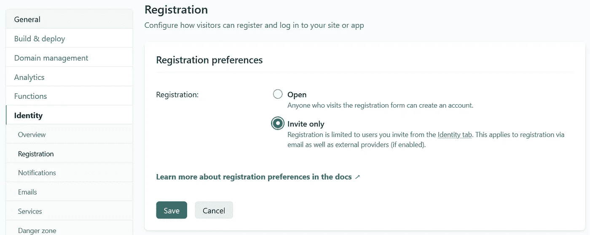

Site settings / Identity / Registration (Invite only)

转到**身份/服务**部分并按下**启用 Git 网关**。

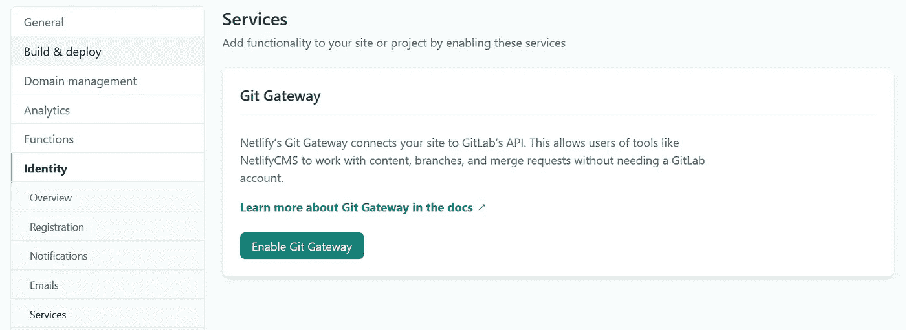

Site settings / Identity / Services (Git Gateway disabled)

弹出窗口打开，登录到您的 **GitLab** 账户。

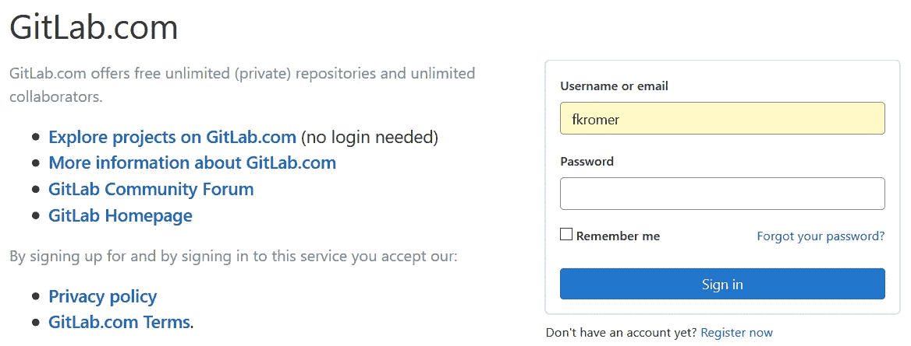

Popup window GitLab Login

现在， **netlify** 站点设置页面看起来应该类似于下面的页面。

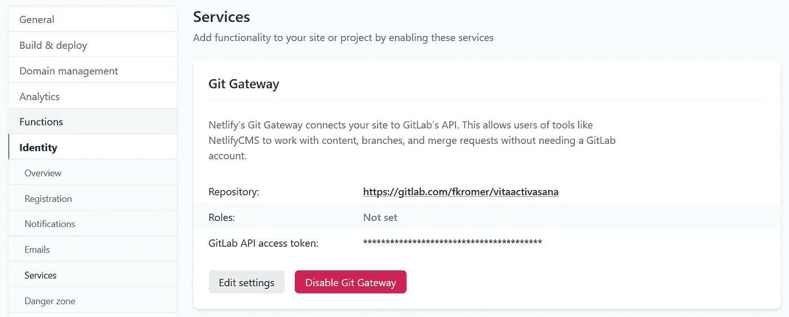

Site settings / Identity / Services (Git Gateway enabled)

**角色**字段可以留空，因为在我的小型私人网站中，任何登录用户都可以访问 CMS。这对你来说可能不一样。

如果你再次访问你的网站的**登录区(【https://relaxed-golick-40584e.netlify.app/admin】T2，按**用网络身份登录**，你会看到这样的内容。**

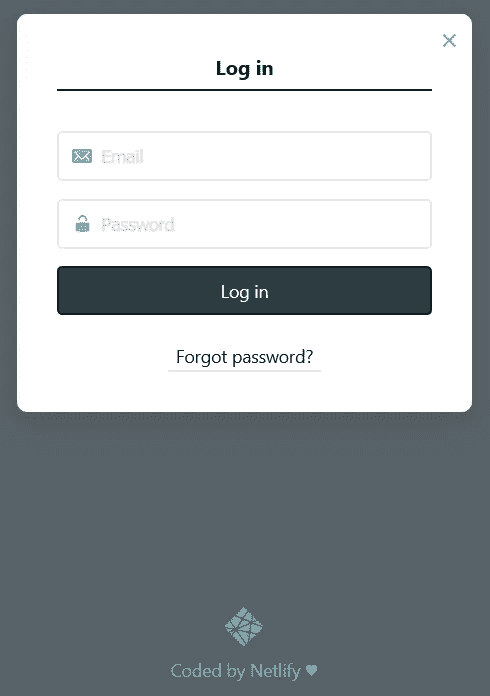

website admin area login form

此登录表单表明您的网站已准备好接受您通过电子邮件和密码邀请的用户。

如何邀请某人在这里解释[。直到现在，我总是明确地邀请人们(](https://docs.netlify.com/visitor-access/identity/registration-login/#add-identity-users) [docs reference](https://docs.netlify.com/visitor-access/identity/registration-login/#invitations) )，而不是提供一个表单。为此，在 **Netlify** 中，转到**站点设置**，选择**身份**选项卡并按下**邀请用户**按钮。

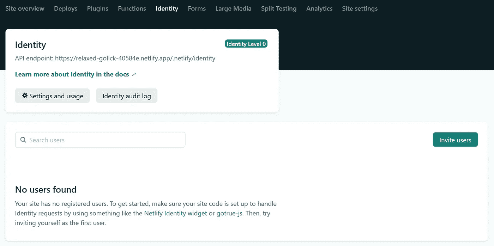

Site settings / Identity

插入应该能够登录的人的电子邮件地址，并按下**发送**按钮。

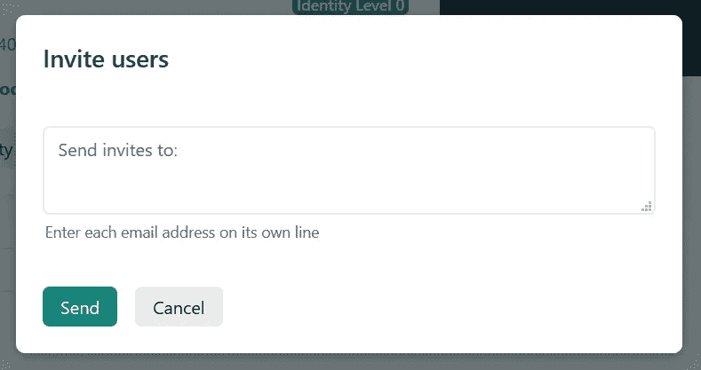

Site settings / Identity (Invite users)

身份网站现在应该列出用户。

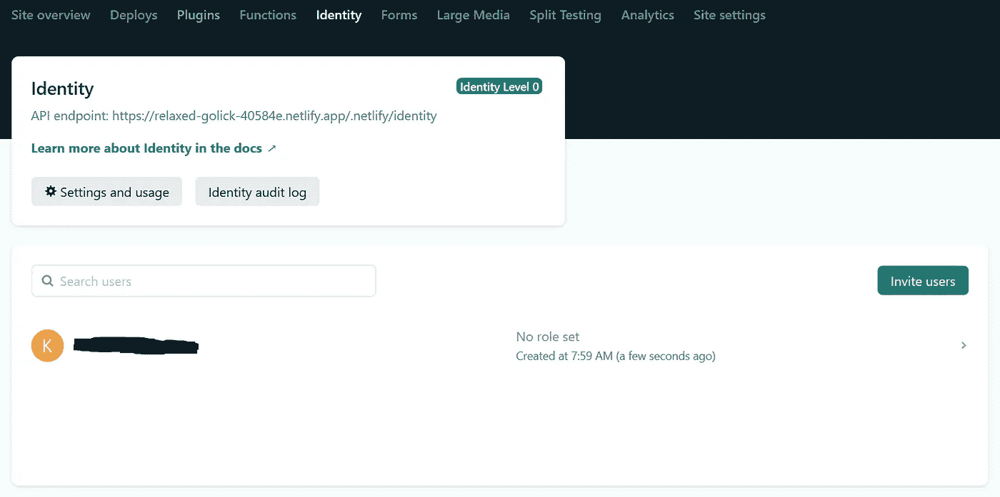

Site settings / Identity (user created)

创建的用户将收到标题为**的电子邮件，您已被邀请加入<网站，网址为>** 。电子邮件的标题和内容可能会更改。当然，理解工作流程并不重要。默认内容包含一个超链接**接受邀请**。如果链接被按下，将会打开一个类似下面的页面。

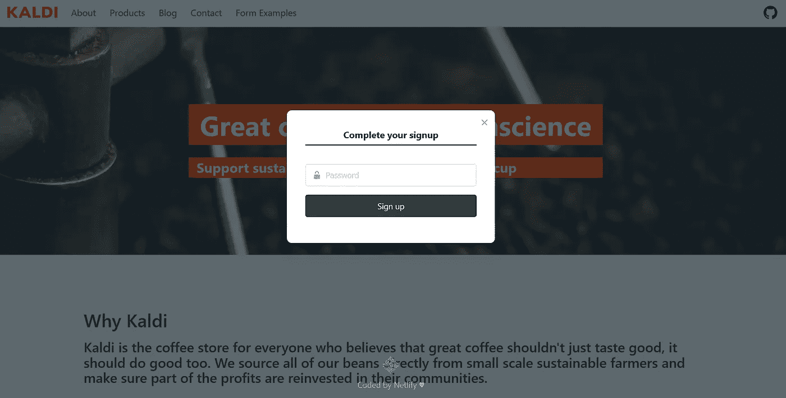

新用户必须**定义密码**并按下**注册**按钮。应该会打开**管理仪表板**。

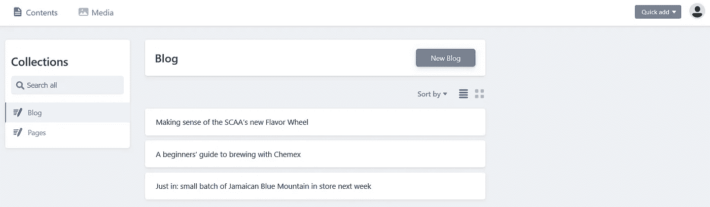

netlifycms Admin Dashboard

恭喜你！在 NetlifyCMS 管理仪表板中所做的每一项更改(例如，更改博客帖子或网站页面)都应该在几分钟内同步到您的网站中。

## 创建分支

建议不要根据您网站的需求修改模板，而是创建一个网站特定的分支。

*   转到 GitLab repo，通过 GitLab UI 从 master 或 tag 创建分支
*   转到 netlify，站点设置选项卡，构建和部署部分/连续部署/部署上下文，将分支更改为新创建的分支

## 接下来去哪里？

通常接下来的步骤是

*   改变站点[配置选项](https://www.netlifycms.org/docs/configuration-options/)，
*   自定义 NetlifyCMS 管理仪表板([创建自定义预览](https://www.netlifycms.org/docs/customization/)，[创建自定义小部件](https://www.netlifycms.org/docs/custom-widgets/))或
*   自定义正在使用的前端模板。

后两个主题在我的文章 [*如何定制一个盖茨比 Netlify CMS 启动器*](https://florian-kromer.medium.com/how-to-customize-a-gatsby-netlify-cms-starter-3a78244a7b06) 中有所涉及。

*更多内容尽在*[***plain English . io***](https://plainenglish.io/)