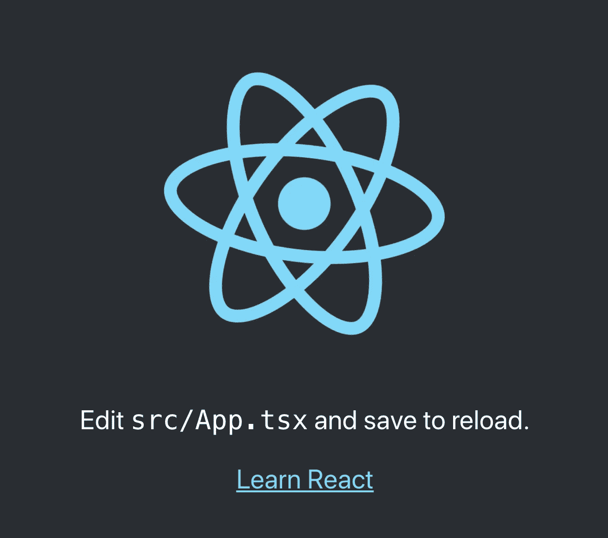

# 使用 Monorepo 和 Lerna-01 开始您的 React 项目

> 原文：<https://javascript.plainenglish.io/how-to-setup-a-monorepo-with-react-and-lerna-with-typescript-5e1be0345a7c?source=collection_archive---------4----------------------->

大家好。在这个系列中，我将讨论如何用 mono repository 方法构建 React 项目。


# 为什么是 mono 仓库？

使用 mono 存储库的想法是能够在一个存储库中创建几个“项目”。这种方法简化了您的开发过程，并且您可以让几个团队并行工作，同时冲突最小。您还可以控制关于稳定特性和处于 alpha 或其他状态的特性的版本。

# 怎么做？莱尔纳

Lerna 是帮助你实现理想目标的工具之一。它基本上是一个工具管理器，支持你用 JavaScript 构建 monorepo。在本文中，我们将使用 Lerna 引导 React 应用程序，以利用 monorepo 的优势。

首先，你最好对 JavaScript/ [TypeScript](https://www.typescriptlang.org/) 和如何使用 [npm](https://www.npmjs.com/) / [yarn](https://yarnpkg.com/) 有基本的了解。假设您的计算机上安装了 Node.js 的 [LTS 版本，让我们开始吧。](https://nodejs.org/en/)

让我们首先为我们的存储库创建一个文件夹，我将把它命名为 **react-monorepo-template。**然后，在终端中，我们可以开始我们的项目:

```
yarn init
```

大概是这样的:

```
yarn init**yarn init v1.22.10**warning ../../package.json: No license fieldquestion name (react-monorepo-template):question version (1.0.0):question description:question entry point (index.js):question repository url:question author:question license (MIT):question private:success Saved package.json✨  Done in 4.42s.
```

由于这是一个简短的指南，我不担心那里提供的信息。我们以后可以改变这一点。

现在我们有了 package.json 集，让我们安装 **lerna** :

```
yarn add -D lerna
```

> **yarn -D** 会将此添加到 devDependencies 中。您也可以全局安装或使用 npx，但是为了这篇文章，我在 devDependencies 中使用。

现在我们已经安装了 lerna，让我们开始我们的项目吧！

```
lerna init
```

结果:

```
lerna initinfo cli using local version of lernalerna notice cli v4.0.0lerna info Initializing Git repositorylerna info Updating package.jsonlerna info Creating lerna.jsonlerna info Creating packages directorylerna **success** Initialized Lerna files
```

一切都好！默认情况下，我们将有一个 packages 文件夹，在那里我们可以添加我们的项目/库/monorepos！

让我们更新我们的 lerna.json 文件以使用 yarn 运行:

```
{
  "packages": [
    "packages/*"
  ],
  "version": "0.0.0",
  "npmClient": "yarn",
  "useWorkspaces": true
}
```

> **提示**:所有的 devDependencies 都应该在我们的根 package.json 文件夹中。

我们需要改变 package.json 上的一些东西，例如添加工作区(以匹配 packages 文件夹)，将项目设置为私有，以及添加一些脚本以方便我们的生活。

```
{
  "name": "react-monorepo-template",
  "version": "1.0.0",
  "main": "index.js",
  "license": "MIT",
  "private": true,
  "workspaces": [
    "packages/*"
  ],
  "scripts": {
    "bootstrap": "lerna bootstrap",
    "build": "lerna run build",
    "start": "lerna run start --stream"
  },
  "devDependencies": {
    "lerna": "^4.0.0"
  }
}
```

*   引导:lerna 将链接你的项目，他们将能够理解如何与他们沟通
*   构建:将构建包文件夹中的所有项目
*   开始:当你运行一个 React 应用程序时，它会像“纱线开始”一样运行

现在，在 packages 文件夹中，让我们使用以下内容启动我们的**应用程序**:

```
npx create-react-app app --template typescript
```

这个命令将在一个名为 **app** 的文件夹中启动一个支持 typescript 的 react 应用程序。我们现在将应用程序与根文件夹中的 lerna 链接起来:

```
lerna bootsrap
```

现在，在根项目中(不是包中的 app 文件夹):

```
yarn start
```

它将运行如下内容:

```
yarn start**yarn run v1.22.10**$ lerna run start --streamlerna notice cli v4.0.0lerna info Executing command in 1 package: "yarn run start"**app**: $ react-scripts start**app**: ℹ ｢wds｣: Project is running at http://192.168.1.41/**app**: ℹ ｢wds｣: webpack output is served from**app**: ℹ ｢wds｣: Content not from webpack is served from /Users/marcossilva/projects/react-monorepo-template/packages/app/public**app**: ℹ ｢wds｣: 404s will fallback to /**app**: Starting the development server...**app**: Compiled successfully!**app**: You can now view app in the browser.**app**:   Local:            http://localhost:3000**app**:   On Your Network:  http://192.168.1.41:3000**app**: Note that the development build is not optimized.**app**: To create a production build, use yarn build.
```

您可以访问您的 localhost:3000 并检查:



Initial screen from create-react-app script

我们已经有了“基础”设置。让我们尝试为我们添加另一个 monorepo！

假设我们想将 react 应用程序的所有 ui 组件放在一个名为… **ui 组件**的库中。我们可以开始跑步了:

```
npx create-react-library
```

然后，我们需要填充一些信息，在我的例子中是:

```
npx create-react-library? **Package Name** ui-components? **Package Description** Made with create-react-library? **Author's GitHub Handle** makinhs? **GitHub Repo Path** makinhs/ui-components? **License** MIT? **Package Manager** yarn? **Template** typescript
```

npx 会自动运行 creact-react-library，即使你没有它。另一种方法是对 lerna 做同样的事情，在我们项目的根中使用**yarn add-D create-react-library**，以确保我们在不同的团队中使用相同的版本。

现在，让我们在 ui 组件库中创建一个基本的 ui 组件。

为了创建一个基本组件，我将使用样式化组件。在一篇新文章中，我将使用 [chakra-ui](https://chakra-ui.com/) 作为非设计师视角的基础架构。在 ui-components 文件夹中:

```
yarn add styled-components styled-system
```

回到项目的根本:

```
yarn add -D @types/styled-components @types/styled-system -W
```

太好了，我们可以开始了。

由于缺乏创造性，让我们添加一个标题和一个包装器，比如样式化组件的基础[文档](https://styled-components.com/docs/basics#getting-started)。

添加 ui 组件/标题/标题. tsx:

```
import React from 'react';
import ***styled*** from 'styled-components';

const Title = ***styled***.h1`
  font-size: 1.5em;
  text-align: center;
  color: palevioletred;
`;

type Props = {
  children: React.ReactNode
}

export default ({children}: Props) => {
  return (<Title>
    {children}
  </Title>)
};
```

添加 ui-components/Wrapper/Wrapper . TSC:

```
import ***styled*** from 'styled-components';

const ***Wrapper*** = ***styled***.section`
  padding: 4em;
  background: papayawhip;
`;

export default ***Wrapper***
```

然后，更新 index.tsx:

```
export {***default*** as Title} from './Title/Title';
export {***default*** as Wrapper} from './Wrapper/Wrapper';
```

我在我的 **package.json** 的 **ui-components** 中添加了一些模块，以避免一些运行问题。这是我的最终版本:

```
{
  "name": "ui-components",
  "version": "1.0.0",
  "description": "Made with create-react-library",
  "author": "makinhs",
  "license": "MIT",
  "repository": "makinhs/ui-components",
  "main": "dist/index.js",
  "module": "dist/index.modern.js",
  "source": "src/index.tsx",
  "engines": {
    "node": ">=10"
  },
  "scripts": {
    "build": "microbundle-crl --no-compress --format modern,cjs",
    "start": "microbundle-crl watch --no-compress --format modern,cjs",
    "prepare": "run-s build",
    "test": "run-s test:unit test:lint test:build",
    "test:build": "run-s build",
    "test:lint": "eslint .",
    "test:unit": "cross-env CI=1 react-scripts test --env=jsdom",
    "test:watch": "react-scripts test --env=jsdom",
    "predeploy": "cd example && yarn install && yarn run build",
    "deploy": "gh-pages -d example/build"
  },
  "peerDependencies": {
    "react": "^17.0.2"
  },
  "devDependencies": {
    "@types/styled-components": "^5.1.9",
    "@types/styled-system": "^5.1.11",
    "babel-eslint": "^10.0.3",
    "cross-env": "^7.0.2",
    "eslint": "^6.8.0",
    "eslint-config-prettier": "^6.7.0",
    "eslint-config-standard": "^14.1.0",
    "eslint-config-standard-react": "^9.2.0",
    "eslint-plugin-import": "^2.18.2",
    "eslint-plugin-node": "^11.0.0",
    "eslint-plugin-prettier": "^3.1.1",
    "eslint-plugin-promise": "^4.2.1",
    "eslint-plugin-react": "^7.17.0",
    "eslint-plugin-standard": "^4.0.1",
    "gh-pages": "^2.2.0",
    "microbundle-crl": "^0.13.10",
    "npm-run-all": "^4.1.5",
    "prettier": "^2.0.4",
    "react": "^17.0.2",
    "react-dom": "^17.0.2",
    "react-scripts": "^4.0.3",
    "typescript": "^4.2.3",
    "web-vitals": "^1.0.1"
  },
  "files": [
    "dist"
  ],
  "dependencies": {
    "styled-components": "^5.3.0",
    "styled-system": "^5.1.5"
  }
}
```

酷，但是如何把项目联系起来呢？将 ui 组件添加到 react app package.json 中！

```
"ui-components": "latest"
```

> 我们不打算在本文中讨论版本控制，但我希望你能明白…

添加后，在您的根中链接两个项目:

```
lerna bootstrap
lerna build
```

这应该是链接您的项目并为您构建最新的 ui 组件库。

现在，回到你的 app/src/App.tsx:

```
import React from 'react';
import './App.css';
import {***Title***, ***Wrapper***} from 'ui-components';
function App() {
  return (
    <div className="App">
      <Wrapper>
        <Title>
          Hello Medium!
        </Title>
      </Wrapper>
    </div>
  );
}

export default App;
```

让我们一起尝试一切:

```
yarn start
```

在浏览器中打开 [http://localhost:3000/](http://localhost:3000/) ，您应该会看到:


Importing ui-components

就是这样，在 React 中用 lerna 添加自己的 mono-repo 的简单基础。

在这种方法中，您可以在 ui 组件和业务逻辑之间划分任务，并在将来添加可以跨多个团队共享/开发的功能。

我会创造更多的文章。同时，我会不时更新回购协议。

运行和工作的全部代码可以在我的 [git 库](https://github.com/makinhs/react-monorepo-template)中找到。

感谢阅读。

[](https://makinhs.medium.com/starting-your-new-project-with-nestjs-in-2021-df997815c740) [## 在 2021 年与 NestJS 一起开始你的新项目

### 当前最健壮、开放源代码、内置于服务器端的节点框架之一。JS，带类型脚本

makinhs.medium.com](https://makinhs.medium.com/starting-your-new-project-with-nestjs-in-2021-df997815c740) 

## 进一步阅读

[](https://bit.cloud/blog/painless-monorepo-dependency-management-with-bit-l4f9fzyw) [## 使用 Bit 进行无痛 monorepo 依赖管理

### 简化 monorepo 中的依赖关系管理，以避免虚拟依赖关系和版本问题。了解…

比特云](https://bit.cloud/blog/painless-monorepo-dependency-management-with-bit-l4f9fzyw) 

*更多内容请看*[***plain English . io***](https://plainenglish.io/)*。报名参加我们的* [***免费周报***](http://newsletter.plainenglish.io/) *。关注我们关于*[***Twitter***](https://twitter.com/inPlainEngHQ)[***LinkedIn***](https://www.linkedin.com/company/inplainenglish/)*[***YouTube***](https://www.youtube.com/channel/UCtipWUghju290NWcn8jhyAw)***，以及****[***不和***](https://discord.gg/GtDtUAvyhW) *对成长黑客感兴趣？检查* [***电路***](https://circuit.ooo/) ***。*****