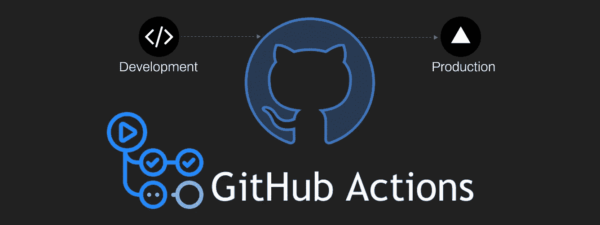
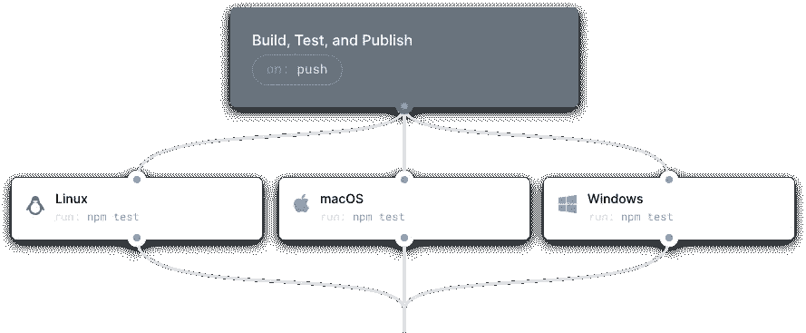
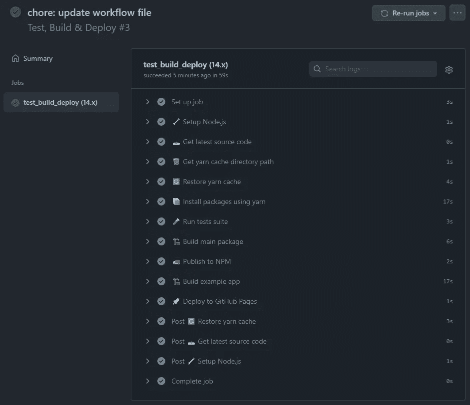
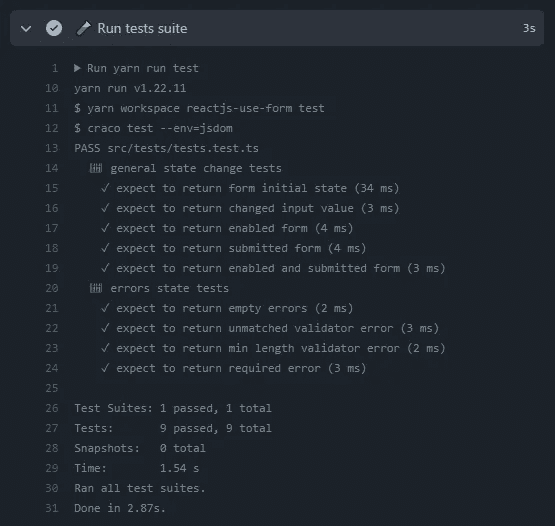
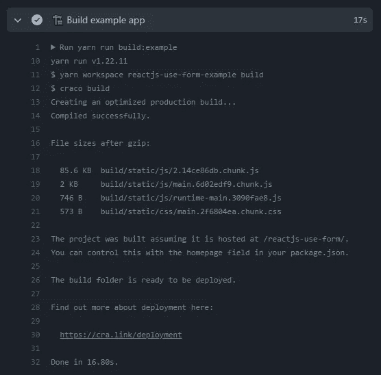
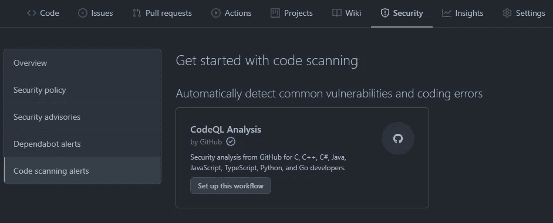
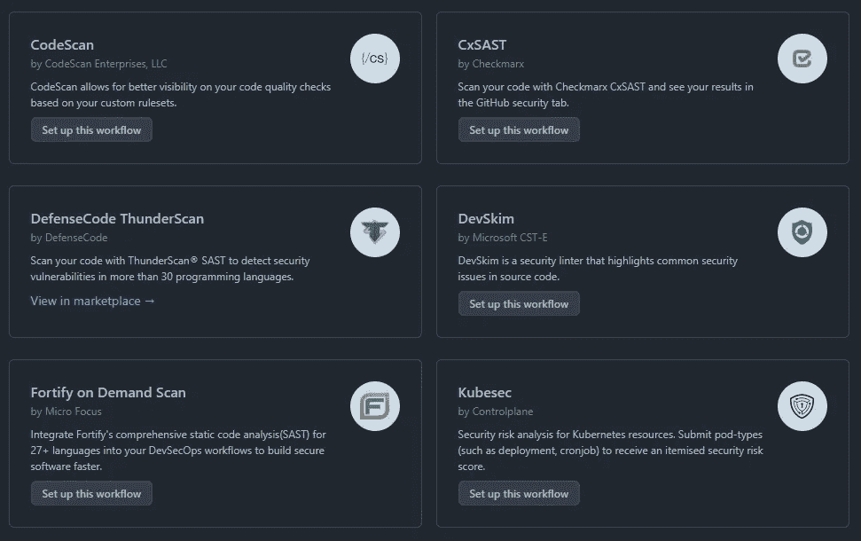
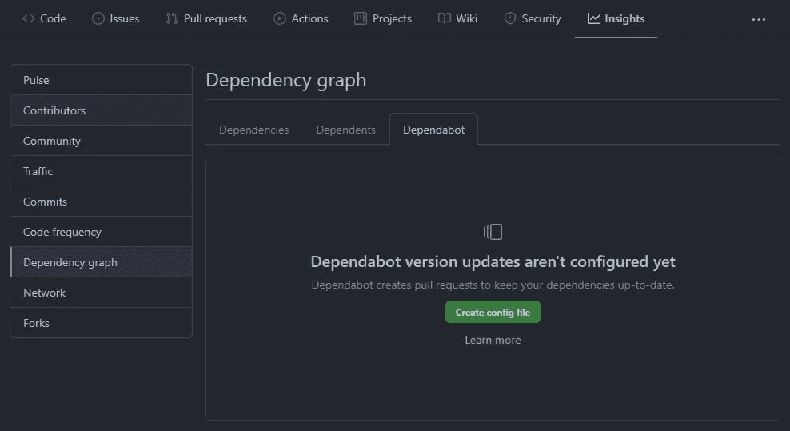
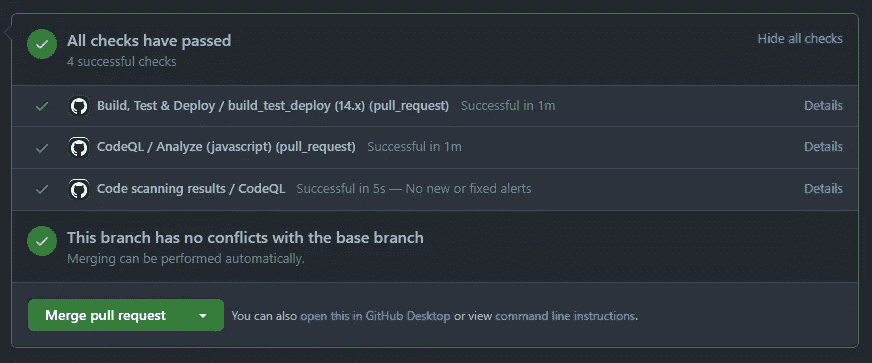

# 如何使用 GitHub 操作设置高级 CI/CD 管道

> 原文：<https://javascript.plainenglish.io/how-to-setup-advanced-ci-cd-pipeline-with-github-actions-no-travis-circle-ci-29b02b03c501?source=collection_archive---------6----------------------->

> 您的源代码 repo 托管在 GitHub 上，您想知道如何实现 CI/CD 管道来测试、构建和发布您的应用程序。当你需要的所有东西都已经被放进 GitHub 的时候，为什么还要使用外部工具呢？还有称为工作流的自动化过程，可以扫描您的代码进行安全性分析。

除了安全分析扫描，GitHub 动作中的工作流是非常强大的功能。他们自动化构建脚本、运行测试、向 npm 发布包以及将构建的包部署到生产环境中。

Various virtual environments for running a CI/CD workflow

# 什么是工作流？

在层级的顶端，GitHub Actions 提供了所谓的工作流。它们是使用 YAML 语法创建的可配置自动化流程。可以把它们想象成容器或环境，其中名为`steps`的任务使用`actions`运行多个作业，以满足您的 CI/CD 需求。工作流文件必须放在代码库的`.github/workflows`目录中。

Actions from the GitHub Marketplace [https://github.com/marketplace](https://github.com/marketplace)

# ⚙️测试、构建和部署工作流

正如本工作流程的`name`所示，其目的是**测试**，**构建**，**将**应用程序部署到生产环境中。触发工作流的事件在`on`下配置。在这种情况下是回购推式和拉式请求。工作流任务在`jobs`下定义，在这种情况下，任务 id 为`test_build_deploy`。默认情况下，作业并行运行。要按顺序运行作业，您可以使用`jobs.job_id.needs`关键字定义对其他作业的依赖性。分配给`env`的环境变量将可用于工作流程中所有作业的步骤。在这种情况下，`CI`被设置为`true`将强制 Jest 在 CI 模式下运行，测试将只运行一次，而不是启动观察器。源映射生成也被设置为`false`以减小包的大小。运行工作流构建的虚拟环境类型在`runs-on`中定义。在这种情况下，它运行在最新的 LTS Ubuntu 上。Node.js 版本在`node_version`数组中指定。

## 让我们总结一下参数

*   `**name**` 工作流的名称
*   `**on**` 触发工作流的事件
*   `**jobs**` 按步骤运行任务的容器
*   `**env**` 设置环境变量
*   `**steps**` 将在下一节介绍👉

Main workflow configuration file

# 作业步骤

在设置了环境操作系统和一些环境变量之后，我们想要测试、构建、部署和发布我们的应用程序。我们在作业中按顺序运行的步骤来完成这一任务。

## 🔧 1.设置 Node.js

该步骤使用( [actions/setup-node@v2](https://github.com/marketplace/actions/setup-node-js-environment) )操作设置 Node.js。版本在`node-version`下的矩阵中指定。

## 📥 2.**获取最新源代码**

这个步骤使用( [actions/checkout@v2](https://github.com/marketplace/actions/checkout) )动作来签出代码。需要从您的 GitHub 帐户提供个人访问权限`token`。

## 🗑️ 3.**获取纱线缓存目录路径**

这一步运行一个命令，返回纱线缓存目录的路径。缓存依赖关系大大加快了工作流程。

## 🔄 4.**恢复纱线缓存**

该步骤通过使用( [actions/cache@v2](https://github.com/marketplace/actions/cache) )操作来恢复依赖项安装缓存，从而缩短了工作流执行时间。

## 📦 5.安装依赖项

这一步运行`yarn install`来安装所有的依赖项。

## 🧪 6.运行测试套件

这一步运行`yarn run test`来运行代码测试套件。

## 🏗️ 7.**构建主包**

这一步运行`yarn run build`来构建主包模块。

## 🚚 8.**发布到 NPM**

这个步骤使用([JS-dev tools/NPM-publish @ v1](https://github.com/marketplace/actions/npm-publish))动作将主模块包打包并发布到 npm.com。还需要从您的 npm 帐户提供一个`token`。这个重要的令牌变量可以在 repo 的 secrets 下的 settings 部分保存和访问。在`package`下设置指定包的路径。

## 🏗️ 9.**构建示例应用**

这一步运行`yarn run build:example`来构建示例应用程序。

## 🚀 10.**部署到 GitHub 页面**

这一步使用([JamesIves/GitHub-Pages-deploy-action @ 4 . 1 . 4](https://github.com/marketplace/actions/deploy-to-github-pages))动作将示例应用程序部署到 GitHub 页面。分支设置在`branch`下，构建目录在`folder`下。

使用前面的配置，任何对`main`分支的拉请求或推请求都将触发运行所提供的工作流。

An overview of the previous workflow in the Actions section in the repo

Job steps for testing and app build as shown in the Actions section in the repo

# 🛡️代码扫描工作流程

如前所述，安全分析工作流是 GitHub 操作的一部分。在我的用例中，我选择了 GitHub 的 **CodeQL 分析**。该工作流自动检测常见的漏洞和编码错误。

Security workflows can be found in Code scanning alerts under Security

这个工作流配置文件可以从 GitHub 获得。语言自动设置在`line 35`上，否则必须手动检查。

Code scanning workflow file

📄**改变被分析的语言:** [链接](https://docs.github.com/en/free-pro-team@latest/github/finding-security-vulnerabilities-and-errors-in-your-code/configuring-code-scanning#changing-the-languages-that-are-analyzed)

*There’s a variety of code scanning workflows to choose from*

# 📚相关性更新工作流

此工作流使您的依赖关系保持最新。Dependabot 可以配置为通过名称或版本号忽略或定位某些包。

Dependabot workflow can be found in Dependency graph under Insights

工作流配置文件非常基本。在`line 11`上设置相关性更新检查频率。包管理器设置在`line 3`上。

Dependency update check workflow file

📄**依赖关系更新的配置选项:** [链接](https://help.github.com/github/administering-a-repository/configuration-options-for-dependency-updates)

Dependabot creates pull requests for package updates while also running workflows

# 摘要

如您所知，工作流是运行作业的可配置 YAML 文件。每项工作都由您编写的脚本定义的任务或 GitHub Marketplace 的操作提供的特定任务组成。更多关于 GitHub 动作的信息请点击。

📄**源代码:【https://github.com/amir0ff157/reactjs-use-form/actions】T22**

# 结论

我们浏览了由✔️testing、✔️scanning、✔️building 和✔️publishing 组成的整个 CI/CD 管道的配置，这是一个源代码托管在 GitHub 上的应用程序。在上一个故事中 [**如何设置高级自动部署用 Travis CI**](https://medium.com/free-code-camp/advanced-automatic-deployment-with-travis-ci-1da32f7930ce) **。**我演示了如何配置类似的 CI/CD 管道。但是，如果你注意到我的教程最近的风格和目的的转变，你会注意到我多么希望事情变得简单。用尽可能少的开销编写更少的代码，并达到同样的效果，如果不是更多的话。Travis CI 和 Circle CI 仍然是很好的工具。但是这一次我们没有使用外部工具，仅仅使用 GitHub 就取得了更多的成果。

我希望你喜欢阅读，
请[**关注**](https://medium.com/@amir0ff) 和**分享**更多科技内容🤖💖

*更多内容看* [***说白了就是***](http://plainenglish.io/) ***。*** *报名参加我们的* [***免费每周简讯这里***](http://newsletter.plainenglish.io/) ***。***