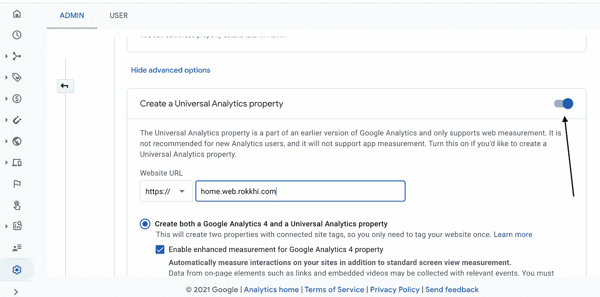
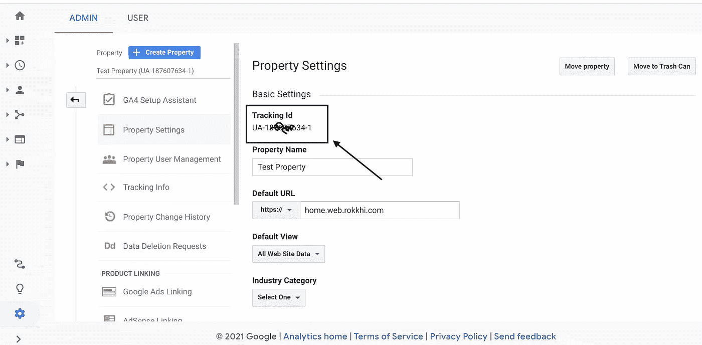

# 如何设置谷歌分析并将其添加到 React 应用程序中

> 原文：<https://javascript.plainenglish.io/how-to-setup-and-add-google-analytics-to-your-react-app-fd361f47ac7b?source=collection_archive---------0----------------------->


Photo by [Nick Fewings](https://unsplash.com/@jannerboy62?utm_source=unsplash&utm_medium=referral&utm_content=creditCopyText) on [Unsplash](https://unsplash.com/s/photos/analytics?utm_source=unsplash&utm_medium=referral&utm_content=creditCopyText)

在当前的信息时代，每一个成功的企业都需要了解其客户以及他们最关心的是什么。最简单的方法就是在他们访问你的网站时跟踪他们。

他们与你网站的互动可以让你更好地了解他们在寻找什么，帮助你更好地优化用户体验。

幸运的是，Google 已经使洞察你的网络应用变得很容易。

# 你能用分析做什么？

*   你可以深入了解他们居住的**地区**。
*   你可以了解哪些**年龄段的人**对你的生意更感兴趣
*   记录他们平均花费了多少时间
*   跟踪新的**用户获取率**
*   跟踪您的**收入**

# 作为开发人员的好处

*   您可以跟踪您的应用程序中是否有任何 **bug**
*   您可以根据用户的兴趣**优化**

还有更多…

因此，无论你是一个多么小的开发者或企业，你都应该将分析整合到你的网站中，因为它是免费的，并且容易设置。

# 第一步。创建一个帐户

转到[analytics.google.com](https://analytics.google.com/)

如果你已经有一个谷歌帐户(你可能已经有了)，你只需要建立一个新的帐户，并给它一个名字。

# 第二步。创建属性

属性是谷歌追踪你网站的一种方式。我们需要为我们的网站创建一个新的属性。

*   去你的仪表盘找到`Admin`->
*   填写所需的名称和其他详细信息，并提供您网站的 URL。

> 确保点击高级设置并打开创建通用属性选项。默认情况下，谷歌不会创建一个通用属性。



*   然后选择一个属性，获取跟踪 id 并将其保存在某个地方。



Getting Tracking ID

现在，您已经完成了在 Google Analytics 中设置您的项目。如果你有一个实时网站，你会开始对访问者有所了解。

> 到这一部分，我们没有做任何具体的反应。这些是任何一个直播网站都可以做到的！

但是我们想要的不止这些。我们希望跟踪用户的确切旅程。我们想更多地了解我们的网站和用户之间的互动。为此，我们需要为我们的项目设置谷歌分析。

# 第三步。安装依赖项

首先，从 npm 安装`react-ga`包。这是 React 与 Google analytics 集成的官方 npm 包。

```
yarn add react-ga
```

或者

```
npm i react-ga -S
```

# 第四步。在项目内设置分析

在你的项目中设置**谷歌分析**。你应该在`App.js`或者`index.js`里面做。来自 react-ga 文档

> 在任何其他跟踪功能记录任何数据之前，必须使用此功能初始化 GA。

因此，将以下代码添加到您的 App.js 文件中

```
import ReactGA from 'react-ga';const TRACKING_ID = "UA-12341234-1"; // YOUR_OWN_TRACKING_ID
ReactGA.initialize(TRACKING_ID);
```

# 第五步。记录自定义事件

现在你有这么多的选择来玩。如果您想跟踪用户点击特定按钮或执行特定操作的次数，您可以这样做。

要跟踪用户创建事件，您可以在用户创建帐户时调用以下函数。

```
ReactGA.event({
  category: 'User',
  action: 'Created an Account'
});
```

为了捕捉异常，

```
ReactGA.exception({
  description: 'An error ocurred',
  fatal: true
});
```

你能做的远不止这些。点击[查看更多信息](https://github.com/react-ga/react-ga)。

# 第六步。与 React 路由器集成

大多数时候，我们想知道我们的用户访问哪些页面更多。但不幸的是，很难用 React 这样的 **CSR** (客户端渲染)库来跟踪。因为 React 只加载一个 HTML 文件。

但是有一个解决方法。对于 react 中的路由，我们主要使用`react-router-dom`，这个库为我们提供了一个跟踪 URL 变化的特设工具。

因此，我们可以将 URL 更改数据发送到 google analytics，以跟踪用户访问哪些页面的频率高于其他页面。

我们可以创建一个`RouteChangeTracker`组件来监听路线的变化，并将数据发送回 **Google Analytics**

```
import ***React*** from 'react'import { withRouter } from 'react-router-dom';
import ReactGA from 'react-ga';const RouteChangeTracker = ({ history }) => {

    history.listen((location, action) => {
        ReactGA.set({ page: location.pathname });
        ReactGA.pageview(location.pathname);
    });

    return <div></div>;
};

export default withRouter(RouteChangeTracker);
```

不要忘记在你的`App.js`文件中添加`RouteChangeTracker`组件。

```
import RouteChangeTracker from './RouteChangeTracker'export const App = () => { //other logics goes here return <div>
    <RouteChangeTracker />
  </div>}
```

现在你都准备好了。您应该在您的分析仪表板中看到用户如何与您的应用程序交互。

今天到此为止。编码快乐！:D

**有话要说？**

```
**Get in touch with me via** [**LinkedIn**](https://www.linkedin.com/in/56faisal/) **or my** [**Personal Website**](https://www.mohammadfaisal.dev/)**.**
```

[](https://betterprogramming.pub/21-best-practices-for-a-clean-react-project-df788a682fb) [## 清洁 React 项目的 21 个最佳实践

### 提高代码质量的实用建议

better 编程. pub](https://betterprogramming.pub/21-best-practices-for-a-clean-react-project-df788a682fb) [](/45-npm-packages-to-solve-16-react-problems-a9ab18946224) [## 45 个 NPM 软件包解决 16 个 React 问题

### 关于如何选择完美的 npm 包的深入指导

javascript.plainenglish.io](/45-npm-packages-to-solve-16-react-problems-a9ab18946224) [](/20-essential-parts-of-any-large-scale-react-app-ee4bd35436a0) [## 任何大型 React 应用程序的 20 个基本部分

### 如果您正在编写企业级代码，您需要了解这一点

javascript.plainenglish.io](/20-essential-parts-of-any-large-scale-react-app-ee4bd35436a0) [](https://betterprogramming.pub/the-7-traits-of-a-rock-star-react-developer-747fbb001c05) [## 摇滚明星 React 开发者的 7 个特质

### 造成差异的习惯

better 编程. pub](https://betterprogramming.pub/the-7-traits-of-a-rock-star-react-developer-747fbb001c05) 

## 进一步阅读

[](/5-tips-to-scale-up-your-react-apps-8fb68319062e) [## 扩展 React 应用的 5 个技巧

### 1.将 Bit 用于可组合设计 2。设计令牌 3。网络请求的定制钩子 4。客户端与服务器状态 5。一个…

javascript.plainenglish.io](/5-tips-to-scale-up-your-react-apps-8fb68319062e) 

*更多内容请看*[***plain English . io***](https://plainenglish.io/)*。报名参加我们的* [***免费周报***](http://newsletter.plainenglish.io/) *。关注我们关于*[***Twitter***](https://twitter.com/inPlainEngHQ)[***LinkedIn***](https://www.linkedin.com/company/inplainenglish/)*[***YouTube***](https://www.youtube.com/channel/UCtipWUghju290NWcn8jhyAw)*[***不和***](https://discord.gg/GtDtUAvyhW) *。对增长黑客感兴趣？检查* [***电路***](https://circuit.ooo/) *。***