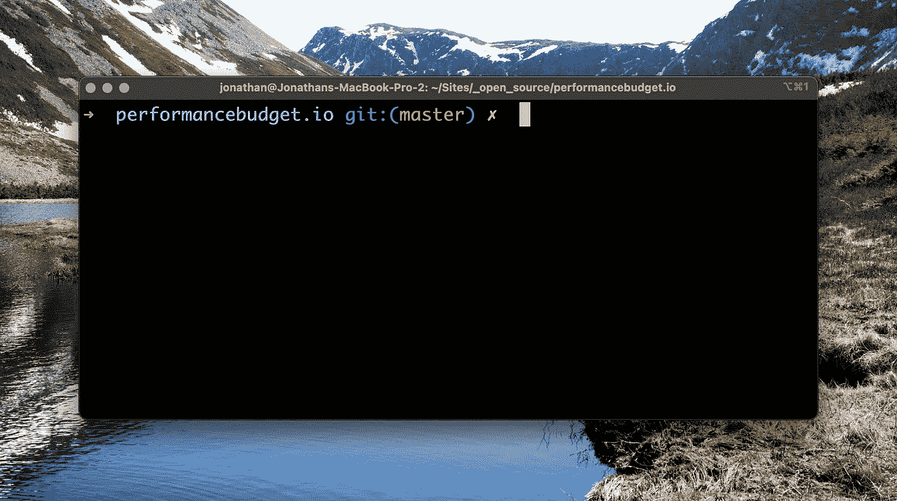
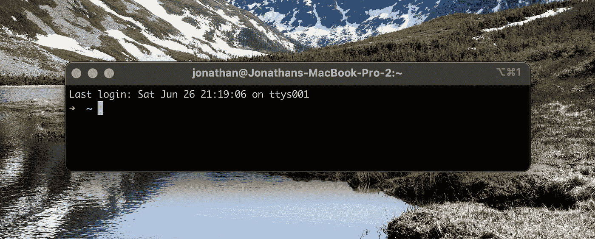
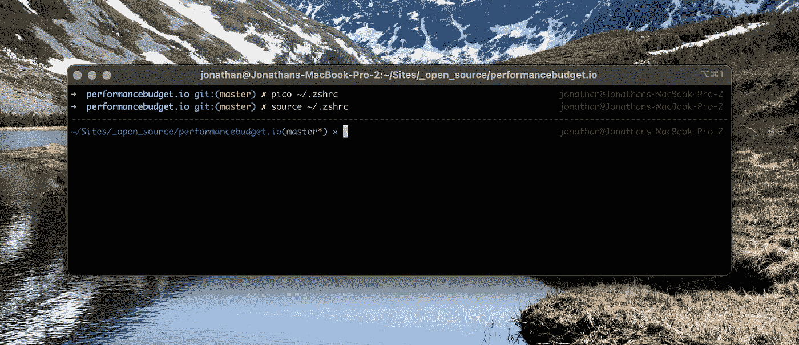

# 如何在 Mac 上设置和优化命令行界面

> 原文：<https://javascript.plainenglish.io/how-to-setup-and-optimise-the-cli-on-your-mac-c91d151a25c8?source=collection_archive---------11----------------------->



Screenshot of authors CLI running OhMyZsh in iTerm2

作为一名在 Mac 上大量工作的开发人员，我花了很多年来调整和优化我如何配置我的 CLI 来改善我的体验。

今天，我想我会分享你如何开始定制自己的 CLI，使它更好地为你服务。

# 安装自制软件

当我安装 Mac 时，我总是做的第一件事是打开默认的终端应用程序并安装**自制软件**。Homebrew 自称为“macOS 的缺失包管理器”,是一个易于使用的工具，可以在 Mac 上安装各种应用程序(包括 CLI 和 GUI)。

为了安装`homebrew`,我们可以在我们的终端中运行下面的命令，它使用 curl 获取一个安装脚本并执行它。

```
/bin/bash -c "$(curl -fsSL [https://raw.githubusercontent.com/Homebrew/install/HEAD/install.sh](https://raw.githubusercontent.com/Homebrew/install/HEAD/install.sh))"
```

# 安装 iTerm2

虽然内置的终端应用程序在过去几年中已经得到了改进，对标签等东西的支持更好了，但我更喜欢使用 iTerm2，它提供了更多强大的功能。

要安装 iTerm2，我们可以使用 homebrew 的`--cask`标志，它使我们能够安装 GUI 应用程序。这是按如下方式完成的:

```
brew install --cask iterm2
```

安装完成后，我们可以关闭目前使用的内置终端应用程序，打开 iTerm2😀。

# 安装我的天啊

由于 Zsh 是 macOs 上使用的默认 shell，下一步就是安装 **Oh My Zsh** 。

哦，我的 Zsh 是一个管理你的 Zsh 配置的框架，它捆绑了成千上万的有用的功能，助手，插件，主题，将帮助你定制你的终端。

类似于我们如何安装家酿，我们可以使用 curl 命令来安装 Oh My Zsh。

```
sh -c "$(curl -fsSL https://raw.github.com/ohmyzsh/ohmyzsh/master/tools/install.sh)"
```

随着 **Oh My Zsh** 的安装，你会看到你的终端现在已经设置好了，将会有一个默认的主题和一些基础插件设置。



Screenshot of default Oh My Zsh setup taken by author

# 更改 CLI 的外观

随着 **Oh My Zsh** 的安装，我们现在可以开始定制它了！

首先，让我们通过改变主题来改变终端的外观。为了找到主题，我们可以去 https://github.com/ohmyzsh/ohmyzsh/wiki/Themes 的主题馆看看。

看着那个画廊，我决定尝试一下 af-magic。要设置主题，你需要打开你的`.zshrc`文件，搜索`ZSH_THEME`，将值改为你喜欢的主题的名称，如下所示。

```
ZSH_THEME="af-magic"
```

接下来，用新的主题重新加载我们的终端配置，我们应该`source`我们的配置文件，使用:

```
source ~/.zshrc
```

这将重新加载配置，我们现在将看到我们的新终端。



Screenshot of customised theme setup by author

# 使用插件添加附加功能

下一步是开始通过插件为我们的终端定制额外的功能。

开箱即用，**哦，我的 Zsh** 带有各种各样你可以启用的插件，完整列表可以在[https://github.com/ohmyzsh/ohmyzsh/wiki/Plugins](https://github.com/ohmyzsh/ohmyzsh/wiki/Plugins)找到。

要启用任何内置插件，我们只需编辑`.zshrc`配置文件并搜索“plugins= ”,默认情况下，该值将被设置为`(git)`。作为一个全栈网络开发人员，我经常使用的两个插件是`nvm`和`npm`，我们把它们添加到下面，用空格分开，如下所示:

```
plugins=(git npm nvm)
```

像以前一样，我们将使用`source`命令用新的插件配置重新加载我们的终端配置:

```
source ~/.zshrc
```

这将重新加载配置，我们现在将能够使用它启用的命令。

除了内置插件，还有一个开发者社区为 **Oh My Zsh** 开发第三方插件。我每天使用的一个是`zsh-autosuggestions`,它会根据你的历史和完成情况在你输入命令时给出建议。

与内置插件不同，安装第三方插件有一个额外的步骤，就是将它们下载到自定义文件夹。对于之前提到的`zsh-autosuggestions`,我们可以做以下事情:

```
git clone https://github.com/zsh-users/zsh-autosuggestions ${ZSH_CUSTOM:-~/.oh-my-zsh/custom}/plugins/zsh-autosuggestions
```

一旦插件就位，就可以编辑`.zshrc`配置文件并像以前一样更新` plugins= `选项，这次包括我们新插件的名称。

```
plugins=(git npm nvm zsh-autosuggestions)
```

同样，我们必须使用新插件重新加载我们终端的配置:

```
source ~/.zshrc
```

*注意:你添加到 shell 中的大多数插件和扩展都会增加它的加载时间，所以请小心操作*

# 其他 ZSH 选项

除了使用“哦，我的 Zsh ”,我还在我的`.zshrc`文件中添加了一些其他设置，以使使用终端更容易

*   **setopt share_history** :该设置使您能够在所有打开的 shells 之间共享历史。我个人认为这在我使用 Kubernetes 时非常有用，我经常需要对多个集群运行相同的命令，我在 iTerm 的多个窗格中执行这些命令，共享历史意味着我可以在一个窗格中执行命令，然后在另一个窗格中执行命令，而不必在两个窗格之间复制粘贴。
*   setopt autocd :这个设置意味着我可以简单地输入或粘贴一个文件夹的路径，它会带我到那里，而不需要我在文件夹路径前输入`cd`。
*   **setopt correct** :该设置使 zsh 能够在我打错命令时提供建议，然后通过按`y`选择运行正确的命令。

# 使用别名进一步定制

除了主题、插件和 zsh 选项，我们还可以为常用命令添加别名。

为了避免我们的`.zshrc`文件夹变得凌乱，我们可以利用 **Oh My Zsh** 中的一个特性，将它们放在自己的文件中。哦，我的 Zsh 将自动加载我们按字母顺序放入`~/.oh-my-zsh/custom/`的任何文件，所以我们可以用我们所有的别名创建一个 **aliases.zsh** 文件，将它们保存在一个地方。这是我的样子:

```
# edit this aliases file in visual studio code
alias edit-alias="code -n ~/.oh-my-zsh/custom/alias.zsh"# reload zsh config
alias reload="source ~/.zshrc"# navigate to Sites directory
alias sites="cd ~/Sites"# navigate to open source projects
alias os="cd ~/Sites/_open_source"
```

用化名可以做的事情太多了，我可以写一整篇文章来介绍你能做的所有很酷的事情。幸运的是 [Yankee Maharjan](https://medium.com/u/348042aca5a2?source=post_page-----c91d151a25c8--------------------------------) 已经写了一篇很棒的关于别名的文章，所以我推荐你去看看:

[](https://blog.lftechnology.com/command-line-productivity-with-zsh-aliases-28b7cebfdff9) [## ZSH 别名的命令行效率

### 如果你使用的是 Linux，那么终端就是你做大部分事情的地方。使用 CLI 很酷，但是…

blog.lftechnology.com](https://blog.lftechnology.com/command-line-productivity-with-zsh-aliases-28b7cebfdff9) 

# 结论

这篇文章将带你了解我在新系统上设置终端时的基本设置。除此之外，我还有一些包含额外别名的点文件，这些别名使我在 CLI 上的生活更容易，我从 GitHub 下载了这些文件，并包含在我的系统路径中。

如果有其他人可以推荐的`zsh`插件，那么请回复这篇文章，让我知道，这样我就可以给他们一个尝试。

*更多内容看* [***说白了. io***](http://plainenglish.io)