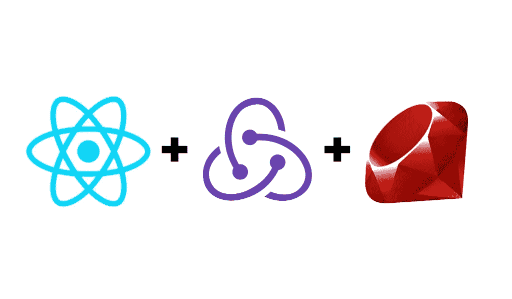

# 如何使用 React 和 Rails 设置身份验证

> 原文：<https://javascript.plainenglish.io/how-to-setup-auth-with-react-and-rails-c694035d94ee?source=collection_archive---------2----------------------->



这在当时看起来并不明显，但是设置身份验证真的很简单，或者至少是最基本的。大多数人都知道，随着应用程序的增长，平衡身份验证变得越来越困难。

我通常会推荐第三方认证，甚至后端 API，如 Firebase 或 Auth0，但现在，如果您只是构建一个小应用程序，这就可以了。

首先，如果您已经足够深入地了解了身份验证，我将假设您对生成器非常熟悉。运行 React 的`npx create-react-app`包装运行器和 Rails 的`Rails new`发电机。然后在您的 Rails gems 文件中添加并安装:

```
gem install bcrypt
gem install rack-cors
```

以及你的项目可能需要的任何宝石。

在 React 端，运行 npx 后，您现在应该有一个类似下面的`index.js`文件。

很好。现在直接在您的 src 目录中，您将想要为 **Redux** 创建一个新的子目录。除此之外，您还将创建另外两个子文件夹——actions 和 reducers。然后，您需要为您的 Redux 创建一个新的`index.js`文件。

```
App.js
index.js
src
 /components
 /Redux
   /actions 
     <this is empty>
   /reducers
     <This is empty DIR>
   index.js
```

导航到`src/Rudux/index.js`这是所有神奇事情发生的地方。我们将建立我们的商店，以及一些 Thunk 中间件。是的，我们将使用 thunk！

当然，你需要安装 `react-redux`和`thunk.`

这是我如何设置我的:

请注意，我导出了默认的存储，这将在我们设置完 index.js 后派上用场。

PS, Have no Idea why it is formatted like this

下一步将想用 Thunk 设置我们的动作创建器。看起来有点像这样。

现在，让我们建立我们的商店，好吗？

嘣。现在我们只需要做一个小小的 Rails 后端，我们应该准备好了。如果你还没有的话，现在你会想要一个`sessions_store.rb`和一个`cors.rb`。我们需要提供跨源的访问权限，这样 cors 就会知道我们的前端和后端在做什么。

而在你的`session_store`里。

然后，我们需要确保在我们的用户模型中设置了`has_secure_password`，并在我们的`users`表中使用 password_digest。你也应该设立一个`currentUserConcern`来帮点忙。

然后嘣！从这里开始，您需要做的就是从终端 UI 设置您的组件，并构建您的用户控制器来创建一个新用户。你做到了！出色的工作。

感谢您的阅读。

[*更多内容尽在 plainenglish.io*](http://plainenglish.io/)