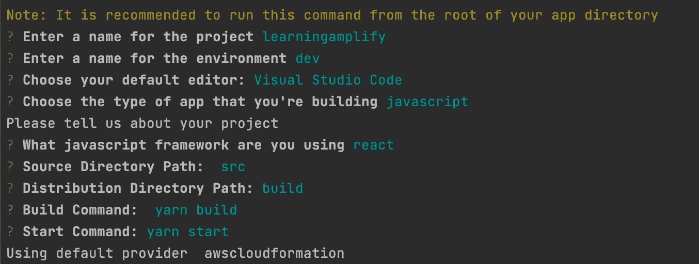
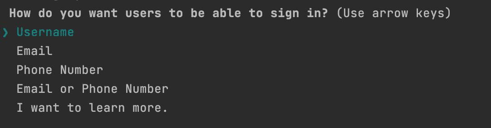
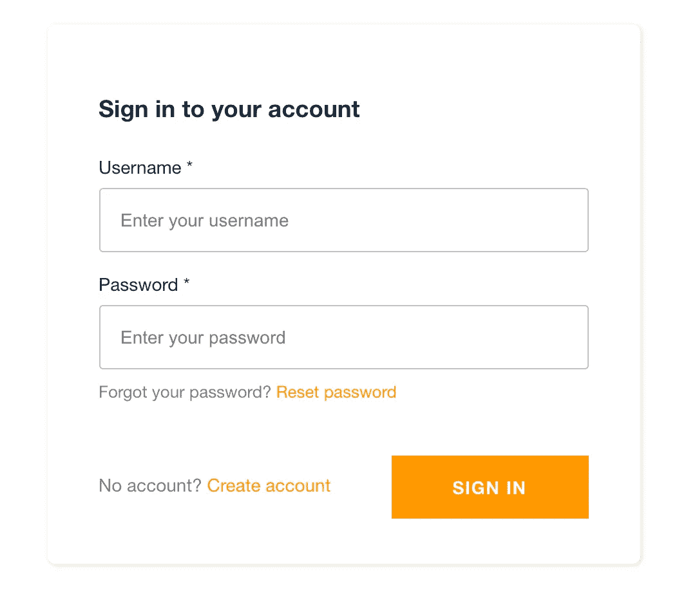
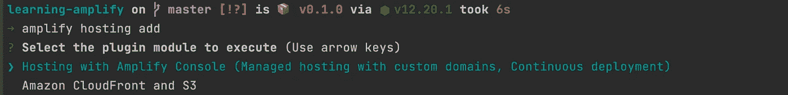
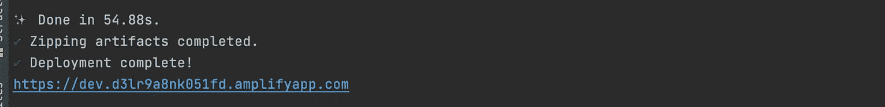

# 如何为 React 应用程序设置 AWS 身份验证

> 原文：<https://javascript.plainenglish.io/how-to-setup-aws-authentication-for-react-applications-8bbf03bb722?source=collection_archive---------12----------------------->

## 简单但强大


Photo by [Chepe Nicoli](https://unsplash.com/@nicoli_?utm_source=unsplash&utm_medium=referral&utm_content=creditCopyText) on [Unsplash](https://unsplash.com/s/photos/lock?utm_source=unsplash&utm_medium=referral&utm_content=creditCopyText)

身份验证是任何现代 web 应用程序的首要方面之一，作为开发人员，您需要注意这一点。幸运的是，今天我们有这么多优秀的解决方案，其中之一就是 **AWS Amplify。**

今天，我们将使用这个服务来创建一个简单的 React 应用程序。我们的目标是

*   在我们的机器上安装并配置 **Amplify CLI**
*   创建一个基本的 React 项目
*   向其添加用户**认证**
*   **在云中部署** it

让我们开始吧。

# 什么是 AWS Amplify？

AWS Amplify 是一项由 AWS 自己管理的服务。它负责现代应用程序的大部分常见功能，如 **Auth** 、 **Hosting** 、 **API** 等，这样您就可以专注于自己构建实际的产品。

## 第一步。在你的机器上安装放大器

运行以下命令在您的机器上安装 amplify

```
npm i -g [@aws](http://twitter.com/aws)-amplify/cli
```

## 第二步。配置放大器

安装后，运行以下命令来配置 amplify

```
amplify configure
```

这 2 个步骤只有一次。在这一步中，您将需要`aws secret access key`和`aws access key id`。这两者都可以在 aws 概要文件的 IAM 设置中找到。

## 第三步。创建新的 React 项目

首先，为我们的目的创建一个全新的项目

```
npx create-react-app learning-amplify
```

## 第四步。为项目配置放大器

进入项目的根目录。

```
cd learning-amplify
```

然后通过运行以下命令配置一个放大项目

```
amplify init
```

这将带你通过一个标准程序。大多数选项都可以保留为默认值。这里有一个例子



amplify init

它将在你的项目中创建一个`amplify`目录。别碰那个。

## 第五步。添加身份验证

现在我们已经把这个项目认定为`Amplify`项目。现在我们需要做的是向这个项目添加身份验证。

```
amplify add auth
```

在这一步中，您必须配置您希望您的用户如何登录。有很多选择



authentication options

选择你想要的。我们现在选择`Username`。

将其他一切都保留为默认设置，您将在几分钟内完成设置。

## 第六步。将一切都推至云端

现在我们需要把我们的项目放到云上。为此，运行以下命令

```
amplify push
```

这需要一些时间。但在那之后，你就万事俱备了。

## 第七步。在项目中使用 Amplify SDK

它将处理我们所有的用户界面，并与 aws 同步。首先，安装它

```
yarn add aws-amplify 
```

您需要在根级别配置您的项目(在我们的例子中是`index.js`文件)。在您的`index.js`文件中添加以下 3 行代码

```
import Amplify from "aws-amplify";
import ***awsExports*** from "./aws-exports";
Amplify.configure(***awsExports***);
```

之后，我们的`index.js`看起来会像这样

现在我们可以自己处理身份验证了。[这里的](https://aws-amplify.github.io/amplify-js/api/classes/authclass.html)是所有可用功能的文档。

## 第八步。让它变得更好

有一个很棒的名为`@aws-amplify/ui-react`的库，它自动为我们处理最常见的认证流程。它包括

*   签到
*   签名登记离开
*   重置密码

和许多其他事情。为了利用认证库，我们必须首先安装软件包

```
yarn add @aws-amplify/ui-react
```

现在，在我们的`App.js`中，我们需要导入一个高阶函数，并用它包装我们的`App`组件。

最后，它看起来会像这样。

注意，我们还为我们的应用程序添加了一个`Signout`按钮。

## 第九步。运行应用程序

现在像往常一样启动应用程序

```
yarn start
```

而且你会被 Amplify Ui React 提供的登录 UI 问候！



Amplify UI

在这里，您可以创建一个新帐户，然后登录。

## 第十步。发布您的应用

好极了。现在是时候与世界分享你的成就了。只需转到终端并运行以下命令。

```
amplify hosting add
```

它将提示您希望在哪里托管您的应用程序。



hosting option

我们选择放大器控制台，这样我们就不需要做任何事情！

然后运行下面的命令把所有东西都放到云中！

```
amplify publish
```

这将需要一些时间，在那之后，你将会看到这个



deployment successful

厉害！现在访问网址，看看你的应用生活！

就是这样。现在，您知道了如何使用 AWS Amplify 构建端到端产品。探索更多，找出你可以用它做的其他事情。感谢您的阅读！

**通过**[**LinkedIn**](https://www.linkedin.com/in/56faisal/)**或我的** [**个人网站**](https://www.mohammadfaisal.dev/) **与我取得联系。**

## 资源:

[https://docs.amplify.aws/start/q/integration/react?sc _ I campaign = react-start&sc _ I channel = choose-integration](https://docs.amplify.aws/start/q/integration/react?sc_icampaign=react-start&sc_ichannel=choose-integration)