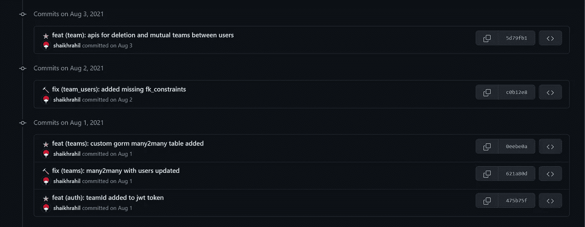

# 如何像专业人员一样使用 Husky、Commitlint、Cz 可定制和 Lint-Staged 设置工作区

> 原文：<https://javascript.plainenglish.io/how-to-setup-workspace-like-a-pro-husky-commitlint-commitizen-lint-staged-1e9b093d7afc?source=collection_archive---------7----------------------->

## 对开发人员使用的一些常规工具的介绍。



Sample commit messages

这将是一个直截了当的博客，在这里你将能够了解到一些在我们作为开发人员的日常生活中应该使用的工具。

**注意:这篇文章主要是为 JavaScript 开发者写的，但是也可以被其他开发者用来提高生产力**

# husky+commit Lint+Cz-可定制+ Lint-Staged

它们一起使用，以获得更干净的提交消息，并检查提交消息的格式。

1.  [Husky:用于添加预提交和提交消息 Git 挂钩](https://www.npmjs.com/package/husky)
2.  [commit link:用于 lint 提交消息的 CLI](https://www.npmjs.com/package/commitlint)
3.  [Cz-可定制:帮助你写提交消息](https://www.npmjs.com/package/cz-customizable)
4.  [Lint-Staged:对你的 Staged 文件进行基本的 Lint 检查和更漂亮的格式化](https://www.npmjs.com/package/lint-staged)

**命令:**

```
npm i -D husky cz-customizable commitlint commitlint-config-gitmoji lint-staged prettier eslintnpx husky installnpx husky add .husky/commit-msg “cat \$1 | commitlint”
```

请注意，在上面的命令中，“$1”可能没有被添加。您可以通过打开。当前工作目录中的 husky/commit-msg 文件。此外，如果您使用 wsl，它可能会导致一些格式错误，所以如果您遇到任何问题，请手动键入命令，而不是复制粘贴。以下命令也是如此。

```
npx husky add .husky/pre-commit “npm run lint-staged”
```

现在让我们做一些卷发如下所示:

```
curl -L [https://raw.githubusercontent.com/shaikhrahil/nextjs-workspace-template/main/commitlint.config.js](https://raw.githubusercontent.com/shaikhrahil/nextjs-workspace-template/main/commitlint.config.js) > commitlint.config.jscurl -L [https://raw.githubusercontent.com/shaikhrahil/nextjs-workspace-template/main/.lintstagedrc](https://raw.githubusercontent.com/shaikhrahil/nextjs-workspace-template/main/.lintstagedrc) >.lintstagedrccurl -L [https://raw.githubusercontent.com/shaikhrahil/nextjs-workspace-template/main/.cz-config.js](https://raw.githubusercontent.com/shaikhrahil/nextjs-workspace-template/main/.cz-config.js) >.cz-config.js
```

将以下内容添加到 package.json 脚本中:

```
“lint-staged”: “lint-staged — config .lintstagedrc”,
“commit”: “./node_modules/cz-customizable/standalone.js”
```

并将以下内容添加到 package.json 根配置中:

```
“config”: { “commitizen”: { “path”: “cz-customizable” } }
```

# 我们完事了。

这将设置您的工作区，提供使用表情符号、lint 检查和美化暂存文件提交令人敬畏的 git commit 消息。

# 超越一步

首先，对于所有非 JS 开发人员，不要担心，我已经编写了一个 shell 脚本，在我不从事非 JS 项目时帮助我。你可以在这里看看玩玩:[commit lint(github.com)](https://gist.github.com/shaikhrahil/144684861ff62ec46ee3d294837640a3)

其次，您可以避免使用*“npm run commit”*和用户 [Git 别名](https://git-scm.com/book/en/v2/Git-Basics-Git-Aliases)来完成提交工作，这样您就不会出现将提交从 Git 移交给 NPM 脚本的 OCD。你可以简单地做

```
git config alias.cz ‘!npm run commit’
```

然后运行`*git cz*` 开始提交您的更改。

就这些了，伙计们！感谢您的阅读。

*更多内容看* [*说白了。在这里注册我们的*](http://plainenglish.io/) [*免费周报*](http://newsletter.plainenglish.io/) *。*