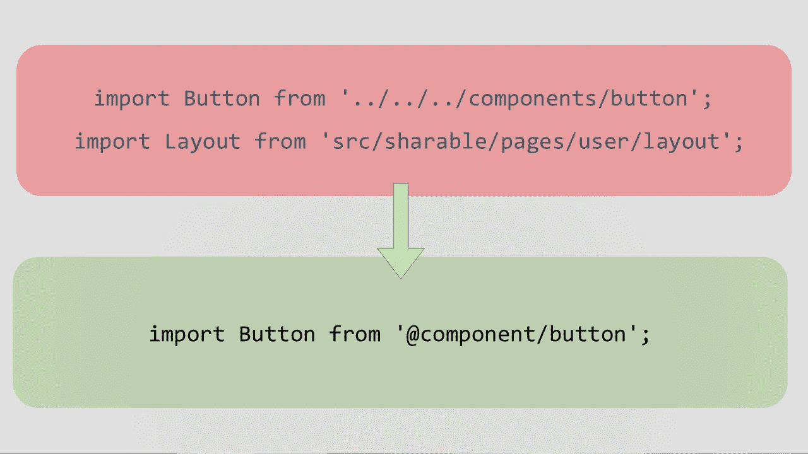
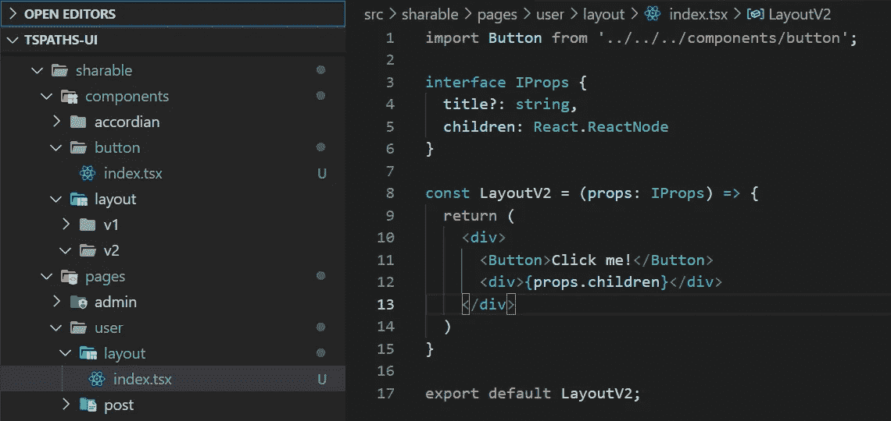
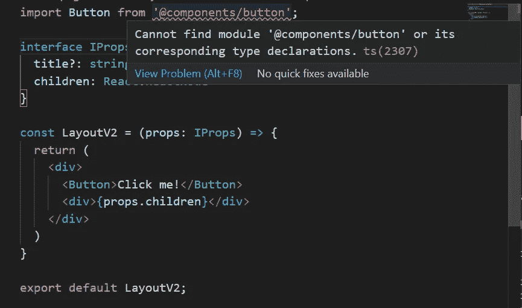
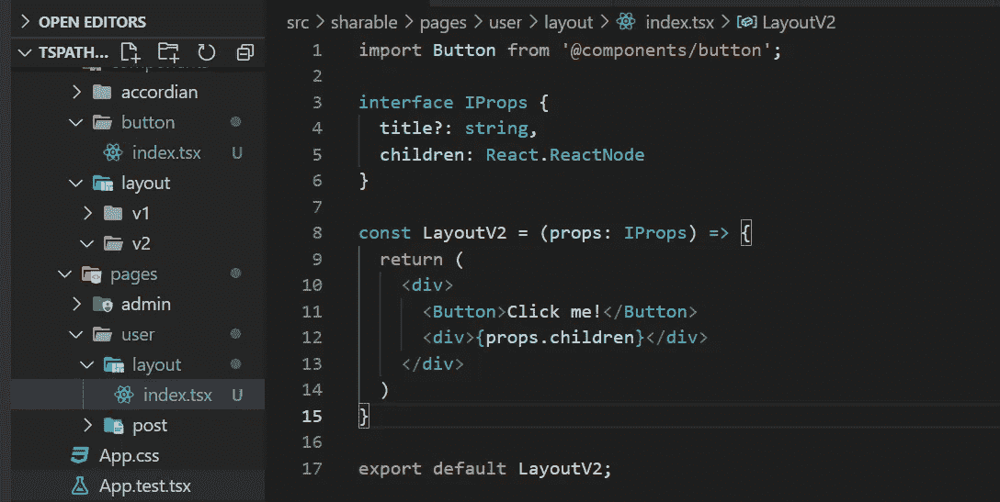
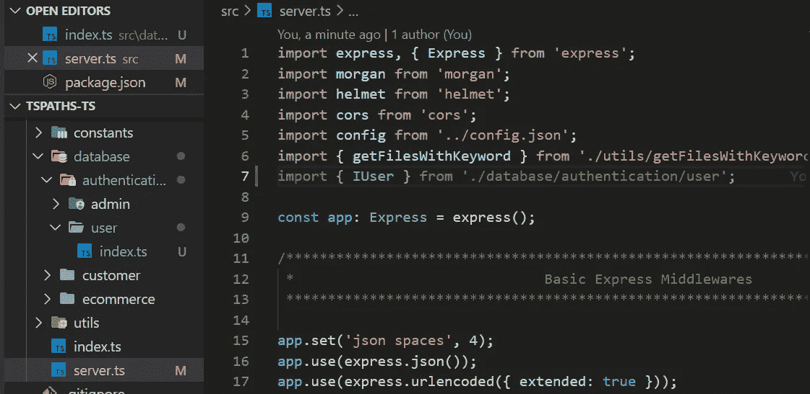

# 如何缩短 React 中的导入路径

> 原文：<https://javascript.plainenglish.io/how-to-shorten-import-paths-in-react-and-typescript-nodejs-5b257ee0c3fa?source=collection_archive---------0----------------------->

## 在 TypeScript 和 Node.js 中也是如此

你曾经不得不用`import ModuleName from '../../../one/two/component'`导入一个模块吗？本文将消除这一痛点，并允许 TypeScript 开发人员高效且有效地为**前端**和**后端**代码库导入模块！是时候告别漫长的导入路径了。



在本文中，由于捆绑器的不同，我将向导分为前端和后端。

*   [链接(点击此处)到前端创建 React 应用程序导入缩短](#61c3)
*   [链接(点击此处)到后端打字稿导入缩短](#a80e)

# 前端创建 React 应用程序导入缩短

在 react 代码库中，我们经常发现自己要从远离 JSX 的地方导入可共享的组件。元素文件。例如，我们从 components 文件夹导入按钮，如图所示。



这并不理想，因为嵌套的路径会降低代码的可维护性。因此，我们想把它变成`'@components/componentName';`,因为这将允许绝对路径导入，不管我们在哪个子文件夹中，与上面的相对路径相比，它不会保持不变。当你把你的导入改成`'@components/componentName';`时，你会发现下面的错误。



为了解决这个问题，我们需要配置 webpack 别名。因此，我们需要安装 craco 软件包。Craco 指的是创建 React 应用程序配置覆盖！

```
$ npm install @craco/craco
```

安装 craco 后，使用以下参数创建 craco.config.js。

不仅如此，您还必须在 package.json 脚本部分用 craco 替换 react-scripts。

```
{
    // ...
    "scripts": {
-     "start": "react-scripts start",
-     "build": "react-scripts build",
-     "test": "react-scripts test",
+     "start": "craco start",
+     "build": "craco build",
+     "test": "craco test",
      "eject": "react-scripts eject"
    },
  }
```

现在反应过来的邦德勒明白了，我们还没完。我们也需要“告诉”visual studio 代码，以便 VSC 智能感知能够工作。创建名为 paths.json 的新文件。

修改现有的 tsconfig.json，将其扩展到 paths.json。

Tadaaa！现在你完成了！无论您在哪个嵌套文件夹中，您都可以使用绝对短路径！



# 后端打字稿导入缩短

## 发展环境

当您的代码库变得越来越大时，您的导入路径往往会变得越来越长。因此，在某些时候，我们将需要绝对导入路径来使我们的代码库更易于维护。在这一节中，我将介绍如何在 TypeScript 非 webpack 项目中实现这一点。在下面的例子中，我从嵌套文件夹中导入一个接口。在这个例子中，我使用[create-express-typescript-application](https://www.npmjs.com/package/create-express-typescript-application)模块生成项目。



因为它是基本文件夹，所以仍然是可跟踪的。然而，当您需要从`'../../parentFolder/childFolder/grandChildFolder/index.ts';`导入时，事情就变得混乱了。为此，您需要从 npm 安装 tsconfig-paths 和 require-json5 模块。

```
$ npm install tsconfig-paths require-json5
```

接下来，通过在 compilerOptions 下添加以下内容来修改 tsconfig.json。

```
"baseUrl": "./",    
"paths": {
      "@auth-user": ["./database/authentication/user"]
},
```

因此，您的 tsconfig.json 应该如下所示。

一旦修改了 tsconfig.json，就可以修改启动脚本了。

```
 "scripts": {
-     "dev": "ts-node ./src/index.ts",
-     "dev:nodemon": "nodemon -w src -e ts,json -x ts-node ./src/index.ts",
+     "dev": "ts-node -r tsconfig-paths/register ./src/index.ts",
+     "dev:nodemon": "nodemon -w src -e ts,json -x ts-node  -r tsconfig-paths/register ./src/index.ts",

    },
```

一旦将`-r tsconfig-paths/register`作为参数添加到`node`或`ts-node`命令中，就大功告成了！然而，这只适用于开发环境。一旦您使用 tsc 命令构建了项目，事情就会发生变化。

## 构建环境

为此，您需要创建 js 文件作为自定义注册。用下面的代码创建 tspaths.js。

最初，我的启动脚本如下

```
"start": "cd build && node ./build/index.js"
```

我们将不得不修改它来读取自定义寄存器…

```
"start": "node -r ./tspaths ./build/src/index.js",
```

通过注册自定义路径，不仅是 typescript，我们还允许 js 从绝对路径中受益。

因此，我最终的 package.json 如下所示。

# 结论

我希望你已经从这篇文章中受益。本文向您展示了如何通过在基于 webpack 的前端 CRA 以及在 nodemon (ts-node)和使用 tsc 构建的后端中将相对路径更改为绝对路径来减少错误和时间。万事如意！