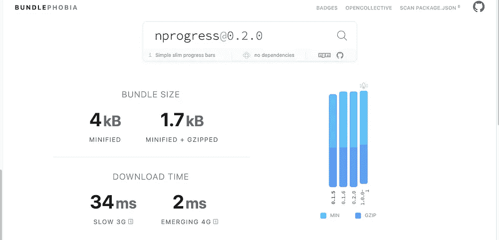
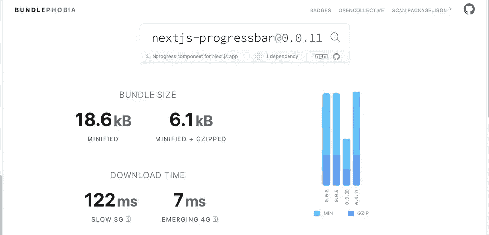

# 如何在 Next.js 中显示页面变化的加载器

> 原文：<https://javascript.plainenglish.io/how-to-show-loader-on-page-changes-in-next-js-102edd0ec98d?source=collection_archive---------4----------------------->

## 通过出色的视觉效果让您的用户参与进来！


Photo by [ThisIsEngineering](https://www.pexels.com/@thisisengineering?utm_content=attributionCopyText&utm_medium=referral&utm_source=pexels) from [Pexels](https://www.pexels.com/photo/female-software-engineer-coding-on-computer-3861972/?utm_content=attributionCopyText&utm_medium=referral&utm_source=pexels)

我们都很喜欢 Next.js，感觉像是 React 的增压版。Next.js 的好处是它可以在客户端和服务器端进行渲染。

服务器端渲染的想法是，我们用适当数量的 HTML 和 CSS 预先生成所有页面，并在请求时交付整个页面。

但是这是有代价的！

# 问题是

问题是，当用户单击任何路径进入另一个页面时，获取请求需要首先完成，然后才能显示给用户。

用户通常不知道发生了什么，因为屏幕上没有视觉线索。

为了解决这个问题，我们可以引入一个很好的技巧来指示它何时加载给用户。我们有两种方法可以做到这一点。

# 第一种解决方案

有一个很好的名为`[nextjs-progressbar](https://www.npmjs.com/package/nextjs-progressbar)`的图书馆就是为此服务的。你可以在这里看到使用这个库[的结果](https://demo-nextjs-progressbar.vercel.app/)

要使用这个库，首先要安装它

```
yarn add nextjs-progressbar
```

然后进入您的`_app.tsx`文件并导入它

```
import NextNprogress from 'nextjs-progressbar';
```

然后在`_app.tsx`中渲染组件和你的`<Component />`。最终的结果看起来会像下面这样。

现在，当您改变路线时，您将拥有一台漂亮的装载机。

# 第一个解决方案的问题

这个包是用另一个非常流行的漂亮的包构建的。那叫做`[nprogress](https://www.npmjs.com/package/nprogress)`。

它只是带走了你所有的复杂性。但是有一个问题。`nprogress`的线束尺寸比`nextjs-progressbar`小得多。



Comparison between 2 libraries

因此，通过比较，我们可以看到，如果使用名为`nprogress`的默认库，我们可以节省大约 14kb。但要让它发挥作用还需要多一点努力。

# 使用 Nprogress 的更好解决方案

让我们先安装依赖项

```
yarn add nprogress
```

然后进入你的`_app.tsx`文件并导入`Nprogress`

```
**import** NProgress **from** 'nprogress';
**import** 'nprogress/nprogress.css';**import** Router **from** 'next/router';
```

现在我们也正在导入 CSS 文件。如果你想定制 CSS，你也可以这样做。只需将 CSS 文件包含在项目本身中。它非常小。[这里的](https://github.com/rstacruz/nprogress/blob/master/nprogress.css)是那个文件的链接

我们还需要导入`Router`，因为我们必须检测路线的变化。

现在我们将把`Nprogress`和我们的`Router`绑定在一起，如下所示。

这些事件不言自明。当路线改变开始的时候，我们正在开始`Nprogress`。并且当路线改变完成时关闭它。

现在我们的`_app.tsx`应该看起来像下面这样

这将产生和以前一样的效果。但是这将导致更小的束尺寸。

# 最后的想法

有多种方法可以让你的应用程序变得更好。您应该始终寻找提高应用程序性能和用户体验的方法。

这只是另一个例子。

```
**Get in touch with me via** [**LinkedIn**](https://www.linkedin.com/in/56faisal/) **or my** [**Personal Website**](https://www.mohammadfaisal.dev/)**.**
```

[](/should-you-use-redux-in-next-js-5e57201c34da) [## Next.js 中应该用 Redux 吗？

### 你真的需要吗？

javascript.plainenglish.io](/should-you-use-redux-in-next-js-5e57201c34da) [](https://levelup.gitconnected.com/use-docker-with-nodejs-projects-like-a-pro-a9e7504e1308) [## 像专业人士一样使用 Docker 和 NodeJS 项目！

### 在开发和生产中利用 Docker 的力量

levelup.gitconnected.com](https://levelup.gitconnected.com/use-docker-with-nodejs-projects-like-a-pro-a9e7504e1308) 

*更多内容尽在*[***plain English . io***](http://plainenglish.io/)