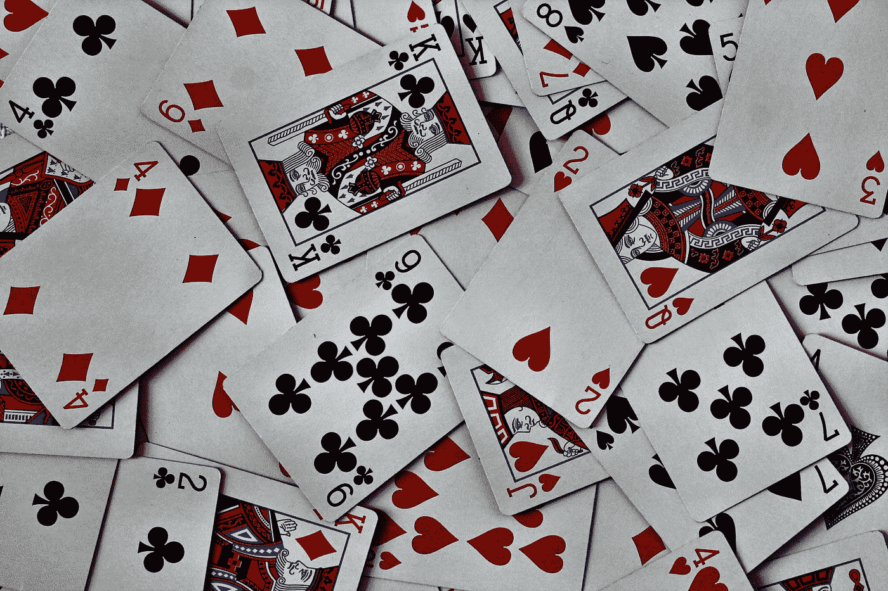

# 如何洗牌一个 JavaScript 数组？

> 原文：<https://javascript.plainenglish.io/how-to-shuffle-a-javascript-array-1357eed1680f?source=collection_archive---------3----------------------->



Photo by [Amanda Jones](https://unsplash.com/@amandagraphc?utm_source=medium&utm_medium=referral) on [Unsplash](https://unsplash.com?utm_source=medium&utm_medium=referral)

打乱 JavaScript 数组是我们有时不得不做的事情。

在本文中，我们将看看如何洗牌一个 JavaScript 数组。

# 随机交换数组条目

打乱 JavaScript 数组的一种方法是随机交换不同数组条目的位置。

例如，我们可以写:

```
const shuffleArray = (array) => {
  for (let i = array.length - 1; i > 0; i--) {
    const j = Math.floor(Math.random() * (i + 1));
    [array[i], array[j]] = [array[j], array[i]];
  }
}const arr = [1, 2, 3]
shuffleArray(arr)
console.log(arr)
```

在`shuffleArray`函数中，我们用 for 循环遍历数组。

然后我们用`Math.random`方法从数组中选择一个随机索引。

然后我们通过获取条目并把它们分配到另一个条目的位置来进行交换。

`array`是换了地方。

所以在对`arr`调用`shuffleArray`之后，我们得到一个数组，其中的项目交换了位置。

这被称为 [Durstenfeld shuffle](http://en.wikipedia.org/wiki/Fisher-Yates_shuffle#The_modern_algorithm) ，它是 Fisher-Yates shuffle 算法的优化版本。

# 排序方法和数学随机

我们可以一起使用`sort`方法和`Math.random`来洗牌。

例如，我们可以写:

```
const arr = [1, 2, 3].sort(() => .5 - Math.random());
console.log(arr)
```

我们在回调中返回一个介于-0.5 和 0.5 之间的随机数，让我们洗牌。

这是因为如果返回的数字是负数，那么它迭代的两个元素的位置保持不变。

否则，它们会被交换。

然而，这是有偏见的，而且也很慢。

但这是用 JavaScript 混洗数组最简单的方法。

# 结论

用 JavaScript 混洗数组有几种方法。

他们都需要`Math.random`方法来挑选一个随机数。