# 如何简化 React 开发人员的生活

> 原文：<https://javascript.plainenglish.io/how-to-simplify-your-life-as-a-react-developer-b40b5e24a06f?source=collection_archive---------4----------------------->

[https://en.wikipedia.org/wiki/React_(JavaScript_library)](https://en.wikipedia.org/wiki/React_(JavaScript_library))

> React 是一个免费的开源前端 JavaScript 库，用于构建用户界面或 UI 组件。它由脸书和一个由个人开发者和公司组成的社区维护。React 可以用作开发单页面或移动应用程序的基础。

—维基百科

你能做些什么来减轻开发 React 应用程序的负担呢？

好吧，我已经列出了一些不仅是完全浪费时间的事情，也是不好的做法；

## 1.在创建新组件之前，请务必思考

这是 React 的核心理念；你可以在他们的网站上找到。这种意识形态背后的全部原因不是让你写两遍；毕竟，你为什么要这样做？

如果你认为你需要写同样的组件两次，仅仅因为他们有一点点不同，使用道具。

让我们举一个例子来说明编写一个组件并使用 props 来描述不同之处是多么容易:

这里我们有两个组件，Post 和 Highlight Post，除了样式之外，它们基本相同:

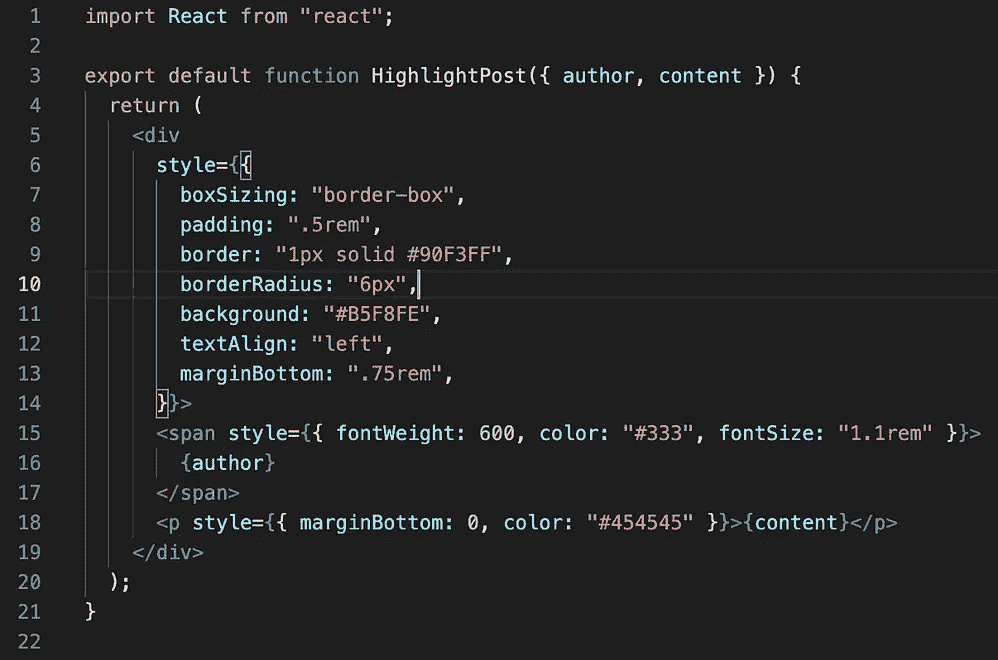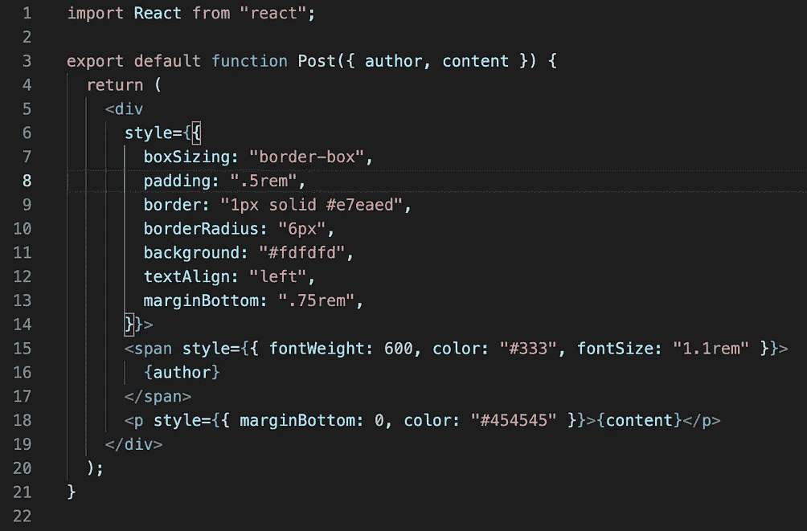

The code for **HighlightPost** & **Post,** respectively

这看起来是一个需要处理的复杂的烂摊子，正如你所看到的，确实如此。我们能做些什么来解决这个问题？

在我继续之前，样式可以有一千种不同的方式，但是为了简单和节省时间，我选择了内联样式。

因此，继续使用内联样式，解决这个问题的一个方法是永久删除高亮组件并继续。

这是目前为止的 App.js:

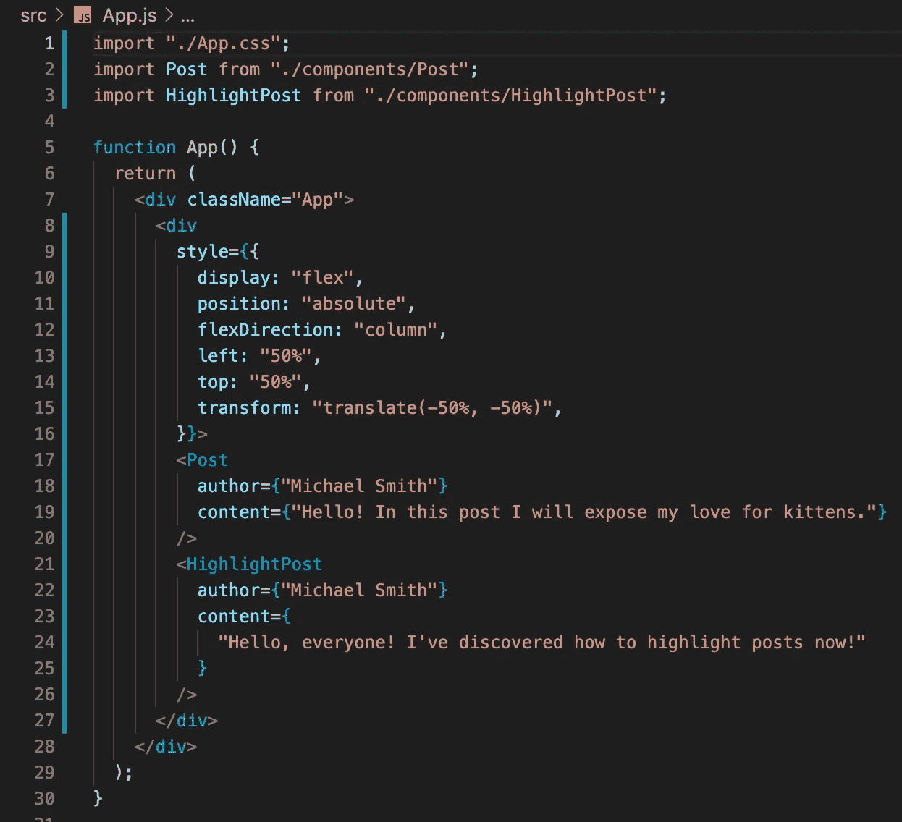

App.js

通过向 Post 组件传递一个 prop，我们现在将拥有新的 App.js posts 容器:

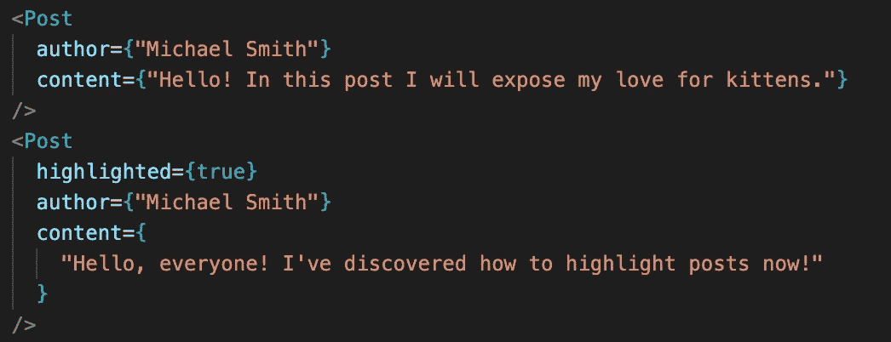

如您所见，我们不再使用 HighlightPost 组件，因为在这种情况下我们甚至不需要它，因为我们对 Post.js 组件做了以下更改，现在看起来像这样:

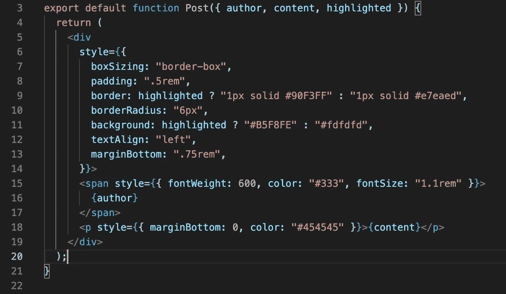

我们更改了三行代码:

*   第三个文件代码行，我们添加了一个新的道具， ***突出显示了*** ，它用于从父文件(在我们的例子中是 App.js)中了解是否应该突出显示 Post.js 组件
*   第 9 个文件代码行，我们将在三元运算符的帮助下检查我们是否将使用' ***突出显示的*** *样式*'用于手头的组件
*   第 11 行文件代码，这里我们使用了与 Post.js 文件中第 9 行代码相同的原则

你现在可以看到编写好的 React.js 代码是多么容易，这段代码现在是多么容易持续，因为如果我们想改变边框宽度或边框填充，我们不必改变两个不同文件中的代码；很快就会变得一团糟。

这是应用程序目前的状态:

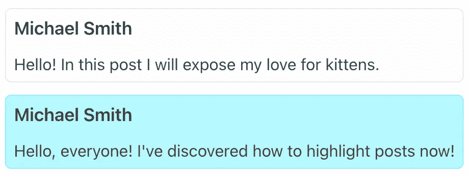

## 2.尽可能多的分成几个部分

这似乎与最后一点相矛盾，但请听我说完；

我们不必盲目地创建组件；这将破坏每一个文件夹结构，只会让一切变得更加困难；我们需要深思熟虑地将所有内容拆分成组件，我们将继续上一个示例，这样您可以更好地了解何时将组件拆分成更多组件以简化结构。

为了简化我们的代码库并在帖子方面创造更多的灵活性，我们将创建新的组件来帮助保持一切整洁。

我们将创建的两个新组件是 PostHeader.js 和 PostFooter.js，正如它们的名字所暗示的那样；文章的页眉和页脚。它们看起来会像这样:

*   PostHeader.js:

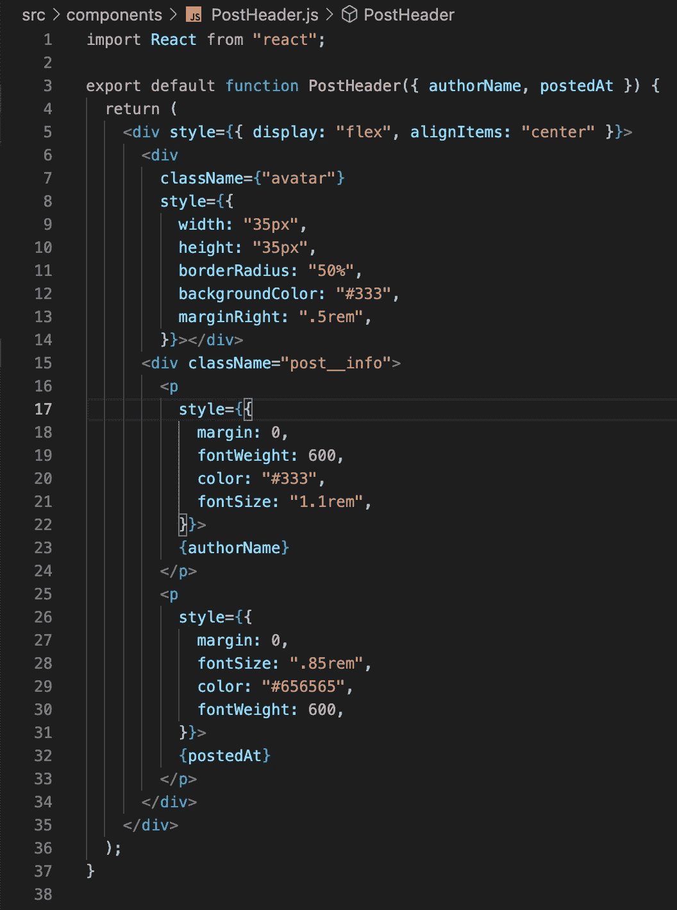

这里我们创建了一个头像占位符(类名为“avatar”的 div)，移动了带有作者姓名的 span，并添加了帖子的创建日期。

*   PostFooter.js:

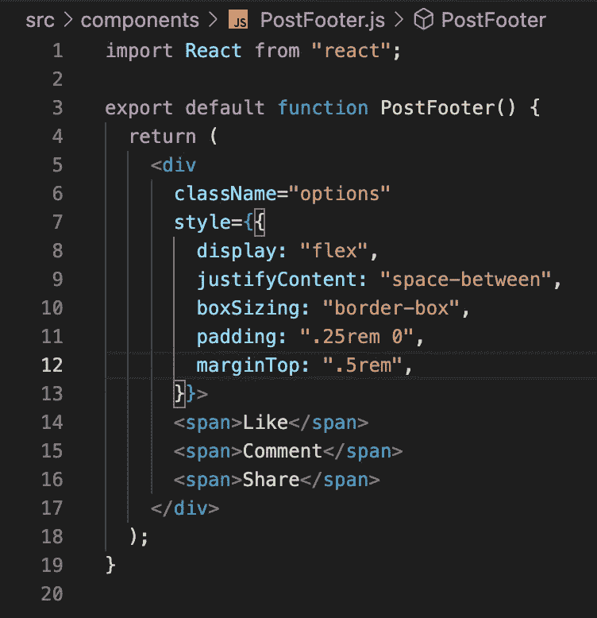

在这里，我添加了你会在社交媒体网站上的所有帖子上找到的基本按钮(比如，评论，分享)。

这将允许我们直接在孩子中改进父母的特性，而不影响我们不需要做出改变的其余组件的流程。

这就是 Post.js 现在的样子:

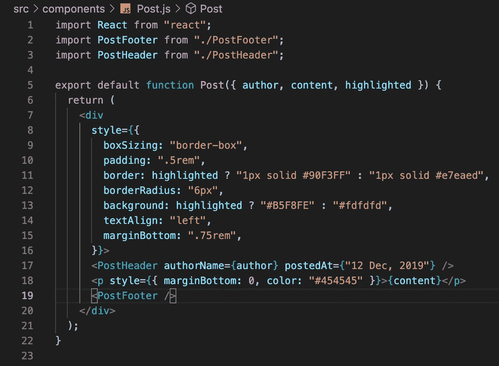

我们将保留 content p (paragraph)标签，并在其上方添加 PostHeader，在其下方添加 PostFooter 组件。

结果会是这样的:

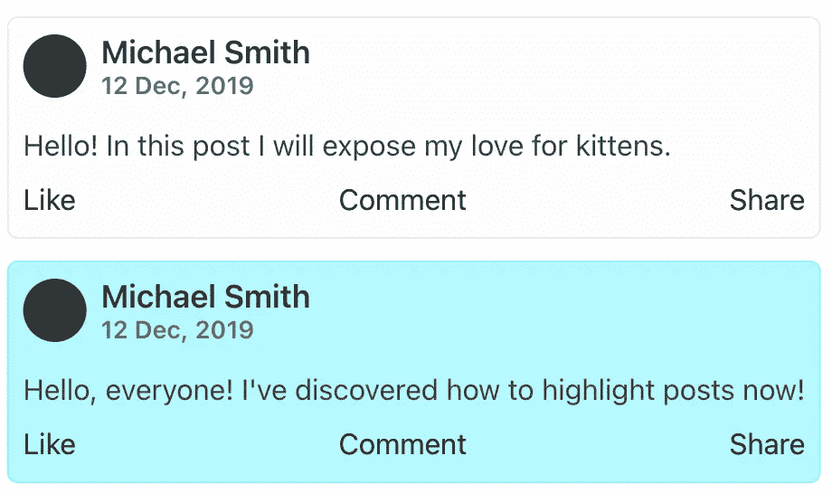

这是一个关于组件如何工作以及何时应该创建组件的基本示例。不过，你需要明白的是，所有的东西都可以转换成一个组件，以便在不破坏应用程序流程的情况下轻松地修改它，因为它不是必需的。

## 3.使用功能组件

这可能会让一些人感到不安，但我认为使用钩子更好，特别是因为脸书希望在 React 中优先考虑功能组件，而不是传统的类组件。

这样做有几个原因:

*   首先，样板代码会少得多
*   创建定制挂钩更容易
*   这样做更直观，也更容易
*   提高代码可读性，让您更容易遵循良好的代码实践
*   有了 React 的最新更新，您现在可以使用功能组件，功能与您在类组件中使用的功能相同，因为两者现在都可以维护自己的状态

## 4.使用状态管理

当处理较小的应用程序时，这是不必要的。然而，当涉及到更大、更复杂的应用程序时，您可能会更好地考虑状态管理解决方案，如 Context & Redux。

以上任何一种都可以；这主要归结于偏好，尽管对于中小型应用程序，通常最好使用 React 提供的上下文 API，否则，对于大中型应用程序，通常最好使用 Redux。这也是我的首选解决方案，但这不一定重要，因为根据手头的项目，需求和功能通常会推翻首选。

两者之间另一个更微妙的区别是，上下文只能用于管理整个应用程序树的状态。不过，另一方面，Redux 可以与 Redux-Persist 结合，将状态数据保存到本地存储/会话存储，并随时检索，所以我必须将这作为 Redux 的一个附加优势。

## 5.组织项目结构

这是一个通配符，因为你应该在任何时候组织你的文件夹结构，不管它是大是小。

我在前端坚持了一段时间的个人项目结构是:

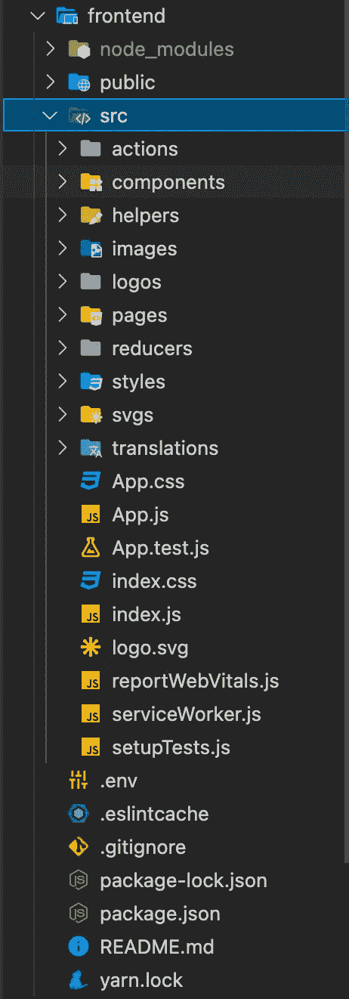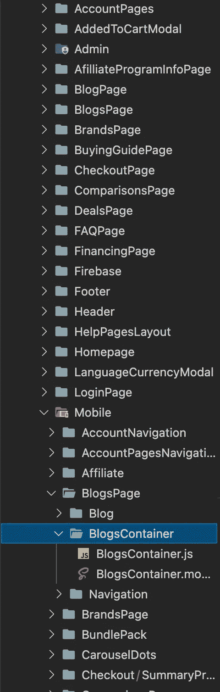

在左边，我们有前端文件夹的结构，在右边，我们有前端/src/components 文件夹的结构，其中组件根据它们使用的页面排序。你也可以看到每个组件的结构和它的文件夹，当 SCSS 也用于完美的单个组件样式和测试时。

但是无论哪种方式，构造 React 应用程序都有很多方法，所以只要使用一些核心概念和准则来确保该结构适合 React 本身，这并不重要。

# 结论

我已经列出了关于反应开发效率和时间经济的五个基本要素。我希望你喜欢它，并确保继续关注新的文章。

***更多关于开发的帖子和短小精悍的信息，请务必查看我的项目和出版物，网络开发自由职业者的社交页面:***

*   Instagram: [*网络开发自由职业| Instagram*](https://www.instagram.com/webdevfreelancing/)
*   脸书: [*网络开发自由职业者|脸书*](https://www.facebook.com/webdevfreelancing)
*   抖音: [*网络开发自由职业者|抖音*](https://www.tiktok.com/@webdevfreelancing)
*   媒体出版: [*网络开发自由职业|媒体出版*](https://medium.com/web-dev-freelancing)

## 在这里，您可以查看“开发人员类型”的第一篇文章，以了解该系列的最新情况:

[*开发者类型|网络开发者*](https://medium.com/geekculture/developer-types-the-web-developer-93fd16117544?sk=59660ea66650e26b380cca6cb31a0df9)

## 如果你想了解更多关于我从 17 岁开始工作，成为一名网站开发人员的经历，一定要看看这个故事:

[*我 17 岁成为网页开发者的路线图*](https://vlad-mihet.medium.com/my-roadmap-of-becoming-a-web-developer-at-17-e0db2597b5df)

## 以及其他我认为很有见地的文章:

*   [*什么是 RESTful API？*](https://vlad-mihet.medium.com/what-is-a-rest-ful-api-75544a49a75f)
*   [*什么是 MVC 架构？*](https://vlad-mihet.medium.com/what-is-the-mvc-architecture-22244d9ed24b)
*   [*帮助我成为网页开发者的网站*](https://vlad-mihet.medium.com/websites-that-helped-me-as-a-web-developer-6340577b36b1)
*   [*我作为前端开发人员使用的 5 个 Visual Studio 代码扩展*](https://vlad-mihet.medium.com/5-visual-studio-code-extension-ive-been-using-as-a-front-end-developer-dc07faddd2db)

*更多内容请看* [***说白了就是***](https://plainenglish.io/) *。报名参加我们的* [***免费每周简讯***](http://newsletter.plainenglish.io/) *。关注我们关于* [***推特***](https://twitter.com/inPlainEngHQ) ，[***LinkedIn***](https://www.linkedin.com/company/inplainenglish/)*，*[***YouTube***](https://www.youtube.com/channel/UCtipWUghju290NWcn8jhyAw)*[***不和***](https://discord.gg/GtDtUAvyhW) *。对增长黑客感兴趣？检查出* [***电路***](https://circuit.ooo/) *。**