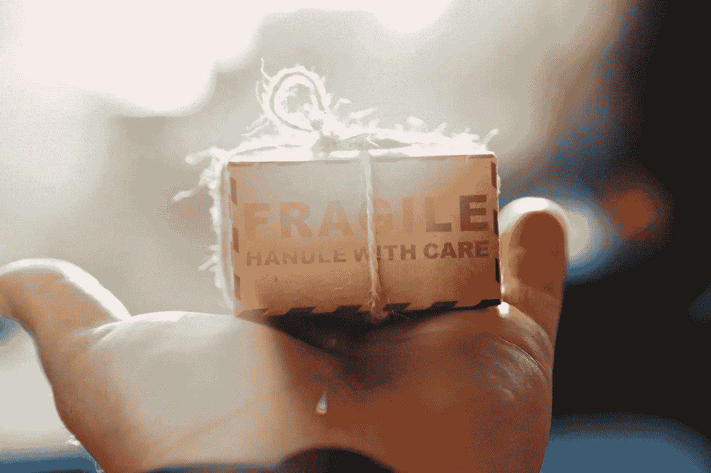

# 如何定义字符串

> 原文：<https://javascript.plainenglish.io/how-to-slugify-a-string-9254916429ea?source=collection_archive---------4----------------------->

Photo by [jesse ramirez](https://unsplash.com/@jesseramirezla?utm_source=unsplash&utm_medium=referral&utm_content=creditCopyText) on [Unsplash](https://unsplash.com/@jesseramirezla?utm_source=unsplash&utm_medium=referral&utm_content=creditCopyText)

新的一天和新的 [Dev 降临日历 2021](https://github.com/devadvent/readme) 谜题要解决。圣诞老人的小精灵们尝到了咖啡的味道，决定冒险一试:他们想跳进送餐的世界。首先，他们必须通过添加能够管理订单的 API 来修复咖啡店站点。

# 谜题:精灵咖啡店 API 🧝🥤

今天的谜题比前几个稍微难一点。但是它可以很容易地分解成两个不同的子问题。第一个是向 JavaScript 对象添加属性的简单问题。第二种方法需要使用正则表达式。在我看来，这也是最有趣的部分。但我们还是按顺序来，从头开始。

我使用 [map()](https://developer.mozilla.org/en-US/docs/Web/JavaScript/Reference/Global_Objects/Array/map) 方法遍历每个菜单项，并简单地添加缺少的属性。现在剩下的就是修复`slugify`函数。

# 如何获得文本的“简化”版本

我很困惑。是我从来没有问过自己的问题。但我认为这是经常发生的情况。我喜欢面对新问题，即使这些问题对我来说是全新的。然而，在字谜的文本中有一个提示:

 [## 在 JavaScript 中删除字符串中的重音/音调符号

### 如何从字符串中删除加重的字符？特别是在 IE6 的时候，我有过这样的事情:accentsTidy =…

stackoverflow.com](https://stackoverflow.com/questions/990904/remove-accents-diacritics-in-a-string-in-javascript) 

一个世界为我打开了，我不知道可以使用叫做 [Unicode property escapes](https://developer.mozilla.org/en-US/docs/Web/JavaScript/Guide/Regular_Expressions/Unicode_Property_Escapes) 的东西来更容易地创建正则表达式。从这里开始，我一步一步地遵循这些要求。

为了使每个字符小写，我显然使用了[string . prototype . tolowercase()](https://developer.mozilla.org/en-US/docs/Web/JavaScript/Reference/Global_Objects/String/toLowerCase)方法:`text.toLowerCase()`。

为了替换所有奇怪的字母(包括重音字母)，我使用了这个代码:`text.normalize("NFD").replace(/\p{Diacritic}/gu, "")`。然而，这并没有解决菜单中表情符号的问题。精灵喜欢表情符号。一个解决方案可能是使用类似于`replace(/\p{Emoji}/gu, "-"`的东西。它可以工作，但是对于下一个请求来说是多余的。

事实上，要替换所有字母数字字符(包括表情符号)，我可以使用 regex `.replace(/[^a-zA-Z0-9_\s-]/gu, " ")`。我用空格代替一切，而不是直接用破折号(`-`)。为什么？因为这样我可以直接使用`trim()`来消除字符串开头和结尾的空格。

下一步是用破折号替换所有空格。我可以使用`.replace(/\s+/gu, "-")`将每个空格序列转换成一个破折号。

我把它们放在一起，得到了`slugify`函数:

好了，今天就到这里。我很想发现明天的谜题。

感谢阅读！敬请关注更多内容。

***不要错过我的下一篇文章—报名参加我的*** [***中邮箱列表***](https://medium.com/subscribe/@el3um4s)

 [## 通过我的推荐链接加入 Medium—Samuele

### 阅读萨缪尔的每一个故事(以及媒体上成千上万的其他作家)。不是中等会员？在这里加入一块…

el3um4s.medium.com](https://el3um4s.medium.com/membership) 

*原载于 2021 年 12 月 4 日*[*https://blog.stranianelli.com*](https://blog.stranianelli.com/how-to-slugify-a-string/)*。*

*更多内容看* [***说白了就是***](http://plainenglish.io/) ***。*** *报名参加我们的* [***免费每周简讯这里***](http://newsletter.plainenglish.io/) ***。***