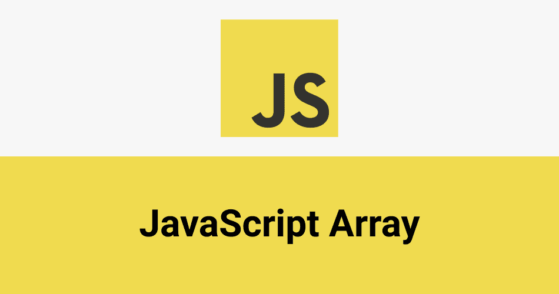

# JavaScript 算法问题:如何从数组中移除元素

> 原文：<https://javascript.plainenglish.io/how-to-solve-removing-element-from-an-array-question-by-reusing-old-code-a354e6bc4c4f?source=collection_archive---------27----------------------->



# 从数组中移除元素

本周我将展示另一个 [LeetCode](https://leetcode.com/) 问题。我发现如何通过重用你已经拥有的代码来解决问题很有趣。上周我写了关于[从排序后的数组中移除重复项](/remove-duplicates-from-sorted-array-leetcode-challenge-ae9e676e70db?source=friends_link&sk=5eba03cbdf4d03450ee9a0ea496158d2)，我将重用我上周写的部分代码来解决这个挑战。

# 问题

*给定一个数组 nums 和一个值 val，就地删除该值*[](https://en.wikipedia.org/wiki/In-place_algorithm)**的所有实例，并返回新的长度。不要为另一个数组分配额外的空间，你必须通过用 O(1)额外的内存修改输入数组*[](https://en.wikipedia.org/wiki/In-place_algorithm)**来做到这一点。元素的顺序可以改变。超出新长度的内容无关紧要。”***

## ****例 1****

****输入:** nums = [3，2，2，3]，val = 3**

****输出:** 2，nums = [2，2]**

****解释:**你的函数应该返回 length = **2** ，其中 *nums* 的前两个元素是 **2** 。**

**超出返回长度的内容无关紧要。例如，如果您返回 2，nums = [2，2，3，3]或 nums = [2，2，0，0]，您的答案将被接受。**

## **类似**

**在上一篇文章中，我必须从排序后的数组中移除重复值并返回其长度，而在本任务中，我只需要从数组中移除给定值并返回其长度。**

**该算法有两个相同的步骤:**

1.  **从数组中删除元素**
2.  **返回数组的长度**

**这很好，因为我们可以重用之前挑战中的代码。**

## **我们来分解一下**

**我们将在这种情况下使用递归，在[中从排序数组](/remove-duplicates-from-sorted-array-leetcode-challenge-ae9e676e70db?source=friends_link&sk=5eba03cbdf4d03450ee9a0ea496158d2)中移除重复项也是如此，因为我在上面解释了我们如何在这里重用一些代码。**

**我创建了一个 remove 函数，它将从数组(nums)中删除所有与提供的值(val)匹配的元素。Remove 函数将接受三个参数:**

1.  **current —当前元素的索引，我们将从 0 开始；**
2.  **nums —给定数组**
3.  **val —给定值**

**第一个条件语句检查当前(索引)是否在数组内**

```
**if (current <= nums.length — 1) {*check the value*}**
```

**一旦我们知道 index 指向一个元素，我们需要检查这个元素是否等于 value (val ),或者是否不等于。**

****选项 a:** 元素不等于 val——我们不需要对数组做任何事情，因此我们可以增加索引并使用 current + 1 执行 **remove** 函数，而 nums 和 val 保持不变**

```
**remove(current + 1, nums, val);**
```

****选项 b:** 元素等于 val——我们将重用代码从数组中删除一个元素，然后再次执行**remove**函数，但是它已经有了一个更新的 nums 数组。**

```
**nums.splice(current, 1);remove(current, nums, val)**
```

**一旦数组的每个元素都通过 if 语句两边的**remove**函数，我们将得到没有任何 val 值的 nums 数组。现在我们可以返回数组长度。**

```
**return nums.length;**
```

**这是一个重用代码解决类似问题的简单例子。实践越多，看到的代码示例越多，解决编码问题和一般代码就越容易。实践无荣耀，不实践无荣耀。**

***请在以下社交网络上查看我，我希望收到您的来信！——*[*LinkedIn*](https://www.linkedin.com/in/nick-solonyy/)*，* [*GitHub*](https://github.com/nicksolony) ， [*脸书*](https://www.facebook.com/nick.solony) *。***

***更多内容请看*[***plain English . io***](https://plainenglish.io/)**