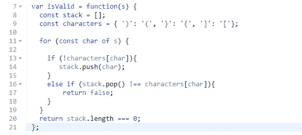

# 如何解决 JavaScript 中的有效括号挑战

> 原文：<https://javascript.plainenglish.io/how-to-solve-valid-parentheses-in-javascript-18c1316aa7a8?source=collection_archive---------5----------------------->


## **简介**

大家好，在这篇博客中，我将教大家如何用 JavaScript 解决一个常见的面试问题，叫做“有效括号”。虽然这个问题被认为很容易，但我发现第一次遇到它时要获得最优解是相当棘手的。所以让我们开始吧！

**注意:**完整编码的答案在底部。

## **问题和我们的方法**

如果你想继续编码，这里有一个链接指向这个问题的 Leetcode 版本。这个问题基本上要求我们查看一个字符串，并确定它是否有有效的括号。这意味着每个圆括号、中括号或大括号都有一个匹配对。例如，字符串“()”是有效的对，而字符串“([)]”不是有效的对。

您可能认为最好的方法是使用散列表，但是解决这个问题的最好方法实际上是使用堆栈。我们要做的是处理字符串中的每个字符，当我们找到一个左括号时，我们会把它推到堆栈上。然后，当我们看到一个闭括号时，我们检查它是否和栈中的括号类型相同，如果是，我们就把它从栈中弹出。如果这有点令人困惑，希望浏览一下代码会有助于使它变得更加清晰。

## **解决方案**

我们要做的第一件事是初始化一个 hashmap，它包含我们要验证的所有类型的圆括号、方括号和大括号，如下所示:


正如我们之前所说的，我们需要处理字符串中的每个字符。我们将使用标准的 for 循环遍历整个字符串。然后我们将检查这个字符是否是一个开括号，确保它不是 hashmap 中的一个键。之后，我们知道它是一个开括号，所以我们现在可以把它放入堆栈。如果它是一个闭括号，我们可以从堆栈中取出开括号，看看它是否属于同一类型。如果不是，我们返回 false，否则我们遍历字符串的其余部分。


我们需要做的最后一件事是检查堆栈中是否有开括号，我们可以通过确保堆栈的长度为 0 来做到这一点。如果是 0，我们返回 true，如果不是，我们返回 false，如下所示:



**代码:**

```
var isValid = function(s) {
  const stack = [];
  const characters = { ')': '(', '}': '{', ']': '['};for (const char of s) {

    if (!characters[char]){
       stack.push(char); 
    } 
    else if (stack.pop() !== characters[char]){
        return false;
    } 
  }
  return stack.length === 0;
};
```

## **结论**

现在你知道如何解决有效括号的问题了！代码可能看起来很简单，但是方法有点复杂，所以我建议你自己做这个问题，并讨论每个步骤以及为什么要实现它。感谢您的阅读，祝您面试顺利！

**来源:**

[https://leetcode.com/problems/valid-parentheses/](https://leetcode.com/problems/valid-parentheses/)