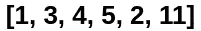
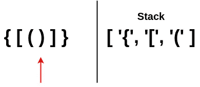

# 如何解决 JavaScript 中的有效括号

> 原文：<https://javascript.plainenglish.io/how-to-solve-valid-parentheses-in-javascript-a1ffc8477685?source=collection_archive---------0----------------------->

## 在这篇简单易懂的文章中，你可以解决流行的面试问题，提高你对堆栈的理解。

[有效括号](https://leetcode.com/problems/valid-parentheses/)是软件开发人员常见的面试问题。

这个问题通常用作候选过滤器，因为它提供了对开发人员的算法和数据结构知识的清晰评估。

如果受访者实施了暴力、幼稚的解决方案，面试官可能会认为他们缺乏工作所需的数据结构知识，因为有一个优雅、易于理解的解决方案使用了**堆栈**数据结构。

本文将对栈进行快速概述，然后深入研究手头的实际问题。

# 栈上的最低限度

堆栈**是一种线性数据结构，遵循一组规定的操作。在开始研究它在代码中的样子之前，让我们想象一下现实生活中的一堆书。**

这幅画里有一摞书。如果有人要拿走其中一本书，哪一本最容易拿走？

任何不是专业叠人偶玩家的读者都会说**顶级书籍**。要删除那本书，根本不需要删除任何其他书。我们可以将该操作的成本想象为 **1，**，因为我们只移动了 1 本书。

最下面那本书怎么样？需要搬多少本书才能到那本书？答案是 **7** ，因为我们需要从另一本书的顶部挑选一本书，直到我们到达最底部的书。

我们可以通过**总是**将我们下一个**想要的书**直接放在书库**顶部**来提高书库的效率。这样，运营成本总是 1，因为我们需要的书就在最上面。

编程中的堆栈通过实现**后进先出(LIFO)** 策略来使用这个概念，这意味着最后推入堆栈的元素是第一个从堆栈中弹出的元素。

为了说明后进先出策略，以下面的数组为例:

推入数组的最后一个元素是`2`。让我们将`11`推到数组上。

现在，最后一个元素是`11`。当我们从数组中弹出时，我们移除最后一个元素`11`，使`2`再次成为堆栈中的最后一个元素。

这是栈的两个操作:`push`和`pop`。其他操作与本文无关。

使用堆栈的好处在于所有的操作现在都是 O(1) 时间，因为我们只在堆栈的末尾操作。如果我们要从数组中间移除一个元素，我们需要将该元素后面的元素的所有索引下移。有了栈，我们再也不需要担心那个耗时的操作了。

# 回到有效括号

让我们来分解这个问题:

> 给定一个仅包含字符`'('`、`')'`、`'{'`、`'['`和`']'`的字符串`s`，确定输入的字符串是否有效。

从问题描述中我们可以看出，问题的名称有点用词不当。我们正在检查有效的括号、有效的大括号和有效的方括号。

这个问题的核心是确保在**正确的顺序**中，任何开始符号后面都有正确的结束符号。

例如，`[]`是有效的，因为`[`后面直接有结束的`]`。

例子`[[]`怎么样？这是无效的，因为第一个`[`在字符串末尾没有结束`]`。

让我们尝试一个更复杂的例子:

这个是有效的。每个开始符号在正确的位置都有相应的结束符号。这里需要注意的是，结束符号出现的顺序也决定了字符串的有效性。

下一个示例说明了所有结束符号都存在但顺序错误的情况:

在这两个相似但不同的例子之间，出现了一种模式。注意，第一个元素`{`的结束元素是序列中最后一个元素**？第二个元素`[`的结束元素位于倒数第二个索引处。最后，第三个元素`(`的结束元素紧随其后。**

似乎开启元件的顺序决定了关闭元件应该放置在的位置**。我们一会儿将回到这一点。**

# 制定计划

既然我们已经分解了这个问题并注意到了一个模式，让我们开始制定一个计划来解决这个问题。

接下来，我们将使用以下示例作为模板:

让我们一次一个元素地浏览这个例子，并自己解决它。由于输入是以字符串的形式出现的，让我们假设我们用指针循环访问它，或者把它转换成一个数组。

第一个元素是`{`。这是一个开放符号，所以我们还不能确定它是否有效。

第二个元素是`[`。往前走。

第三个元素是`(`，所以继续下去，直到我们碰到一个结束符号。

终于！第四个元素`)`是关闭元素。让我们看看它是否在正确的地方。我们仅仅通过观察字符串就知道它在正确的位置，因为它正在关闭它前面的`(`。

我们如何存储开始符号的序列，以便实际上以编程方式进行检查呢？

既然我们已经讨论了使用堆栈，那么让我们在这里尝试一下。记住，是后进先出。让我们试试下面的策略:如果当前元素是一个开始符号，让我们把它推到堆栈上。如果是结束符号，让我们从堆栈中弹出最后一个元素，看看它是否是与当前结束符号匹配的**开始符号。**

我们从一个空栈开始，`[]`:

第一个元素是`{`。这是一个开口，所以把它推到堆栈上。移动到下一个元素。

我们目前的元素仍然是一个开放，所以推动它，继续前进。

这是最后一个开始符号。按下它，让我们来看看结束符号。

现在我们终于碰到了结束符号`)`。让我们弹出堆栈的最后一个元素，看看它是否是`)`关闭的正确符号。

确实是！移动到下一个元素。

弹出堆栈的最后一个元素，并检查它是否是关闭`]`的正确符号。是的，所以我们继续。

最后一个要素是正确的符号对。当我们完成对符号集合的迭代后，如果堆栈为空，我们就可以确定字符串是有效的。如果堆栈中还有剩余的符号，这意味着字符串是无效的，因为有些符号没有关闭。

既然我们对如何处理这个问题有了一个高层次的理解，让我们实际上写一些代码。

# 编写代码

首先，创建函数`isValid`并在其中初始化一个堆栈。

在我们开始迭代输入`s`之前，让我们考虑一下如何检查从堆栈中弹出的元素是否是当前结束符号的正确开始符号。在我们对这个问题的高层次回顾中，我们从未讨论过我们将如何实际实现它。

我们可以检查的一种方法是将正确的**开始和结束**符号对存储在**散列表**中。这样，我们可以检查堆栈中弹出的元素，即**键**，是否与该键的值匹配，该值将是该对的**结束符号**。如果这不完全合理，请查看下一个代码片段。

我们将检查弹出元素的值，例如可能是`closings['(']`，并查看`s`中的当前元素是否与来自`closings`的值相匹配。

接下来，让我们设置`s`的迭代。为了最大化时间效率，我们将在这里使用一个`for`循环，这样我们可以在`s`无效的情况下尽早`return`。

在循环中，首先检查当前元素是否是任何开始符号。如果是，将它推到堆栈上，并转到下一个元素。如果不是开始符号，我们需要从堆栈中弹出一个元素，并检查当前元素是否是弹出元素的正确结束符号。

当我们结束循环时，我们需要检查堆栈中是否还有剩余的元素。如果是，字符串无效，并且`isValid`返回`false`。如果堆栈是空的，字符串是有效的，我们将返回`true`。

就这样，我们都完了。

希望这篇文章帮助你理解了这个问题，多叠加一点。编码快乐！