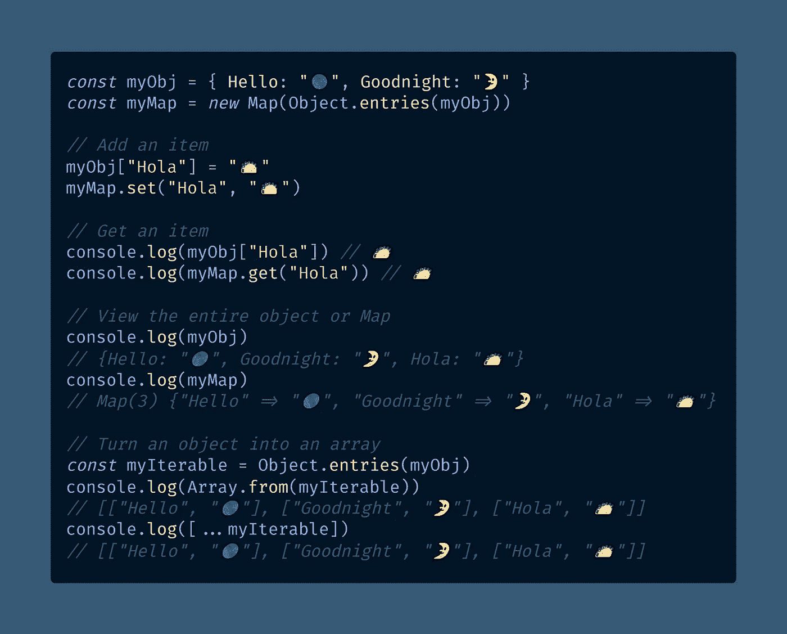
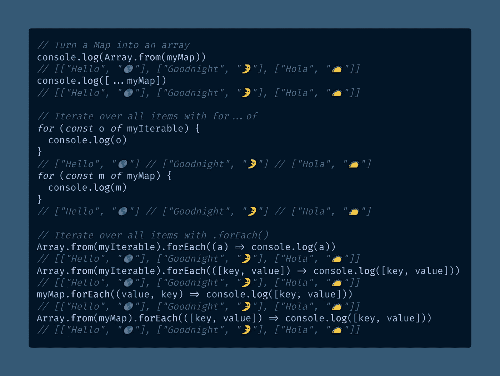

# 如何在 JavaScript ES6 中对地图进行排序

> 原文：<https://javascript.plainenglish.io/how-to-sort-a-map-in-javascript-es6-59751f06f692?source=collection_archive---------2----------------------->

## ES6 `Map`类型类似于常规的 JavaScript 对象，有一个重要的区别——它有插入顺序，就像数组一样。下面是如何对一个`Map`对象进行排序。

Photo by [Nick Seagrave](https://unsplash.com/@seagrave?utm_source=medium&utm_medium=referral) on [Unsplash](https://unsplash.com?utm_source=medium&utm_medium=referral)

无论你是否已经为下一次技术面试记住了一堆排序算法，你都将最终用 JavaScript 对数据进行排序。

排序是不可避免的，每个 JavaScript 开发人员最终都会了解到[数组](/how-to-check-for-an-array-in-javascript-6ad20f7a0e21) `.sort()`方法(`[Array.prototype.sort()](https://developer.mozilla.org/en-US/docs/Web/JavaScript/Reference/Global_Objects/Array/sort)`)。

一旦你知道了如何对数组进行数字排序(T12)——这在 JavaScript 中一点也不明显——就很容易觉得你理解了排序。

然而，你可能已经被这样一个事实[阻碍了](https://www.urbandictionary.com/define.php?term=stymied)，即虽然你可以`.sort()`一个数组，但是你不能排序一个普通的 JavaScript 对象。

事实上，JavaScript 对象根本没有固定的顺序(尽管根据 StackOverflow 的说法，这在 ES2020 规范[中有所改变)。](https://stackoverflow.com/questions/30076219/does-es6-introduce-a-well-defined-order-of-enumeration-for-object-properties)

如果你需要对一个对象进行排序，比如按照[对象属性键](/can-javascript-object-keys-have-spaces-ed389758e5c3)的字母顺序，那么你最好使用`[Map](https://developer.mozilla.org/en-US/docs/Web/JavaScript/Reference/Global_Objects/Map)`对象。

2015 年，我们引入了带有 [ES6](https://exploringjs.com/es6/) 的“现代 JavaScript”，它试图通过引入`Map`和`[Set](https://medium.com/coding-at-dawn/how-to-use-set-to-filter-unique-items-in-javascript-es6-196c55ce924b)`来“修复”对象。

如果您从未听说过`Map`，我在以前的一篇文章中介绍过它们，在那里我深入解释了 JavaScript 对象缺乏排序:

 [## JavaScript 对象键是有序的和可迭代的吗？

### JavaScript 对象属性有内在的顺序吗？你能迭代一个 JavaScript 对象吗？

javascript.plainenglish.io](/are-javascript-object-keys-ordered-and-iterable-5147eedb26ce) 

正如我在那篇文章中解释的，我们可以将 JavaScript 对象的工作方式归咎于 Internet Explorer。谢天谢地，`Map`是一个很好的选择。

一个`Map`类似于[一个常规的 JavaScript 对象](https://developer.mozilla.org/en-US/docs/Web/JavaScript/Reference/Global_Objects)，除了它有一个固定的顺序——这意味着你可以像数组一样迭代它。

但是在你使用`.forEach()` ( `[Map.prototype.forEach()](https://developer.mozilla.org/en-US/docs/Web/JavaScript/Reference/Global_Objects/Map/forEach)`)、一个`[for...of](https://developer.mozilla.org/en-US/docs/Web/JavaScript/Reference/Statements/for...of)`循环或者全局`[Array.from()](https://levelup.gitconnected.com/how-to-copy-an-array-in-javascript-with-array-from-298c7e66eebc)`函数之前，你需要`.sort()`。

不幸的是，ES6 `Map`对象没有内置的`.sort()`函数。在本文中，我将向您展示您需要做些什么。

# 将`Map`与 JavaScript 数组和对象进行比较

当我们使用一个`Map`对象时，我们有一个类似于常规对象的数据结构，除了三个重要的区别。

第一点，也可能是最明显的一点，就是您必须使用不同的方法来修改一个`Map`——具体来说就是用`.get()` ( `[Map.prototype.get()](https://developer.mozilla.org/en-US/docs/Web/JavaScript/Reference/Global_Objects/Map/get)`)来检索一个值，用`.set()` ( `[Map.prototype.set()](https://developer.mozilla.org/en-US/docs/Web/JavaScript/Reference/Global_Objects/Map/set)`)来设置一个值。

其次，`Map`对象跟踪它的“插入顺序”，即你向它们添加项目的顺序，就像数组一样。行为类似于`[Object.keys()](https://developer.mozilla.org/en-US/docs/Web/JavaScript/Reference/Global_Objects/Object/keys)`、`[Object.values()](https://developer.mozilla.org/en-US/docs/Web/JavaScript/Reference/Global_Objects/Object/values)`和`[Object.entries()](https://developer.mozilla.org/en-US/docs/Web/JavaScript/Reference/Global_Objects/Object/entries)`——除了对象不能保证保持它们的插入顺序，而`Map`总是这样。

> "`Map`中的键以简单直接的方式排序:一个`Map`对象按照条目插入的顺序迭代条目、键和值。"— [MDN 文档](https://developer.mozilla.org/en-US/docs/Web/JavaScript/Reference/Global_Objects/Map)

`Map`和常规对象的第三个区别是对`Map`排序最有用。由于其插入顺序，`Map`对象是[可迭代的](https://developer.mozilla.org/en-US/docs/Web/JavaScript/Reference/Iteration_protocols)，就像数组一样。因为可以迭代一个`Map`，所以可以对它进行排序。

这也意味着你可以使用`[...](https://medium.com/coding-at-dawn/how-to-use-the-spread-operator-in-javascript-b9e4a8b06fab)`[扩展操作符](https://medium.com/coding-at-dawn/how-to-use-the-spread-operator-in-javascript-b9e4a8b06fab)和`Map`把它变成一个数组，就像你在制作[一个数组](/how-to-deep-copy-objects-and-arrays-in-javascript-7c911359b089)的浅层副本时可能做的那样。

下面是一个说明这些差异的代码示例。

[View the raw code](https://gist.github.com/DoctorDerek/eaac1cd8161a0ad893c1a1dfdfeaa1fa) as a GitHub Gist

在代码示例的下一部分，我将把`Map`转换成一个数组，并演示迭代`Map`的方法。

[View the raw code](https://gist.github.com/DoctorDerek/eaac1cd8161a0ad893c1a1dfdfeaa1fa) as a GitHub Gist

我应该解释一下上面代码的一些特点:

*   你可以从一个普通的对象生成一个`Map`，只要你调用全局`Object.entries()`帮助函数将`Map`转换成一个 iterable。对于空地图，您只需调用`new Map()`然后调用`.set()`值。
*   不先调用`Object.entries()`就不能用`for...of`迭代一个对象。在 ES5 中，你可以使用`[for...in](https://developer.mozilla.org/en-US/docs/Web/JavaScript/Reference/Statements/for...in)`和`[.hasOwnProperty()](https://developer.mozilla.org/en-US/docs/Web/JavaScript/Reference/Global_Objects/Object/hasOwnProperty)`，但是我建议你尽可能编写[简单代码](https://betterprogramming.pub/why-you-should-make-your-code-as-simple-as-possible-3b35e89f137)。
*   用于数组的`.forEach()`和用于`Map`的`.forEach()`之间存在语法差异。你可以使用 [ES6 析构](/destructure-react-props-with-es6-object-destructuring-for-cleaner-code-3984453e484d)来拆分带有数组的键和值，但是`Map`的`.forEach()`的参数是`[(value, key, index)](https://developer.mozilla.org/en-US/docs/Web/JavaScript/Reference/Global_Objects/Map/forEach)`。

最后，我本想使用[来替代 JavaScript 的](https://levelup.gitconnected.com/5-ways-to-log-an-object-to-the-console-in-javascript-7b995c56af5a) `[console.log()](https://levelup.gitconnected.com/5-ways-to-log-an-object-to-the-console-in-javascript-7b995c56af5a)`，上面称之为`[console.table()](https://developer.mozilla.org/en-US/docs/Web/API/console/table)`，但是它只适用于常规对象——而不是`Map`对象——所以我把它从代码示例中完全删除了。

让我们继续讨论如何对一个`Map`进行排序。

# 如何在 JavaScript ES6 中通过对象键对`Map`进行排序

在最后一个代码示例之后，您可能会猜测如何通过将`Map`转换为数组来对`Map`进行排序:

1.  将`Map`转换成一个数组
2.  使用数组的`.sort()`功能
3.  将数组转换回一个`Map`

事实上，这是在 JavaScript 中对`Map`进行排序的最简单的方法。诀窍在于，如果不使用[回调函数](https://developer.mozilla.org/en-US/docs/Glossary/Callback_function)，那么`.sort()`将无法正常工作，就像你在[对数组进行数字排序](https://medium.com/coding-at-dawn/how-to-sort-an-array-numerically-in-javascript-2b22710e3958)时需要使用的函数一样。

下面是一个代码示例，使用一个数组作为[中介](https://www.urbandictionary.com/define.php?term=middleman)，通过[对象键](/can-javascript-object-keys-have-spaces-ed389758e5c3)(也称为对象属性名)对`Map`进行排序:

[View the raw code](https://gist.github.com/DoctorDerek/b188a1c606c8bc9b36b281eecb0779c1) as a GitHub Gist

我用`.localeCompare()` ( `[String.prototype.localeCompare()](https://developer.mozilla.org/en-US/docs/Web/JavaScript/Reference/Global_Objects/String/localeCompare)`)比较了上面代码中回调函数内部的[字符串](/how-to-check-for-a-string-in-javascript-a16b196915ff#cd00)。

通过将`key1.localeCompare(key2)`替换为`value1.localeCompare(value2)`，按属性值而不是键排序将会很容易。

您还可以使用任何带有数组`.sort()`方法的任意回调函数，只要它为“小于”返回负数，为“大于”返回正数，为[等于](https://betterprogramming.pub/making-sense-of-vs-in-javascript-f9dbbc6352e3)返回[零](https://medium.com/coding-at-dawn/is-negative-zero-0-a-number-in-javascript-c62739f80114)。

# 结论:在 JavaScript 中对 ES6 `Map`进行排序

我发现虽然`Map`比标准内置对象有一些优势，但是由于`.get()`和`.set()`的缘故，它远没有那么方便。

然而，当你在处理一个需要保持一定顺序的对象时，一个`Map`是你工具箱中一个极好的补充。

尽管有些古怪，但是仅仅使用一个`Map`比试图通过自己缝合两个数组来创建一个定制的[关联数组](https://en.wikipedia.org/wiki/Associative_array)要容易得多。

但是，如果在创建对象后不能对其进行排序，那么有序对象就没有多大用处。

对一个`Map`进行排序一点也不明显——首先必须将`Map`转换成一个数组，对数组进行排序，然后再将其转换回`Map`。

但是，一旦你做了一次，你就会永远记得如何给地图排序。这就像骑自行车，除了中间有一个[电池阵列](https://www.raleigh.co.uk/gb/en/array/)。

**快乐编码！**🚲🚵‍♂️🛬🎯🏹💘

# 延伸阅读:现代 JS 代码的 ES6 特性

*   ES6 在 2015 年引入了许多伟大的功能，其中许多功能的工作方式与传统的 JavaScript (ES5)截然不同。

 [## ES6: Object.is() vs. ===在 JavaScript 中

### ES6 (ECMAScript 2015)增加了一个名为 Object.is()的辅助函数，与===运算符略有不同。

medium.com](https://medium.com/coding-at-dawn/es6-object-is-vs-in-javascript-7ce873064719)  [## 用 ES6 对象进行析构来获得更清晰的代码

### 当您在 React 中为组件编写渲染函数时，它会接受一个包含属性的 props 对象…

javascript.plainenglish.io](/destructure-react-props-with-es6-object-destructuring-for-cleaner-code-3984453e484d)  [## 带有 flat() & flatMap()的两个 JS 数组的排序列表

### 现代 JavaScript (ES2015)的一个特性是 flat()，用来展平 JavaScript 中的数组。我们来谈谈…

medium.com](https://medium.com/derek-develops/rank-ordered-lists-of-two-js-arrays-with-flat-flatmap-32e0aff6c40f)  [## 如何在 JavaScript 中使用扩展运算符(…)

### spread 操作符是一种有用而快速的语法，用于向数组中添加项、组合数组或对象以及展开…

medium.com](https://medium.com/coding-at-dawn/how-to-use-the-spread-operator-in-javascript-b9e4a8b06fab)  [## JavaScript 中反斜线文字(``)的 3 个优点

### 这些“奇特的字符串”插入变量，避免需要转义引号字符，并允许多行字符串…

thebittheories.com](https://thebittheories.com/the-3-advantages-of-backtick-literals-in-javascript-f6beade4a9cf) 

# 延伸阅读:在 JavaScript ES6 中使用`Set`

*   你知道`Map`对象有“更好的另一半”吗？ES6 还引入了`Set`对象，这是一种有用的对象类型，我比`Map`用得更多。

 [## 如何使用 Set 来过滤 JavaScript ES6 中的唯一项

### JavaScript 中需要唯一值？这就是 Set 对象出现的原因。以下是如何使用 Set 来过滤一个列表…

medium.com](https://medium.com/coding-at-dawn/how-to-use-set-to-filter-unique-items-in-javascript-es6-196c55ce924b)  [## 使用 Set (ES6)从 JavaScript 数组中获取唯一值

### 当数组中有重复值时，可以通过调用…

levelup.gitconnected.com](https://levelup.gitconnected.com/get-unique-values-from-a-javascript-array-using-set-es6-32b0bc8f1870)  [## 如何使用 JavaScript 在数组中找到唯一的字符串

### 对于 web 开发人员来说，从 JavaScript 数组中找到唯一的字符串是一项常见的任务——下面是如何做到这一点的。

medium.com](https://medium.com/coding-in-simple-english/how-to-find-unique-strings-in-an-array-using-javascript-e698b7957736)  [## 如何在 JavaScript 中查找数组中的唯一日期

### JavaScript 有三种方法来定义日期对象是否惟一:它是否有惟一的对象引用…

medium.datadriveninvestor.com](https://medium.datadriveninvestor.com/how-to-find-unique-dates-in-an-array-in-javascript-efd87ecfea66)  [## 如何在 JavaScript 中通过对象引用或键值对找到数组中唯一的对象

### 我将使用 Set 通过对象引用从数组中移除重复的对象。那我就通过看…来找对象

better 编程. pub](https://betterprogramming.pub/how-to-find-unique-objects-in-an-array-in-javascript-by-object-reference-or-key-value-pairs-131338898d7a) 

# 延伸阅读:在 JavaScript 中使用数组

*   数组是计算机科学中的一个基本数据结构，尽管你最好知道下一次面试[的正确术语(](/10-ways-to-be-a-more-attractive-candidate-for-a-web-developer-job-9ba599fbe937)[栈](https://simple.wikipedia.org/wiki/Stack_(data_structure)))。

 [## 如何使用钩子在反应状态下添加到数组中

### 的。push()函数将不起作用，但是。当状态是一个数组时，concat()函数可以更新 React 状态——就像…

javascript.plainenglish.io](/how-to-add-to-an-array-in-react-state-3d08ddb2e1dc)  [## 如何在 JavaScript 中将数组转换成带逗号的字符串

### 您可以使用数组原型上的内置函数将一个数组连接成一个由逗号分隔的字符串…

medium.com](https://medium.com/coding-at-dawn/how-to-convert-an-array-to-a-string-with-commas-in-javascript-79e212506c2)  [## 如何在 JavaScript 中对数组进行数字排序

### 默认的 ECMAScript 排序是按字母顺序的，所以需要一点小技巧来按数字顺序对数组进行排序。

medium.com](https://medium.com/coding-at-dawn/how-to-sort-an-array-numerically-in-javascript-2b22710e3958)  [## 如何在 JavaScript 中将两个数组连接在一起

### 需要把两个数组合并成一个数组？这是你如何用 JavaScript 将数组连接在一起，这是众所周知的…

levelup.gitconnected.com](https://levelup.gitconnected.com/how-to-join-two-arrays-together-in-javascript-fb0707d20d12) 

Photo by [Daniel Gonzalez](https://unsplash.com/@overlyawesome?utm_source=medium&utm_medium=referral) on [Unsplash](https://unsplash.com?utm_source=medium&utm_medium=referral)

[Derek Austin](https://www.linkedin.com/in/derek-austin/)博士是《职业编程:如何在 6 个月内成为一名成功的 6 位数程序员 》一书的作者，该书现已在亚马逊上架。