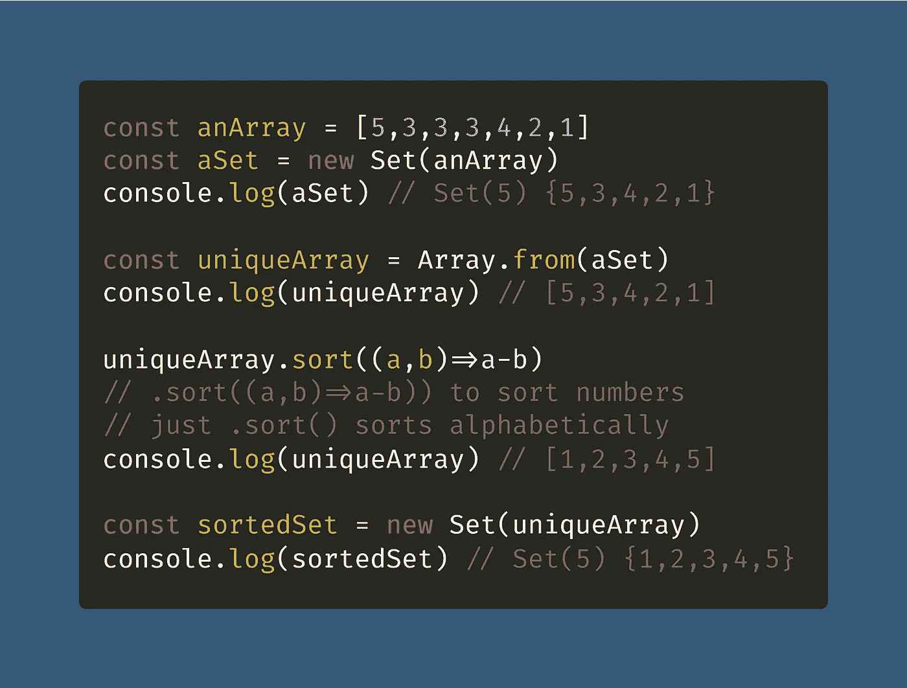

# 如何在 JavaScript ES6 中对集合进行排序

> 原文：<https://javascript.plainenglish.io/how-to-sort-a-set-in-javascript-es6-51b53f6ef71a?source=collection_archive---------11----------------------->

## 需要排序一套？我已经向您介绍了这个关于在 JavaScript 中对一组独特的项目进行排序的方便快捷的教程。

Photo by [nour tayeh](https://unsplash.com/@nourtayeh?utm_source=medium&utm_medium=referral) on [Unsplash](https://unsplash.com?utm_source=medium&utm_medium=referral)

如果你曾经需要[在 JavaScript](https://levelup.gitconnected.com/how-to-find-unique-values-by-property-in-an-array-of-objects-in-javascript-50ca23db8ccc) 中寻找唯一值，那么你可能已经找到了方便的 [ES6](https://medium.com/coding-at-dawn/tagged/es6) [对象类型](https://levelup.gitconnected.com/how-to-check-for-an-object-in-javascript-object-null-check-3b2632330296)，`[Set](https://medium.com/coding-at-dawn/how-to-use-set-to-filter-unique-items-in-javascript-es6-196c55ce924b)`。

 [## 如何使用 Set 来过滤 JavaScript ES6 中的唯一项

### JavaScript 中需要唯一值？这就是 Set 对象出现的原因。以下是如何使用 Set 来过滤一个列表…

medium.com](https://medium.com/coding-at-dawn/how-to-use-set-to-filter-unique-items-in-javascript-es6-196c55ce924b) 

但是如果需要对`Set`进行排序呢？虽然 [JavaScript 数组有一个内置的排序方法](https://medium.com/coding-at-dawn/how-to-sort-an-array-numerically-in-javascript-2b22710e3958)、`[Array.prototype.sort()](https://developer.mozilla.org/en-US/docs/Web/JavaScript/Reference/Global_Objects/Array/sort)`，但是`Set`没有对应的方法。

换句话说，你不能只是在一个`Set`上呼叫`.sort()`，然后期待任何事情发生，这有点不方便。

相反，您需要将`Set`转换成一个数组，按照您喜欢的方式进行排序，然后将其转换回`Set`(如果您愿意的话)。

[View raw code](https://gist.github.com/DoctorDerek/e98e591e15b5f2777f56e1e260865368) as a GitHub Gist

这里我使用`[Array.from()](https://levelup.gitconnected.com/how-to-copy-an-array-in-javascript-with-array-from-298c7e66eebc)`来制作`Set`的[浅拷贝](/how-to-deep-copy-objects-and-arrays-in-javascript-7c911359b089)，然后我像平常一样调用`.sort()`。又快又简单。

就我个人而言，我觉得他们可以添加一个`.sort()`方法来设置，类似于`Set.prototype.sort()`，但那不是 ES6 的一部分。

相反的观点也是正确的——如果已经有了一个非常好的排序函数，为什么还要重复代码呢？🤷‍♂️ [*这就是生活。*](https://www.urbandictionary.com/define.php?term=cest%20la%20vie)

喜欢这篇文章吗？查看我关于[如何对 ES6](/how-to-sort-a-map-in-javascript-es6-59751f06f692) `[Map](/how-to-sort-a-map-in-javascript-es6-59751f06f692)`进行排序的文章接下来:

 [## 如何在 JavaScript ES6 中对地图进行排序

### ES6 映射类型类似于常规的 JavaScript 对象，有一个重要的区别——它有一个插入顺序…

javascript.plainenglish.io](/how-to-sort-a-map-in-javascript-es6-59751f06f692) 

**快乐编码！**💻🎃🍂🌠🍁

德里克·奥斯汀博士是《职业规划:如何在 6 个月内成为一名成功的 6 位数程序员》一书的作者，该书现已在亚马逊上出售。