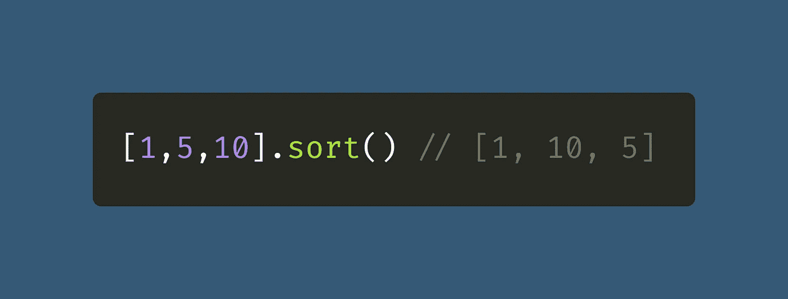
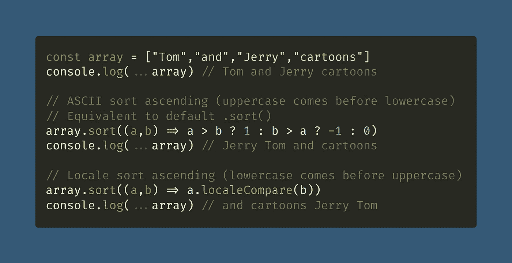
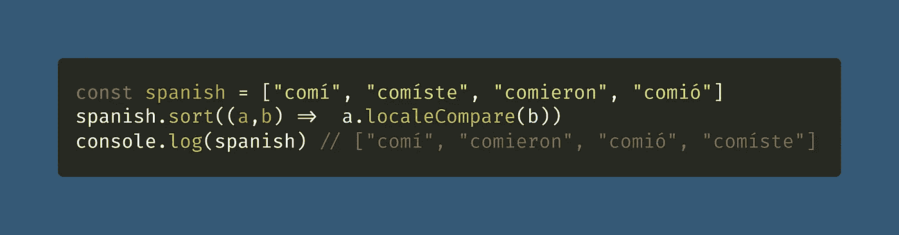
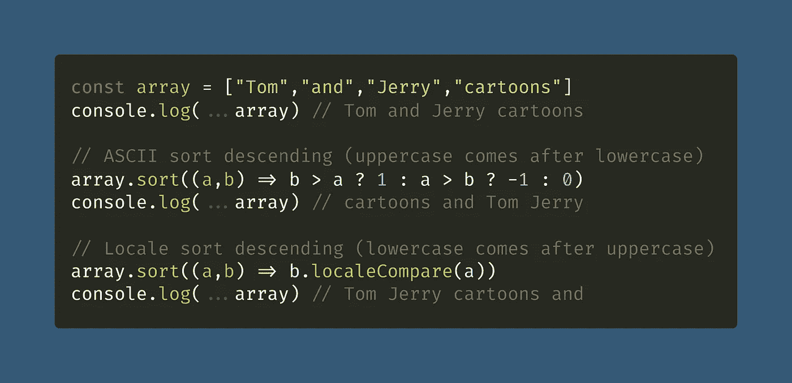

# 如何在 JavaScript 中对字符串数组进行排序

> 原文：<https://javascript.plainenglish.io/how-to-sort-an-array-of-strings-in-javascript-5d59b1ac64be?source=collection_archive---------3----------------------->

## JavaScript 的默认值。sort()方法按字母升序对数组进行排序，这在处理数字时会令人困惑，但在处理字符串时却非常有用。

Photo by [Alina Grubnyak](https://unsplash.com/@alinnnaaaa?utm_source=medium&utm_medium=referral) on [Unsplash](https://unsplash.com?utm_source=medium&utm_medium=referral)

许多人了解 JavaScript 的[数组](/how-to-check-for-an-array-in-javascript-6ad20f7a0e21) `[.sort()](https://developer.mozilla.org/en-US/docs/Web/JavaScript/Reference/Global_Objects/Array/sort)`方法(`[Array.prototype.sort()](https://developer.mozilla.org/en-US/docs/Web/JavaScript/Reference/Global_Objects/Array/sort)`)的第一件事就是它不能正常工作。

嗯，这并不完全正确，但它确实以一种奇怪的方式工作。如果你试图`.sort()`一组[数字](/how-to-check-for-a-number-in-javascript-8d9024708153)，它们似乎不能正确排序:

 [## 如何在 JavaScript 中对数组进行数字排序

### 默认的 ECMAScript 排序是按字母顺序的，所以需要一点小技巧来按数字顺序对数组进行排序。

medium.com](https://medium.com/coding-at-dawn/how-to-sort-an-array-numerically-in-javascript-2b22710e3958) 

原因是因为`.sort()`默认按字母顺序对条目进行排序，升序——在字母顺序列表中，10 排在 2 之前。

[View raw code](https://gist.github.com/DoctorDerek/e743334230815822907fa99e97d53c4a) as a GitHub Gist

这意味着对一个由[字符串](/how-to-check-for-a-string-in-javascript-a16b196915ff)组成的[数组](/how-to-check-for-an-array-in-javascript-6ad20f7a0e21)进行排序实际上相当容易:`.sort()`本身会帮你完成。但是有一些技巧你应该知道。

# 创建比较函数对字符串进行排序

使用两个问号(又名[三元运算符](https://medium.com/javascript-in-plain-english/what-does-the-question-mark-mean-in-javascript-code-353cfadcf760)，我将创建一个[比较函数](https://developer.mozilla.org/en-US/docs/Web/JavaScript/Reference/Global_Objects/Array/sort#parameters)，如果`a`大于`b`，它将返回`1`；如果 b 大于 a，返回`-1`，如果相等，返回 0。

这个特定的比较函数对于排序字符串很有用。这基本上也是默认的排序，除了没有比较函数的`.sort()`在比较之前也显式地将每一项转换成一个字符串。

[View raw code](https://gist.github.com/DoctorDerek/e743334230815822907fa99e97d53c4a) as a GitHub Gist

注意，默认的 [ASCII 排序顺序](http://support.ecisolutions.com/doc-ddms/help/reportsmenu/ascii_sort_order_chart.htm)可能有点不寻常，所以使用`[String.prototype.localeCompare()](https://developer.mozilla.org/en-US/docs/Web/JavaScript/Reference/Global_Objects/String/localeCompare)`可能会更好。

要更改为降序排序，只需简单地切换`1`和`-1`，或者将第二个功能更改为`b.localeCompare(a)`。

# 用`localeCompare()`对非 ASCII 字符串进行排序

带有重音字符的字符串(e，é，è，a，等)。)如外语字符串使用`[String.localeCompare](https://developer.mozilla.org/en-US/docs/Web/JavaScript/Reference/Global_Objects/String/localeCompare)`受益最大。

这个函数比较字符，这样得到的 [Unicode (UTF-8)](https://developer.mozilla.org/en-US/docs/Glossary/UTF-8) 字符串数组将按照正确的顺序出现在区域设置中。

[View raw code](https://gist.github.com/DoctorDerek/e743334230815822907fa99e97d53c4a) as a GitHub Gist

这个例子是[简单代码](https://betterprogramming.pub/why-you-should-make-your-code-as-simple-as-possible-3b35e89f137)，但是重要的是要记住，在 JavaScript 中通常应该使用 `.localeCompare()`进行字符串比较。

# 如何对字符串进行降序排序？

您可以对`.sort()`使用任何想要的比较函数，所以在这种情况下，我们只需要交换`a`和`b`来创建一个降序(Z-A)排序。

[View raw code](https://gist.github.com/DoctorDerek/e743334230815822907fa99e97d53c4a) as a GitHub Gist

使用比较函数，你可以随心所欲，因为它只是一个[回调函数](https://developer.mozilla.org/en-US/docs/Glossary/Callback_function)，就像任何其他 [JavaScript 函数](/how-to-check-for-a-function-in-javascript-986248827790)一样。

**快乐编码！** 🧵🪕🎸🎻🎉

德里克·奥斯汀博士是《职业规划:如何在 6 个月内成为成功的 6 位数程序员》一书的作者，该书现已在亚马逊上出售。