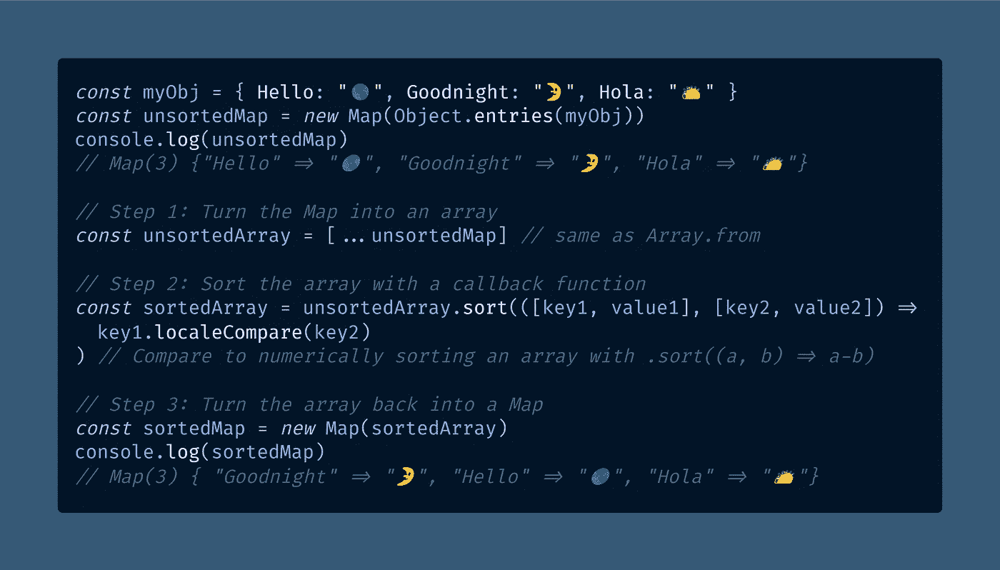
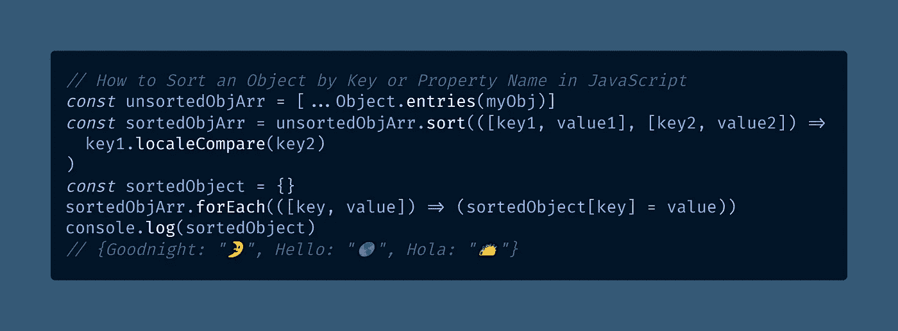

# 如何在 JavaScript 中按键或属性名对对象进行排序

> 原文：<https://javascript.plainenglish.io/how-to-sort-an-object-by-key-or-property-name-in-javascript-a8c07b179901?source=collection_archive---------7----------------------->

## 下面介绍如何使用 Object.entries()帮助器函数和 ES6 Map 根据 JavaScript 对象的键对其进行排序。

Photo by [Alp Duran](https://unsplash.com/@alpduran?utm_source=medium&utm_medium=referral) on [Unsplash](https://unsplash.com?utm_source=medium&utm_medium=referral)

您是否曾经遇到过根据 JavaScript 对象的[属性名称](https://developer.mozilla.org/en-US/docs/Web/JavaScript/Guide/Working_with_Objects#objects_and_properties)或[键](https://developer.mozilla.org/en-US/docs/Web/JavaScript/Reference/Global_Objects/Object/keys)对其进行排序的需求？如何做到这一点一点也不明显。

虽然[数组](/how-to-check-for-an-array-in-javascript-6ad20f7a0e21)有一个方便的`.sort()`特性，可以用来[对 JavaScript 数组进行数值排序](https://medium.com/coding-at-dawn/how-to-sort-an-array-numerically-in-javascript-2b22710e3958)，但是对于对象来说却没有这个特性。

除此之外，由于 Internet Explorer，从技术上讲，ES5 对象甚至没有固定的对象键顺序。

然而，通过使用助手函数`[Object.entries()](https://developer.mozilla.org/en-US/docs/Web/JavaScript/Reference/Global_Objects/Object/entries)`，可以根据属性对 JavaScript 对象进行排序。

如果您还没有读过我关于[如何对 ES6](/how-to-sort-a-map-in-javascript-es6-59751f06f692) `[Map](/how-to-sort-a-map-in-javascript-es6-59751f06f692)`进行分类的文章，您可以在继续之前查看一下:

 [## 如何在 JavaScript ES6 中对地图进行排序

### ES6 Map 类型类似于常规的 JavaScript 对象，有一个重要的区别——它有一个插入顺序……

javascript.plainenglish.io](/how-to-sort-a-map-in-javascript-es6-59751f06f692) 

或者，请随意跳过这篇文章。正如您将在后面看到的，使用 ES6 `Map`实际上是可选的。现在进入代码！

按照键对 JavaScript 对象进行排序的第一步是将它转换成一个`Map`。为此，我们只需在由`Object.entries()`返回的 [iterable](https://developer.mozilla.org/en-US/docs/Web/JavaScript/Reference/Iteration_protocols) 上调用[的](https://developer.mozilla.org/en-US/docs/Web/JavaScript/Reference/Global_Objects/Map/Map) `[Map](https://developer.mozilla.org/en-US/docs/Web/JavaScript/Reference/Global_Objects/Map/Map)` [构造函数](https://developer.mozilla.org/en-US/docs/Web/JavaScript/Reference/Global_Objects/Map/Map)(使用`[new](https://developer.mozilla.org/en-US/docs/Web/JavaScript/Reference/Operators/new)`关键字)。

[View raw code](https://gist.github.com/DoctorDerek/06f06c2195cb86fd8dd9574d58e85e38) as a GitHub Gist

一旦我们有了一个`Map`，我们使用`[...](https://medium.com/coding-at-dawn/how-to-use-the-spread-operator-in-javascript-b9e4a8b06fab)`[扩展操作符](https://medium.com/coding-at-dawn/how-to-use-the-spread-operator-in-javascript-b9e4a8b06fab)(或者等价地，`[Array.from()](https://levelup.gitconnected.com/how-to-copy-an-array-in-javascript-with-array-from-298c7e66eebc)`)将它转换成一个数组，然后对它进行排序。

在这里，因为我正在对一组 JavaScript 字符串进行[排序，所以我使用`.localeCompare()`，因为它是对](https://doctorderek.medium.com/how-to-sort-an-array-of-strings-in-javascript-5d59b1ac64be)[字符串](/how-to-check-for-a-string-in-javascript-a16b196915ff)进行比较的最佳选择。

让我们从头到尾再看一遍整件事:

[View raw code](https://gist.github.com/DoctorDerek/06f06c2195cb86fd8dd9574d58e85e38) as a GitHub Gist

这一次，我跳过了整个`Map`的事情，直接对数组进行排序，没有中间步骤。

您可能更喜欢这种实现——而且它使用的内存也可能更少。我个人喜欢用 ES6 `Map`，但是完全没有必要。

正如我们所看到的，按照属性名对 JavaScript 对象进行排序实际上并不可怕。我们只需要利用`Object.entries()`将对象的键从它的值中分离出来，然后我们可以`.sort()`它们。

**编码快乐！**💻🎃👻👼👑

[Derek Austin](https://www.linkedin.com/in/derek-austin/)博士是《职业编程:如何在 6 个月内成为一名成功的 6 位数程序员 》一书的作者，该书现已在亚马逊上架。