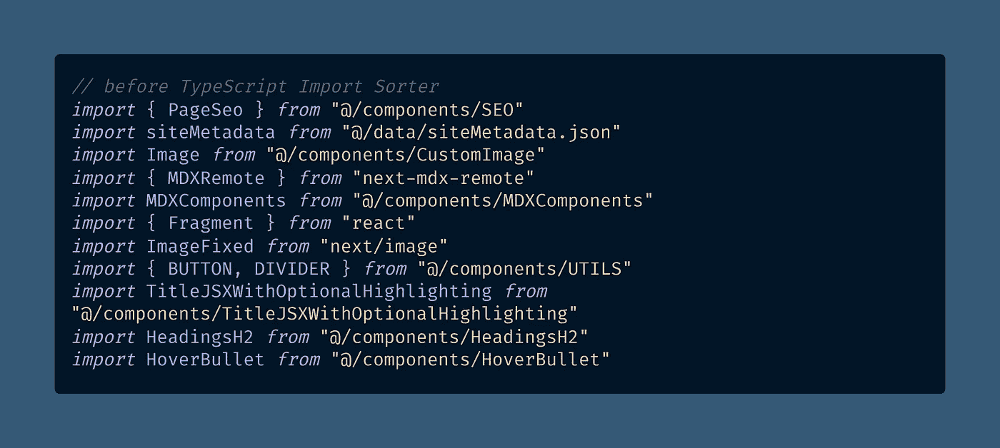
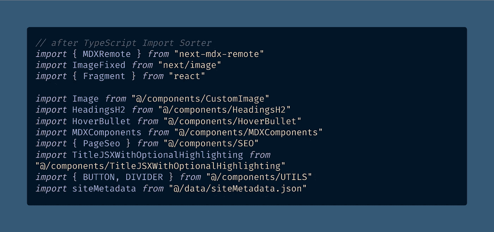

# 如何在 VS 代码中自动对 TypeScript 中的导入排序

> 原文：<https://javascript.plainenglish.io/how-to-sort-imports-in-typescript-automatically-in-vs-code-f4fe4e499bb1?source=collection_archive---------0----------------------->

## 使用免费的“TypeScript Import Sorter”扩展，只需 3 个简单的步骤，就可以在每次保存时清理混乱的导入。

Photo by [Paul Teysen](https://unsplash.com/@hooverpaul55?utm_source=medium&utm_medium=referral) on [Unsplash](https://unsplash.com?utm_source=medium&utm_medium=referral)

你有没有想过 JavaScript 文件中的[导入语句](https://codesandbox.io/s/the-difference-between-import-and-require-in-javascript-by-dr-derek-austin-xp842b?file=/pages/index.js)没有正确或固定的顺序？

你应该把 [CSS-in-JS](https://medium.com/dailyjs/what-is-actually-css-in-js-f2f529a2757) 模块`import`放在顶部，还是你的 React 导入应该放在那里？内部依赖怎么办？

我使用 VS 代码的强大的[逆风](https://marketplace.visualstudio.com/items?itemName=heybourn.headwind)扩展对我的[顺风 CSS 类名](https://medium.com/coding-at-dawn/the-tailwind-css-jit-mode-bug-that-only-happens-in-production-4f25ef009fe8)进行排序已经有一段时间了，所以我很高兴在庞大的 TypeScript 项目中找到类似的东西来处理我的导入语句。

它叫做(*等等* ) [打字输入分类器](https://marketplace.visualstudio.com/items?itemName=mike-co.import-sorter&ssr=false#review-details)，由伟大的[迈克尔](https://marketplace.visualstudio.com/publishers/mike-co)开发，我想他用了这个名字。谢谢你，迈克。

> " Extension 根据提供的配置对 TypeScript 导入进行排序。配置默认值遵循 ESLint 排序-导入规则”“ [Michael](https://marketplace.visualstudio.com/publishers/mike-co)

老实说，这对我来说是诗歌，我立即将我正在开发的大型打字稿项目中的所有内容进行了排序。

我最喜欢的一点是，将我重构的新组件添加到新文件中是多么容易。我开始输入`import`，并立即获得我的组件`@/components/Button`的 VS 代码类型提示。

但是感谢 TS 导入分类器扩展，有一个更简单的方法，你所要做的就是用 VS 代码保存你的文件。

# 值得注意的是:排序顺序是固执己见的

要注意的是，这个 [VS 代码扩展](https://betterprogramming.pub/how-to-set-up-vs-code-like-a-pro-in-just-5-minutes-65aaa5788c0d?gi=d4a327d58e8f)是固执己见的，就像你可能已经使用的惊人的[漂亮的](https://levelup.gitconnected.com/how-to-format-all-files-in-a-directory-with-prettier-5f0ff5f4ffb2)代码格式化程序。

固执意味着[排序顺序的规则](https://medium.com/coding-at-dawn/sorts-in-60-seconds-speedy-javascript-interview-answers-on-sorting-acb72bdea8a2)已经为你决定了，只有很少或者没有定制配置选项。

我认为这是一个优势，因为我不想负责选择“正确”和“最优”的进口顺序。

让迈克尔为我们做这件事吧。谢谢你，迈克！

反正 2 分钟不到很容易上手。以下是方法。

# 如何通过 3 个简单的步骤对 TypeScript 导入进行排序

## 步骤 1-安装扩展

你可以从 [VS 代码市场](https://marketplace.visualstudio.com/items?itemName=mike-co.import-sorter&ssr=false#review-details)网站或者使用[VS 代码快捷方式](https://medium.com/derek-develops/how-to-zoom-in-and-out-in-vs-code-plus-an-optional-extension-2e9722638fd1) `Ctrl+Shift+X`或者`**⌘**+Shift+X`来安装这个扩展。

## 第二步-创建`import-sorter.json`

假设您已经在使用 pretty，那么您需要在项目的根目录下创建一个名为`import-sorter.json`的文件。

我建议你不要阅读详细的配置说明，但是如果你需要的话，它们是可用的。

下面是`import-sorter.json`文件的[更漂亮的默认值](https://prettier.io/docs/en/options.html):

我建议你添加的另一行是删除分号，因为谁需要它们？

我对分号的看法是，“如果它们是可选的，请关闭它们。”如果您同意，您会希望在`import-sorter.json`中再添加一行:

如果你更喜欢分号，并打算为我写一个关于 JavaScript 的自动分号插入的回复…请不要。谢了。😄

## 步骤 3- […](https://knowyourmeme.com/memes/profit)

## 第四步——盈利！(点击保存按钮)

好吧，我开玩笑的，还有一件事要做。您需要编辑您的 [VS 代码设置](https://betterprogramming.pub/how-to-set-up-vs-code-like-a-pro-in-just-5-minutes-65aaa5788c0d)来将`importSorter.generalConfiguration.sortOnBeforeSave`设置为`true`，这将在每次保存操作之前触发排序。

然后你可以通过点击“保存”(`Ctrl+S`或`**⌘**+S`)来自动排序你的导入，这就是我所做的。很棒，我推荐。

要手动排序，您需要打开命令面板(`Ctrl+Shift+P`或`**⌘**+Shift+P`)并找到`Sort Imports`命令。

该命令也可以用于任何自定义的键绑定(默认为`Ctrl+Shift+O`或`**⌘**+Shift+O`)。但是为什么不在保存时格式化呢？

# 但是等等，还有更多——通过浏览器在 VS 代码中进行目录深度导入排序

还有一个很酷的特性值得一提——您可以使用 VS 代码中的浏览器(`Ctrl+Shift+E`或`**⌘**+Shift+E`)通过右键单击一个目录来递归排序其中的所有文件。

请注意，这个"[深度操作](/how-to-deep-copy-objects-and-arrays-in-javascript-7c911359b089)"(意味着递归)将在没有任何提示的情况下对源文件进行排序和重写，因此请确保使用快速 Git commit 提前进行备份。

这项功能非常方便，可以快速排序所有文件，而不需要手动打开每个文件。然后，您可以一次对所有的更改进行一次 Git 提交。

 [## 如何在 JavaScript 中深度复制对象和数组

### 复制对象或数组的常用方法只能进行浅层复制，所以深度嵌套的引用是个问题…

javascript.plainenglish.io](/how-to-deep-copy-objects-and-arrays-in-javascript-7c911359b089) 

# 排序的 TS 导入:代码示例之前和之后

那么，当您在 VS 代码中对一个 TypeScript 文件实际运行这个导入排序器时，会发生什么呢？看一看。

[View raw code](https://gist.github.com/DoctorDerek/d39b15505befe0ad69aba260bc684ea7) as a GitHub Gist (BEFORE)

我之前没有整理文件。不可避免的是，我新开发的本地组件最终会出现在底部，没有特定的顺序。

[View raw code](https://gist.github.com/DoctorDerek/3f020b43094cc175857ef4d06732539d) as a GitHub Gist (AFTER)

点击 save 后，我的导入按字母顺序排列，在我的 npm 依赖项和我的本地组件库之间有一个漂亮的空行。

# 结论:你应该对你的进口商品进行分类

这种改变最好的部分是如果你在一个团队中工作——每个人都以相同的顺序添加导入，所以你的 PRs 将比以前更容易。

即使你不是，我仍然建议你尝试一下(还有[逆风](https://marketplace.visualstudio.com/items?itemName=heybourn.headwind)，这和顺风 CSS 的想法一样)。

这个扩展治愈了我对在我的`.tsx`文件顶部按字母顺序排列和合并导入语句的强迫性需求。

最后一点，这是一个只适用于 TypeScript 的扩展，这可能会成为您的绊脚石。嘿，我明白了。

当然，只要您打开了`allowJS`标志，您总是可以创建一个 TypeScript 项目并使用所有的 JavaScript 文件，但是这不会给您带来与实际切换到 TypeScript 相同的 Intellisense 好处。

对于您不希望转换为 TypeScript 的 JavaScript 项目，另一种选择是 [ESLint 排序导入规则](https://eslint.org/docs/rules/sort-imports)。

您可以使用`npx eslint --fix .`运行它，并获得类似的排序好处，但是它没有 VS 代码扩展方便。

您还可以尝试这个替代的导入分类器扩展， [JS/TS 导入/导出分类器](https://marketplace.visualstudio.com/items?itemName=dozerg.tsimportsorter)，作者有两个名字:赵岱。

谢谢赵。感谢您的阅读。

**快乐编码！**👩‍💻🔤💻🌀📈

Photo by [Pat Whelen](https://unsplash.com/@patwhelen?utm_source=medium&utm_medium=referral) on [Unsplash](https://unsplash.com?utm_source=medium&utm_medium=referral)

[德里克·奥斯汀博士](https://www.linkedin.com/in/derek-austin/)是《职业规划:如何在 6 个月内成为一名成功的 6 位数程序员 》一书的作者，该书现已在亚马逊上架。