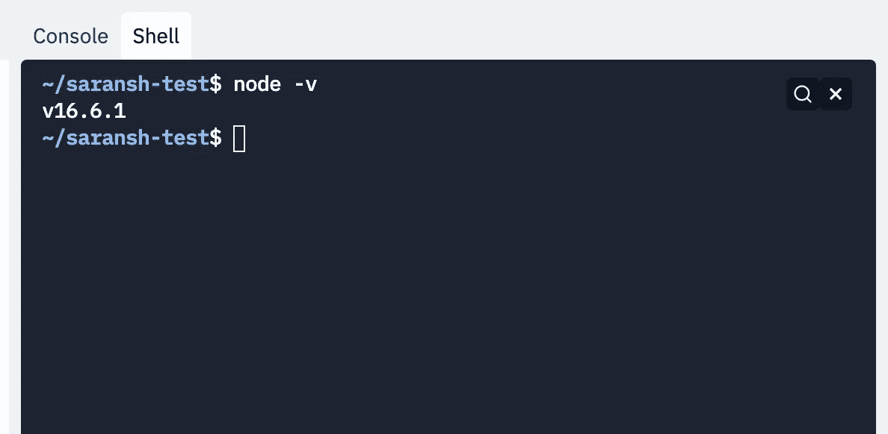
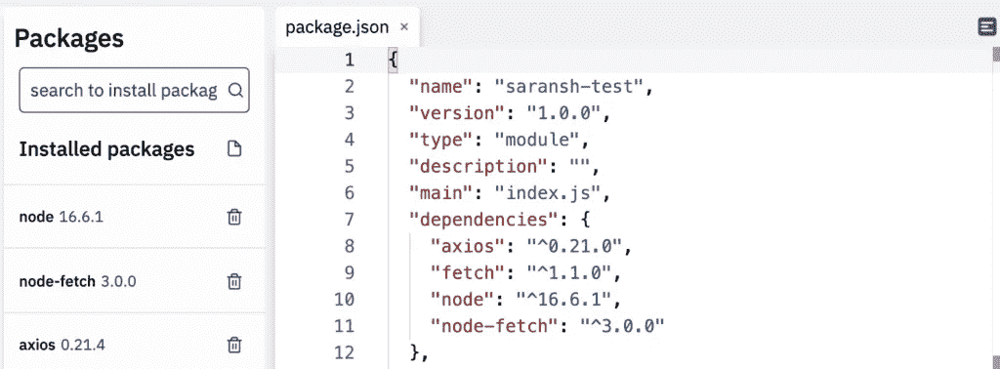

# 如何在 Repl.it 中指定节点版本

> 原文：<https://javascript.plainenglish.io/how-to-specify-a-node-version-in-repl-it-a7402a458ea9?source=collection_archive---------22----------------------->



我最近试图在 Repl.it 上使用 Node 的更高版本，我想使用支持 ES 模块的包，而默认版本不支持它。所以我想在 Repl.it .中使用最新的节点版本，但发现没有直接的方法。但是通过一些自定义步骤仍然是可能的。

# 设置

它允许将 node.js 版本指定为 package.json 本身的一部分。但是在运行脚本时，默认情况下不使用已安装的版本。但是在这之前，我们需要在 repl.it 中安装我们的节点版本。或者我们可以使用软件包管理器界面来完成:



# 配置 Repl.it

设置好之后，我们需要使用这个版本，而不是默认的 Repl.it Node.js 版本。我们需要通过创建一个名为. replit 的文件来使用 Repl.it 的配置。

在这个文件中，我们将添加内容:

```
run="npm start"
```

这将从 shell 而不是控制台执行 Node。然后剩下要做的就是在我们的 package.json 文件中配置启动脚本:

```
"scripts": { "start": "node ." }
```

如果我们想开始使用最新版本的 shell，我们可以在 shell 中执行以下命令:

```
npm config set prefix=$(pwd)/node_modules/node && export PATH=$(pwd)/node_modules/node/bin:$PATH
```

或者，如果我们希望将它们定位到刚刚安装的 node.js 的更高版本，我们可能希望重新安装已安装的包。

应该就是这样了。我们在 Repl.it 中的自定义节点版本应该已经准备好了。当我们点击 Run 按钮时，index.js 脚本将使用我们在 package.json 中指定的节点版本执行。

如果你对此有任何问题，请在下面留言！

*原载于 2021 年 9 月 13 日*[*【https://www.wisdomgeek.com】*](https://www.wisdomgeek.com/development/web-development/javascript/specifying-a-node-version-in-repl-it/)*。*

*更多内容请看*[***plain English . io***](https://plainenglish.io/)*。报名参加我们的* [***免费周报***](http://newsletter.plainenglish.io/) *。关注我们关于* [***推特***](https://twitter.com/inPlainEngHQ)[***领英***](https://www.linkedin.com/company/inplainenglish/)**和* [***不和***](https://discord.gg/GtDtUAvyhW) ***。****