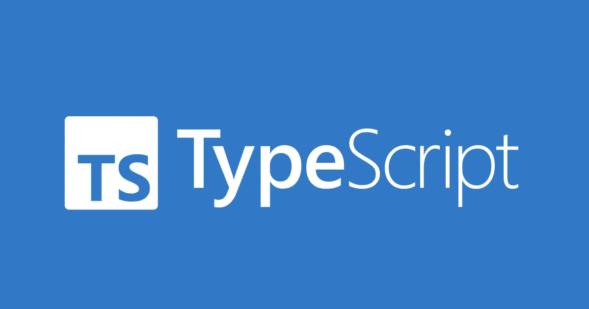

# 如何用 TypeScript 启动一个空白项目

> 原文：<https://javascript.plainenglish.io/how-to-start-a-blank-typescript-project-1d260f7e2aa8?source=collection_archive---------2----------------------->



TypeScript logo

如今，在 Node 中创建项目时，通常使用 CLI 搭建工具如`create-react-app`来编写初始的样板文件。因此，很容易忘记(或者从未学习过)如何从头创建一个空白的 TypeScript 项目。

我正在编写本分步指南，以便您可以在几分钟内开始使用 ES2016 和 TypeScript。

除了列出说明之外，我还将解释每一步，以建立直觉，了解为什么每一步都是必要的。理解一个过程消除了死记硬背的需要。

我假设没有 Node 或 TypeScript 的先验知识，但是您应该已经安装了`npm`。

# 1.npm 初始化

在你的控制台中运行`npm init`来创建一个空白的 npm 项目。您将被要求输入一些信息，如项目名称和许可证——这些对于我们的目的都不重要，但是如果您创建了您打算在将来发布的项目，您应该填写这些字段。

命令运行完毕后，您会在工作目录中看到一个`package.json`文件。这包含了关于你的 npm 项目的所有重要信息。

# 2.npm 安装类型脚本

接下来，您需要安装 TypeScript 包。这个包允许你将你的类型脚本代码转换成 JS，你可以使用`node`命令运行它。

TypeScript 包只在开发过程中使用——它永远不会从您的实际代码中引用。因此，我们可以(也应该)使用`-D`标志来指示 TypeScript 不应该在生产环境中安装这个包。

所以，把这个输入你的控制台:

```
npm install -D typescript
```

# 3.gitignore

这一步并不是绝对必要的，特别是如果您没有使用 Git 的话。但是由于大多数项目都是这样，所以值得一提。我们希望 git 忽略一些文件和目录:

1.  `package-lock.json`是由 Node 在运行`npm install`之后生成的，用来跟踪您已经安装的实际软件包。因此，它不应存储在您的 git repo 中。
2.  `node_modules`是包含所有已安装软件包代码的目录。占用空间很大，反正应该是用`npm install`自动生成的。
3.  `dist`将是我们的 dist 文件夹的名称，它将包含 transpiled JS 文件。这些文件将使用`tsc`(**T**type**S**script**c**ompile)命令生成。

# 4.tsconfig.json

这个文件包含了我们的 TypeScript 配置——`tsc`命令需要知道的所有信息，包括从哪里、如何以及向哪里传输您的 TypeScript 代码。

在根目录下创建一个名为`tsconfig.json`的文件，并粘贴以下 JSON:

```
{
  "compilerOptions": {
    "target": "ES2016",
    "module": "ES6",
    "esModuleInterop": true,
    "strict": true,
    "rootDir": "src",
    "outDir": "dist",
  },
}
```

让我们一行一行地分解它。

1.  `target`指定你要转换到的 JS 语言版本。从 ES3 到 ES2021，你有很多选择。ES2016 是一个坚实的中间地带——它包含了大多数现代 JS 语言功能，但仍受许多不同执行环境的支持。`ES6`也是一个不错的选择。您可以随意使用它，这取决于您需要什么样的语言特性以及代码将在哪里执行。点击了解更多信息[。](https://www.typescriptlang.org/tsconfig#target)
2.  `module`指定您想要在项目中使用的 JS 模块的类型。大多数现代项目使用`import`语法，也称为 ES6 模块。这确实是推荐值。在此找到关于这个[的更多信息。](https://www.typescriptlang.org/tsconfig#module)
3.  `esModuleInterop`使非 ES6 模块与 ES6 模块一起使用更加容易。通常，这两者在最坏的情况下是不兼容的，或者在最好的情况下是错误的。启用此选项允许您同时使用这两者，这对于导入某些 npm 软件包很有帮助(甚至是必要的)。点击查看更多信息[。](https://www.typescriptlang.org/tsconfig#esModuleInterop)
4.  `strict`“启用大范围的类型检查行为，从而更强地保证程序的正确性”，根据 TSConfig 参考。基本上，它加强了更好的编码实践。在这里找到更多信息。
5.  `rootDir`指定我们源代码的根目录。在本例中，我们将所有的源代码放在一个名为`src`的文件夹中。这有助于我们明确区分源代码、配置代码和编译代码。
6.  `outDir`指定 TypeScript 将放置所有传输的 JS 的目录。同样，指定这个路径，虽然没有必要，但可以改进我们回购的组织。

# 5.汇编

接下来，我们将编写一个快速的 npm 脚本，它将为我们编译代码。打开您的`package.json`文件，并将以下条目添加到`scripts`对象中:

```
"build": "tsc --build"
```

所有这些都允许我们使用别名`npm run build`运行`tsc --build`。

你可能想知道为什么要做这一步，因为它几乎不节省时间。原因是你可能想给`tsc --build`命令添加一些配置选项，或者添加其他功能，比如将非 JS 文件复制到你的`dist`文件夹中。无论哪种方式，拥有一个易于记忆的集中命令都很好，比如`npm run build`。

# 6.把所有的放在一起

创建`src/index.ts`。添加您想要的任何代码—出于我们的目的，我们将做一个简单的日志:

```
console.log("Hello world!");
```

保存文件，然后在你的控制台上运行`npm run build`。几秒钟后，您应该会在 repo 中看到一个新的`dist`文件夹。这个文件夹应该包含`index.js`。注意是 JS 文件，不是 TS。

您现在可以使用`node`命令运行这个 JS 文件:

```
node dist/index.js
```

这会将`Hello world!`打印到您的控制台上。

就这样——您现在可以用 TypeScript 编写任何 Node.js 程序，并在任何安装了 Node 的机器上执行它。

*更多内容看* [***说白了就是***](http://plainenglish.io/) ***。*** *报名参加我们的**[***免费每周简讯这里***](http://newsletter.plainenglish.io/) ***。****