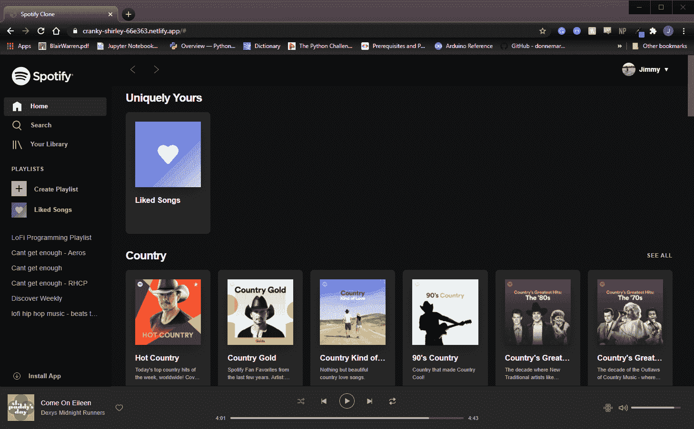
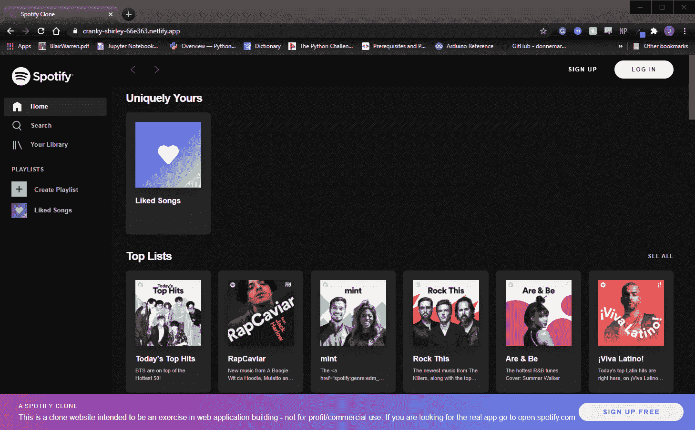

# 如何开始和完成一个克隆项目，让你快速找到工作

> 原文：<https://javascript.plainenglish.io/how-to-start-and-finish-a-clone-project-that-gets-you-jobs-fast-b3ac2c462ed6?source=collection_archive---------10----------------------->

## 有抱负的 web 开发人员指南

去年夏天，我决定自学 web 开发——在 3 个月内，我从编写简单的 HTML、CSS 和 JavaScript，到使用 React 完成一个相当复杂的 Spotify web 播放器的工作克隆。直到今天，我仍然认为这个项目是最重要的项目之一，它帮助我在自学如何编码的一年内获得了作为 web 开发人员的第一份工作。今天，我将反思我是如何着手这样一个项目的，并揭示我希望我所知道的能帮助你开始构建你自己的克隆项目。

A demo of my Spotify clone project

## 为什么要克隆项目？

> 克隆项目让你找到工作——我

对我来说，一个克隆项目是一个在形式和功能上都已经建立的应用程序的复制。这种复制别人比你做得好的东西的活动是加速你自己学习的一种极好的方式(这个概念适用于许多不同的学科)。

我相信进入软件行业最简单的方法(如果这是你的目标)是在成为软件开发人员之前先做一名软件开发人员。这听起来可能违反直觉，但这只是意味着你必须确保你的编码实践应该尽可能地与你的目标工作相似。作为软件开发人员，我们的主要工作归结为将需求转化为代码实现。试图克隆一个项目的行为提供了具体的和真实世界的需求，这对于初学者来说是很难自己想出来的。

你试图复制的应用程序也应该有一个设计良好的用户界面，这在投资组合中非常有帮助。人们经常假设看起来好的东西一定是好的——这被称为光环效应，你可以利用这个原则。当我向潜在的雇主展示我的克隆项目时，他们经常说的第一句话是，这个项目看起来非常干净，非常完美。他们从来没有看到我的代码，但假设是代码应该是好的，因为用户界面看起来很好。

## 第 0 步:了解一些基础知识

承担克隆项目是一个相当复杂的过程，需要花费大量的时间。正因为如此，我不建议完全初学者承担这样的项目，因为你的学习不会最大化。相反，首先要熟悉 HTML、CSS 和普通的 Javascript。还建议您使用 React、Angular 或 Vue 之类的 javascript 框架，因为这将使您的生活更加轻松。因此，建议您了解所选框架的一些基础知识

## 第一步:选择一个项目

首先，你需要一个项目开始。我建议选择你喜欢每天使用的东西。对我来说，它就是 Spotify——我几乎每天都在使用它，我很乐意向别人展示它。想一个让你兴奋和熟悉的项目——当事情变得艰难，你想放弃的时候，这真的会帮到你。帮助您选择项目的另一个方法是找到可用的 API——这导致了下一步…

## 第二步:你需要数据

作为一名前端开发人员，我没有足够的知识来开发支持 Spotify 等多媒体应用程序的完整后端基础设施。我也不想花时间这么做，因为我的目标不是成为一名全栈开发人员。幸运的是，您试图复制的这些项目通常有一个公开可用的 API——有时甚至是用于构建真正应用程序的 API。同样，克隆项目的优势变得很明显，因为作为前端开发人员，您很可能会使用 API 来构建工作中的 UI。

如果您想要构建的特定产品没有官方 API，那么可能会有一个不同但相似的公开可用 API 可以作为替代。例如，您可以将 IMDB 数据用于网飞克隆。如果您的项目没有任何多媒体组件，如图像或视频，那么尝试使用简单的解决方案(如谷歌云存储)来存储您自己的数据可能是一个更好的主意。一旦你找到了合适的 API，花些时间熟悉一下文档——这将是你整个项目中的好朋友。

这里有一个公开可用的 API 列表，可以激发你的灵感。

 [## GitHub-public-API/public-API:免费 API 的集合列表

### 免费 API 的集合列表。在 GitHub 上创建一个帐户，为 public-API/public-API 开发做贡献。

github.com](https://github.com/public-apis/public-apis) 

## 步骤 3:确定项目范围

在开始这个项目之前，你应该考虑一下工作范围。您可能会问自己:您是否希望对应用程序的每个页面和每个功能进行完全克隆？如果你的目标是将项目添加到你的投资组合中，你可能不需要所有的东西。您甚至可能只需要登录页面就可以工作。

我认为任何项目的目标都是尽可能多的学习。在这种情况下，您的主要目标应该是尝试构建尽可能多的复杂 UI 行为，以获得项目时间的最大回报。你承担的工作范围应该反映这一点。

## 第四步:尽可能匹配外观

就像我之前说的，你试图克隆的应用程序很可能有优秀的 UI 设计师在上面工作。所以你的工作只是简单地尝试用你决定的样式复制你的项目——CSS、Sass、样式组件等等。如果你刚刚开始，我推荐简单的 CSS，但是你最熟悉的都可以。

总是有 inspector 工具可以用来查找 UI 组件的 CSS 样式。当然，您应该将应用程序的 UI 视为您试图在代码中复制的模型，并且应该避免检查。先花至少 15 分钟尝试做一些事情，然后在检查器中查找，以获得最大限度的学习。你不想花更多的时间，因为你可能会在一个不起作用的解决方案上浪费时间(当然，这正是现实世界中发生的情况，但我们在这里试图尽快了解)。

## 第五步:尽可能匹配事物的工作方式

应用程序中的东西不仅要看起来好，还要工作得好。尽可能多地复制你看到的应用程序的行为——例如无限滚动、实时搜索、播放栏等。如果你被卡住了，网上有很多关于你需要做什么的教程。尽管这些教程可能不完全符合您的要求，但您通常可以根据自己的需要进行一些小的修改。例如，我需要在我的 Spotify 项目中有一个无限滚动的歌曲列表，所以我查找了一下，并最终使用 YouTube 上的 Web Dev Simplified 教程来完成这项任务。

A demonstration of the live search feature I implemented

## 步骤 6:继续前进，迭代直到你完成了你的工作范围

请注意，在整个项目过程中，你会多次失去动力，但会坚持下去，因为最终一切都是值得的。正如第一步中提到的，因为这个原因，你选择一个你感兴趣的项目是很重要的。这可能很难，但你将会学到几乎和实际工作一样多的东西，所以一切都是值得的。一旦你触及了你的工作范围，并且事情运行得相当好，没有错误，这个项目就完成了，并准备放入投资组合。

## 结论

今天我就讲到这里。希望我已经让你相信，作为一个有抱负的开发人员，尝试克隆一个现有项目是你能做的最好的活动之一。它不仅给出了您要遵循的真实世界的具体要求，而且还教会了您在生产就绪级别上如何做事情。现在去构建那个项目吧！

*更多内容看*[***plain English . io***](http://plainenglish.io/)