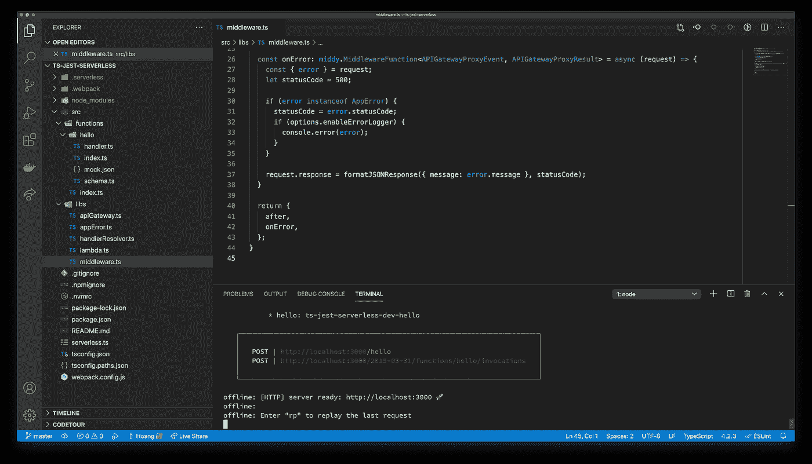
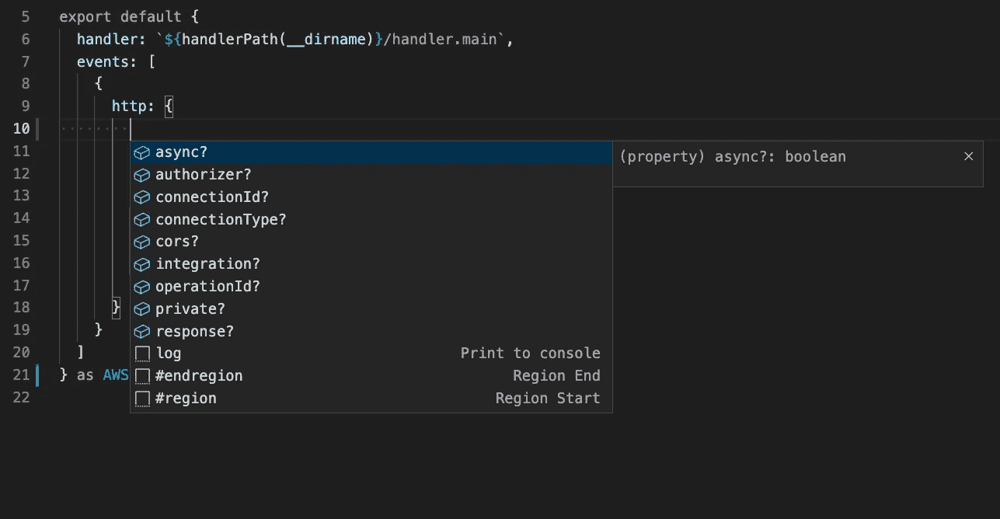
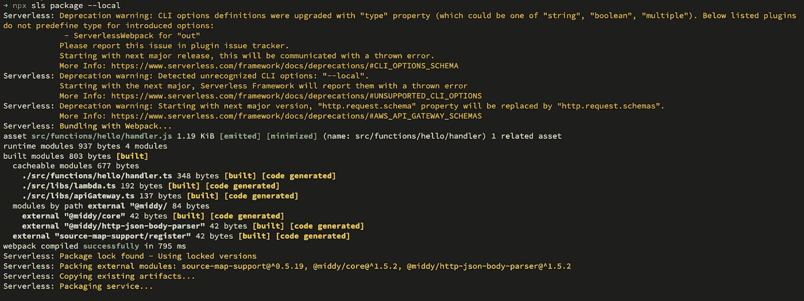
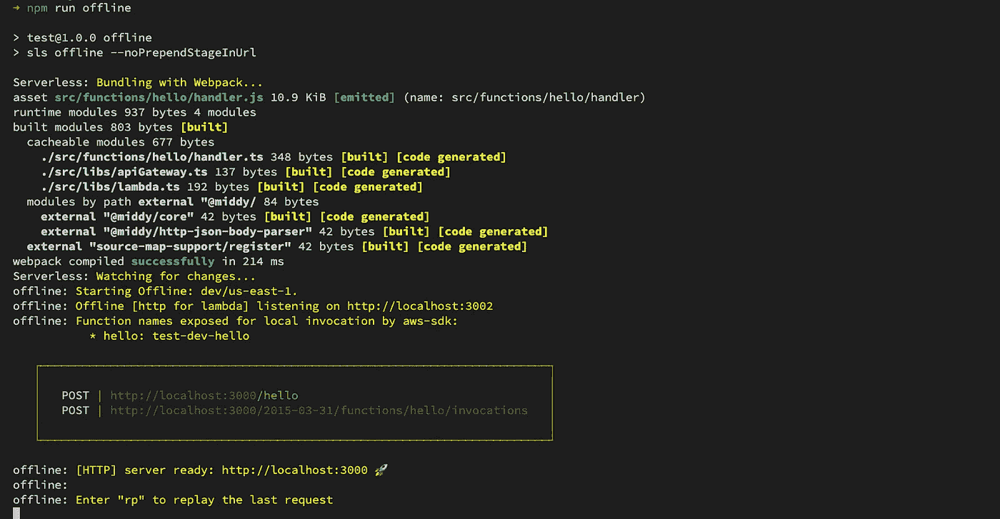
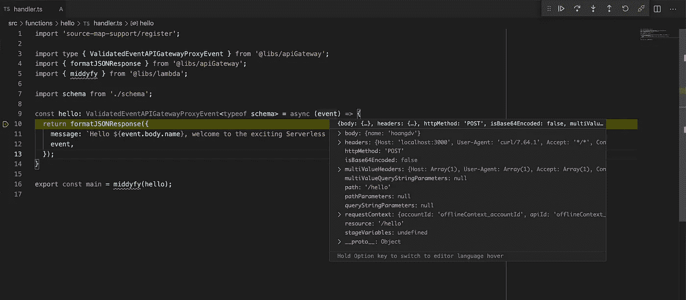
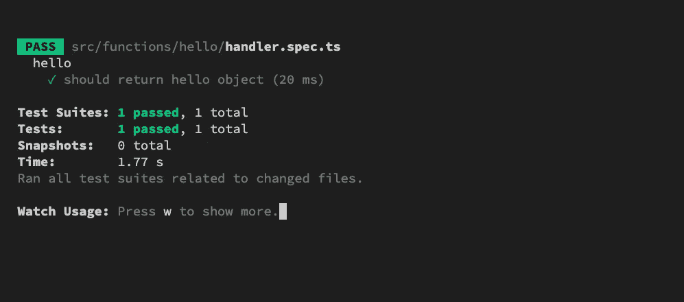

# 如何用无服务器启动 Typescript 和 Node.js AWS 函数

> 原文：<https://javascript.plainenglish.io/how-to-start-typescript-node-aws-function-with-serverlessjs-ef4b55910127?source=collection_archive---------2----------------------->



在本文中，我们将讨论使用无服务器和 TypeScript 启动项目。本文需要关于 AWS 无服务器架构、无服务器框架和 TypeScript 的基础知识。

我们将使用最新稳定版的 Serverless (2.35.0)来构建一个“简单”的 Serverless 项目——一个带有 AWS Lambda 函数和 API 网关的 REST API。

# 要求

*   [Node.js](https://nodejs.org/en/) (14.x 版本)
*   [无服务器](https://www.serverless.com/)

```
$ mkdir ts-jest-serverless
$ cd ts-jest-serverless
$ npm install serverless --no-save
```

使用`--no-save`选项安装无服务器软件包，以避免创建`package.json`文件。在下一部分中，我们将使用一个模板来启动项目。

# 打字稿模板

当我们想用 TypeScript 构建项目时，这是一种初始化项目的简单方法。

```
$ npx serverless create --template aws-nodejs-typescript
$ npm install
```

现在我们有了一些配置文件:

*   `serverless.ts` —无服务器配置
*   `tsconfig.paths.json`和`tsconfig.json` —打字稿配置
*   `webpack.config.js` —网络包配置

而且我们还有一个简单的函数——`hello`函数。

如有必要，让我们更新`package.json`和`serverless.ts`文件中的项目信息。

函数定义的“强类型”。如您所见，`hello`函数定义被导出为没有类型的对象，我们不能在这里使用 Typescript 建议和类型检查特性。让我们将`AWSFunction`导出为`src/libs/lambda.ts`中的通用类型

```
import middy from "[@middy/core](http://twitter.com/middy/core)"
import middyJsonBodyParser from "[@middy/http-json-body-parser](http://twitter.com/middy/http-json-body-parser)"
import type { AWS } from "[@serverless/typescript](http://twitter.com/serverless/typescript)";export const middyfy = (handler) => {
  return middy(handler).use(middyJsonBodyParser())
}// AWSFunction type
export type AWSFunction = AWS['functions'][0];
```

然后，将`hello`函数定义转换为`AWSFunction`:

```
import schema from './schema';
import { handlerPath } from '[@libs/handlerResolver](http://twitter.com/libs/handlerResolver)';
import { AWSFunction } from '[@libs/lambda](http://twitter.com/libs/lambda)';export default {
  handler: `${handlerPath(__dirname)}/handler.main`,
  events: [
    {
      http: {
        method: 'post',
        path: 'hello',
        request: {
          schema: {
            'application/json': schema
          }
        }
      }
    }
  ]
} as AWSFunction;
```



Code suggestion with VSCode

尝试构建项目:

```
npx sls package
```



Serverless warnings

尝试修复警告:

*   使用`events.http.request.schemas`代替`src/functions/hello.index.ts`中的`…schema`
*   禁用`CLI_OPTIONS_SCHEMA`警告(等待`serverless-webpack`插件更新)。更新`serverless.ts`

```
...
  disabledDeprecations: [
    'CLI_OPTIONS_SCHEMA',
  ],
  frameworkVersion: '2',
  custom: {
...
```

现在我们可以构建没有警告的项目了。

# 无服务器离线插件

> [这个无服务器](https://www.npmjs.com/package/serverless-offline)插件在你的本地机器上模拟 [AWS λ](https://aws.amazon.com/lambda) 和 [API Gateway](https://aws.amazon.com/api-gateway) ，以加快你的开发周期。

有了这个插件，我们可以通过 HTTP 请求在本地端轻松触发 lambda 函数。包括 lambda 函数是否与 API 网关集成。

安装插件:

```
$ npm install serverless-offline -D
```

启用插件:

```
// update plugin list in serverless.ts file...
  plugins: [
    'serverless-webpack',
    'serverless-offline',
  ],
...
```

创建脱机脚本:

```
// create a new npm script in package.json file...
"scripts": {
    "offline": "sls offline --noPrependStageInUrl"
},
```

服务“离线”服务器:

```
$ npm run offline
```



The local server is started

尝试使用请求正文调用`GET /hello` API:

```
$ curl --location --request POST 'localhost:3000/hello' \
       --header 'Content-Type: application/json' \
       --data-raw '{ "name": "hoangdv" }'
```

登录本地服务器终端将如下所示:

```
offline: POST /hello (λ: hello)
offline: (λ: hello) RequestId: cknx634oo0008q0pmdlynfvyl  Duration: 21.81 ms  Billed Duration: 22 ms
```

使用预设选项时，会启用监看模式。这意味着当你更新**入口点**文件(函数文件)或**其相关的**文件时，本地服务器会自动“刷新”更新新的变化。

我们还可以在调试模式下运行脱机服务器。程序文件为`./node_modules/.bin/serverless`。

如果使用的是 VSCode，让我们点击`command + shift + p`(打开命令选项板)，然后输入`Debug npm Script`，点击 enter(如果有多个 npm 脚本，请选择`offline`脚本)。

设置断点结束调用 API 终结点:



Debug with breakpoint

# APIGatewayProxy 响应中间件

在`hello`函数句柄文件中，我们使用`formatJSONResponse`函数创建 API Gateway 集成代理响应。该函数总是返回一个响应对象，其状态代码为 200，让我们对其进行更新，使其更有用。

使`statusCode`成为参数，以 200 为默认值:

```
import type { APIGatewayProxyEvent, Handler } from "aws-lambda"
import type { FromSchema } from "json-schema-to-ts";type ValidatedAPIGatewayProxyEvent<S> = Omit<APIGatewayProxyEvent, 'body'> & { body: FromSchema<S> }
export type ValidatedEventAPIGatewayProxyEvent<S> = Handler<ValidatedAPIGatewayProxyEvent<S>, any>export const formatJSONResponse = (response: Record<string, unknown>, statusCode: number = 200) => {
  return {
    statusCode,
    body: JSON.stringify(response),
  }
}
```

在每个函数处理程序中，我们必须记住调用`formatJSONResponse`函数，这不是一个好主意。

现在，你还必须通过`try/catch`来处理函数处理程序内部的错误，如果我们有一个错误处理程序来处理所有的函数错误会更好。

我们的模板使用[middle](https://www.npmjs.com/package/middy)来应用中间件模式，这样我们就可以很容易地解决上述问题。

让我们在`src/libs/middleware.ts`中创建`apiGatewayResponseMiddleware`中间件工厂

`after`和`onError`是中间件语法。我们也使用`async/await`语法，这样就不需要提供中间件的`next`功能。

*   `after`:检查响应是一个 HTTP 请求，并且该请求尚未格式化，然后将其格式化为 API 网关响应。
*   `onError`:错误情况处理。默认状态码是 500，如果错误是一个`AppError`状态码将被设置为错误的状态码。

`AppError`类:`src/libs/appError.ts`

```
export class AppError extends Error {
  statusCode: number;constructor(message: string = '', statusCode: number = 400) {
    super(message);
    this.statusCode = statusCode;
  }
}
```

向我们的 middy 注册新的中间件:

```
// src/libs/lambda.ts
import middy from '[@middy/core](http://twitter.com/middy/core)';
import type { AWS } from '[@serverless/typescript](http://twitter.com/serverless/typescript)';
import middyJsonBodyParser from '[@middy/http-json-body-parser](http://twitter.com/middy/http-json-body-parser)';
import { Handler } from 'aws-lambda';import { apiGatewayResponseMiddleware } from './middleware';export const middyfy = (handler: Handler) => {
  return middy(handler)
    .use(middyJsonBodyParser())
    .use(apiGatewayResponseMiddleware({ enableErrorLogger: process.env.IS_OFFLINE === 'true' }));
}export type AWSFunction = AWS['functions'][0];
```

从现在开始，在函数处理程序中，我们可以不调用 format 函数而返回一个结果:

`src/function/hello/handler.ts`

```
...
const hello: ValidatedEventAPIGatewayProxyEvent<typeof schema> = async (event) => {
  return {
    message: `Hello ${event.body.name}, welcome to the exciting Serverless world!`,
    event,
  };
}
...
```

在我们的逻辑代码中，只要在出错时抛出一个错误，这个错误就会被我们的中间件捕获:

```
throw new AppError('User not found', 404);
```

# 用 Jest 进行单元测试

这部分向您展示了如何在我们的项目中使用 [Jest](https://www.npmjs.com/package/jest) 以及如何为函数处理函数编写单元测试。

安装 Jest:

```
$ npm install jest ts-jest @types/jest -D
```

Jest 配置:

```
// jest.config.js
const { pathsToModuleNameMapper } = require('ts-jest/utils');
const { compilerOptions } = require('./tsconfig.paths.json');module.exports = {
  roots: [
    '<rootDir>'
  ],
  testMatch: [
    '**/__tests__/**/*.+(ts|tsx|js)',
    '**/?(*.)+(spec|test).+(ts|tsx|js)'
  ],
  transform: {
    '^.+\\.(ts|tsx)$': 'ts-jest'
  },
  collectCoverageFrom: [
    '**/*.{js,jsx,ts,tsx}',
    '!**/*.d.ts',
    '!**/node_modules/**',
    '!.serverless/**',
    '!.webpack/**',
  ],
  moduleNameMapper: pathsToModuleNameMapper(compilerOptions.paths, { prefix: '<rootDir>/' }),
  globals: {
    'ts-jest': {
      tsconfig: 'tsconfig.json',
    },
  },
}
```

启用`tsconfig.json`中的`esModuleInterop`选项。

在`package.json`中创建测试脚本:

```
...
"scripts": {
  "offline": "sls offline --noPrependStageInUrl",
  "test": "jest",
}
...
```

因为我们的 handler 函数在导出之前是被`middyfy`函数包装的。

```
export const main = middyfy(hello);
```

然后，我们必须在导入处理函数之前模仿`middyfy`。

`src/functions/hello/handler.spec.ts`

我们模仿`middyfy`函数只返回处理函数。然后使用`import` api 导入处理函数。现在我们可以很容易地测试处理函数的结果。

运行测试脚本:

```
$ npm run test
```



The test result

# 包扎

我希望你喜欢这篇文章，并从中获得一些有用的东西。现在，您可以使用 TypeScript 开始您的无服务器项目了。

本文使用的源代码发表在 [Github](https://github.com/codetheworld-io/ts-jest-serverless) 上。

感谢阅读！

[*更多内容尽在 plainenglish.io*](http://plainenglish.io/)