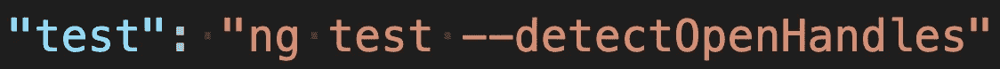

# 如何阻止 Jest 测试挂在角上

> 原文：<https://javascript.plainenglish.io/how-to-stop-jest-tests-from-hanging-in-angular-7302b35ac788?source=collection_archive---------4----------------------->

## 用模拟服务对组件进行单元测试


Photo by [Maxwell Nelson](https://unsplash.com/@maxcodes?utm_source=medium&utm_medium=referral) on [Unsplash](https://unsplash.com?utm_source=medium&utm_medium=referral)

在我当前的项目中，我们使用 Jenkins 运行了许多构建:连续的和手动的。一个必需的步骤是断言在我们的 Angular 应用程序可以部署到 AWS 之前，我们所有的 Jest 单元测试都通过了。这个过程可能需要几分钟，当开始一个构建，去洗手间或喝咖啡休息，然后回到一个失败的构建，甚至更糟糕的是，一个挂起的构建时，这个过程可能会变得令人沮丧。前者通常更直截了当地指出哪里出了问题，但后者却令人沮丧和困惑。

## 嘲弄服务

组件单元测试的一个关键方面是模拟服务调用。这有助于只隔离出有问题的类的功能。其机制是用测试床配置中的模拟对应物覆盖服务。这是一个尝试从登录服务及其相应的 spec 测试中检索用户数据的基本组件。

home.component.ts

home.component.spec.ts

在 spec 测试中，LoginService 正在被模拟，但是它的 getUserDataObservable 函数尚未被覆盖。这似乎在 Jest 中创造了一种奇怪的情况。当运行单元测试时，我们得到这个神秘的错误，并且测试无限期地挂起。

Jest hanging error

该错误没有指出问题发生在哪里；没有有用的堆栈错误。我求助于试错法，发现一个未锁定的服务方法导致了这个问题。

通过向 LoginServiceMock 中添加一个 getUserDataObservable mock 函数，这个特殊的 spec 测试很容易解决。

不幸的是，对于具有几个模拟服务的大型组件来说，忽略了哪个或哪些方法并不明显。当运行多个测试套件时，这个问题变得更加复杂，示例输出如下。

Multiple test suites running

在运行状态停止切换到通过之前，一切看起来都很好。时间流逝，但没有错误，直到一分钟左右，可怕的圆形对象错误才出现。这个问题的快速谷歌搜索告诉我们，一些对象正在引用自己，但我们甚至不知道这是指什么对象。经过深入研究，我们终于找到了这个谜的答案。

## Jest 选项

可取之处是一个叫做 ***的玩笑标志。*** 如果你在 [Jest 文档](https://jestjs.io/docs/cli#--detectopenhandles)中查找，你会看到以下描述:

> `--detectOpenHandles`
> 
> 尝试收集和打印开放句柄，防止 Jest 干净地退出。在需要使用`--forceExit`来让 Jest 退出以潜在地追踪原因的情况下使用这个。这意味着`--runInBand`，让测试连续运行。使用`[async_hooks](https://nodejs.org/api/async_hooks.html)`实现。此选项对性能有很大影响，应仅用于调试。

性能警告令人生畏，但值得一试，看看这是否有助于解决我们的问题。某些东西无疑阻止了我们的 Jest 测试正确退出，为什么不呢？

在将它添加到我们的 package.json 测试脚本之后



运行之前冻结的相同单元测试，现在显示一个实际上有意义的错误。

Jest undefined function error

这个错误比我们上次看到的圆形物体有用得多。

> 我一生中从未如此高兴地看到堆栈跟踪。

更令人鼓舞的是，我们的单元测试将会完成，我们的 Jenkins 构建实际上能够提供一个失败的状态。

现在建议你不要过多的使用这个旗帜，但是我们决定把它留在我们的詹金斯版本中。即使使用我们的 **160 个测试套件和近 600 个测试**，我们也没有发现任何严重的性能下降。错误处理的好处和使用 detectOpenHandles 节省的时间是值得的。

这个选项肯定可以防止将来浪费编码周期来追踪不正确定义的模拟。当然，如果你勤于嘲讽，并且经常在本地测试，那么你可能永远都不需要使用它。大多数开发人员全神贯注于他们的应用程序代码，单元测试往往会落后。当他们这样做的时候，你就会进入这种悬着的状态，你会感激有这面旗帜在你的支配之下。好在我们没有在这个问题上纠结太久。

希望这有助于把你从我们面临的烦恼中解救出来。

## 2021 年 4 月 8 日更新

自从写这篇文章以来，我的项目现在有 **174 个测试套件和 2813 个测试**。我们一直很忙！我相信我们达到了大约 1500 到 2000 次测试的性能阈值，其中 detectOpenHandles 确实产生了很大的影响。下面是一些用于比较的运行时间。

```
**WITH detectOpenHandles - sequential**
Test Suites: 174 passed, 174 total
Tests:       2813 passed, 2813 total
Snapshots:   0 total
**Time:        1398.452 s****WITHOUT detectOpenHandles - parallel** Test Suites: 174 passed, 174 total
Tests:       2813 passed, 2813 total
Snapshots:   0 total
**Time:        489.689s**
```

至少他们的文档是准确的。我更新了我们的詹金斯配置，以便能够打开/关闭标志。

*更多内容请看*[*plain English . io*](http://plainenglish.io/)