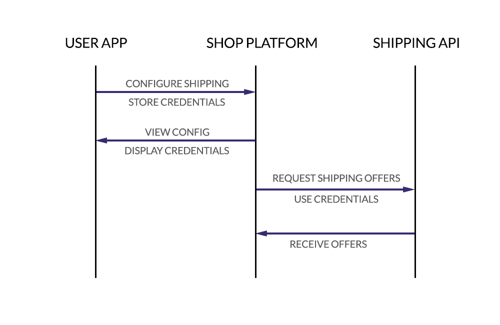

# 如何存储应用编程接口凭据

> 原文：<https://javascript.plainenglish.io/how-to-store-b2b-api-credentials-c207b4991160?source=collection_archive---------5----------------------->

## 如何在保守秘密的同时保持内心平静？

Photo by [Samantha Lam](https://unsplash.com/@contradirony?utm_source=unsplash&utm_medium=referral&utm_content=creditCopyText) on [Unsplash](https://unsplash.com/s/photos/keys?utm_source=unsplash&utm_medium=referral&utm_content=creditCopyText)

信息技术历史上充斥着保守秘密的失败，比如在一个阴暗的网站上出售数百万的用户名和密码。存储凭据比看起来要困难得多。

我最近不得不解决这个任务的一个变体。在将运输服务集成到电子商务网站时，我偶然发现了一个简单的问题:如何在商店数据库中存储运输服务的 API 凭据？

挑战在于我们不能像对待用户密码那样使用散列法(这篇[优秀的文章](https://nakedsecurity.sophos.com/2013/11/20/serious-security-how-to-store-your-users-passwords-safely/)详细解释了为什么散列法是用户密码唯一安全的选择)。我们需要凭据来访问 API，因此我们需要在从商店检索时显示它们——如下图所示。

# **一液**

想到加密。今天，AES-256 位加密被认为是最先进的，因为尝试所有的密钥直到你得到正确的密钥可能需要大量的资源和很长的时间。然而，加密本身也有风险。在最简单的情况下，一个没有大脑的用户选择“T7”密码作为密码，突然潜在的黑客可能会有一个更简单的任务，因为他们只需要尝试直到*密码*被发现。

规避这个问题的一个方法是在加密凭证之前**混淆**凭证**。这可以非常容易和快速地完成。**

这个想法很简单:让我们将凭证字符分散在一个更大的字符串中——就像在一盘盐中撒一些胡椒一样。

我们在`saltCredentials`的第 n 个字节之间连续插入输入`crds`中的每个字符，并注意使后者足够长以容纳全部输入。对于反向提取，我们还需要保持原始长度和步长的增加。在加密之前，我们将该信息存储在生成的有效载荷的前两个字节中。

相反的过程同样简单。我们首先解密，然后从有效载荷的前两个字节中提取元信息。然后循环提取盐中的原始胡椒。

这是防黑客的吗？不。如果黑客打算把资源花在破解您的方案上，他们会处理的。这会让事情更难吗？很可能，尤其是因为他们无法分辨哪个解密密钥是正确的。最后一步是隐藏软件，这很容易通过用`php`包装器封装来完成。

顺便说一句:还有许多其他方法来混淆文本。上面的是一个极端的简化，我们在这里展示它只是为了启发你想出自己的解决方案。开心莫名其妙！

完整代码在 [GitHub](https://gist.github.com/zapalote/7deff5056e16e9e373b380db8c3d0f68) 上。欢迎评论和改进。

感谢您的阅读。我希望这很有趣。

*更多内容尽在*[plain English . io](http://plainenglish.io/)