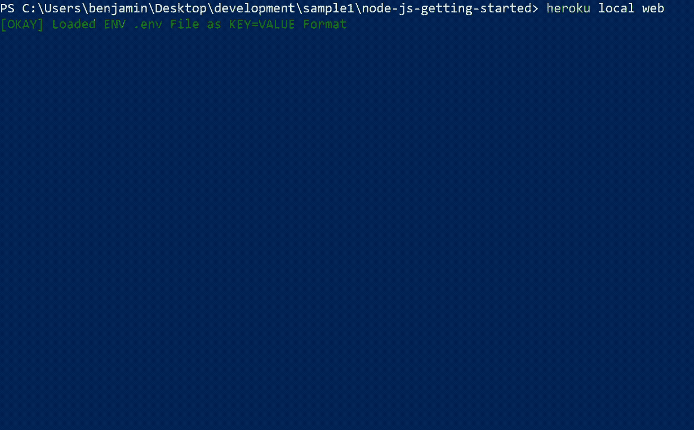
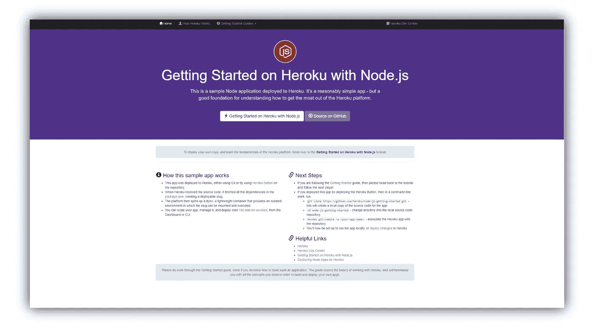
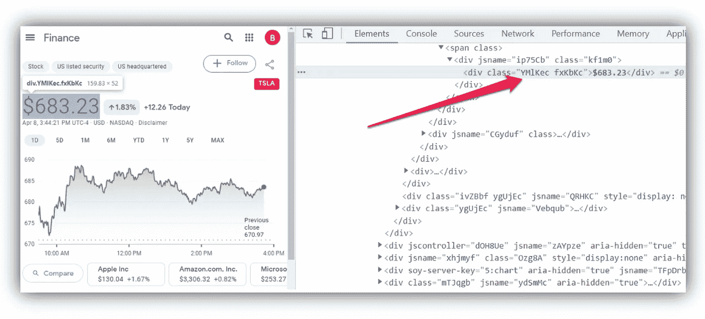
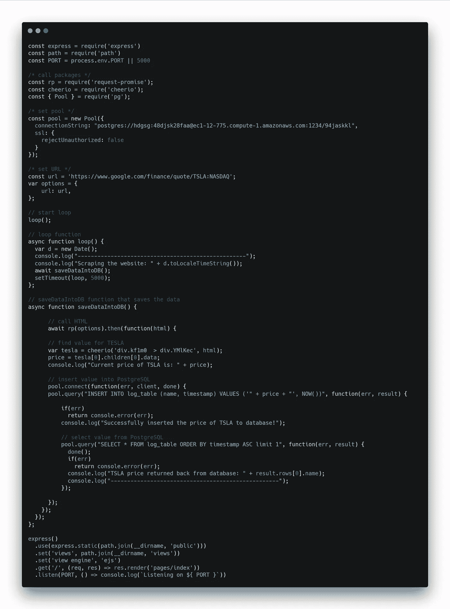

# 如何在网页抓取后将数据存储在 PostgreSQL 中

> 原文：<https://javascript.plainenglish.io/how-to-store-your-data-in-postgresql-after-web-scraping-6bfe3bb1b83f?source=collection_archive---------7----------------------->

## 关于如何将数据抓取并保存到远程数据库以备将来分析的教程


Photo by [Chris Liverani](https://unsplash.com/@chrisliverani?utm_source=medium&utm_medium=referral) on [Unsplash](https://unsplash.com?utm_source=medium&utm_medium=referral)

# 目的

在我的上一篇文章中，我写了使用 Node.js 抓取网站并通过 Twilio 发送通知。

然而，如果我们能够 ***将*** 的数据存储在数据库中以便以后使用，而不是丢失所有收集的数据，不是很好吗？

我们将在本教程中这样做。

我将一步一步地解释如何运行 web scraper，并最终连接到外部数据库来保存抓取的数据。



Web scraper looking at a TESLA stock and saving the price into a database

# 先决条件

*   首先推荐阅读我的文章“[使用 Node.js 抓取并发送 Twilio 通知](/use-node-js-to-scrape-and-send-twilio-notifications-e9c0193adde4)”它解释了如何运行 Node.js 应用程序，以及如何使用 **cheerio** 和**response-request***进行必要的 HTTP 调用。*
*   *您需要了解基本的 SQL 语句，并理解它是如何工作的。我不会对此进行过多的探讨，但是作为一名开发人员，了解一下**创建**、**选择**和**插入**语句会有所帮助。一个很棒的教程可以在这里找到[。](https://www.w3schools.com/sql/)*
*   *注册一个 [Heroku](https://heroku.com/) 账户。Heroku 是一个[平台即服务](https://en.wikipedia.org/wiki/Platform_as_a_service) (PaaS)，允许你在他们的服务器上运行你的网络应用。最棒的是，你可以免费注册！*

*解决了这个问题，让我们开始编程。*

# *决定刮去和储存什么*

*对于本教程，我决定刮掉谷歌财经页面上找到的特斯拉股票。*

*股票价格每 5 秒更新一次，因此将数据抓取并存储将是一个很好的例子。之后，我们可以在数据库表中看到所有股票价格的日志。*

> ***注**:该网站的网址为:[https://www.google.com/finance/quote/TSLA:NASDAQ](https://www.google.com/finance/quote/TSLA:NASDAQ)*

# *创建 Node.js 应用程序并将其推送到 Heroku*

*Heroku 很好地[解释了](https://devcenter.heroku.com/articles/getting-started-with-nodejs?singlepage=true)如何创建 Node.js 应用程序，但是你实际上并不需要运行这个特殊的例子的所有步骤。*

## *1.安装*

*首先，使用 Heroku 的启动项目，将其克隆并`cd`到项目中:*

```
*$ git clone [https://github.com/heroku/node-js-getting-started.git](https://github.com/heroku/node-js-getting-started.git)
$ cd .\node-js-getting-started\*
```

## *2.安装必要的软件包*

*上一篇文章提到，你需要安装**请求-承诺**和 **cheerio** ，以及 **pg:***

```
*$ npm install request-promise cheerio pg*
```

> ****注意*** *:我注意到这个安装在我第一次运行的时候挂起。如果您遇到这种情况，请关闭命令提示符，然后再次重新运行该命令。**

## *3.创建和部署您的 Heroku 应用程序*

*软件包安装完成后，您需要将应用程序部署到 Heroku。通过创建一个应用程序，Heroku 将创建一个随机的(而且通常很有趣！)您的应用程序名称:*

```
*$ heroku create
Creating app... done, [https://shieldy-sierra-14395.herokuapp.com](https://shield-sierra-12335.herokuapp.com)*
```

*最后，将代码部署到远程 Heroku:*

```
*$ git push heroku main*
```

*如果一切按计划进行，您应该会收到一条消息，说明您已经成功地将应用程序部署到 Heroku。然后，您需要确保*应用程序的至少一个*实例正在运行，并打开浏览器以确定它是否工作:*

```
*$ heroku ps:scale web=1
$ heroku open*
```

*如果操作正确，您的浏览器应该会自动打开，您应该会看到 Heroku 应用程序正在运行——很好！*

**

*Node.js website opening up in Heroku*

# *创建和配置数据库*

*现在，您已经有了自己的 Heroku web 应用程序，下一步是创建一个数据库来存储从 scraper 获得的必要信息。幸运的是，Heroku 也提供免费的数据库。*

## *1.添加供应附加组件(例如 PostgreSQL)添加到您的应用程序*

*要添加数据库，只需键入:*

```
*$ heroku addons:create heroku-postgresql:hobby-dev*
```

## *2.创建表格*

*由于默认情况下数据库没有表，我们需要手动创建它:*

```
*$ heroku pg:psql
DATABASE => create table log_table (id SERIAL PRIMARY KEY, name TEXT, timestamp TIMESTAMP);
CREATE TABLE*
```

*该命令创建一个名为 **log_table** 的表，包含“id”、“name”和“timestamp”列。股票价格将存储在这个表中。*

> ****注意*** *:为了让****heroku pg:SQL****命令工作，你*必须安装 *Postgres。说明可以在这里找到*[](https://devcenter.heroku.com/articles/heroku-postgresql#local-setup)**。***

# **将所有内容放在 index.js 中**

**还记得我们之前创建的 Heroku 应用程序项目吗？在 IDE 中打开该项目(我个人最喜欢的是 [Visual Studio 代码](https://code.visualstudio.com/)，并导航到 **index.js** 。**

## **1.设置您的默认包**

**像这样插入您的**请求-响应、cheerio、pg** 包:**

## **2.查找您的 PostgreSQL 凭据**

**然后，您需要找到您的 PostgreSQL 连接凭据。幸运的是，您可以通过运行以下命令找到它:**

```
**$ heroku pg:credentials:url DATABASE**
```

**在命令提示符下显示的是您的 **connectionString** 。*复制连接字符串。*连接字符串是使您能够连接到远程数据库粘合剂。**

## **3.配置您的连接字符串和 URL**

**要连接到远程数据库，将您在上一步中找到的 **connectionString** 放入您的**池**中，并设置您的 **URL** :**

## **4.实施循环()**

**一旦配置完成，您现在将实现一个简单的循环。这个循环的主要目的是每 5 秒暂停一次。我们用一个`setTimeout`来做这件事。**

**然后循环函数调用**savedatintodb()**，我们接下来将实现它。**

## **5.实现**savedatintodb()****

**咻！我们做了很多，但是现在要实现我们实际的刮刀，这是 **index.js** 的肉。**

**首先，我们需要弄清楚*我们将如何*获得特斯拉的股票价值。作为参考，下面是以 HTML 格式显示的谷歌财务页面的图片。请注意，股票值被一个带有类别**yml CEC**的`div`所包围。这就是我们在 **cheerio 中期待的。****

****

**We see that the TSLA stock is wrapped in a div with a class “YMlKec”**

****cheerio** 将做的是找到围绕特斯拉股票的`div`。然后，它提取其中的值。**

**之后，您将构建两条 SQL 语句:**

*   **第一个语句是一个 **INSERT** 语句，它将把特斯拉值插入到表中。**
*   **第二个语句是一个 **SELECT** 语句，它将从表中选择插入的值。**

# **最终代码**

**当我们把所有东西放在一起时，下面是最终的代码:**

****

**Final code for index.js**

# **运行代码**

**要启动 web scraper，请输入:**

```
**$ heroku local web**
```

**您应该看到您的 web scraper 编译成功，开始 web 抓取，并保存数据。**

**恭喜你！**

# **结论**

*   **您创建了自己的 Node.js 应用程序，并将其推送到 Heroku。**
*   **接下来，您将一个 PostgreSQL 数据库附加到它。**
*   **然后实现一个 web scraper，每 5 秒查看一次 TESLA 股票。**
*   **然后使用 Javascript 编写的 SQL 语句将数据远程存储在数据库中。**
*   **最后，您将结果记录到控制台上。**

**我计划在此基础上创建另一个教程，其中记录的数据将显示在 web 应用程序中。**

**一定要回来看看。**

**干杯！**

***更多内容请看*[***plain English . io***](https://plainenglish.io/)**