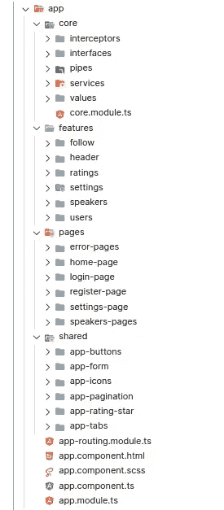
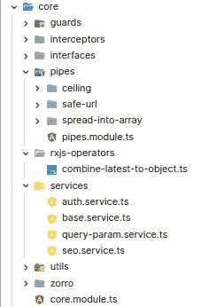
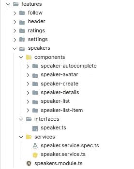
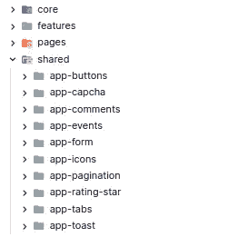
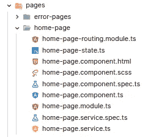
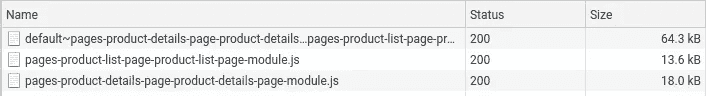
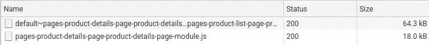
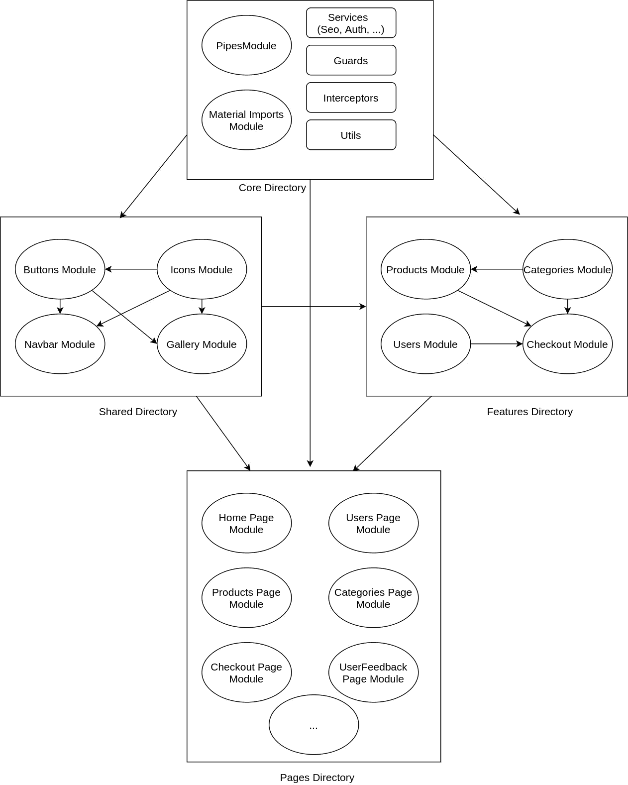

# 2021 年如何架构 Angular Apps

> 原文：<https://javascript.plainenglish.io/how-to-structure-angular-apps-in-2021-a0bdd481ad0d?source=collection_archive---------0----------------------->


Photo by [Kaleidico](https://unsplash.com/@kaleidico?utm_source=medium&utm_medium=referral) on [Unsplash](https://unsplash.com?utm_source=medium&utm_medium=referral)

> **编辑-2** :更新图表，添加注释。
> 
> **编辑-1** :添加 github repo 的图表和示例。

有许多方法可以构建一个有角度的应用程序。但这就是我如何构建我的应用程序，以获得广泛的灵活性、可伸缩性和较小的初始包大小。



Fig-1: Preferred Directory Structure

*   **核心**:app 启动绝对必不可少的东西。
*   **特性**:业务逻辑。包含特定业务功能的模块、组件、服务和其他角度构建块(如果需要)。
*   **分享**:组件哑到疼！
*   **页面**:带惰性加载模块的路由组件。

# 核心

核心目录是放置单体服务、注入令牌、常量、应用配置、管道、拦截器、防护、认证服务、实用程序等的地方。这将在应用程序范围内使用。如果有特定于应用程序本身、部署、CI/CD、API 和开发人员的东西，很可能属于核心。



Fig-1: Example Core directory

# 特征

商业特征存在于这个目录中。根据每个特征制作一个模块。该模块可以包含组件、指令、管道、服务、接口、枚举、实用程序等等。我们的想法是保持事物的紧密联系。所以，一个只在`Speakers`模块中使用的管道不应该被定义在全局作用域或`Core`内部。这同样适用于该模块所需的任何其他角形积木。



Fig-2: An example feature module

组件以模块名为前缀，例如，如果模块名是`SpeakersModule`，组件将被命名为`SpeakerAbcComponent, SpeakerXyzComponent`等。

**保持目录中的组件树平坦**。这意味着，如果`SpeakerListComponent`是父节点而`SpeakerListItemComponent`是子节点，不要在`speaker-list`目录中创建`speaker-list-item`组件。前缀命名应该清楚地表明这种关系。这样做的目的是能够一眼看出模块中驻留了什么组件。

功能模块可以导入其他功能，显然是从共享模块中导入。

# 共享的

将共享模块视为用户界面组件的迷你库。它们并不特定于某一个业务功能。他们应该是超级愚蠢的，你可以拿走所有的组件，放入另一个角度项目，并期待工作(给定的依赖性得到满足)。您可能已经知道包装其他库提供的用户界面组件，如 Material、ng-zorro-antd、ngx-bootstrap 等。是一个很好的练习。它保护您免受其 API 更改的影响，并允许您在需要时替换底层库。共享模块中的组件是进行这种包装的好地方。



Fig-3: Example Shared Directory

**不要制造一个巨大的** `**SharedModule**`，而是将每个原子特征粒化成它自己的模块(见图 3)。允许交叉导入原子共享模块，但尽量减少。为了带来一个小库的味道，你甚至可以给目录&模块加上你的角度应用的自定义前缀(默认为`app`)。

# 页

Pages 目录是这个结构中最有趣的部分。把它想象成一个*水槽*，功能模块落入其中，但是没有出来(即没有导出的成员)。在这些模块中，除了页面之外，您不声明任何组件。



Fig-4: Example Page Module

页面控制器没有业务逻辑。他们仅仅是展示者，协调来自业务功能模块的组件。比方说——主页。它将包含一个标题，一个英雄部分，文章，评论，联系等。部分—全部来自各自的功能模块！

```
[@NgModule](http://twitter.com/NgModule)({
    declarations: [HomePageComponent],
    imports: [
        CommonModule,
        **ArticlesModule,
        CommentsModule,
        ContactModule,
        HeadersModule,**
        HomePageRoutingModule,
    ],
})
export class HomePageModule {}
```

虚构的*主页. component.ts* 可能是什么样子:

```
*<!-- Component from HeaderModule -->*
**<app-header-default></app-header-default>**<main class="container">
    <app-hero-content></app-hero-content> *<!-- Component from ArticleModule -->*
    **<app-article-list></app-article-list>**    *<!-- Component from CommentModule -->*
    **<app-comment-list-latest></app-comment-list-latest>** *<!-- Component from ContactModule -->*
    **<app-contact-form></app-contact-form>**
</main>*<!-- Component from FooterModule -->*
**<app-footer-default></app-footer-default>**
```

他们可以从特定于页面的服务中获取帮助，该服务只为该页面组合数据和状态。**针对页面组件提供服务，不在** `**root**`。否则，即使在您离开页面后，这种状态也可能持续存在，因为页面组件将被破坏，而页面服务不会被破坏。

```
// home-page.service.ts@Injectable()
export class HomePageService {} // home-page.component.ts@Component({
    ...
    providers: [HomePageService]
}
export class HomePageComponent {
    constructor(private homePageService: HomePageService){}
}
```

页面模块最重要的目的是每个模块都被延迟加载，以使应用程序性能更好、更精简。

> **每个页面模块都是惰性加载的！**

**Pro-tip:** 如果您为每个模块定义了一个页面组件，那么您可以要求进一步减小初始束大小。这种做法也将所有路线组织在一个更容易管理的单一来源(即`AppRoutingModule`)中。然后，您的 *app-routing.module.ts* 文件可能如下所示:

```
const appRoutes: Routes = [
    {
        path: '',
        loadChildren: () => import('./pages/home-page/home-page.module').then((m) => m.HomePageModule),
    },
    {
        path: 'home',
        redirectTo: '',
        pathMatch: 'full',
    },
    {
        **path: 'products/:id',  // <-------- NOTE 1\. Child route**
        loadChildren: () =>
            import('./pages/product-details-page/product-details-page.module').then((m) => m.ProductDetailsPageModule),
    },
    {
        **path: 'products',     // <--------- NOTE 2\. Parent route**
        loadChildren: () =>
            import('./pages/product-list-page/product-list-page.module').then((m) => m.ProductListPageModule),
    },
    {
        path: 'checkout/pay',
        loadChildren: () =>
            import('./pages/checkout-payment-page/checkout-payment-page.module').then((m) => m.CheckoutPaymentPageModule),
    },
    {
        path: 'checkout',
        loadChildren: () => import('./pages/checkout-page/checkout-page.module').then((m) => m.CheckoutPageModule),
    },
    {
        path: '**',
        loadChildren: () => import('./pages/not-found-page/not-found-page.module').then((m) => m.NotFoundPageModule),
    },
]
```

***备注 1 & 2*** *:由于路由声明是自顶向下解析的，所以一定要在父路径之前声明子路径。这将确保正确提取延迟加载块。否则，如果您首先定义父路由，那么访问任何子路由也会不必要地加载父路由的模块块。您可以在 DevTools 中看到不同之处。这是我的实验，当我把父路由放在第一位(图 5.1)和子路由放在第一位(图 5.2)并访问 http://mysite.com/products/1.*



Fig-5.1: When /products declared **BEFORE** /products/:id in routes config



Fig-5.2: When /products declared **AFTER** /products/:id in routes config

# 结论

如果你以这种方式构建你的角度应用，它就会变成线性的。下图总结了—



Fig-6: Structure of Modules and Directories at a Glance

请看这里的应用示例:[touhidrahman/structure-ng-app-2021](https://github.com/touhidrahman/structure-ng-app-2021)

# 奖金

将目录路径添加到您的 *tsconfig.json* 文件中，以便您的应用程序中的导入路径更短更好:

```
// tsconfig.json
{
    "compilerOptions": {
        "baseUrl": "./",
        **"paths": {
            "**[**@core**](http://twitter.com/core)**/*": ["src/app/core/*"],
            "**[**@features**](http://twitter.com/features)**/*": ["src/app/features/*"],
            "**[**@shared**](http://twitter.com/shared)**/*": ["src/app/shared/*"],
            "**[**@environment**](http://twitter.com/environment)**/*": ["src/environments/*"]
        },**
        "outDir": "./dist/out-tsc",
    ...
}
```

现在，您的导入将被别名化为`import { Nice } from '@features/nice`而不是`import { Ugly } from './../../path/to/ugly`。

感谢阅读！

*更多内容请看*[***plain English . io***](https://plainenglish.io/)