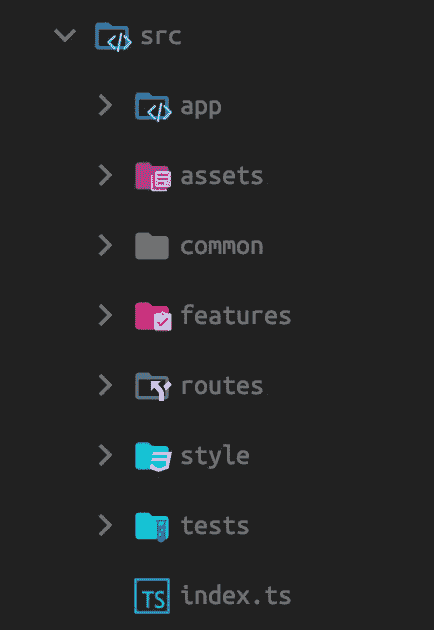
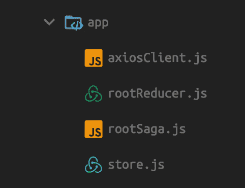
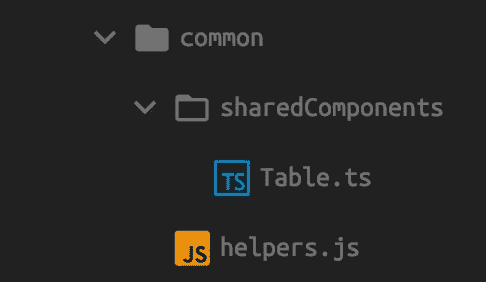
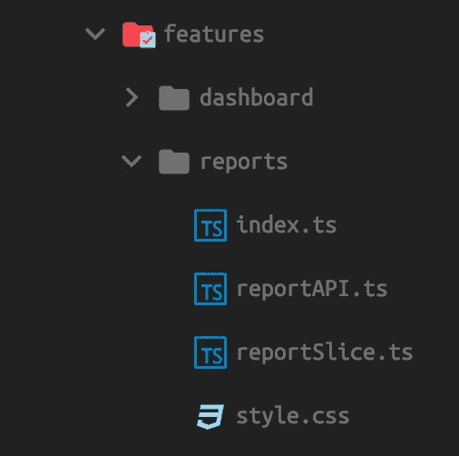
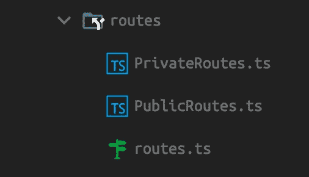
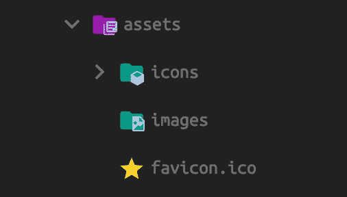
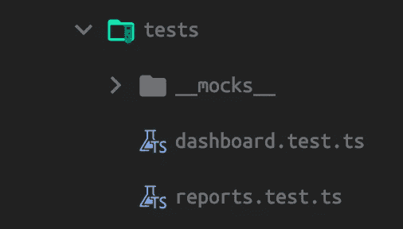
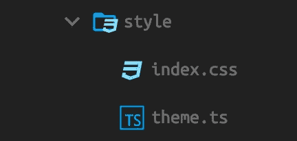

# 如何构建你的 React Redux 应用

> 原文：<https://javascript.plainenglish.io/how-to-structure-your-react-redux-app-83d523851137?source=collection_archive---------1----------------------->

react-redux 应用程序的特征文件夹结构便于维护。

Photo by [Alexander Rotker](https://unsplash.com/@awrotker?utm_source=unsplash&utm_medium=referral&utm_content=creditCopyText) on [Unsplash](https://unsplash.com/s/photos/brooklyn-bridge?utm_source=unsplash&utm_medium=referral&utm_content=creditCopyText)

React 是构建用户界面最流行的 JavaScript 库。React 没有任何标准的文件夹结构来对组件和逻辑进行分组。React 应用程序可以根据项目需求以任何方式构建。

但是 React 应用程序的不适当的结构会影响应用程序的可扩展性和可维护性。随着应用程序的增长，我们可能会添加新的功能并删除一些旧的功能，因此每个组件需要松散地相互耦合。让我们看看如何构建 React 应用程序来避免此类问题。

我们需要根据特征对文件进行分组。也就是说，特征的所有文件都在同一个文件夹中。请查看下图中的文件夹结构。

Folder Structure

在上图中，我们可以看到 React 应用程序的文件夹。让我们来分解每个文件夹的用途。

# 应用

整个应用程序使用的全局应用程序设置和配置在如下所示的**应用程序**文件夹中定义，包括 axiosClient、rootReducer、saga 和 store。

app folder

# 普通的

可重用的助手、共享组件、钩子等被定义在**公共**文件夹中。

common folder

# 特征

特定于功能的组件、[切片](https://redux-toolkit.js.org/tutorials/quick-start#create-a-redux-state-slice) (Redux reducer 逻辑和相关动作— [Redux Toolkit](https://redux-toolkit.js.org/) )、API 和样式放在**功能**文件夹中。

feature folder

# 路线

组件私有、公共路线在**路线**文件夹中定义。这里处理基于认证的路由限制。

routes folder

# 资产

图像、文件、图标等静态资产放在**资产**目录中。

assets folder

# 试验

单元测试用例及其模拟进入**测试**目录。

tests folder

# 风格

全局样式、主题配置放在**样式**文件夹中。

style folder

使用上面的特性文件夹结构，我们可以轻松地删除或添加与特性相关的代码，而不会出现问题。特征文件夹结构由 [Redux 风格指南](https://redux.js.org/style-guide/style-guide#structure-files-as-feature-folders-with-single-file-logic)推荐。通过使用 Redux Toolkit，我们避免了像 actions 和 reducers 这样的样板代码。

> 需要了解更多关于 Redux ToolKit 的知识？看看我写的关于 Redux toolkit 的文章。

# 资源

1.  [鸭子提案](https://github.com/erikras/ducks-modular-redux)
2.  [文件结构化](https://reactjs.org/docs/faq-structure.html)
3.  [Redux 工具包](/redux-toolkit-the-standard-way-to-write-redux-dcfb372202b8)

# 结论

基于文件夹的文件结构特性将使 React app 更具可维护性、可伸缩性和松耦合性。感谢您的阅读。

*更多内容尽在*[***plain English . io***](http://plainenglish.io/)