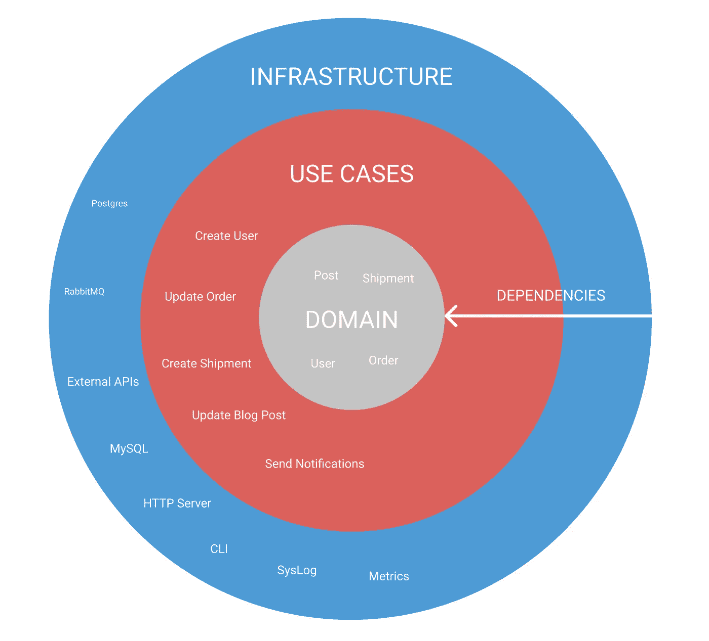
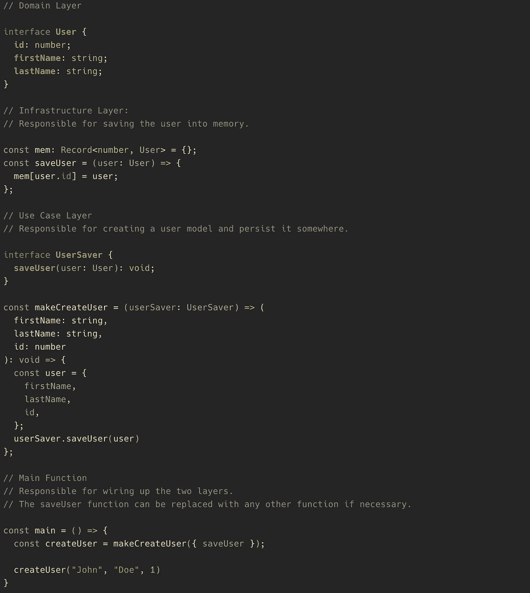
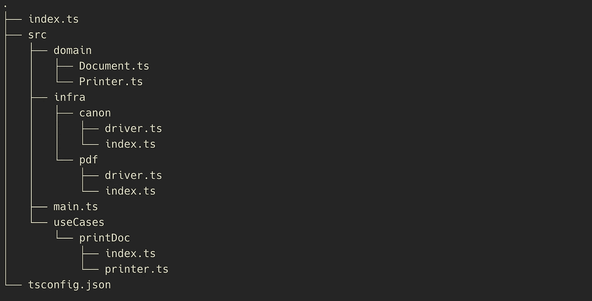
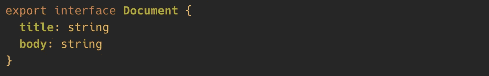
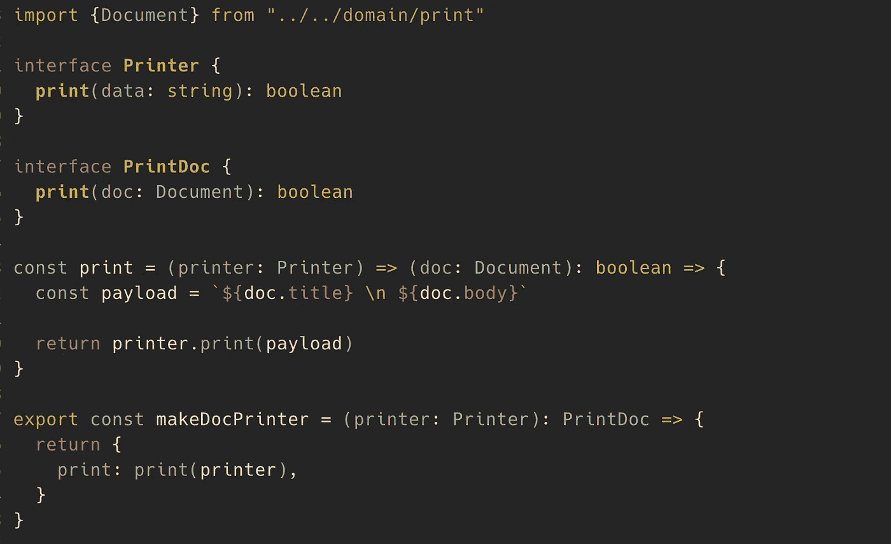
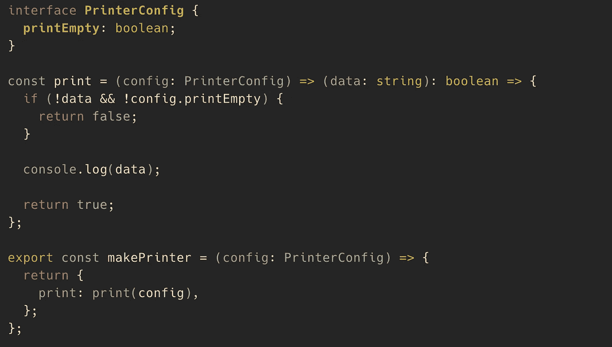
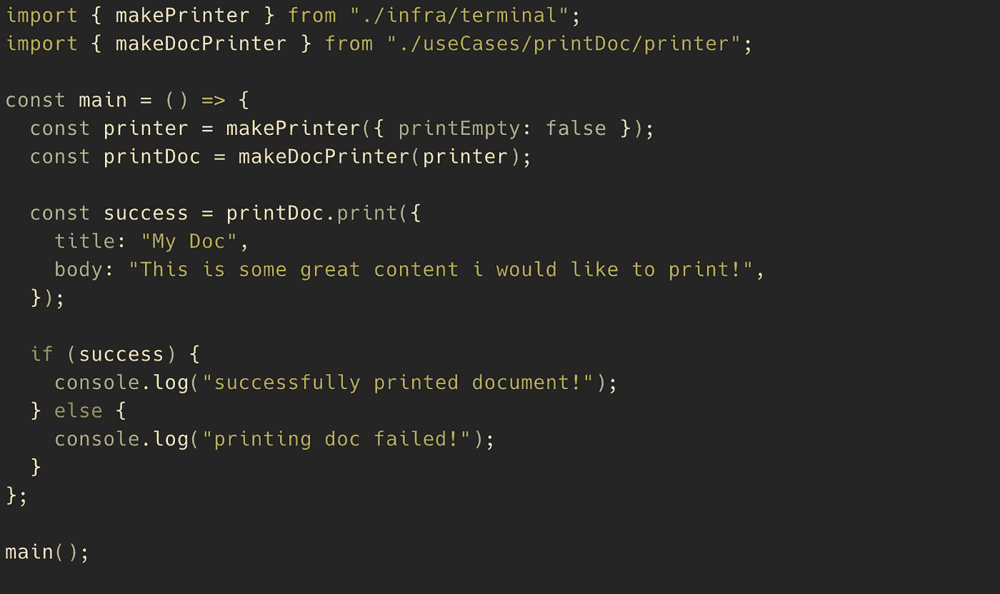

# 如何构建 TypeScript Node.js 应用程序

> 原文：<https://javascript.plainenglish.io/how-to-structure-your-typescript-node-js-application-db05bfbdf0b4?source=collection_archive---------0----------------------->

Source: [Unsplash](https://unsplash.com/photos/6n9JGobCASo)

对我来说，从头开始一个新的应用程序总是很难。

从 Ruby on Rails 或 Symphony 这样的框架中开发应用程序的初始结构尤其困难。

在 TypeScript 的世界中，我们倾向于避免有时固执己见的框架。这取决于我们从零开始想出一些伟大的东西，通常需要几次迭代才能把它做好。这就是为什么我决定根据我的个人经验编写一个小的实用指南，介绍如何构建 TypeScript Node.js 应用程序。

本文将包括一些实际操作的例子，并且我将触及一些重要的基本架构原则。我们将使用端口和适配器架构的简化版本。

如果您已经熟悉以下概念，这将非常有用:

*   你对打字稿有很好的理解。
*   你知道基本的 OOP 概念，比如接口和工厂函数，并且应该熟悉多态。我们将在函数式编码风格中应用这些原则。
*   你热爱软件架构，并且想了解更多。

我将首先介绍这些概念，然后通过一个实际例子说明在设计应用程序时如何应用这些概念。

## **端口和适配器**

在过去的十年中，端口和适配器的概念变得非常流行。这是一个关于如何构建应用程序的简单而强大的想法:

> 端口和适配器的概念是应用程序是系统的核心。所有的输入和输出都通过端口到达或离开应用程序的核心。该端口将应用程序与外部技术、工具和交付机制隔离开来。—[https://www . thinktocode . com/2018/07/19/ports-and-adapters-architecture/](https://www.thinktocode.com/2018/07/19/ports-and-adapters-architecture/)

让我们看一个简单的用例来理解这意味着什么:

> **用户想要打印文档。**

让我们暂时忘记问题的真正复杂性，只看本质部分:我们首先需要的是打印文档的打印设备。我们还需要驱动程序将您的虚拟文档翻译成您的打印机可以理解的低级和设备特定的消息/命令。

驱动程序的工作是封装特定打印机需要的所有逻辑，并向操作系统公开打印机的抽象版本。

我们这样做有一个很好的理由:操作系统必须支持所有类型的打印机。如果我们通过驱动程序使打印机可插拔，我们可以只添加一个新的，而不需要改变/扩展操作系统的核心。

将这个例子转换成端口和适配器:驱动程序是适配器，抽象打印机表示是端口。适配器可以并且将来会改变；端口可以保持不变。

你的应用应该足够灵活，可以替换将来可能被替换的某些部分。此外，有时您可能会针对不同的工作使用不同的设备。

这就是为什么我们不想添加任何与你的应用核心没有 100%直接关系的东西。

现在我们对端口和适配器有了一个大致的了解，让我们来看看这些层:

## **各层**

层帮助您控制应用程序的数据流。它们在不同类型的服务和抽象级别之间创建了清晰的界限:

在“端口和适配器”架构中，您通常可以找到以下几层:

*   **基础设施层:**包括所有的适配器/第三方依赖。这一层包括数据库调用，如 Postgres、外部 API 的第三方 API 客户端，或者在我们的示例中，特定打印机技术的打印机驱动程序。这些问题应该从应用程序的核心中分离出来。在这一层中，变化通常发生得非常频繁，并且非常特定于特定的技术和问题。
*   **用例层:**这是神奇发生的地方。它包括应用程序的用例，例如，“打印文档”或“创建用户”您可以将其视为应用程序的核心。这一层包含实际的应用程序逻辑。
*   **领域层:**定义你正在使用的模型。例如，“文档”或“打印机”我通常只对简单的接口使用这一层。这些接口描述数据对象，不定义任何功能(没有方法定义)。这些对象通常在层间传递。
*   也许更多:对于你的应用程序应该有多少层没有严格的规定。假设您想为您的 API 或 CLI 命令添加另一个“表示层”,这非常好。这总是取决于你在建造什么。

## **控制反转**

你看到图中的箭头了吗？有一个基本规则可以帮助您正确管理依赖关系:

> 您的依赖项应该总是由外向内。

这意味着，无论何时你发现自己从基础设施层向用例层导入了一些类似“postgres”或“mysql”的服务，退后一步，三思而后行:

箭头意味着用例层不应该对外层有任何**直接**依赖。

你可能会问自己:这是如何实现的？当不允许我访问数据库依赖项时，如何保存用户？这就是 word **direct** 发挥作用的地方:你只能通过一个接口间接地访问你的数据库。我们通过“控制反转”来反转依赖性。

让我们看看下面的“创建用户”示例，看看我们如何实现“控制反转”:

我们不是直接从基础设施层调用 *saveUser* 函数，而是将它注入到 *createUser* 函数中。 *createUser* 只接受一个描述该函数外观的接口。我们基本上是将不同层的功能组合在一起。

这样，我们颠倒了内存存储和 createUser 用例之间的关系。这也称为依赖注入。您现在可以用一个数据库调用来替换内存存储，而无需更改用例层中的任何内容。

您的*主*函数负责组合这些层之间的关系。

TypeScript 在这项技术上大放异彩。在这种情况下，与 JavaScript 等非类型化语言相比，类型化语言具有明显的优势。接口是实现可读和干净的控制反转的重要组成部分。

以下是这个想法如此有用的更多原因:

*   当测试“createUser”方法时，您可以简单地传递一个内存存储的模拟。
*   当您想要用数据库替换您的内存存储时，您可以在不直接接触用例逻辑的情况下完成。
*   每当您想要更改一个层中的内容时，其他层都不会受到影响。
*   独立做决定是可能的。例如，您可以定义独立于持久性策略的用户创建逻辑。

也请看看这个 StackOverflow 的回答，它总结得相当好:[https://stack overflow . com/questions/3058/what-is-inversion-of-control](https://stackoverflow.com/questions/3058/what-is-inversion-of-control)。

## **文件夹结构**

现在是深入研究文件夹结构的时候了。

我觉得这方面特别难。出于某种原因，我很难移动文件，直到一切都合适。不要害怕在开始时经常改变你的初始结构。我通常从以下结构开始:

您可以立即看到应用程序的层次和用途。

src 文件夹保存了我们所有的代码。这是典型的 TypeScript 应用程序，因为我们也有一些配置文件，如 *tsconfig.ts、lintrc、babelrc 等。，*在根目录下。

src/useCases 文件夹包括您所有的用例。当你打开此文件夹时，你应该立即了解你的应用程序的用途。用一种清晰的方式命名用例，以便它能做什么。我还见过这样的架构，用例直接放在 src 文件夹中，与基础模块放在一起。这个也可以。这取决于你的口味。

src/infra 文件夹保存了所有的基础设施代码。在这里你可以看到以他们的技术命名的文件夹。有一个名为 *postgres* 的文件夹是非常好的，因为它准确地描述了这个模块的用途。

如前所述，src/domain 文件夹保存数据对象。

*src/main.ts* 模块负责连接你的应用程序。它将连接各层，并引导您的应用程序。你的主要功能可以变得相当大。将这个逻辑分离到一个附加层中是有意义的。

每个文件夹都包含一个 *index.ts* 文件。我使用这些文件来控制哪些功能应该对其他模块公开。仅向外部公开功能，如果它在其他地方。

测试:我发现让你的测试文件靠近实现非常有用。它还增加了一个好处，即您不需要向外部公开任何不必要的逻辑。我不会在这篇文章中涉及测试，但是记住它无疑是有用的。

## 让我们打印一份文件。

我们终于准备好实现我们的第一个用例了。我将向您介绍“printDocument”功能。这个例子并不完整，如果这是一个真实的应用程序，所有的函数肯定会更复杂。尤其是用例将包含更多的逻辑，而不仅仅是创建文档。您可能会通知用户文档已经打印出来了，或者将一些指标放到外部服务中。

首先，让我们创建一个名为“文档”的数据对象接口我们稍后将使用它作为我们的文档表示:

/src/domain/print.ts

如你所见，我保持简单。您在这里找不到任何方法定义。文档只保存文档需要的字段。我们也没有发现任何外部依赖性。保持干净整洁。记住:域对象只是用来传递的。如果经常使用，在这里定义一些硬的业务计算/规则是有意义的。

现在是时候构建名为“printDoc”的用例模块了 print 函数获取带有标题和正文的文档，并将其转换为打印机适配器需要的有效负载:

*/src/useCases/printDoc/printer.ts*

这是我们第一次利用港口。您可以传递任何您喜欢的打印机(适配器),只要它具有我们用例需要的相同功能。这里我使用了一个工厂函数。有没有注意到这个工厂函数带接口*打印机*？*打印机*是我们的端口定义。

> 一个重要的注意事项:很容易陷入[漏抽象](https://www.joelonsoftware.com/2002/11/11/the-law-of-leaky-abstractions/):
> 
> 这可以通过使您的端口的方法签名尽可能简单来避免。此外，不要传递任何设备细节，如“打印速度、颜色设置等”如果它不能普遍适用于其他设备。但是，不要因为考虑到各种最有可能永远不会发生的未来用例而过于疯狂。
> 
> 建议将打印机特定的配置传递到适配器的出厂函数中。下一个代码片段向您展示了这可能是什么样子。

你可能也注意到了，我把接口放在离消费者很近的地方。为你的类型准备一个额外的文件夹没有错，但是我更喜欢让我的界面靠近消费者。它使你的代码更具可读性，尤其是当你在你的代码库中跳跃的时候。

在使用你的应用程序时，你会注意到有时你不得不复制接口以避免进入其他用例。不要太担心它。有时候复制一段代码比让所有东西都严格地可重用要好。

不要害怕只用一种方法创建接口。小接口对保持应用程序的可组合性有很大帮助——检查一下 [Liskov 替换原则](https://stackoverflow.com/questions/56860/what-is-an-example-of-the-liskov-substitution-principle),以更好地理解为什么这是有用的。

现在让我们关注一下基础设施层中的虚拟打印机集成/适配器。

> 你有没有注意到，我们实现了大量的代码，甚至没有考虑实际的打印设备？这是端口和适配器架构的另一大好处:您可以将应用程序的某些方面推迟到以后，或者只是在不中断开发流程的情况下实现它。

src/infra/terminal/printer.ts

这段代码相对简单。在我们的例子中，一个简单的控制台日志就可以做到这一点。在现实生活中，您可能会为您的特定打印协议进行一些奇特的字节编码。 *makePrinter* 工厂函数也接受一个配置对象。您可以在这里传递一些特定于打印机的属性。

最后缺失的部分是我们的主应用程序中用例的连接。

src/main.ts

我们正在调用 *makePrinter* 函数并传递一些配置。我们正在创建 *printDoc* 用例，并将打印机传递给我们的用例。

好了，伙计们，我们做到了！如果你牢记核心原则，你可以用那种方式设计任何用例。

## **一些重要的知识**

*   端口和适配器是 TypeScript 应用程序的优秀基础架构。接口使得使用控制反转来反转依赖成为可能。你现在有可能以一种将来可以扩展的方式来构建你的应用。这不仅适用于基于 OOP 的应用程序。如果你像我一样喜欢功能性更强的编码风格，也可以使用这个原则。
*   在应用程序中使用图层可以保持数据流有序。每一层都有它的责任，当跨越层边界时，你应该小心。
*   用例精确地定义了你的应用程序在做什么。代码阅读者很容易理解你的应用程序在做什么。
*   在决定层边界的时候，要注意泄漏的抽象。有时保持函数签名简单会更好。
*   接口是避免直接依赖逻辑的有用工具。
*   让你的界面靠近消费者。
*   不要害怕建筑:)

感谢您阅读本文！这是我在 Medium 上的第一篇文章，我希望您能在这里或那里找到一些有用的信息。

伊莱亚斯。