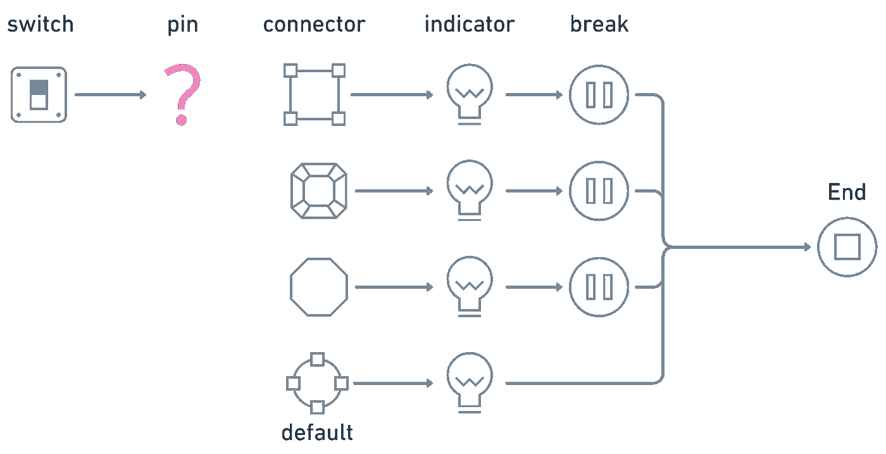

# 如何在 JavaScript 中从“if-else”进行“切换”

> 原文：<https://javascript.plainenglish.io/how-to-switch-from-if-else-in-javascript-6c4ddf728d7f?source=collection_archive---------18----------------------->

## 并使 JavaScript 代码更加简洁。

Photo by [Ilya Pavlov](https://unsplash.com/@ilyapavlov?utm_source=medium&utm_medium=referral) on [Unsplash](https://unsplash.com?utm_source=medium&utm_medium=referral)

由于编程语言是抽象的，理解它的最好方法是使用类比。

JavaScript 也不例外。

今天，我想用一个简单的例子来解释 switch-case 的概念，作为 if-else 的替代。

# 案例研究(双关语)

想象一下，你有一个不同输出的电路。每个输出都在各自的`case`内，具有独特的连接器形状，并配有使用时会亮起的指示灯。

现在，无论何时你想操作某个箱子，你都必须把它和一个完全相似的连接器配对。如果它们匹配，指示器将运行，其余情况将被忽略。或者简单的说，你可以决定打开哪一个。

*多酷的主意，是吧？*

现在让我们来看看下面的一个简单电路:

Created by the author in Whimsical

假设您想要打开矩形连接器的指示器。你会怎么做？是的，您使用与连接器形状相似的矩形引脚。

Created by author in Whimsical

指示灯将点亮，制动器启动，忽略连接器的其余部分。如果您将图钉更改为菱形，它不会打开矩形指示器，因为它们不匹配。它现在要做的是寻找下一个匹配—在本例中，是菱形连接器:

Created by author in Whimsical

如果我们将引脚更改为八边形，也会发生同样的情况:

Created by author in Whimsical

但是，如果没有找到匹配呢？难道它会使系统失灵吗？不要烦恼！输入默认情况(或者只输入`default`)。可以把 default 想象成一个通用连接器，当它找不到匹配的开关时，它会调整自己的形状来匹配任何开关。

Created by author in Whimsical

由于默认状态是最后一个检查点，所以不会有`break`。

# 把所有这些放在一起，最后的想法

现在，让我们将之前讨论过的类比与其实际的 JavaScript 概念联系起来:

Left: analogy of switch statement | Right: the actual JavaScript `switch` concept

差不多吧？

希望这个故事能让你明白 JavaScript 中的`switch`语句。

*更多内容请看*[***plain English . io***](http://plainenglish.io/)