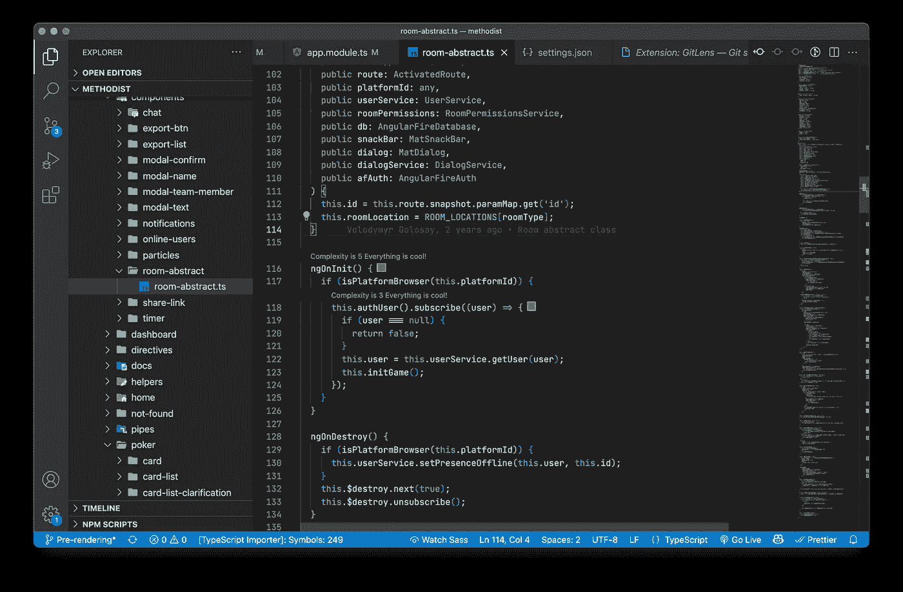

# 如何从 WebStorm 切换到 VS 代码

> 原文：<https://javascript.plainenglish.io/how-to-switch-from-webstorm-to-vs-code-4e70c3025135?source=collection_archive---------0----------------------->

## 提示、设置、插件、差异/合并工具等


# 如何从 WebStorm 切换到 VS 代码

在本文中，我不打算将 WebStorm 与 VS 代码进行比较，也不分享顶级插件列表。相反，我想告诉你多年前我是如何从 WebStorm 迁移到 VS 代码的，我是如何配置它的，特别是我们可以做些什么来拥有 WebStorm 中的 3 列 diff 工具。

# 对我的开发环境的要求

我必须参与许多项目，每个项目都使用不同的语言和技术。同时，我有时需要处理项目的服务器端。所以对我来说，代码编辑器应该能够突出语法，格式化代码，重构和自动完成 JS，TS，SCSS/LESS，HTML 文件。在使用 Angular 或 React 等 JS 框架时，我还需要在组件和模板之间进行舒适的导航。

WebStorm 可以完美地做到这一切，它的文件索引让 IDE 比你更了解你的代码。但是，如果你在一家不提供执照的公司工作，或者你厌倦了缓慢的创业时间，想尝试一些新的东西，该怎么办呢？幸运的是我们有 [VS 代码](https://code.visualstudio.com/)。

# 首次发布

与 WebStorm 相比，VS 代码的启动时间会让你大吃一惊。这是因为它没有索引整个项目。这就是它发射如此之快的原因。

启动时，默认情况下会显示一个欢迎窗口。但是，您可以通过在窗口本身或设置中打勾来关闭它:

> " work bench . welcome . enabled ":false

顺便说一下，我将在文章的最后分享我的整个配置。

# 用户界面主题

默认主题黑暗+是梦幻般的。可能你也会喜欢。但是，我只会推荐 Seti 或者材质图标与之搭配。但是当然，在 [VS 代码市场](https://marketplace.visualstudio.com/vscode)中有大量的主题。最酷的我的眼睛:一个黑暗的亲，材料，和诺德。我相信你会找到适合你的。即使是老派的 IntelliJ IDEA 用户，VS Code market 也可以提出一个 Darcula IntelliJ 主题🙃。

另外，我将编辑器字体大小设置为 12，缩放级别设置为 1。字体大小为 13，缩放为 0 时可能看起来更好，但是更大的元素对眼睛更安全。



Here is how my VS Code looks like

# 插件

VS 代码首先是一个编辑器，但是在安装了前端开发所必需的插件之后，它的功能就会向 IDE 靠拢。像网络风暴，但免费！

## 快捷键

迁移后首先不舒服的是键盘快捷键。所以安装 [IntelliJ IDEA 键盘绑定](https://marketplace.visualstudio.com/items?itemName=k--kato.intellij-idea-keybindings)，节省你学习新快捷键或配置它们的时间。

## 格式程序

VS 代码可以格式化 HTML，JS，CSS。但只是标准设置，并不了解 sass。代码格式器允许你以适合你和你的团队的方式定制格式。

默认情况下，它的设置很棒，但是你可以在 VS 代码设置中随意配置。prettierrc 或者。编辑器配置文件。最后两个文件可以添加到存储库中，并在团队成员之间共享。

## 智能模板

VS 代码是智能的，它可以检查打开的文件中的所有导入，允许您导航文件。此外，它还显示建议并具有重构功能。但是所有这些东西只能在相同的文件格式下工作。

为了更好地支持 angular、lit-element、react 等流行框架和库，我们需要安装相关插件:

*   [角度支持](https://marketplace.visualstudio.com/items?itemName=vismalietuva.vscode-angular-support) —更好的角度框架支持(直到官方角度插件被最新的框架版本打破)
*   [lit-html](https://marketplace.visualstudio.com/items?itemName=bierner.lit-html)—JavaScript 和 TypeScriptSyntax 高亮显示、类型检查和代码完成内部的 HTML 语言支持
*   [lit-plugin](https://marketplace.visualstudio.com/items?itemName=runem.lit-plugin)
*   [Vetur](https://marketplace.visualstudio.com/items?itemName=octref.vetur) —更好的 Vue.js 框架支持
*   [HTML CSS 支持](https://marketplace.visualstudio.com/items?itemName=ecmel.vscode-html-css) —具有定位功能的 id 和类完成

## 代码完成和建议

WebStorm 会对整个项目进行索引，之后，它会比你更了解你的代码。VS 代码也可以完成你的代码行，但是你需要向下滚动建议列表来找到一个合适的选项。WebStorm 做得更好，直到你安装了[Visual Studio IntelliCode](https://marketplace.visualstudio.com/items?itemName=VisualStudioExptTeam.vscodeintellicode)。因此，这是一个必须具备的插件，它将根据上下文推荐代码建议。它是免费的，离线工作。

**替代代码建议**

IntelliCode 不是代码完成的唯一解决方案。比如有一个相当流行的插件——[Tabnine](https://www.tabnine.com)。它使用机器学习模型，在开源项目中训练，并且做得很好。您开始看到更少的不必要的代码建议。

但是这个扩展只对个人使用是免费的，不需要用你的代码训练模型。

公司可以使用高级版本，能够单独适应项目代码。

目前，在技术预览版中，来自 GitHub 的非常有前途的插件——[GitHub Copilot](https://copilot.github.com)。它将代码完成推向下一个层次。你可以评论你需要什么方法，这个插件会向你建议整个功能。

一位来自 Reddit 的用户上传了一段视频，视频中他用 2 分 49 秒的时间制作了一个全栈 URL shortener 应用。

> 顺便说一下，我正在测试使用 Tabnine 或 Github copilot 时的生产率变化。报告即将发布。

## **吉特**

有了这个插件，对我来说，使用 Git 甚至比在 WebStorm 中更舒服。一键同步、内联 git 责备、快速提交管理、远程查看、标签、交互式存储等等。1100 万安装的插件— [GitLens](https://marketplace.visualstudio.com/items?itemName=eamodio.gitlens) 。

## 其他必备插件

现在我想分享一个插件列表，它必须是核心的一部分。

*   [自动关闭标签](https://marketplace.visualstudio.com/items?itemName=formulahendry.auto-close-tag)
*   [自动重命名标签](https://marketplace.visualstudio.com/items?itemName=formulahendry.auto-rename-tag)
*   [ESLint](https://marketplace.visualstudio.com/items?itemName=dbaeumer.vscode-eslint)
*   [路径智能感知](https://marketplace.visualstudio.com/items?itemName=christian-kohler.path-intellisense)
*   [TypeScript Importer](https://marketplace.visualstudio.com/items?itemName=pmneo.tsimporter) —不流行，但是自动导入依赖项的类扩展中最好的

## 3 列区分/合并工具

对我来说，WebStorm 中的 diff 工具是一个杀手级功能。只要尝试一下，你就会发现，它们的三列 UI 是解决任何复杂性合并冲突的不可替代的工具。

在 VS 代码中，diff 工具有两列 UI[过去是怎样的][现在是怎样的]和经典的 Git 一列内联合并冲突解决视图。

目前没有能力更改这个 UI。看起来微软方面没有改进它的计划。我们有一个[问题标签](https://github.com/Microsoft/vscode/issues/37350)已经很多年了，这个特性甚至不在路线图上。

那么我们能做什么呢？

我们可以安装免费软件 [P4Merge 和 Diff 工具](https://www.perforce.com/products/helix-core-apps/merge-diff-tool-p4merge)。并将我们的 Git 配置为使用这个应用程序作为默认的 diff/merge 工具。然后我们只需要在项目文件夹中运行 git merge 或 git diff 命令。

大概是每次需要合并东西的时候都要打开终端比较烦吧。然后你可以安装一个[扩展](https://marketplace.visualstudio.com/items?itemName=david-rickard.git-diff-and-merge-tool)并从上下文菜单中运行合并工具。

**这里是。使用 p4merge** 的 gitconfig

*Mac*

```
[merge]
 tool = p4mergetool
[mergetool "p4mergetool"]
 cmd = /Applications/p4merge.app/Contents/Resources/launchp4merge $PWD/$BASE $PWD/$REMOTE $PWD/$LOCAL $PWD/$MERGED
 trustExitCode = true
[mergetool]
 keepBackup = false
[diff]
 tool = p4difftool
[difftool "p4difftool"]
 cmd = /Applications/p4merge.app/Contents/Resources/launchp4merge $LOCAL $REMOTE
```

*视窗*

```
[diff]
    tool = p4difftool
[difftool "p4difftool"]
    cmd = C:/Program\\ Files/SourceGear/Common/DiffMerge/sgdm.exe \"$LOCAL\" \"$REMOTE\"[merge]
    tool = p4mergetool
[mergetool "p4mergetool"]
    trustExitCode = true
    cmd = C:/Program\\ Files/SourceGear/Common/DiffMerge/sgdm.exe -merge -result=\"$MERGED\" \"$LOCAL\" \"$BASE\" \"$REMOTE\"
```

## 最后的步骤

最后，我建议在你的机器上安装 [JetBrains Mono](https://www.jetbrains.com/lp/mono/) 字体，并在 VS 代码中使用它。它是专门为开发者开发的，支持字体连字。

这是我承诺的 settings.json。要在 VS 代码中打开它，请按 command+shift+P(windows 为 ctrl+shift+P)并键入 open settings.json。

如果你有任何问题，欢迎在评论中提问。

**感谢阅读！**

*更多内容请看*[***plain English . io***](http://plainenglish.io/)