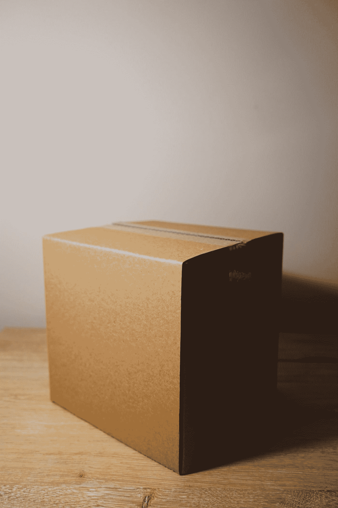

# 如何在本地测试节点(npm)程序包

> 原文：<https://javascript.plainenglish.io/how-to-test-a-node-package-locally-8dde33e642df?source=collection_archive---------9----------------------->


您可以在本地开发一个节点包，并将其发布到 npm。但是如果您想通过导入到本地项目中来测试一个组件呢？我将通过两种方法来做这件事。

## 部分:

1.  简单的回答(`npm link`)。
2.  简单答案疑难解答。
3.  卸载简易答案。
4.  困难的答案(tarball 文件)。
5.  疑难解答。
6.  卸载硬答。


Photo by [Daniel von Appen](https://unsplash.com/@daniel_von_appen?utm_source=medium&utm_medium=referral) on [Unsplash](https://unsplash.com?utm_source=medium&utm_medium=referral)

## 1.简单的答案

假设我们有一个名为`cool-components`的包，你想改变这些组件，但是想在一个名为 **my-project** 的项目中测试它们。

1.  在`cool-components`内部，键入`npm link`。
2.  在`my-project`内部，键入`npm link cool-components`。

如果包需要构建，您可能需要每次都运行一个构建步骤来反映您的更改。

## 2.简单答案疑难解答

如果您使用 webpack 之类的东西来构建您的包，符号链接并不总是工作得很好。在这种情况下，您可能需要在 webpack 配置中添加:

```
# webpack.config.js
module.exports = {
    resolve: {
        symlinks: false
    }
};
```

## 3.卸载简易答案

1.  在`cool-components`中，输入`npm unlink`。
2.  在`my-project`中，输入`npm unlink cool-components`。



Photo by [Brandable Box](https://unsplash.com/@brandablebox?utm_source=medium&utm_medium=referral) on [Unsplash](https://unsplash.com?utm_source=medium&utm_medium=referral)

## 4.难以回答的问题

当您从 npm 安装一个节点模块时，您实际上是在安装一个包的 tarball。您可以通过几个额外的步骤重新创建这个过程。因为您每次都要打包项目，所以每次您希望更改出现时都需要重复这一步，并重新安装特定的包。

假设您有一个名为`cool-components`的包，并希望它位于本地`my-project`中。

1.  如果你正在使用类似 webpack 的东西，在里面`cool-components`构建你的包。
2.  在`cool-components`内键入`npm pack`创建一个 tarball。
3.  在`my-project`内编辑`package.json`并更改项目将包导入文件的行。您可以将此文件放在计算机上的任何位置。

```
{
  "name": "my-project",
  "dependencies": {
    "cool-components": "file:../cool-components/cool-components.tgz"
  }
}
```

4.键入`npm install`或`npm update cool-components`以确保您拥有最新的副本。

或者，您也可以键入`npm install cool-components.tgz`。

## 5.疑难解答

有时，您的更改可能不会更新。这可能是由于`package-lock.json`。只需从您的`package-lock.json`中删除`cool-components`的条目，或者删除整个文件并键入`npm install`。

## 6.卸载硬答案

1.  在`my-project`输入`npm uninstall cool-components`。
2.  在`my-project`中，确保线在`package.json`中被移除。

这就是在本地测试 npm 包所需的全部内容！希望这篇文章是有帮助的。

*更多内容请看*[*plain English . io*](http://plainenglish.io/)