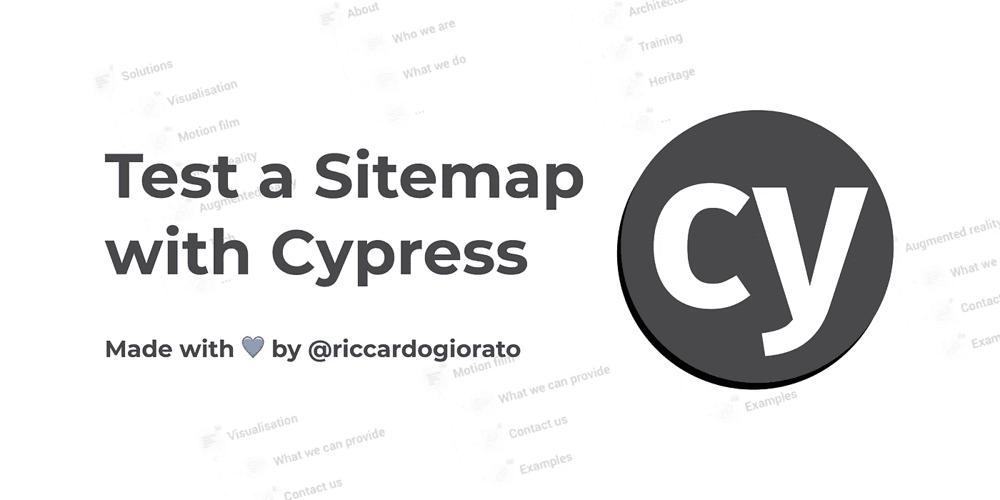

# 如何用 Cypress 测试一个站点地图

> 原文：<https://javascript.plainenglish.io/how-to-test-a-sitemap-with-cypress-31b99cccd600?source=collection_archive---------5----------------------->

## 测试一个站点地图需要两个简单的步骤:读取 XML 和检查链接！



[https://github.com/riccardogiorato/cypress-for-everything/tree/main/examples/sitemap](https://github.com/riccardogiorato/cypress-for-everything/tree/main/examples/sitemap)

## 为什么要为网站地图做 E2E 测试？

构建 E2E 可以很好地为用户操作服务，但是有时候构建一个快速测试也可以帮助你通过构建你自己的“虚拟版本”来节省大量时间。

测试一个站点地图可以让你检查你的网站的每一次构建或改变是否所有的页面都正确地生成或编译了不同的页面。

对于本教程，我们选择使用 Cypress.io，因为它是网络上最常用的 E2E 工具之一。

# 1.读取 sitemap.xml

从 sitemap.xml 文件中获取所有 URL 的数组，并解析它以获取所有完整的链接！

我们需要发出一个“cy.request ”,基本上是对 sitemap XML 文件的一个简单的 HTTP 请求。然后我们获取响应，用 cypress 解析它，得到所有不同的“loc”项，每个项都是一个单独的页面。

```
let urls = [];
  before(() => {
    cy.request({
      url: "[https://www.vercel.com/sitemap.xml](https://www.vercel.com/sitemap.xml)",
      headers: {
        "Content-Type": "text/xml; charset=utf-8",
        "user-agent":
          "Mozilla/5.0 (Windows NT 10.0; Win64; x64) AppleWebKit/537.36 (KHTML, like Gecko) Chrome/92.0.4515.131 Safari/537.36",
      },
    })
      .as("sitemap")
      .then((response) => {
        urls = Cypress.$(response.body)
          .find("loc")
          .toArray()
          .map((el) => el.innerText);
      });
  });
```

# 2.检查网址

现在你需要扫描整个链接列表，检查它们是否有效！我们准备了两种可能性:

*   [快速检查](https://github.com/riccardogiorato/cypress-for-everything/blob/main/examples/sitemap/cypress/integration/sitemap-fast.ts):快速检查站点地图，只检查来自服务器的 200 个响应页面 URL。✨
*   [慢速检查](https://github.com/riccardogiorato/cypress-for-everything/blob/main/examples/sitemap/cypress/integration/sitemap-slow.ts):检查整个页面是否已加载完毕，等待 JavaScript 加载。✨

## 慢速检查

为了进行完整的检查，我们需要检查 URL 是否有效。

我们将使用“cy.visit”，该命令将加载页面，并等待页面 JavaScript 完全加载。这将导致更慢的测试，因为每个页面都需要完全加载！

```
it("should succesfully load each url in the sitemap", () => {
    urls.forEach((url) => {
      cy.visit(url);
    });
  });
```

## 快速检查

使用 cy.visit 检查站点地图的缺页可能要花很长时间！如果我们想更快地检查呈现的页面，我们只需在请求页面时检查服务器的响应。如果服务器发回 200 响应，我们继续下一页！

```
it("should succesfully load each url in the sitemap", () => {
    urls.forEach((url) => {
      cy.request({
        url: url,
        headers: {
          "Content-Type": "text/html",
          accept: "*/*",
          "user-agent":
            "Mozilla/5.0 (Windows NT 10.0; Win64; x64) AppleWebKit/537.36 (KHTML, like Gecko) Chrome/92.0.4515.131 Safari/537.36",
        },
      }).then((resp) => {
        expect(resp.status).to.eq(200);
      });
    });
  });
```

# 结论

构建 E2E 测试没有对错之分。您应该关心的唯一事情是构建一个适当的测试来自动化您的手动操作。

有了这个教程，我们再也不需要检查站点地图了，因为我们将有一个测试来自动检查每次 Cypress 运行中的所有页面！

更少的时间做手工测试，更多的时间享受构建其他东西的乐趣！
请在评论中告诉我们你希望看到哪种考试！

# 资源

*   Sitemap 慢速校验码: [sitemap-slow.ts](https://github.com/riccardogiorato/cypress-for-everything/blob/main/examples/sitemap/cypress/integration/sitemap-slow.ts)
*   Sitemap 快速检查代码: [sitemap-fast.ts](https://github.com/riccardogiorato/cypress-for-everything/blob/main/examples/sitemap/cypress/integration/sitemap-fast.ts)
*   柏树示例目录:[柏树万能#示例](https://github.com/riccardogiorato/cypress-for-everything#examples)
*   站点地图示例:[柏树代表一切/树/主/示例/站点地图](https://github.com/riccardogiorato/cypress-for-everything/tree/main/examples/sitemap)

*更多内容请看*[***plain English . io***](http://plainenglish.io/)