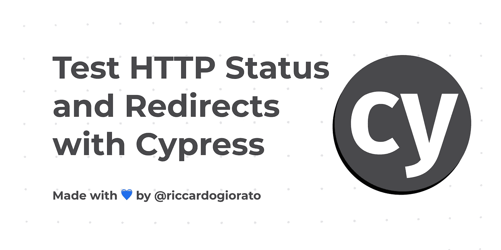

# 如何用 Cypress 测试 HTTP 响应和重定向

> 原文：<https://javascript.plainenglish.io/how-to-test-http-responses-and-redirects-with-cypress-76ee2337e872?source=collection_archive---------3----------------------->

## 所有的站点都有不同的 HTTP 代码，比如 200、404、500、300，我们可以很容易地测试它们，以便总是发送回正确的响应！

[https://github.com/riccardogiorato/cypress-for-everything/tree/main/examples/http-response-status](https://github.com/riccardogiorato/cypress-for-everything/tree/main/examples/http-response-status)

## 为什么要对 HTTP 响应进行 E2E 测试？

你的应用程序的用户将总是从特定的网址访问你的网站。或者在很多情况下，他们会在 URL 中出现拼写错误，比如忘记了“https://”中的“s ”,或者没有在 URL 中添加“www”。

使用 Cypress，您可以测试通常使用来自服务器的 300 或 301 重定向完成的各种事情，也可以测试来自未经验证的用户对 404 页面或 500 禁止页面的响应。

对于本教程，我们选择使用 Cypress.io，因为它是网络上最常用的 E2E 工具之一。

# 重定向 301 代码

重定向通常用代码 301 来完成——“永久移动”。当特定页面或 URL 被重新组织或移动到不同的页面或 URL 时，会使用它们。

# 找到第 200 页代码

当服务器在您的请求中指定的 URL 上准确地找到资源时,“200”响应代码用于所有找到的页面。

# 未找到 404 页代码

当你没有找到一个页面时，你会得到一个最漂亮和最常见的代码 404，也称为“没有找到”。

# 结论

构建 E2E 测试没有对错之分。您应该关心的唯一事情是构建一个适当的测试来自动化您的手动操作。

有了这个教程，我们再也不需要检查 404 的常用页面了。我们将始终能够检查我们实现的所有重定向和更多！

> 更少的时间做手工测试，更多的时间享受构建其他东西的乐趣！

请在评论中告诉我们你希望下一次看到哪种考试！

# 资源

*   测试 Tesla HTTP 响应:[https://github . com/riccardogiorato/cypress-for-everything/blob/main/examples/HTTP-response-status/cypress/integration/Tesla-HTTP . ts](https://github.com/riccardogiorato/cypress-for-everything/blob/main/examples/http-response-status/cypress/integration/tesla-http.ts)
*   柏树示例目录:[柏树万能#示例](https://github.com/riccardogiorato/cypress-for-everything#examples)
*   HTTP 响应示例:[https://github . com/riccardogiorato/cypress-for-everything/tree/main/examples/HTTP-Response-status](https://github.com/riccardogiorato/cypress-for-everything/tree/main/examples/http-response-status)

*更多内容请看*[***plain English . io***](http://plainenglish.io/)