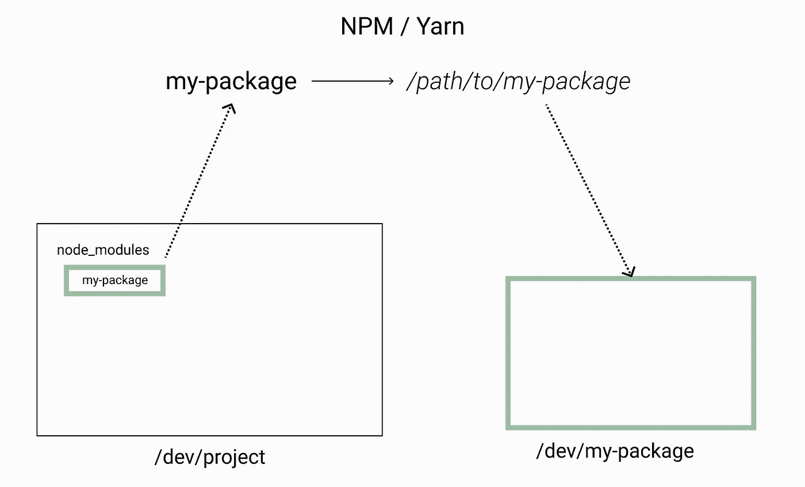
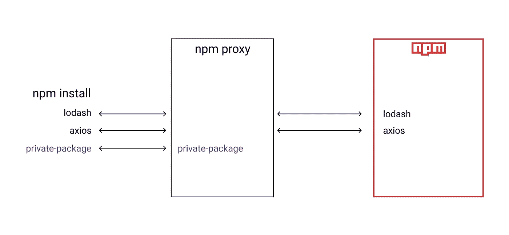

# 如何测试在本地发布 JavaScript 包

> 原文：<https://javascript.plainenglish.io/how-to-test-publishing-your-javascript-package-locally-b97e23c270c0?source=collection_archive---------18----------------------->

## 验证您发布的内容是否正确的简单快捷的方法。


Photo by [Mika Baumeister](https://unsplash.com/@mbaumi?utm_source=unsplash&utm_medium=referral&utm_content=creditCopyText) on [Unsplash](https://unsplash.com/?utm_source=unsplash&utm_medium=referral&utm_content=creditCopyText)

自从我开始使用 npm 作为 JS 包管理器(可能早在 2015 年)，我就一直想发布我自己的包，它可以是我在自己的项目中使用的一个非常特殊的包，也可以是试图解决一个常见问题并帮助其他开发人员的包。

每次我需要这样做的时候，我还想测试本地发布和安装的工作流程。此外，我想看看它发布时的“预览”，即“真正的”npm 页面，例如，看看自述文件是否合适。

经过大量的斗争和尝试，用各种方法来解决这个问题，我想我终于找到了最好的(至少对我来说)解决这两个问题的方法。

在深入研究最终解决方案之前，让我告诉你我在其他解决方案中遇到的问题。

# 符号链接

回到 2016 年，我试图找到一种方法来做到这一点，我看到很多人都在谈论`Symlink`。

简而言之，`Symbolic Link`(或符号链接)，就是当你在两个(或更多)文件之间创建一个引用链接，使它们互相引用。

假设您有一个库(my-library ),并希望在您的项目(网站)中使用它的本地文件。在这种情况下，一个符号链接将在`node_modules`中，而不是拥有`my-library`的生产文件，它指向它的本地文件夹。

但是…怎么做呢？

# NPM/纱线符号链接

当然，我并不是这个世界上唯一一个渴望找到正确方法的人。这就是为什么`npm`和`yarn`都提供了一种开箱即用的方式。

我不会在本文中解释如何使用它，但是如果你仍然想知道，你可以找到一个链接。

简而言之，通过这样做，`npm`或`yarn`将:

1.  创建对您的包的全局引用；
2.  用你的`node_modules`中的引用替换真实的模块



使用这种方法解决了大部分跨项目测试包的问题… **直到它不**。

# 符号链接问题

我对全局符号链接最大的痛苦是嵌套的 node_modules，以及工具(至少支持它们)如何解析模块 A(在项目和库中都使用)的哪个版本应该被解析。

我第一次看到这种情况是在写 React 组件库的时候。工作流程是:

1.  去我的图书馆
2.  运行`yarn link`创建一个符号链接
3.  转到我的项目
4.  链接`my-library`
5.  启动我的开发服务器

仅仅这样做，我就开始对一些 React 内部规则产生了疑问。这很奇怪，因为错误消息是真的。

经过几个小时对这个问题的深入研究，我终于[在 React 的回购上发现了一个问题](https://github.com/facebook/react/issues/14257)报告了我遇到的完全相同的问题，他指出了关于符号链接的问题:

维护者的回答很明确:

> *除非你将 react 从你的模块链接回你的应用程序，否则它不会起作用。*
> 
> *事实上一直都是这样的(React 应用在有两个 React 模块副本的情况下会被微妙地破坏)。钩子立即浮出水面，我想这是好的。*
> 
> *对于这种情况，我们确实有另一个问题来跟踪更好的错误消息。*

当然，这很有道理。在我的组件库中，React 是一个 peerDependency，我没有在包中提供它。现在，通过 Symlink 使用它，React 被安装在我的库和我的项目中。

有人发布了一个解决方法，在这个方法中，您还需要在库中链接`react`和`react-dom`，并在我们的项目中使用这个链接。所以我的流程是:

1.  去我的图书馆
2.  导航到`node_modules/react`
3.  运行`yarn link`创建一个反应符号链接
4.  导航到`node_modules/react-dom`
5.  运行`yarn link`创建一个反应符号链接
6.  回到根级别，运行`yarn link`符号链接我的库
7.  转到我的项目
8.  使用`my-library`、`react`和`react-dom`的链接
9.  启动我的开发服务器

这样做，我的问题就解决了！但是…天啊。真的吗？

完成我的测试后，我必须从你的项目中删除这 3 个链接，并强制安装依赖项。

这样做几次还可以，但是 10 次之后，我真的很烦，创建了一个 bash 脚本来执行这些步骤。

此外，现在我使用 Docker 来运行我的项目，我意识到 Symlink 不能与我的基本设置一起工作。

可能是因为当我运行我的容器时，我只创建了一个当前项目文件夹的卷。当容器启动并试图使用该符号链接时，它可能需要浏览我的文件系统，我认为这是不可能的。

通过添加一些额外的配置也许可以做到这一点，但我不想这样做。我想要一个简单的方法在我的 lib 中做一些事情，每当我需要使用它的时候就推送并安装它，而不会污染我在 npm 的真实包。

此外，使用 Symlink，您无法确定是否正在传送您的应用程序需要工作的所有文件。

幸运的是，我找到了一个非常简单的方法来解决这个问题，我想和你分享一下。

# NPM 代理注册中心

公司也希望在他们的项目中掌握包管理，但也许其中一些需要是私有的，以保护他们的业务和知识产权。

NPM 提供使用私人套餐的服务，但你可以想象，它向公司收取费用。

一个解决方案是使用 npm 代理。

npm 代理只是一个位于官方`npm`注册服务器前面的服务器，为您解析依赖关系。

你可以使用它发布一个内部包，而不是代理将你的包推给`npm`服务器，它会将它存储在自己的服务器上。

通过使用代理服务器运行`npm install`，在幕后你会传递一个你想要安装的软件包列表。如果代理在其“数据库”中发布了一个包，它会将该包返回给您。如果没有，它会要求 NPM 服务器打包并返回给您:



私有包是 npm 代理的功能之一。

想象一下，您派生出 axios 并将修改后的版本发布到您的代理服务器。当您运行 install 时，代理将返回您发布的版本，而不是从 NPM 返回 axios。

你可能会想:

> 嗯……如果我们可以在云服务器上设置这个系统……如果我们在本地使用这个系统会怎么样？

是的……这是我在观察那个解决方案时得出的结论，这就是我们将如何解决本地测试包的问题。

有几个选项可以执行这个工作流，但是在本文中，我将向您展示如何使用 Verdaccio 来执行。

# 韦尔达乔

Verdaccio 是:

> *一个轻量级开源私有 npm 代理注册表*

它非常强大，在版本 4 中，它没有配置来开始使用它，这不一定意味着我们不需要配置，但不是真的在代理本身中。

# 运行本地服务器

在本地使用 Verdaccio 的最简单方法是作为全局 npm 依赖项进行安装:

```
yarn global add verdaccio## Or with npmnpm install -g verdaccio
```

之后，您可以通过运行以下命令来启动服务器:

```
verdaccio
```

如果您愿意，也可以使用 docker 运行该服务器:

```
docker run -it --rm --name verdaccio -p 4873:4873 verdaccio/verdaccio
```

> 请记住，当容器停止时，您要发布的包将被删除。

运行服务器后，您可以在`http://localhost:4873`(或`[http://0.0.0.0:4873](http://0.0.0.0:4873))` [)](http://0.0.0.0:4873)) 查看网站

# 添加您的 npm 用户

为了能够将包发布到您的本地 Verdaccio，您首先必须在那里注册一个 npm 用户。为此，请运行:

```
npm adduser --registry http://localhost:4873 # OR [http://0.0.0.0:4873](http://0.0.0.0:4873)
```

信息不需要安全或准确。记住，这只是当地的事情！:)

# 出版和消费

对于发布和使用您的本地包，您必须始终指定注册表 URL。换句话说，npm 必须找到包所在的服务器。

一种方法是在 repo 的根级别创建您想要消费/发布的名为`.npmrc`的文件，并在那里指定注册表链接:

```
# /my-project/.npmrcregistry=http://localhost:4873 # OR [http://0.0.0.0:4873](http://0.0.0.0:4873)
```

我强烈推荐`npm`用户使用这种方法。原因是 npm 要求你在 package.json 中通过`npm config set`或`publishConfig.registry`设置一个全局注册表。当你想使用常规的`npmjs.org`注册表时，这两种方法都很麻烦。

当你想从官方注册表中使用时，你所要做的就是注释掉该文件中的注册表行。

另一个选项用于纱线用户，包括指定标志`--registry`:

```
# For publishing
yarn publish --registry http://localhost:4873 # OR http://0.0.0.0:4873# For consuming
yarn add my-private-pkg --registry http://localhost:4873 # OR [http://0.0.0.0:4873](http://0.0.0.0:4873)
```

通过这样做，yarn 将无需任何额外的文件或配置就能解析注册表。如果您最终对必须编写注册表标志感到厌烦，您也可以创建一个`.npmrc`文件，yarn 也将能够从那里解析注册表 URL。

完成此配置后，当您发布或安装您的本地包时，npm 或 yarn 将首先向您的 Verdaccio 本地服务器请求该包，Verdaccio 将完成所有工作，以存储或检索本地包并在 NPM 解析公共包。

# 警告

当我们安装一个依赖项时，一堆关于它的信息被添加到`package.lock.json`或`yarn.lock`文件中，其中一个是`resolved`，我们获得该依赖项的 URL:

```
// package.lock
{
  // ....
 "node_modules/my-package": {
      "version": "1.6.0",
      "resolved": "http://localhost:4873/my-package-1.6.0.tgz",
   // ....
  }
}
```

这意味着，如果您使用本地服务器 URL 提交和推送锁文件，无论您的项目将在哪里构建或测试(比如 CI/CD)，它都会失败，因为那里没有 localhost:4887。

从这个意义上来说，我们总是想记住在推送任何代码之前清理这个变更。

此外，与 Symlink 不同的是，在 Symlink 中，您可以打开一个`watch`模式来编译文件并直接在您的项目中看到这些更改，使用这种方法，您需要发布一个新版本，并在您做出每个新更改时安装该版本。

# 结论

我希望你喜欢这个。

有了这样一个简单的解决方案，现在您就能够毫无困难地测试产品发布/消费包工作流了。

# 参考

*   [Verdaccio 网站](https://verdaccio.org/)
*   [纱线符号链](https://classic.yarnpkg.com/en/docs/cli/link/)
*   [NPM 符号链](https://docs.npmjs.com/cli/v6/commands/npm-link)
*   [符号链接—维基百科](https://en.wikipedia.org/wiki/Symbolic_link)
*   [卡琳以快速简单的方式测试全球国家预防机制包](https://dev.to/khenhey/test-global-npm-packages-in-a-quick-and-easy-way-4nld)