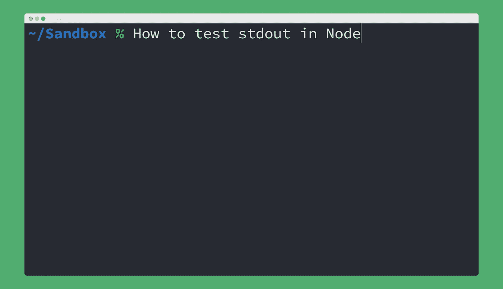

# 如何在 Node.js 中测试 stdout 输出

> 原文：<https://javascript.plainenglish.io/how-to-test-stdout-output-in-node-js-6c36edc610d1?source=collection_archive---------6----------------------->



我写这篇文章是为了给那些一直在寻找像这样的术语的人:

*   如何在节点中测试标准输出
*   如何使用 Jest 监视 Node 中的 stdout
*   如何在节点中存根 stdout

*这花了我一天的时间，但是多亏了我的同事*[*James Ransome*](https://github.com/jransome)*建议使用 Node 的 child_process 来做这件事，最后还是相当容易的！*

**注:**如果你赶时间，我整理了一份回购协议，你可以在这里克隆:[https://github.com/nkhil/testing-stdout](https://github.com/nkhil/testing-stdout)

# **我想测试 Pino 到 stdout 的输出**

**注意** : *我知道这可以算作测试一个依赖项的实现细节，但是在这个例子中，我正在开发一个定制的记录器库，它包装了 Pino 并做了一些额外的事情。Pino 决定在 v6.x.x 中引入突破性的变化，日志记录字符串和 logger.info(string，object)之类的对象不会像预期的那样工作(它们会忽略第二个参数)*

测试用例基本如下:

```
// when I log multiple params using the logger
logger.info('something1', 'something2');// then I see this in stdout
{"level":30,"time":1612227699012,"msg":"something1 something2","pid":69753,"hostname":"whatever","v":1}
```

一旦我们能够访问输出，我们就能够 JSON.parse()它，并断言上面例子中 msg 的值。

## 工作解决方案✅

解决方案是在 node 中生成一个子进程，然后监听。(' data ')事件来做我们的断言。

**设置**

创建一个使用日志记录器的文件，或者您想要测试的记录到 stdout 的任何代码。

**测试**

**快速解释一下上面的测试是怎么回事**

*   我们设置了一个日志文件，它将把事情记录到 stdout(上面例子中的 logger.js)
*   我们产生了一个新的子进程
*   我们使用新产生的子进程来运行`node logger.js`(它将事情记录到标准输出中
*   我们使用`child_process.stdout.on('data', (data) => <do stuff with data>)`模式“监听”正在记录的数据。
*   我们`JSON.parse()`这些数据，让我们断言我们注销的值
*   最后一步:利润💲💲💲

## 我们尝试过但没有成功的事情🙅

最初，我们试图直接使用 EventEmitter 的`.on('data', (callback) => {})`而不产生子进程。我对`child_process`还是很陌生，所以我不确定为什么这个不行。

我试过的另一个不起作用的方法是使用 Jest 监视 stdout。幸运的是，我发现[这个最近的 Jest 问题](https://github.com/facebook/jest/issues/9984)暗示，由于 Jest 是如何编写的，这不会起作用。

## 结论

希望这对你有帮助。如果我有什么地方错了，或者你想补充，我会很感激你的评论让我知道。