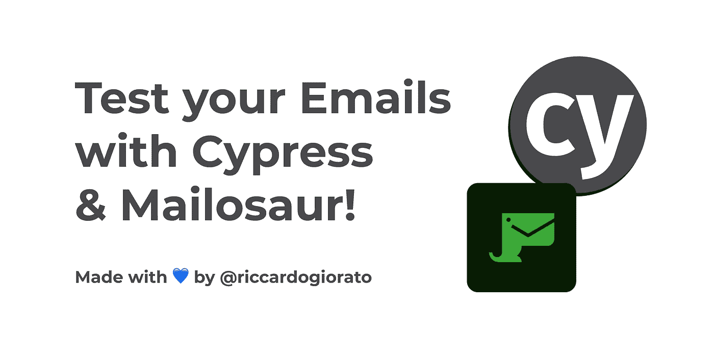

# 如何测试你的电子邮件在你的 SaaS 与美龙和柏树

> 原文：<https://javascript.plainenglish.io/how-to-test-your-email-in-your-saas-with-mailosaur-and-cypress-51f422b40a5f?source=collection_archive---------10----------------------->

## 有了最好的 E2E 电子邮件测试解决方案，您将不必担心中断发送给用户的电子邮件流！



[https://github.com/riccardogiorato/cypress-for-everything/tree/main/examples/mailosaur](https://github.com/riccardogiorato/cypress-for-everything/tree/main/examples/mailosaur)

# 入门指南

电子邮件对所有用户来说都非常重要，如果你在网上购物，你希望收到一封确认电子邮件，以确保你的钱被正确地转移到你刚买的产品上。

同样的关注是需要的，当东西被运送到你或任何其他事件，你希望你的客户收到和电子邮件。

检查这些东西的简单方法是做一个 E2E 测试。
我们就用:[柏树](https://github.com/riccardogiorato/cypress-for-everything/tree/main/examples/mailosaur) + [麦罗龙](https://mailosaur.com/) +“懈怠网站”做一个。

首先，你可以在 Mailosaur 上免费注册:[https://mailosaur.com/](https://mailosaur.com/)

# 它是如何工作的？

1.  安装软件包“cypress-mailosaur ”,包括:

```
yarn add cypress-mailosaur
```

2.用以下代码创建 Cypress 支持文件:

```
require("cypress-mailosaur");
```

或者直接复制这个文件内容: [cypress/support/index.ts](https://github.com/riccardogiorato/cypress-for-everything/blob/main/examples/mailosaur/cypress/support/index.ts)

3.将`CYPRESS_MAILOSAUR_API_KEY`环境变量设置为你的 Mailosaur API 键，你可以在你的账户设置中找到这个键:[https://mailosaur.com/app/account/keys](https://mailosaur.com/app/account/keys)

# 测试闲置账户创建的代码:

您需要查看的主要行是第 10 行、第 25 行和第 39 行:

*   第 10 行:我们在这个**特定的时间戳**为这个特定的测试运行创建一个唯一的电子邮件，其中包含**测试名称**，并且还将您的**邮件服务器 Id** 与**邮件服务器域**结合起来。
    创建的邮件应该是这样的:
    *“slack-new-account-202111309000 @ fake serverid . mailosaur . net”*
*   第 25 行:在这一行，我们使用创建的电子邮件，通过 cypress 命令将它从 UI 发送到 slack 服务器。
*   第 39 行:cy.mailosaurGetMessage:您只需要将参数 sentTo 与您在第 10 行创建的电子邮件一起传递。如果 Mailosaur 将在超时内收到此地址的电子邮件，您将得到响应，否则将失败。
    您可以根据提交后电子邮件发送给用户的速度自定义超时时间。

你也可以在这里找到完整的代码:[https://github . com/riccardogiorato/cypress-for-everything/blob/main/examples/mailosaur/cypress/integration/slack-new-account . ts](https://github.com/riccardogiorato/cypress-for-everything/blob/main/examples/mailosaur/cypress/integration/slack-new-account.ts)

# 资源

*   Slack Mailosaur 示例:[examples/mailo saur/cypress/integration/slack-new-account . ts](https://github.com/riccardogiorato/cypress-for-everything/blob/main/examples/mailosaur/cypress/integration/slack-new-account.ts)
*   Mailosaur 示例:[https://github . com/riccardogiorato/cypress-for-everything/tree/main/Examples/mailosaur](https://github.com/riccardogiorato/cypress-for-everything/tree/main/examples/mailosaur)
*   赛普拉斯示例目录:[赛普拉斯万能#示例](https://github.com/riccardogiorato/cypress-for-everything#examples)

*更多内容看* [***说白了。报名参加我们的***](http://plainenglish.io/) **[***免费周报在这里***](http://newsletter.plainenglish.io/) *。***